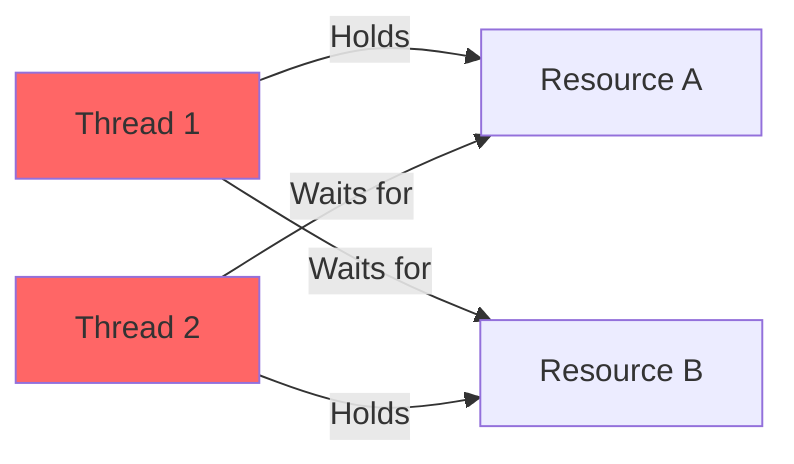

# How to Handle "Deadlock detected" Issues in C#

Author: [nawazdhandala](https://www.github.com/nawazdhandala)

Tags: .NET, C#, Deadlock, Async, Threading, Concurrency, Troubleshooting

Description: Learn how to identify, diagnose, and fix deadlock issues in C# applications. This guide covers common deadlock patterns, async/await pitfalls, database deadlocks, and strategies for writing deadlock-free code.

Deadlocks are among the most frustrating issues to debug in C# applications. They cause applications to hang indefinitely, often without clear error messages. This guide will help you understand, diagnose, and fix deadlock issues in your .NET applications.

## Understanding Deadlocks

A deadlock occurs when two or more threads are blocked forever, each waiting for the other to release a resource. This creates a circular dependency that cannot be resolved.



## Common Deadlock Patterns

### 1. Sync-over-Async Deadlock

The most common deadlock in modern C# code occurs when blocking on async code:

```csharp
// DANGEROUS - This can deadlock!
public class UserController : Controller
{
    private readonly IUserService _userService;

    public ActionResult GetUser(int id)
    {
        // .Result or .Wait() on async code can deadlock
        var user = _userService.GetUserAsync(id).Result;
        return View(user);
    }
}

public class UserService : IUserService
{
    public async Task<User> GetUserAsync(int id)
    {
        // This await tries to return to the original context
        // but that context is blocked by .Result
        return await _repository.GetByIdAsync(id);
    }
}
```

**Why it deadlocks**: In ASP.NET (pre-Core) and UI applications, there's a synchronization context. When you call `.Result`, you block the context thread. The async method tries to resume on that same context after the await, but it's blocked - deadlock!

**Fix**: Use async all the way:

```csharp
public class UserController : Controller
{
    private readonly IUserService _userService;

    // Make the action async
    public async Task<ActionResult> GetUser(int id)
    {
        var user = await _userService.GetUserAsync(id);
        return View(user);
    }
}
```

### 2. Lock Ordering Deadlock

Classic deadlock from inconsistent lock ordering:

```csharp
// DANGEROUS - Potential deadlock!
public class TransferService
{
    public void Transfer(Account from, Account to, decimal amount)
    {
        lock (from)
        {
            lock (to)
            {
                from.Balance -= amount;
                to.Balance += amount;
            }
        }
    }
}

// Thread 1: Transfer(accountA, accountB, 100)
// Thread 2: Transfer(accountB, accountA, 50)
// Deadlock! Thread 1 holds A, waits for B
//           Thread 2 holds B, waits for A
```

**Fix**: Always acquire locks in a consistent order:

```csharp
public class TransferService
{
    public void Transfer(Account from, Account to, decimal amount)
    {
        // Always lock in a consistent order (e.g., by ID)
        var first = from.Id < to.Id ? from : to;
        var second = from.Id < to.Id ? to : from;

        lock (first)
        {
            lock (second)
            {
                from.Balance -= amount;
                to.Balance += amount;
            }
        }
    }
}
```

### 3. Nested Async Lock Deadlock

Using non-async-compatible locks with async code:

```csharp
// DANGEROUS - Can cause issues
public class CacheService
{
    private readonly object _lock = new object();
    private readonly Dictionary<string, object> _cache = new();

    public async Task<T> GetOrCreateAsync<T>(string key, Func<Task<T>> factory)
    {
        lock (_lock) // Regular lock doesn't work with await inside
        {
            if (!_cache.TryGetValue(key, out var value))
            {
                // This is illegal - can't await inside lock
                // value = await factory();
                // _cache[key] = value;
            }
            return (T)value;
        }
    }
}
```

**Fix**: Use `SemaphoreSlim` for async locking:

```csharp
public class CacheService
{
    private readonly SemaphoreSlim _semaphore = new(1, 1);
    private readonly Dictionary<string, object> _cache = new();

    public async Task<T> GetOrCreateAsync<T>(string key, Func<Task<T>> factory)
    {
        await _semaphore.WaitAsync();
        try
        {
            if (!_cache.TryGetValue(key, out var value))
            {
                value = await factory();
                _cache[key] = value;
            }
            return (T)value!;
        }
        finally
        {
            _semaphore.Release();
        }
    }
}
```

## Database Deadlocks

### SQL Server Deadlock Detection

Database deadlocks are different - SQL Server detects and resolves them by killing one transaction:

```
Microsoft.Data.SqlClient.SqlException: Transaction (Process ID 52) was deadlocked
on lock resources with another process and has been chosen as the deadlock victim.
```

### Handling Database Deadlocks with Retry

Implement retry logic for database deadlocks:

```csharp
public class DeadlockRetryPolicy
{
    private const int SqlDeadlockErrorNumber = 1205;
    private const int MaxRetries = 3;
    private static readonly TimeSpan InitialDelay = TimeSpan.FromMilliseconds(100);

    public async Task<T> ExecuteAsync<T>(Func<Task<T>> operation)
    {
        var delay = InitialDelay;

        for (int attempt = 1; attempt <= MaxRetries; attempt++)
        {
            try
            {
                return await operation();
            }
            catch (SqlException ex) when (IsDeadlock(ex) && attempt < MaxRetries)
            {
                // Log the deadlock
                Console.WriteLine($"Deadlock detected, attempt {attempt}. Retrying...");

                // Wait with exponential backoff and jitter
                var jitter = TimeSpan.FromMilliseconds(Random.Shared.Next(0, 100));
                await Task.Delay(delay + jitter);
                delay *= 2;
            }
        }

        throw new InvalidOperationException("Should not reach here");
    }

    private static bool IsDeadlock(SqlException ex)
    {
        return ex.Errors.Cast<SqlError>().Any(e => e.Number == SqlDeadlockErrorNumber);
    }
}

// Usage
var policy = new DeadlockRetryPolicy();
var result = await policy.ExecuteAsync(async () =>
{
    using var transaction = await _context.Database.BeginTransactionAsync();
    // Your database operations
    await transaction.CommitAsync();
    return result;
});
```

### Using Polly for Retry

Use Polly for more sophisticated retry policies:

```csharp
using Polly;
using Polly.Retry;

public static class PollyPolicies
{
    public static AsyncRetryPolicy CreateDeadlockRetryPolicy()
    {
        return Policy
            .Handle<SqlException>(ex => ex.Number == 1205) // Deadlock
            .Or<DbUpdateException>(ex => IsDeadlock(ex))
            .WaitAndRetryAsync(
                retryCount: 3,
                sleepDurationProvider: attempt =>
                    TimeSpan.FromMilliseconds(Math.Pow(2, attempt) * 100),
                onRetry: (exception, timeSpan, retryCount, context) =>
                {
                    Console.WriteLine(
                        $"Deadlock retry {retryCount} after {timeSpan.TotalMilliseconds}ms");
                });
    }

    private static bool IsDeadlock(DbUpdateException ex)
    {
        return ex.InnerException is SqlException sqlEx && sqlEx.Number == 1205;
    }
}

// Registration
builder.Services.AddDbContext<AppDbContext>((provider, options) =>
{
    options.UseSqlServer(connectionString)
        .AddInterceptors(new DeadlockRetryInterceptor());
});
```

### Preventing Database Deadlocks

Use these strategies to minimize database deadlocks:

```csharp
public class OrderService
{
    private readonly AppDbContext _context;

    // 1. Access tables in consistent order
    public async Task ProcessOrderAsync(int orderId)
    {
        // Always: Orders -> OrderItems -> Inventory
        var order = await _context.Orders.FindAsync(orderId);
        var items = await _context.OrderItems
            .Where(i => i.OrderId == orderId)
            .OrderBy(i => i.ProductId) // Consistent ordering
            .ToListAsync();

        foreach (var item in items)
        {
            // Process in order
        }
    }

    // 2. Keep transactions short
    public async Task UpdateInventoryAsync(int productId, int quantity)
    {
        // Don't do expensive operations inside transaction
        var validationResult = await ValidateInventoryAsync(productId, quantity);

        if (validationResult.IsValid)
        {
            // Short transaction
            using var transaction = await _context.Database.BeginTransactionAsync();
            await _context.Database.ExecuteSqlRawAsync(
                "UPDATE Inventory SET Quantity = Quantity - {0} WHERE ProductId = {1}",
                quantity, productId);
            await transaction.CommitAsync();
        }
    }

    // 3. Use appropriate isolation level
    public async Task<Report> GenerateReportAsync()
    {
        // Read-only operations can use snapshot isolation
        using var transaction = await _context.Database
            .BeginTransactionAsync(IsolationLevel.Snapshot);

        var data = await _context.Orders
            .AsNoTracking()
            .ToListAsync();

        await transaction.CommitAsync();
        return GenerateReport(data);
    }
}
```

## Async Deadlock Prevention

### ConfigureAwait(false)

Use `ConfigureAwait(false)` in library code:

```csharp
public class DataService
{
    public async Task<Data> GetDataAsync()
    {
        // In library code, don't capture the context
        var result = await _httpClient.GetAsync(url).ConfigureAwait(false);
        var content = await result.Content.ReadAsStringAsync().ConfigureAwait(false);
        return JsonSerializer.Deserialize<Data>(content);
    }
}
```

### Async Entry Points

Ensure proper async entry points:

```csharp
// Console application
public class Program
{
    // Use async Main
    public static async Task Main(string[] args)
    {
        await RunAsync();
    }

    private static async Task RunAsync()
    {
        var service = new MyService();
        await service.DoWorkAsync();
    }
}
```

### Avoiding Blocking Calls

Replace blocking calls with async equivalents:

```csharp
public class FileService
{
    // BAD - Blocking
    public string ReadFile(string path)
    {
        return File.ReadAllText(path);
    }

    // GOOD - Async
    public async Task<string> ReadFileAsync(string path)
    {
        return await File.ReadAllTextAsync(path);
    }

    // BAD - Blocking on async
    public string GetData()
    {
        return GetDataAsync().Result; // Can deadlock!
    }

    // GOOD - Async all the way
    public async Task<string> GetDataAsync()
    {
        return await _service.FetchDataAsync();
    }
}
```

## Debugging Deadlocks

### Using Debugger

When a deadlock occurs, use Visual Studio to inspect threads:

1. Pause execution (Debug -> Break All)
2. Open Threads window (Debug -> Windows -> Threads)
3. Check each thread's call stack
4. Look for threads waiting on locks or async operations

### Logging Lock Acquisition

Add logging to identify deadlock patterns:

```csharp
public class DiagnosticLock
{
    private readonly object _lock = new();
    private readonly string _name;
    private readonly ILogger _logger;

    public DiagnosticLock(string name, ILogger logger)
    {
        _name = name;
        _logger = logger;
    }

    public IDisposable Acquire([CallerMemberName] string caller = "")
    {
        var threadId = Environment.CurrentManagedThreadId;
        _logger.LogDebug("Thread {ThreadId} requesting lock {Name} from {Caller}",
            threadId, _name, caller);

        var acquired = Monitor.TryEnter(_lock, TimeSpan.FromSeconds(30));

        if (!acquired)
        {
            _logger.LogError("Thread {ThreadId} failed to acquire lock {Name} - potential deadlock!",
                threadId, _name);
            throw new TimeoutException($"Failed to acquire lock {_name}");
        }

        _logger.LogDebug("Thread {ThreadId} acquired lock {Name}", threadId, _name);

        return new LockReleaser(_lock, _name, threadId, _logger);
    }

    private class LockReleaser : IDisposable
    {
        private readonly object _lock;
        private readonly string _name;
        private readonly int _threadId;
        private readonly ILogger _logger;

        public LockReleaser(object @lock, string name, int threadId, ILogger logger)
        {
            _lock = @lock;
            _name = name;
            _threadId = threadId;
            _logger = logger;
        }

        public void Dispose()
        {
            Monitor.Exit(_lock);
            _logger.LogDebug("Thread {ThreadId} released lock {Name}", _threadId, _name);
        }
    }
}
```

## Best Practices Summary

1. **Async all the way**: Never block on async code with `.Result` or `.Wait()`
2. **Consistent lock ordering**: Always acquire multiple locks in the same order
3. **Use SemaphoreSlim for async**: Regular locks don't work with await
4. **Keep critical sections short**: Minimize time spent holding locks
5. **Use ConfigureAwait(false)**: In library code, don't capture the context
6. **Implement retry for database deadlocks**: They're inevitable at scale
7. **Add timeouts**: Don't wait forever for locks
8. **Log lock acquisition**: Makes debugging much easier

## Conclusion

Deadlocks can be challenging to diagnose and fix, but understanding the common patterns helps you avoid them in the first place. By following async best practices, maintaining consistent lock ordering, and implementing proper retry logic for database deadlocks, you can build robust applications that don't hang unexpectedly.

The key is to think about concurrency from the start - retrofitting deadlock prevention into existing code is much harder than designing for it initially.
