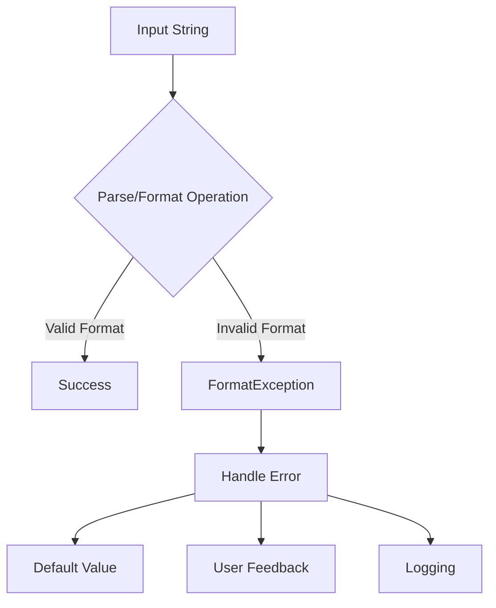

# How to Handle 'Format string' Exceptions in C#

Author: [nawazdhandala](https://www.github.com/nawazdhandala)

Tags: .NET, C#, String Formatting, FormatException, Troubleshooting, Common Issues

Description: Learn how to diagnose and fix FormatException errors in C# applications. This guide covers string formatting, parsing issues, composite formatting, and best practices for safe string manipulation.

Format string exceptions are common runtime errors in C# that occur when working with string formatting, parsing, or data conversion. This guide will help you understand why these exceptions happen and how to handle them effectively.

## Understanding Format Exceptions

The `FormatException` occurs when the format of an argument is invalid. Common scenarios include:

- String.Format with mismatched placeholders
- Parsing strings to numbers or dates
- Custom format strings with invalid patterns
- Interpolated strings with format specifiers



## Common Causes and Solutions

### 1. Mismatched Format Placeholders

The most basic error - placeholder indices don't match arguments:

```csharp
// WRONG - Only 2 arguments but placeholder {2} exists
var message = string.Format("Hello {0}, your order {1} ships on {2}", "John", "12345");
// Throws: FormatException: Index (zero based) must be greater than or
// equal to zero and less than the size of the argument list.
```

**Solution: Match placeholders with arguments**

```csharp
// CORRECT - All placeholders have corresponding arguments
var message = string.Format(
    "Hello {0}, your order {1} ships on {2}",
    "John",
    "12345",
    DateTime.Now.AddDays(3).ToShortDateString());

// BETTER - Use string interpolation (compile-time checked)
var name = "John";
var orderId = "12345";
var shipDate = DateTime.Now.AddDays(3);
var message2 = $"Hello {name}, your order {orderId} ships on {shipDate:d}";
```

### 2. Invalid Number Parsing

Parsing non-numeric strings to numbers:

```csharp
// WRONG - Can throw FormatException
var input = "not a number";
var number = int.Parse(input); // Throws!

// Also problematic
var price = decimal.Parse("$19.99"); // Throws - contains currency symbol
var european = double.Parse("1.234,56"); // May throw depending on culture
```

**Solution: Use TryParse for safe parsing**

```csharp
// SAFE - Using TryParse
var input = "not a number";
if (int.TryParse(input, out var number))
{
    Console.WriteLine($"Parsed: {number}");
}
else
{
    Console.WriteLine("Invalid number format");
}

// Handle currency and culture-specific formats
var priceString = "$19.99";
if (decimal.TryParse(
    priceString,
    NumberStyles.Currency,
    CultureInfo.GetCultureInfo("en-US"),
    out var price))
{
    Console.WriteLine($"Price: {price}");
}

// Handle European number format
var europeanNumber = "1.234,56";
if (double.TryParse(
    europeanNumber,
    NumberStyles.Number,
    CultureInfo.GetCultureInfo("de-DE"),
    out var value))
{
    Console.WriteLine($"Value: {value}");
}
```

### 3. Date and Time Parsing Issues

Date parsing is particularly error-prone due to format variations:

```csharp
// WRONG - Ambiguous date format
var dateString = "01/02/2024"; // Is this Jan 2 or Feb 1?
var date = DateTime.Parse(dateString); // Result depends on culture!

// WRONG - Invalid date format
var invalidDate = DateTime.Parse("2024-13-45"); // Throws FormatException
```

**Solution: Use ParseExact or TryParseExact**

```csharp
// SAFE - Explicit format
var dateString = "2024-12-25";
if (DateTime.TryParseExact(
    dateString,
    "yyyy-MM-dd",
    CultureInfo.InvariantCulture,
    DateTimeStyles.None,
    out var date))
{
    Console.WriteLine($"Date: {date:D}");
}

// Handle multiple possible formats
var formats = new[]
{
    "yyyy-MM-dd",
    "MM/dd/yyyy",
    "dd/MM/yyyy",
    "dd-MMM-yyyy"
};

var ambiguousDate = "25-Dec-2024";
if (DateTime.TryParseExact(
    ambiguousDate,
    formats,
    CultureInfo.InvariantCulture,
    DateTimeStyles.None,
    out var parsedDate))
{
    Console.WriteLine($"Parsed: {parsedDate}");
}
```

### 4. Guid Parsing Errors

```csharp
// WRONG - Invalid GUID format
var guidString = "not-a-guid";
var guid = Guid.Parse(guidString); // Throws FormatException

// Also problematic
var invalidGuid = Guid.Parse("12345"); // Too short
```

**Solution: Validate GUID format**

```csharp
// SAFE - Using TryParse
var guidString = "not-a-guid";
if (Guid.TryParse(guidString, out var guid))
{
    Console.WriteLine($"Valid GUID: {guid}");
}
else
{
    Console.WriteLine("Invalid GUID format");
}

// Or with explicit format
var formattedGuid = "{12345678-1234-1234-1234-123456789012}";
if (Guid.TryParseExact(formattedGuid, "B", out var exactGuid))
{
    Console.WriteLine($"Parsed: {exactGuid}");
}
```

### 5. Enum Parsing Issues

```csharp
public enum Status { Pending, Active, Completed }

// WRONG - Invalid enum value
var statusString = "Invalid";
var status = (Status)Enum.Parse(typeof(Status), statusString); // Throws!

// Also problematic
var numericString = "999";
var status2 = Enum.Parse<Status>(numericString); // Succeeds but invalid!
```

**Solution: Safe enum parsing**

```csharp
public enum Status { Pending, Active, Completed }

// SAFE - Using TryParse
var statusString = "Active";
if (Enum.TryParse<Status>(statusString, ignoreCase: true, out var status))
{
    Console.WriteLine($"Status: {status}");
}

// Validate numeric values
var numericString = "999";
if (Enum.TryParse<Status>(numericString, out var numericStatus)
    && Enum.IsDefined(typeof(Status), numericStatus))
{
    Console.WriteLine($"Valid status: {numericStatus}");
}
else
{
    Console.WriteLine("Invalid status value");
}

// Extension method for safe parsing
public static class EnumExtensions
{
    public static T? ParseOrNull<T>(string value) where T : struct, Enum
    {
        return Enum.TryParse<T>(value, true, out var result)
            && Enum.IsDefined(typeof(T), result)
            ? result
            : null;
    }
}

var safeStatus = EnumExtensions.ParseOrNull<Status>("Active"); // Status.Active
var nullStatus = EnumExtensions.ParseOrNull<Status>("Invalid"); // null
```

### 6. Custom Format String Errors

```csharp
// WRONG - Invalid format specifier
var number = 12345;
var formatted = number.ToString("X2Z"); // 'Z' is invalid - throws!

// WRONG - Unescaped characters in custom format
var date = DateTime.Now;
var formatted2 = date.ToString("Today is dddd"); // 'T', 'o', 'a', 'y' are format chars!
```

**Solution: Use proper format strings**

```csharp
// CORRECT - Valid numeric format
var number = 12345;
var hex = number.ToString("X4"); // "3039"
var currency = number.ToString("C2"); // "$12,345.00"
var custom = number.ToString("#,##0.00"); // "12,345.00"

// CORRECT - Escape literal characters in date format
var date = DateTime.Now;
var formatted = date.ToString("'Today is' dddd"); // "Today is Tuesday"
var formatted2 = date.ToString(@"\T\o\d\a\y\ \i\s dddd"); // Same result

// Common date format specifiers
var examples = new[]
{
    date.ToString("d"),      // Short date: 12/25/2024
    date.ToString("D"),      // Long date: Wednesday, December 25, 2024
    date.ToString("t"),      // Short time: 3:30 PM
    date.ToString("T"),      // Long time: 3:30:00 PM
    date.ToString("f"),      // Full short: Wednesday, December 25, 2024 3:30 PM
    date.ToString("F"),      // Full long: Wednesday, December 25, 2024 3:30:00 PM
    date.ToString("g"),      // General short: 12/25/2024 3:30 PM
    date.ToString("o"),      // Round-trip: 2024-12-25T15:30:00.0000000
};
```

## Safe Parsing Helper Class

Create a helper class for common parsing operations:

```csharp
public static class SafeParse
{
    public static int ToInt(string? value, int defaultValue = 0)
    {
        return int.TryParse(value, out var result) ? result : defaultValue;
    }

    public static decimal ToDecimal(string? value, decimal defaultValue = 0)
    {
        return decimal.TryParse(value, out var result) ? result : defaultValue;
    }

    public static DateTime? ToDateTime(string? value, string? format = null)
    {
        if (string.IsNullOrWhiteSpace(value))
            return null;

        if (format != null)
        {
            return DateTime.TryParseExact(
                value,
                format,
                CultureInfo.InvariantCulture,
                DateTimeStyles.None,
                out var exactResult)
                ? exactResult
                : null;
        }

        return DateTime.TryParse(value, out var result) ? result : null;
    }

    public static Guid? ToGuid(string? value)
    {
        return Guid.TryParse(value, out var result) ? result : null;
    }

    public static T? ToEnum<T>(string? value) where T : struct, Enum
    {
        return Enum.TryParse<T>(value, true, out var result)
            && Enum.IsDefined(typeof(T), result)
            ? result
            : null;
    }

    public static bool ToBool(string? value, bool defaultValue = false)
    {
        if (string.IsNullOrWhiteSpace(value))
            return defaultValue;

        // Handle common boolean representations
        return value.ToLowerInvariant() switch
        {
            "true" or "1" or "yes" or "on" => true,
            "false" or "0" or "no" or "off" => false,
            _ => defaultValue
        };
    }
}

// Usage
var age = SafeParse.ToInt(userInput, defaultValue: 0);
var birthDate = SafeParse.ToDateTime(dateInput, "yyyy-MM-dd");
var userId = SafeParse.ToGuid(idInput) ?? Guid.Empty;
var status = SafeParse.ToEnum<Status>(statusInput) ?? Status.Pending;
```

## Handling Format Exceptions in APIs

```csharp
[ApiController]
[Route("api/[controller]")]
public class UsersController : ControllerBase
{
    [HttpGet("{id}")]
    public IActionResult GetUser(string id)
    {
        // Validate GUID format
        if (!Guid.TryParse(id, out var userId))
        {
            return BadRequest(new
            {
                Error = "Invalid user ID format",
                Parameter = "id",
                ExpectedFormat = "GUID (e.g., 12345678-1234-1234-1234-123456789012)"
            });
        }

        // Continue with valid userId
        return Ok(new { UserId = userId });
    }

    [HttpGet]
    public IActionResult GetUsers(
        [FromQuery] string? status,
        [FromQuery] string? fromDate,
        [FromQuery] string? toDate)
    {
        // Validate enum
        Status? statusFilter = null;
        if (!string.IsNullOrEmpty(status))
        {
            if (!Enum.TryParse<Status>(status, true, out var parsedStatus))
            {
                return BadRequest(new
                {
                    Error = "Invalid status value",
                    ValidValues = Enum.GetNames<Status>()
                });
            }
            statusFilter = parsedStatus;
        }

        // Validate dates
        DateTime? from = null, to = null;
        if (!string.IsNullOrEmpty(fromDate))
        {
            if (!DateTime.TryParse(fromDate, out var parsedFrom))
            {
                return BadRequest(new
                {
                    Error = "Invalid fromDate format",
                    ExpectedFormat = "ISO 8601 (e.g., 2024-12-25)"
                });
            }
            from = parsedFrom;
        }

        // Continue with validated parameters
        return Ok(new { Status = statusFilter, From = from, To = to });
    }
}
```

## Model Binding and Validation

Use model binding with data annotations:

```csharp
public class UserSearchRequest
{
    [Required]
    [RegularExpression(@"^[0-9a-fA-F]{8}-([0-9a-fA-F]{4}-){3}[0-9a-fA-F]{12}$",
        ErrorMessage = "Invalid GUID format")]
    public string? Id { get; set; }

    [Range(1, 100, ErrorMessage = "Page size must be between 1 and 100")]
    public int PageSize { get; set; } = 10;

    [DataType(DataType.Date)]
    public DateTime? FromDate { get; set; }

    [EnumDataType(typeof(Status), ErrorMessage = "Invalid status value")]
    public Status? Status { get; set; }
}

[HttpPost("search")]
public IActionResult SearchUsers([FromBody] UserSearchRequest request)
{
    if (!ModelState.IsValid)
    {
        return BadRequest(ModelState);
    }

    // All values are validated and properly typed
    return Ok(request);
}
```

## Best Practices

1. **Always use TryParse**: Never use Parse without exception handling
2. **Specify culture**: Use `CultureInfo.InvariantCulture` for consistent parsing
3. **Validate input early**: Check formats at the API boundary
4. **Provide helpful error messages**: Tell users the expected format
5. **Use model binding**: Let ASP.NET Core handle parsing and validation
6. **Prefer string interpolation**: It's compile-time checked
7. **Test edge cases**: Empty strings, null, whitespace, special characters

## Conclusion

Format exceptions are preventable with proper validation and parsing techniques. By using TryParse methods, specifying cultures explicitly, and validating input at API boundaries, you can build robust applications that handle malformed input gracefully.

Key takeaways:

- Use TryParse instead of Parse for all conversions
- Specify culture and format explicitly when parsing dates and numbers
- Validate enum values with Enum.IsDefined
- Create helper methods for common parsing patterns
- Use model binding and data annotations for API input validation
- Provide clear error messages when format validation fails
