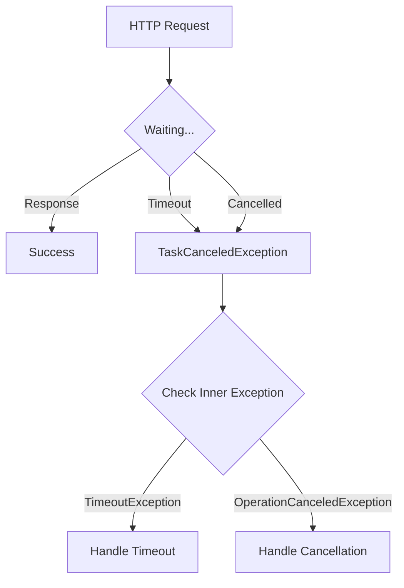

# How to Handle Timeout Exceptions in HttpClient

Author: [nawazdhandala](https://github.com/nawazdhandala)

Tags: .NET, C#, HttpClient, Timeout, Exceptions, Resilience, API

Description: Learn how to properly handle timeout exceptions in HttpClient, configure appropriate timeout values, and implement retry strategies for resilient HTTP communication.

---

Timeout exceptions are inevitable when making HTTP requests. Network latency, slow servers, and infrastructure issues all contribute to timeouts. Properly handling these exceptions is crucial for building resilient applications.

## Understanding HttpClient Timeouts

HttpClient throws `TaskCanceledException` when a request times out. This can be confusing because the same exception is thrown when a `CancellationToken` is cancelled.



## Basic Timeout Configuration

Configure the default timeout for HttpClient:

```csharp
var httpClient = new HttpClient
{
    Timeout = TimeSpan.FromSeconds(30)
};

// Or via IHttpClientFactory
builder.Services.AddHttpClient("api", client =>
{
    client.BaseAddress = new Uri("https://api.example.com");
    client.Timeout = TimeSpan.FromSeconds(30);
});
```

## Distinguishing Timeout from Cancellation

Differentiate between a timeout and user cancellation:

```csharp
public async Task<string?> GetDataAsync(CancellationToken cancellationToken = default)
{
    try
    {
        var response = await _httpClient.GetAsync("/api/data", cancellationToken);
        response.EnsureSuccessStatusCode();
        return await response.Content.ReadAsStringAsync(cancellationToken);
    }
    catch (TaskCanceledException ex) when (ex.InnerException is TimeoutException)
    {
        // Timeout occurred
        _logger.LogWarning("Request timed out");
        return null;
    }
    catch (TaskCanceledException) when (cancellationToken.IsCancellationRequested)
    {
        // User cancelled the request
        _logger.LogInformation("Request was cancelled by user");
        throw;
    }
    catch (TaskCanceledException ex)
    {
        // .NET 5+ wraps timeout in TaskCanceledException without TimeoutException
        // Check if our cancellation token was not the cause
        if (!cancellationToken.IsCancellationRequested)
        {
            _logger.LogWarning("Request timed out");
            return null;
        }
        throw;
    }
}
```

## Handling in .NET 5 and Later

.NET 5+ improved timeout handling:

```csharp
public async Task<Result<T>> GetWithTimeoutHandlingAsync<T>(
    string url,
    CancellationToken cancellationToken = default)
{
    try
    {
        var response = await _httpClient.GetAsync(url, cancellationToken);
        response.EnsureSuccessStatusCode();

        var content = await response.Content.ReadFromJsonAsync<T>(cancellationToken);
        return Result<T>.Success(content!);
    }
    catch (HttpRequestException ex)
    {
        _logger.LogError(ex, "HTTP request failed");
        return Result<T>.Failure($"Request failed: {ex.Message}");
    }
    catch (TaskCanceledException) when (!cancellationToken.IsCancellationRequested)
    {
        _logger.LogWarning("Request timed out after {Timeout}", _httpClient.Timeout);
        return Result<T>.Failure("Request timed out");
    }
    catch (OperationCanceledException) when (cancellationToken.IsCancellationRequested)
    {
        _logger.LogInformation("Request cancelled");
        throw;
    }
}
```

## Per-Request Timeout

Set different timeouts for specific requests:

```csharp
public async Task<string?> GetDataWithCustomTimeoutAsync(TimeSpan timeout)
{
    using var cts = new CancellationTokenSource(timeout);

    try
    {
        var response = await _httpClient.GetAsync("/api/slow-endpoint", cts.Token);
        return await response.Content.ReadAsStringAsync();
    }
    catch (TaskCanceledException) when (cts.IsCancellationRequested)
    {
        _logger.LogWarning("Request timed out after {Timeout}", timeout);
        return null;
    }
}

// Combined timeout and user cancellation
public async Task<string?> GetDataAsync(
    TimeSpan timeout,
    CancellationToken userCancellation)
{
    using var timeoutCts = new CancellationTokenSource(timeout);
    using var linkedCts = CancellationTokenSource.CreateLinkedTokenSource(
        userCancellation, timeoutCts.Token);

    try
    {
        var response = await _httpClient.GetAsync("/api/data", linkedCts.Token);
        return await response.Content.ReadAsStringAsync();
    }
    catch (TaskCanceledException) when (timeoutCts.IsCancellationRequested)
    {
        throw new TimeoutException($"Request timed out after {timeout}");
    }
    catch (TaskCanceledException) when (userCancellation.IsCancellationRequested)
    {
        throw; // Let caller handle user cancellation
    }
}
```

## Retry Strategy with Polly

Use Polly for sophisticated retry logic:

```csharp
builder.Services.AddHttpClient("resilient-api")
    .AddTransientHttpErrorPolicy(policy =>
        policy.WaitAndRetryAsync(
            retryCount: 3,
            sleepDurationProvider: attempt => TimeSpan.FromSeconds(Math.Pow(2, attempt)),
            onRetry: (outcome, timespan, attempt, context) =>
            {
                var logger = context.GetLogger();
                logger?.LogWarning(
                    "Request failed. Waiting {Delay} before retry {Attempt}",
                    timespan, attempt);
            }))
    .AddPolicyHandler(Policy.TimeoutAsync<HttpResponseMessage>(TimeSpan.FromSeconds(10)));
```

Complete Polly configuration:

```csharp
builder.Services.AddHttpClient<IExternalApiClient, ExternalApiClient>()
    .ConfigureHttpClient(client =>
    {
        client.BaseAddress = new Uri("https://api.example.com");
        client.Timeout = TimeSpan.FromSeconds(60); // Overall timeout
    })
    .AddPolicyHandler(GetRetryPolicy())
    .AddPolicyHandler(GetTimeoutPolicy())
    .AddPolicyHandler(GetCircuitBreakerPolicy());

static IAsyncPolicy<HttpResponseMessage> GetRetryPolicy()
{
    return HttpPolicyExtensions
        .HandleTransientHttpError()
        .Or<TimeoutRejectedException>()
        .WaitAndRetryAsync(
            retryCount: 3,
            sleepDurationProvider: attempt =>
                TimeSpan.FromMilliseconds(100 * Math.Pow(2, attempt)),
            onRetry: (outcome, delay, attempt, context) =>
            {
                Console.WriteLine($"Retry {attempt} after {delay.TotalMilliseconds}ms");
            });
}

static IAsyncPolicy<HttpResponseMessage> GetTimeoutPolicy()
{
    return Policy.TimeoutAsync<HttpResponseMessage>(
        TimeSpan.FromSeconds(10),
        TimeoutStrategy.Optimistic);
}

static IAsyncPolicy<HttpResponseMessage> GetCircuitBreakerPolicy()
{
    return HttpPolicyExtensions
        .HandleTransientHttpError()
        .Or<TimeoutRejectedException>()
        .CircuitBreakerAsync(
            handledEventsAllowedBeforeBreaking: 5,
            durationOfBreak: TimeSpan.FromSeconds(30));
}
```

## HttpClient Extension Methods

Create extension methods for common patterns:

```csharp
public static class HttpClientExtensions
{
    public static async Task<T?> GetWithTimeoutAsync<T>(
        this HttpClient client,
        string requestUri,
        TimeSpan timeout,
        CancellationToken cancellationToken = default)
    {
        using var cts = CancellationTokenSource.CreateLinkedTokenSource(cancellationToken);
        cts.CancelAfter(timeout);

        try
        {
            var response = await client.GetAsync(requestUri, cts.Token);
            response.EnsureSuccessStatusCode();
            return await response.Content.ReadFromJsonAsync<T>(cancellationToken);
        }
        catch (TaskCanceledException) when (!cancellationToken.IsCancellationRequested)
        {
            throw new TimeoutException(
                $"Request to {requestUri} timed out after {timeout.TotalSeconds} seconds");
        }
    }

    public static async Task<HttpResponseMessage> SendWithRetryAsync(
        this HttpClient client,
        HttpRequestMessage request,
        int maxRetries = 3,
        CancellationToken cancellationToken = default)
    {
        Exception? lastException = null;

        for (int i = 0; i <= maxRetries; i++)
        {
            try
            {
                // Clone request for retry (request can only be sent once)
                var clonedRequest = await CloneRequestAsync(request);
                var response = await client.SendAsync(clonedRequest, cancellationToken);

                if (response.IsSuccessStatusCode || !IsTransient(response.StatusCode))
                {
                    return response;
                }

                lastException = new HttpRequestException(
                    $"Request failed with status {response.StatusCode}");
            }
            catch (TaskCanceledException) when (!cancellationToken.IsCancellationRequested)
            {
                lastException = new TimeoutException("Request timed out");
            }
            catch (HttpRequestException ex)
            {
                lastException = ex;
            }

            if (i < maxRetries)
            {
                var delay = TimeSpan.FromMilliseconds(100 * Math.Pow(2, i));
                await Task.Delay(delay, cancellationToken);
            }
        }

        throw lastException!;
    }

    private static bool IsTransient(HttpStatusCode statusCode)
    {
        return statusCode == HttpStatusCode.RequestTimeout
            || statusCode == HttpStatusCode.BadGateway
            || statusCode == HttpStatusCode.ServiceUnavailable
            || statusCode == HttpStatusCode.GatewayTimeout;
    }

    private static async Task<HttpRequestMessage> CloneRequestAsync(HttpRequestMessage request)
    {
        var clone = new HttpRequestMessage(request.Method, request.RequestUri);

        foreach (var header in request.Headers)
        {
            clone.Headers.TryAddWithoutValidation(header.Key, header.Value);
        }

        if (request.Content != null)
        {
            var content = await request.Content.ReadAsByteArrayAsync();
            clone.Content = new ByteArrayContent(content);

            foreach (var header in request.Content.Headers)
            {
                clone.Content.Headers.TryAddWithoutValidation(header.Key, header.Value);
            }
        }

        return clone;
    }
}
```

## Timeout Strategies for Different Scenarios

Choose appropriate timeouts based on the operation:

```csharp
public class ApiClient
{
    private readonly HttpClient _httpClient;
    private readonly ILogger<ApiClient> _logger;

    // Default timeouts for different operations
    private static readonly TimeSpan QuickOperationTimeout = TimeSpan.FromSeconds(5);
    private static readonly TimeSpan StandardTimeout = TimeSpan.FromSeconds(30);
    private static readonly TimeSpan LongOperationTimeout = TimeSpan.FromMinutes(5);

    public ApiClient(HttpClient httpClient, ILogger<ApiClient> logger)
    {
        _httpClient = httpClient;
        _logger = logger;
    }

    public async Task<HealthStatus> GetHealthAsync()
    {
        // Health checks should be quick
        return await ExecuteWithTimeoutAsync<HealthStatus>(
            () => _httpClient.GetAsync("/health"),
            QuickOperationTimeout);
    }

    public async Task<List<Product>> GetProductsAsync()
    {
        // Standard API call
        return await ExecuteWithTimeoutAsync<List<Product>>(
            () => _httpClient.GetAsync("/api/products"),
            StandardTimeout);
    }

    public async Task<Report> GenerateReportAsync(ReportRequest request)
    {
        // Long-running operation
        return await ExecuteWithTimeoutAsync<Report>(
            () => _httpClient.PostAsJsonAsync("/api/reports/generate", request),
            LongOperationTimeout);
    }

    private async Task<T> ExecuteWithTimeoutAsync<T>(
        Func<Task<HttpResponseMessage>> operation,
        TimeSpan timeout)
    {
        using var cts = new CancellationTokenSource(timeout);

        try
        {
            var response = await operation();
            response.EnsureSuccessStatusCode();
            return (await response.Content.ReadFromJsonAsync<T>())!;
        }
        catch (TaskCanceledException) when (cts.IsCancellationRequested)
        {
            _logger.LogWarning("Request timed out after {Timeout}", timeout);
            throw new TimeoutException($"Request timed out after {timeout}");
        }
    }
}
```

## Handling Streaming Responses

For streaming responses, handle timeouts differently:

```csharp
public async IAsyncEnumerable<T> StreamDataAsync<T>(
    string url,
    [EnumeratorCancellation] CancellationToken cancellationToken = default)
{
    using var response = await _httpClient.GetAsync(
        url,
        HttpCompletionOption.ResponseHeadersRead,
        cancellationToken);

    response.EnsureSuccessStatusCode();

    await using var stream = await response.Content.ReadAsStreamAsync(cancellationToken);

    var options = new JsonSerializerOptions { PropertyNameCaseInsensitive = true };

    await foreach (var item in JsonSerializer.DeserializeAsyncEnumerable<T>(
        stream, options, cancellationToken))
    {
        if (item != null)
        {
            yield return item;
        }
    }
}
```

## Summary

| Scenario | Recommended Approach |
|----------|---------------------|
| **Simple requests** | Set `HttpClient.Timeout` |
| **Per-request timeout** | Use `CancellationTokenSource` with timeout |
| **With user cancellation** | Use `CreateLinkedTokenSource` |
| **Retry on timeout** | Use Polly retry policies |
| **Distinguish timeout vs cancel** | Check `IsCancellationRequested` |
| **Long-running operations** | Use longer timeouts with progress tracking |

Proper timeout handling is essential for building resilient applications. Always configure appropriate timeouts, distinguish between timeouts and user cancellations, and implement retry strategies for transient failures.
