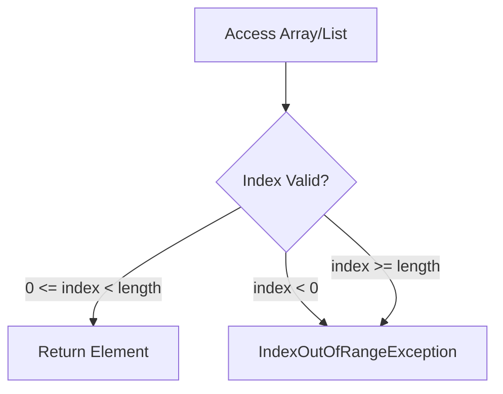

# How to Handle "Index out of range" Errors in C#

Author: [nawazdhandala](https://www.github.com/nawazdhandala)

Tags: .NET, C#, IndexOutOfRangeException, Arrays, Collections, Troubleshooting

Description: Learn how to diagnose and prevent IndexOutOfRangeException errors in C# applications. This guide covers array bounds checking, safe collection access patterns, and best practices for writing robust code that handles indices properly.

The `IndexOutOfRangeException` is a common runtime error that occurs when trying to access an array or collection element using an invalid index. This guide will help you understand why this error occurs and how to prevent it.

## Understanding the Error

```
System.IndexOutOfRangeException: Index was outside the bounds of the array.
   at MyApp.ProcessData(Int32[] data) in Program.cs:line 25
```

This exception occurs when:
- Accessing an array with a negative index
- Accessing an array with an index >= array length
- Similar issues with List, string, Span, etc.



## Common Causes and Solutions

### 1. Off-by-One Errors

The classic bug - forgetting that arrays are zero-indexed:

```csharp
// WRONG - Arrays are 0-indexed, last valid index is Length - 1
var numbers = new int[] { 1, 2, 3, 4, 5 };
for (int i = 0; i <= numbers.Length; i++) // Bug: <= should be <
{
    Console.WriteLine(numbers[i]); // Throws when i = 5
}

// WRONG - Accessing element at Count instead of Count - 1
var list = new List<string> { "a", "b", "c" };
var last = list[list.Count]; // Throws! Should be Count - 1
```

**Solution: Use correct bounds**

```csharp
// CORRECT - Use < for upper bound
var numbers = new int[] { 1, 2, 3, 4, 5 };
for (int i = 0; i < numbers.Length; i++)
{
    Console.WriteLine(numbers[i]);
}

// CORRECT - Use Count - 1 for last element
var list = new List<string> { "a", "b", "c" };
var last = list[list.Count - 1]; // "c"

// BETTER - Use foreach when possible
foreach (var number in numbers)
{
    Console.WriteLine(number);
}

// BETTER - Use LINQ for first/last
var first = list.First();
var last = list.Last();
var lastOrDefault = list.LastOrDefault(); // null if empty
```

### 2. Empty Collection Access

Accessing elements in an empty collection:

```csharp
// WRONG - No elements to access
var empty = new List<int>();
var first = empty[0]; // Throws!

// WRONG - Assuming collection has data
var data = GetDataFromApi(); // Returns empty list
var firstItem = data[0]; // Throws!
```

**Solution: Check before accessing**

```csharp
// CORRECT - Check Count/Length first
var data = GetDataFromApi();
if (data.Count > 0)
{
    var firstItem = data[0];
    ProcessItem(firstItem);
}

// CORRECT - Use LINQ with default
var firstOrDefault = data.FirstOrDefault();
if (firstOrDefault != null)
{
    ProcessItem(firstOrDefault);
}

// CORRECT - Use TryGet pattern for dictionaries
if (data.TryGetValue(key, out var value))
{
    ProcessValue(value);
}

// CORRECT - Use pattern matching
if (data is [var first, ..])
{
    ProcessItem(first);
}
```

### 3. Calculated Index Errors

Using calculated indices without validation:

```csharp
// WRONG - userInput could be any value
int userInput = GetUserInput();
var item = items[userInput]; // Throws if invalid!

// WRONG - Calculation could produce invalid index
int index = (pageNumber - 1) * pageSize;
var pageItems = allItems[index]; // Throws if too large
```

**Solution: Validate calculated indices**

```csharp
// CORRECT - Validate user input
int userInput = GetUserInput();
if (userInput >= 0 && userInput < items.Length)
{
    var item = items[userInput];
    ProcessItem(item);
}
else
{
    Console.WriteLine($"Invalid index: {userInput}");
}

// CORRECT - Use Math.Clamp for bounded access
int userInput = GetUserInput();
int safeIndex = Math.Clamp(userInput, 0, items.Length - 1);
var item = items[safeIndex];

// CORRECT - Validate pagination parameters
int index = (pageNumber - 1) * pageSize;
if (index >= 0 && index < allItems.Count)
{
    var pageItems = allItems.Skip(index).Take(pageSize).ToList();
}
```

### 4. Multi-Dimensional Array Issues

Working with multi-dimensional or jagged arrays:

```csharp
// WRONG - Jagged array rows have different lengths
int[][] jagged = new int[][]
{
    new int[] { 1, 2 },
    new int[] { 3, 4, 5, 6 },
    new int[] { 7 }
};

for (int i = 0; i < jagged.Length; i++)
{
    for (int j = 0; j < 4; j++) // Assumes all rows have 4 elements
    {
        Console.WriteLine(jagged[i][j]); // Throws for rows 0 and 2
    }
}
```

**Solution: Check each dimension**

```csharp
// CORRECT - Check each row's length
int[][] jagged = new int[][]
{
    new int[] { 1, 2 },
    new int[] { 3, 4, 5, 6 },
    new int[] { 7 }
};

for (int i = 0; i < jagged.Length; i++)
{
    for (int j = 0; j < jagged[i].Length; j++) // Use row's actual length
    {
        Console.WriteLine(jagged[i][j]);
    }
}

// CORRECT - Use GetLength for multi-dimensional arrays
int[,] matrix = new int[3, 4];
for (int i = 0; i < matrix.GetLength(0); i++)
{
    for (int j = 0; j < matrix.GetLength(1); j++)
    {
        Console.WriteLine(matrix[i, j]);
    }
}
```

### 5. String Index Access

Strings are character arrays and have the same issues:

```csharp
// WRONG - Empty string
string text = "";
char first = text[0]; // Throws!

// WRONG - Accessing beyond string length
string name = "John";
char fifth = name[4]; // Throws! Length is 4, max index is 3
```

**Solution: Validate string access**

```csharp
// CORRECT - Check string length
string text = GetUserInput();
if (!string.IsNullOrEmpty(text))
{
    char first = text[0];
}

// CORRECT - Use safe indexing with bounds check
string name = "John";
if (name.Length > 4)
{
    char fifth = name[4];
}

// CORRECT - Use Substring safely
string SafeSubstring(string input, int startIndex, int length)
{
    if (string.IsNullOrEmpty(input)) return string.Empty;
    if (startIndex >= input.Length) return string.Empty;

    int actualLength = Math.Min(length, input.Length - startIndex);
    return input.Substring(startIndex, actualLength);
}
```

## Safe Collection Access Patterns

### Extension Methods for Safe Access

```csharp
public static class SafeCollectionExtensions
{
    public static T? ElementAtOrDefault<T>(this IList<T> list, int index)
    {
        if (index < 0 || index >= list.Count)
            return default;
        return list[index];
    }

    public static T ElementAtOrDefault<T>(this IList<T> list, int index, T defaultValue)
    {
        if (index < 0 || index >= list.Count)
            return defaultValue;
        return list[index];
    }

    public static bool TryGetValue<T>(this IList<T> list, int index, out T? value)
    {
        if (index >= 0 && index < list.Count)
        {
            value = list[index];
            return true;
        }
        value = default;
        return false;
    }

    public static T? SafeGet<T>(this T[] array, int index)
    {
        if (index >= 0 && index < array.Length)
            return array[index];
        return default;
    }
}

// Usage
var numbers = new[] { 1, 2, 3 };
var value = numbers.SafeGet(10); // null instead of exception

var list = new List<string> { "a", "b" };
if (list.TryGetValue(5, out var item))
{
    Console.WriteLine(item);
}
else
{
    Console.WriteLine("Index not found");
}
```

### Index and Range Operators (C# 8+)

```csharp
var numbers = new[] { 0, 1, 2, 3, 4, 5 };

// Index from end
var last = numbers[^1];      // 5
var secondLast = numbers[^2]; // 4

// Ranges
var firstThree = numbers[..3];   // [0, 1, 2]
var lastThree = numbers[^3..];   // [3, 4, 5]
var middle = numbers[1..^1];     // [1, 2, 3, 4]

// Still need bounds checking
int[] empty = Array.Empty<int>();
// var last = empty[^1]; // Still throws!

// Safe pattern with ranges
static T[] SafeSlice<T>(T[] array, int start, int length)
{
    if (array.Length == 0) return Array.Empty<T>();
    start = Math.Clamp(start, 0, array.Length - 1);
    length = Math.Min(length, array.Length - start);
    return array[start..(start + length)];
}
```

### Span<T> for Safe Slicing

```csharp
public static class SpanExtensions
{
    public static Span<T> SafeSlice<T>(this Span<T> span, int start, int length)
    {
        if (span.IsEmpty) return Span<T>.Empty;

        start = Math.Clamp(start, 0, span.Length);
        length = Math.Clamp(length, 0, span.Length - start);

        return span.Slice(start, length);
    }
}

// Usage
Span<int> numbers = stackalloc int[] { 1, 2, 3, 4, 5 };
var slice = numbers.SafeSlice(10, 5); // Returns empty span, no exception
```

## Defensive Programming Patterns

### Guard Clauses

```csharp
public class DataProcessor
{
    public void ProcessItems(int[] items, int startIndex, int count)
    {
        // Guard clauses
        ArgumentNullException.ThrowIfNull(items);

        if (startIndex < 0)
            throw new ArgumentOutOfRangeException(nameof(startIndex),
                "Start index cannot be negative");

        if (startIndex >= items.Length)
            throw new ArgumentOutOfRangeException(nameof(startIndex),
                $"Start index {startIndex} exceeds array length {items.Length}");

        if (count < 0)
            throw new ArgumentOutOfRangeException(nameof(count),
                "Count cannot be negative");

        if (startIndex + count > items.Length)
            throw new ArgumentOutOfRangeException(nameof(count),
                $"Count {count} from index {startIndex} exceeds array bounds");

        // Safe to process
        for (int i = startIndex; i < startIndex + count; i++)
        {
            Process(items[i]);
        }
    }
}
```

### Bounded Collections

```csharp
public class BoundedList<T>
{
    private readonly List<T> _items = new();
    private readonly int _maxSize;

    public BoundedList(int maxSize)
    {
        _maxSize = maxSize;
    }

    public int Count => _items.Count;

    public T this[int index]
    {
        get
        {
            ValidateIndex(index);
            return _items[index];
        }
        set
        {
            ValidateIndex(index);
            _items[index] = value;
        }
    }

    public void Add(T item)
    {
        if (_items.Count >= _maxSize)
            throw new InvalidOperationException($"List cannot exceed {_maxSize} items");
        _items.Add(item);
    }

    public bool TryGet(int index, out T? value)
    {
        if (index >= 0 && index < _items.Count)
        {
            value = _items[index];
            return true;
        }
        value = default;
        return false;
    }

    private void ValidateIndex(int index)
    {
        if (index < 0 || index >= _items.Count)
            throw new IndexOutOfRangeException(
                $"Index {index} is out of range. Valid range: 0-{_items.Count - 1}");
    }
}
```

## LINQ Alternatives

Use LINQ to avoid index errors:

```csharp
var items = new List<string> { "a", "b", "c" };

// Instead of: items[0]
var first = items.FirstOrDefault();

// Instead of: items[items.Count - 1]
var last = items.LastOrDefault();

// Instead of: items[index]
var atIndex = items.ElementAtOrDefault(index);

// Instead of: for loop with index
foreach (var (item, index) in items.Select((item, i) => (item, i)))
{
    Console.WriteLine($"{index}: {item}");
}

// Instead of: manual slicing
var page = items.Skip(pageIndex * pageSize).Take(pageSize).ToList();

// Instead of: checking if exists then accessing
var item = items.FirstOrDefault(x => x.StartsWith("a"));
```

## Common Scenarios

### Pagination

```csharp
public class PaginatedList<T>
{
    public List<T> Items { get; }
    public int PageIndex { get; }
    public int TotalPages { get; }
    public int TotalCount { get; }

    public PaginatedList(IEnumerable<T> source, int pageIndex, int pageSize)
    {
        var items = source.ToList();
        TotalCount = items.Count;
        TotalPages = (int)Math.Ceiling(TotalCount / (double)pageSize);

        // Clamp page index to valid range
        PageIndex = Math.Clamp(pageIndex, 0, Math.Max(0, TotalPages - 1));

        Items = items
            .Skip(PageIndex * pageSize)
            .Take(pageSize)
            .ToList();
    }

    public bool HasPreviousPage => PageIndex > 0;
    public bool HasNextPage => PageIndex < TotalPages - 1;
}
```

### Circular Buffer

```csharp
public class CircularBuffer<T>
{
    private readonly T[] _buffer;
    private int _head;
    private int _count;

    public CircularBuffer(int capacity)
    {
        _buffer = new T[capacity];
    }

    public void Add(T item)
    {
        _buffer[_head] = item;
        _head = (_head + 1) % _buffer.Length;
        _count = Math.Min(_count + 1, _buffer.Length);
    }

    public T this[int index]
    {
        get
        {
            if (index < 0 || index >= _count)
                throw new IndexOutOfRangeException();

            int actualIndex = (_head - _count + index + _buffer.Length) % _buffer.Length;
            return _buffer[actualIndex];
        }
    }
}
```

## Conclusion

IndexOutOfRangeException is preventable with proper bounds checking and defensive coding practices:

1. **Use foreach when possible**: Avoid manual index management
2. **Check bounds before access**: Validate indices before using them
3. **Use LINQ methods**: FirstOrDefault, LastOrDefault, ElementAtOrDefault
4. **Validate user input**: Never trust external index values
5. **Use extension methods**: Create safe access helpers
6. **Test edge cases**: Empty collections, single elements, boundaries
7. **Use Index/Range syntax**: Modern C# features for cleaner code

By consistently applying these patterns, you'll eliminate index-related runtime errors and build more robust applications.
