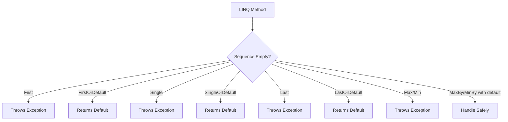

# How to Handle "Sequence contains no elements" Errors in C#

Author: [nawazdhandala](https://github.com/nawazdhandala)

Tags: C#, .NET, LINQ, Exceptions, Error Handling, Collections

Description: Learn how to diagnose and fix the "Sequence contains no elements" exception in C#. This guide covers common causes with LINQ methods and provides safe alternatives for handling empty collections.

---

The "Sequence contains no elements" exception (`InvalidOperationException`) occurs when you use LINQ methods that expect at least one element on an empty collection. This guide covers why it happens and how to handle it properly.

## Understanding the Error

Several LINQ methods throw `InvalidOperationException` when called on empty sequences:

```csharp
var emptyList = new List<int>();

// All of these throw "Sequence contains no elements"
emptyList.First();           // InvalidOperationException
emptyList.Last();            // InvalidOperationException
emptyList.Single();          // InvalidOperationException
emptyList.Max();             // InvalidOperationException
emptyList.Min();             // InvalidOperationException
emptyList.Average();         // InvalidOperationException
```

## LINQ Methods and Their Safe Alternatives



## First, Last, and Single

### First() vs FirstOrDefault()

```csharp
var orders = new List<Order>();

// PROBLEM: Throws on empty sequence
var firstOrder = orders.First(); // InvalidOperationException!

// SOLUTION 1: Use FirstOrDefault()
var firstOrder = orders.FirstOrDefault(); // Returns null for reference types

// SOLUTION 2: FirstOrDefault with condition check
var firstOrder = orders.FirstOrDefault();
if (firstOrder == null)
{
    // Handle no orders case
    throw new NotFoundException("No orders found");
}

// SOLUTION 3: FirstOrDefault with custom default (C# 9+)
var firstOrder = orders.FirstOrDefault() ?? new Order { Id = 0, Status = "Empty" };

// SOLUTION 4: Any() check first
if (orders.Any())
{
    var firstOrder = orders.First(); // Safe now
}
```

### Single() vs SingleOrDefault()

```csharp
// Single expects exactly one element
var users = await _context.Users
    .Where(u => u.Email == email)
    .ToListAsync();

// PROBLEM: Throws if 0 or more than 1 element
var user = users.Single(); // Might throw!

// SOLUTION: Use SingleOrDefault for 0 or 1 elements
var user = users.SingleOrDefault();

if (user == null)
{
    throw new UserNotFoundException(email);
}

// Note: SingleOrDefault still throws if MORE than one element
// Use FirstOrDefault if duplicates are possible
```

### Last() vs LastOrDefault()

```csharp
var events = GetRecentEvents();

// PROBLEM
var lastEvent = events.Last(); // Throws if empty!

// SOLUTION
var lastEvent = events.LastOrDefault();
var lastEvent = events.LastOrDefault(e => e.Type == "Error");
```

## Aggregate Methods

### Max() and Min()

```csharp
var prices = new List<decimal>();

// PROBLEM
var maxPrice = prices.Max(); // InvalidOperationException!

// SOLUTION 1: DefaultIfEmpty()
var maxPrice = prices.DefaultIfEmpty(0).Max(); // Returns 0 if empty

// SOLUTION 2: Nullable Max (for reference types or explicit nullable)
var orders = new List<Order>();
var maxPrice = orders.Max(o => (decimal?)o.Price); // Returns null if empty

// SOLUTION 3: Check Any() first
decimal maxPrice = 0;
if (prices.Any())
{
    maxPrice = prices.Max();
}

// SOLUTION 4: Aggregate with seed
var maxPrice = prices.Aggregate(0m, (max, price) => price > max ? price : max);

// SOLUTION 5: MaxBy with check (C# 10+)
var orders = new List<Order>();
var mostExpensive = orders.MaxBy(o => o.Price);
if (mostExpensive != null)
{
    Console.WriteLine($"Most expensive: {mostExpensive.Name}");
}
```

### Average()

```csharp
var scores = new List<int>();

// PROBLEM
var average = scores.Average(); // InvalidOperationException!

// SOLUTION 1: DefaultIfEmpty
var average = scores.DefaultIfEmpty(0).Average();

// SOLUTION 2: Conditional
var average = scores.Any() ? scores.Average() : 0;

// SOLUTION 3: Null-returning version
var nullableScores = scores.Cast<int?>();
var average = nullableScores.Average(); // Returns null if empty
```

## Working with Query Results

### Entity Framework Queries

```csharp
public class OrderService
{
    private readonly ApplicationDbContext _context;

    // PROBLEM: May throw if no matching order
    public async Task<Order> GetOrderByIdAsync(int id)
    {
        return await _context.Orders.SingleAsync(o => o.Id == id);
    }

    // SOLUTION 1: Return nullable
    public async Task<Order?> GetOrderByIdAsync(int id)
    {
        return await _context.Orders.SingleOrDefaultAsync(o => o.Id == id);
    }

    // SOLUTION 2: Throw specific exception
    public async Task<Order> GetOrderByIdAsync(int id)
    {
        var order = await _context.Orders.SingleOrDefaultAsync(o => o.Id == id);

        if (order == null)
        {
            throw new OrderNotFoundException(id);
        }

        return order;
    }

    // SOLUTION 3: Use FindAsync for primary key lookups
    public async Task<Order?> GetOrderByIdAsync(int id)
    {
        return await _context.Orders.FindAsync(id);
    }
}
```

### Handling Multiple Scenarios

```csharp
public class ProductService
{
    public async Task<ProductStats> GetProductStatsAsync(int categoryId)
    {
        var products = await _context.Products
            .Where(p => p.CategoryId == categoryId)
            .ToListAsync();

        if (!products.Any())
        {
            return new ProductStats
            {
                CategoryId = categoryId,
                Count = 0,
                AveragePrice = null,
                MinPrice = null,
                MaxPrice = null
            };
        }

        return new ProductStats
        {
            CategoryId = categoryId,
            Count = products.Count,
            AveragePrice = products.Average(p => p.Price),
            MinPrice = products.Min(p => p.Price),
            MaxPrice = products.Max(p => p.Price)
        };
    }
}
```

## Pattern Matching Approach

```csharp
public Order? ProcessLatestOrder(List<Order> orders)
{
    return orders switch
    {
        [] => null,                              // Empty sequence
        [var single] => ProcessSingle(single),   // Exactly one
        [.., var last] => ProcessLast(last)      // Last of many
    };
}

// With FirstOrDefault pattern matching
var order = orders.FirstOrDefault();
var result = order switch
{
    null => "No orders available",
    { Status: "Pending" } => "Processing pending order",
    { Status: "Completed" } => "Order already completed",
    _ => "Unknown order status"
};
```

## Extension Methods for Safety

```csharp
public static class LinqExtensions
{
    public static T? FirstOrNull<T>(this IEnumerable<T> source) where T : struct
    {
        foreach (var item in source)
        {
            return item;
        }
        return null;
    }

    public static TResult? SafeMax<TSource, TResult>(
        this IEnumerable<TSource> source,
        Func<TSource, TResult> selector) where TResult : struct
    {
        if (!source.Any())
        {
            return null;
        }
        return source.Max(selector);
    }

    public static T? SafeSingle<T>(
        this IEnumerable<T> source,
        Func<T, bool>? predicate = null) where T : class
    {
        var filtered = predicate != null ? source.Where(predicate) : source;
        var list = filtered.Take(2).ToList();

        return list.Count switch
        {
            0 => null,
            1 => list[0],
            _ => throw new InvalidOperationException("Sequence contains more than one element")
        };
    }

    public static async Task<T> FirstOrThrowAsync<T, TException>(
        this IQueryable<T> source,
        Expression<Func<T, bool>> predicate,
        Func<TException> exceptionFactory) where TException : Exception
    {
        var result = await source.FirstOrDefaultAsync(predicate);

        if (result == null)
        {
            throw exceptionFactory();
        }

        return result;
    }
}

// Usage
var order = await _context.Orders
    .FirstOrThrowAsync(
        o => o.Id == orderId,
        () => new OrderNotFoundException(orderId));
```

## Best Practices Summary

| Method | Use When | Safe Alternative |
|--------|----------|------------------|
| `First()` | Element must exist | `FirstOrDefault()` |
| `Single()` | Exactly one expected | `SingleOrDefault()` |
| `Last()` | Element must exist | `LastOrDefault()` |
| `Max()/Min()` | Collection has items | `DefaultIfEmpty().Max()` |
| `Average()` | Collection has items | `DefaultIfEmpty().Average()` |
| `ElementAt()` | Index must be valid | `ElementAtOrDefault()` |

## Defensive Coding Pattern

```csharp
public class SafeQueryHandler
{
    public async Task<QueryResult<T>> ExecuteAsync<T>(
        IQueryable<T> query,
        QueryOptions options) where T : class
    {
        var items = await query
            .Skip(options.Skip)
            .Take(options.Take)
            .ToListAsync();

        return new QueryResult<T>
        {
            Items = items,
            HasResults = items.Any(),
            First = items.FirstOrDefault(),
            Last = items.LastOrDefault(),
            Count = items.Count
        };
    }
}

public class QueryResult<T> where T : class
{
    public List<T> Items { get; set; } = new();
    public bool HasResults { get; set; }
    public T? First { get; set; }
    public T? Last { get; set; }
    public int Count { get; set; }
}
```

## Conclusion

The "Sequence contains no elements" exception is easily preventable by using the right LINQ methods. Always use `*OrDefault()` variants when the sequence might be empty, use `DefaultIfEmpty()` for aggregate methods, and check `Any()` when you need to perform multiple operations. Consider creating extension methods for common safe-query patterns in your application.
