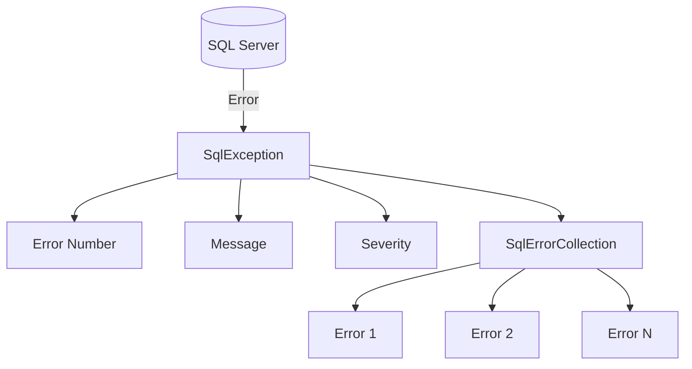

# How to Handle SqlException Errors in .NET

Author: [nawazdhandala](https://github.com/nawazdhandala)

Tags: .NET, C#, SQL Server, Database, Exception Handling, Entity Framework

Description: Learn how to properly handle SqlException errors in .NET applications, understand common SQL error codes, and implement robust error handling strategies for database operations.

---

`SqlException` errors are inevitable when working with SQL Server databases. Understanding how to handle these exceptions properly helps you build more resilient applications and provide better feedback to users.

## Understanding SqlException

`SqlException` contains valuable information about what went wrong, including error numbers, severity levels, and detailed messages. A single `SqlException` can contain multiple errors.



## Basic Exception Handling

Start with proper try-catch blocks:

```csharp
public async Task<User?> GetUserByIdAsync(int id)
{
    try
    {
        await using var connection = new SqlConnection(_connectionString);
        await connection.OpenAsync();

        await using var command = new SqlCommand(
            "SELECT Id, Name, Email FROM Users WHERE Id = @Id",
            connection);
        command.Parameters.AddWithValue("@Id", id);

        await using var reader = await command.ExecuteReaderAsync();

        if (await reader.ReadAsync())
        {
            return new User
            {
                Id = reader.GetInt32(0),
                Name = reader.GetString(1),
                Email = reader.GetString(2)
            };
        }

        return null;
    }
    catch (SqlException ex)
    {
        _logger.LogError(ex,
            "Database error while fetching user {UserId}. Error number: {ErrorNumber}",
            id, ex.Number);
        throw;
    }
}
```

## Common SQL Error Numbers

Handle specific error numbers for better error responses:

```csharp
public class SqlErrorHandler
{
    // Common SQL Server error numbers
    private const int DuplicateKey = 2627;
    private const int DuplicateIndex = 2601;
    private const int ForeignKeyViolation = 547;
    private const int CannotInsertNull = 515;
    private const int ArithmeticOverflow = 8115;
    private const int StringTruncation = 8152;
    private const int DeadlockVictim = 1205;
    private const int LockTimeout = -2;
    private const int ConnectionFailed = 53;
    private const int LoginFailed = 18456;
    private const int DatabaseNotFound = 4060;
    private const int PermissionDenied = 229;
    private const int InvalidObjectName = 208;

    public DatabaseResult HandleSqlException(SqlException ex)
    {
        return ex.Number switch
        {
            DuplicateKey or DuplicateIndex => new DatabaseResult
            {
                Success = false,
                ErrorType = DatabaseErrorType.DuplicateEntry,
                Message = "A record with this key already exists"
            },

            ForeignKeyViolation => new DatabaseResult
            {
                Success = false,
                ErrorType = DatabaseErrorType.ForeignKeyViolation,
                Message = "Cannot complete operation due to related records"
            },

            CannotInsertNull => new DatabaseResult
            {
                Success = false,
                ErrorType = DatabaseErrorType.ValidationError,
                Message = "Required field is missing"
            },

            DeadlockVictim => new DatabaseResult
            {
                Success = false,
                ErrorType = DatabaseErrorType.Deadlock,
                Message = "Database conflict occurred. Please retry"
            },

            ConnectionFailed or LoginFailed or DatabaseNotFound => new DatabaseResult
            {
                Success = false,
                ErrorType = DatabaseErrorType.ConnectionError,
                Message = "Unable to connect to database"
            },

            _ => new DatabaseResult
            {
                Success = false,
                ErrorType = DatabaseErrorType.Unknown,
                Message = "A database error occurred"
            }
        };
    }
}

public enum DatabaseErrorType
{
    Unknown,
    DuplicateEntry,
    ForeignKeyViolation,
    ValidationError,
    Deadlock,
    ConnectionError,
    Timeout,
    PermissionDenied
}
```

## Handling Constraint Violations

Extract meaningful information from constraint violations:

```csharp
public async Task<Result> CreateUserAsync(User user)
{
    try
    {
        await using var connection = new SqlConnection(_connectionString);
        await connection.OpenAsync();

        await using var command = new SqlCommand(
            @"INSERT INTO Users (Email, Name, Username)
              VALUES (@Email, @Name, @Username)",
            connection);

        command.Parameters.AddWithValue("@Email", user.Email);
        command.Parameters.AddWithValue("@Name", user.Name);
        command.Parameters.AddWithValue("@Username", user.Username);

        await command.ExecuteNonQueryAsync();

        return Result.Success();
    }
    catch (SqlException ex) when (ex.Number == 2627 || ex.Number == 2601)
    {
        // Extract constraint name from message
        var constraintName = ExtractConstraintName(ex.Message);

        return constraintName switch
        {
            "UQ_Users_Email" => Result.Failure("Email address is already registered"),
            "UQ_Users_Username" => Result.Failure("Username is already taken"),
            _ => Result.Failure("A duplicate entry already exists")
        };
    }
    catch (SqlException ex) when (ex.Number == 547)
    {
        return Result.Failure("Invalid reference to related data");
    }
}

private string? ExtractConstraintName(string message)
{
    // Message format: Violation of UNIQUE KEY constraint 'UQ_Users_Email'.
    var match = Regex.Match(message, @"constraint '([^']+)'");
    return match.Success ? match.Groups[1].Value : null;
}
```

## Retry Logic for Transient Errors

Implement retry for transient errors like deadlocks:

```csharp
public class SqlRetryPolicy
{
    private static readonly int[] TransientErrorNumbers = new[]
    {
        -2,     // Timeout
        1205,   // Deadlock
        -1,     // Connection error
        2,      // Timeout
        53,     // Network error
        121,    // Timeout
        1222,   // Lock timeout
        49918,  // Not enough resources
        49919,  // Too many requests
        49920   // Too many requests
    };

    public async Task<T> ExecuteWithRetryAsync<T>(
        Func<Task<T>> operation,
        int maxRetries = 3)
    {
        var retryCount = 0;
        var delay = TimeSpan.FromMilliseconds(100);

        while (true)
        {
            try
            {
                return await operation();
            }
            catch (SqlException ex) when (IsTransient(ex) && retryCount < maxRetries)
            {
                retryCount++;
                _logger.LogWarning(
                    "Transient SQL error {ErrorNumber}. Retry {RetryCount}/{MaxRetries}",
                    ex.Number, retryCount, maxRetries);

                await Task.Delay(delay);
                delay = TimeSpan.FromMilliseconds(delay.TotalMilliseconds * 2); // Exponential backoff
            }
        }
    }

    private bool IsTransient(SqlException ex)
    {
        if (TransientErrorNumbers.Contains(ex.Number))
            return true;

        // Check all errors in the collection
        foreach (SqlError error in ex.Errors)
        {
            if (TransientErrorNumbers.Contains(error.Number))
                return true;
        }

        return false;
    }
}
```

## Entity Framework Integration

Handle SqlExceptions in Entity Framework:

```csharp
public class UserRepository
{
    private readonly AppDbContext _context;
    private readonly ILogger<UserRepository> _logger;

    public UserRepository(AppDbContext context, ILogger<UserRepository> logger)
    {
        _context = context;
        _logger = logger;
    }

    public async Task<Result<User>> CreateAsync(User user)
    {
        try
        {
            _context.Users.Add(user);
            await _context.SaveChangesAsync();
            return Result<User>.Success(user);
        }
        catch (DbUpdateException ex) when (ex.InnerException is SqlException sqlEx)
        {
            return HandleSqlException(sqlEx);
        }
    }

    public async Task<Result> DeleteAsync(int userId)
    {
        try
        {
            var user = await _context.Users.FindAsync(userId);
            if (user == null)
                return Result.Failure("User not found");

            _context.Users.Remove(user);
            await _context.SaveChangesAsync();
            return Result.Success();
        }
        catch (DbUpdateException ex) when (ex.InnerException is SqlException sqlEx)
        {
            if (sqlEx.Number == 547) // Foreign key violation
            {
                return Result.Failure(
                    "Cannot delete user because they have associated records");
            }
            throw;
        }
    }

    private Result<User> HandleSqlException(SqlException ex)
    {
        return ex.Number switch
        {
            2627 or 2601 => Result<User>.Failure("User with this email already exists"),
            547 => Result<User>.Failure("Invalid reference"),
            _ => Result<User>.Failure("Database error occurred")
        };
    }
}
```

## Connection Error Handling

Handle connection issues gracefully:

```csharp
public class DatabaseHealthCheck
{
    private readonly string _connectionString;
    private readonly ILogger<DatabaseHealthCheck> _logger;

    public async Task<HealthCheckResult> CheckHealthAsync()
    {
        try
        {
            await using var connection = new SqlConnection(_connectionString);
            await connection.OpenAsync();

            await using var command = new SqlCommand("SELECT 1", connection);
            await command.ExecuteScalarAsync();

            return HealthCheckResult.Healthy();
        }
        catch (SqlException ex) when (ex.Number == 53)
        {
            _logger.LogError(ex, "Network error connecting to database");
            return HealthCheckResult.Unhealthy("Cannot reach database server");
        }
        catch (SqlException ex) when (ex.Number == 18456)
        {
            _logger.LogError(ex, "Authentication failed");
            return HealthCheckResult.Unhealthy("Database authentication failed");
        }
        catch (SqlException ex) when (ex.Number == 4060)
        {
            _logger.LogError(ex, "Database not found");
            return HealthCheckResult.Unhealthy("Database does not exist");
        }
        catch (SqlException ex)
        {
            _logger.LogError(ex, "Database health check failed");
            return HealthCheckResult.Unhealthy($"Database error: {ex.Message}");
        }
    }
}
```

## Timeout Handling

Handle command timeouts properly:

```csharp
public async Task<List<Report>> GenerateReportsAsync()
{
    try
    {
        await using var connection = new SqlConnection(_connectionString);
        await connection.OpenAsync();

        await using var command = new SqlCommand(
            "EXEC GenerateLargeReport",
            connection);
        command.CommandTimeout = 300; // 5 minutes for long-running queries

        var reports = new List<Report>();
        await using var reader = await command.ExecuteReaderAsync();

        while (await reader.ReadAsync())
        {
            reports.Add(MapReport(reader));
        }

        return reports;
    }
    catch (SqlException ex) when (ex.Number == -2)
    {
        _logger.LogWarning("Report generation timed out");
        throw new TimeoutException("Report generation took too long", ex);
    }
}
```

## Structured Error Logging

Log comprehensive error information:

```csharp
public void LogSqlException(SqlException ex, string operation)
{
    _logger.LogError(ex,
        "SQL Error during {Operation}. " +
        "Number: {ErrorNumber}, " +
        "State: {State}, " +
        "Class: {Class}, " +
        "Server: {Server}, " +
        "Procedure: {Procedure}, " +
        "LineNumber: {LineNumber}",
        operation,
        ex.Number,
        ex.State,
        ex.Class,
        ex.Server,
        ex.Procedure,
        ex.LineNumber);

    // Log all errors in the collection
    foreach (SqlError error in ex.Errors)
    {
        _logger.LogError(
            "SQL Error Detail - Number: {Number}, Message: {Message}, " +
            "Procedure: {Procedure}, Line: {Line}",
            error.Number,
            error.Message,
            error.Procedure,
            error.LineNumber);
    }
}
```

## Complete Repository Pattern

Here is a complete implementation with proper error handling:

```csharp
public class ProductRepository : IProductRepository
{
    private readonly string _connectionString;
    private readonly ILogger<ProductRepository> _logger;
    private readonly SqlRetryPolicy _retryPolicy;

    public ProductRepository(
        IConfiguration configuration,
        ILogger<ProductRepository> logger,
        SqlRetryPolicy retryPolicy)
    {
        _connectionString = configuration.GetConnectionString("Default")!;
        _logger = logger;
        _retryPolicy = retryPolicy;
    }

    public async Task<Result<Product>> CreateAsync(Product product)
    {
        return await _retryPolicy.ExecuteWithRetryAsync(async () =>
        {
            try
            {
                await using var connection = new SqlConnection(_connectionString);
                await connection.OpenAsync();

                await using var command = new SqlCommand(
                    @"INSERT INTO Products (Name, SKU, Price, CategoryId)
                      OUTPUT INSERTED.Id
                      VALUES (@Name, @SKU, @Price, @CategoryId)",
                    connection);

                command.Parameters.AddWithValue("@Name", product.Name);
                command.Parameters.AddWithValue("@SKU", product.SKU);
                command.Parameters.AddWithValue("@Price", product.Price);
                command.Parameters.AddWithValue("@CategoryId", product.CategoryId);

                var id = (int)await command.ExecuteScalarAsync();
                product.Id = id;

                return Result<Product>.Success(product);
            }
            catch (SqlException ex)
            {
                return HandleCreateException(ex);
            }
        });
    }

    private Result<Product> HandleCreateException(SqlException ex)
    {
        LogSqlException(ex, "CreateProduct");

        return ex.Number switch
        {
            2627 when ex.Message.Contains("UQ_Products_SKU") =>
                Result<Product>.Failure("A product with this SKU already exists"),

            2627 =>
                Result<Product>.Failure("A duplicate product already exists"),

            547 =>
                Result<Product>.Failure("Invalid category selected"),

            515 =>
                Result<Product>.Failure("Required product field is missing"),

            _ => throw ex // Re-throw unexpected errors
        };
    }
}
```

## Summary

| Error Number | Meaning | Handling Strategy |
|--------------|---------|-------------------|
| **2627, 2601** | Duplicate key | Return user-friendly duplicate message |
| **547** | Foreign key violation | Explain relationship constraint |
| **515** | Cannot insert null | Validation error |
| **1205** | Deadlock | Retry with backoff |
| **-2** | Timeout | Retry or extend timeout |
| **53** | Network error | Check connectivity |
| **18456** | Login failed | Check credentials |

Proper SqlException handling improves application reliability and user experience. Always log detailed error information for debugging while returning user-friendly messages to clients.
