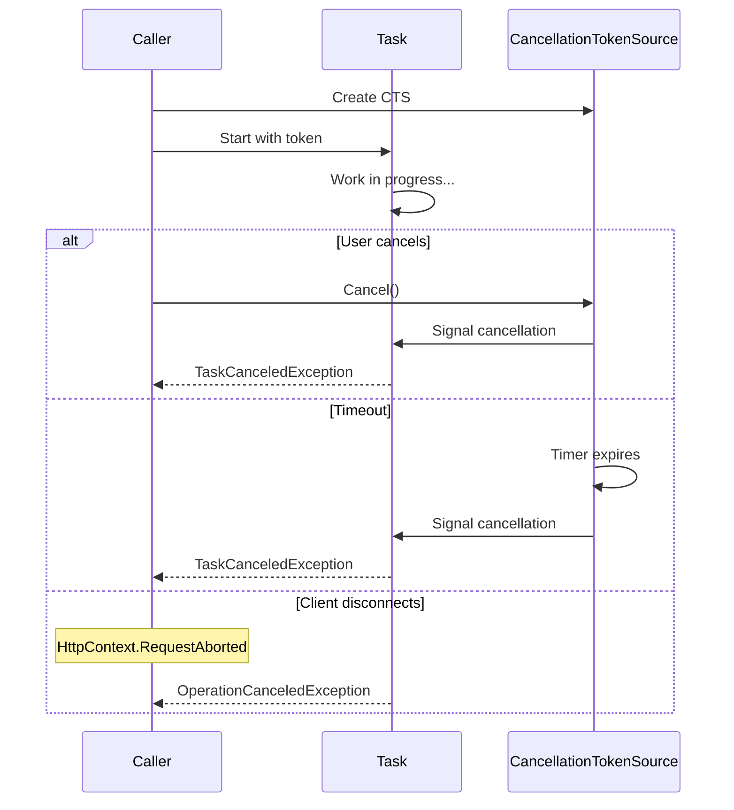

# How to Handle "Task was canceled" Exceptions in C#

Author: [nawazdhandala](https://github.com/nawazdhandala)

Tags: C#, .NET, Async, Cancellation, Error Handling, Task, Performance

Description: Learn how to properly handle TaskCanceledException and OperationCanceledException in C#. This guide covers cancellation patterns, timeout handling, and best practices for graceful task cancellation.

---

The "Task was canceled" exception (`TaskCanceledException` or `OperationCanceledException`) occurs when an async operation is canceled before completion. Understanding when and why tasks get canceled helps you write more robust async code.

## Understanding Task Cancellation



## Common Causes

### 1. Explicit Cancellation

```csharp
public async Task ProcessDataAsync(CancellationToken cancellationToken)
{
    using var cts = new CancellationTokenSource();

    var task = LongRunningOperationAsync(cts.Token);

    // User clicks cancel button
    cts.Cancel();

    try
    {
        await task; // Throws TaskCanceledException
    }
    catch (TaskCanceledException)
    {
        Console.WriteLine("Operation was canceled by user");
    }
}
```

### 2. Timeout

```csharp
public async Task<string> GetDataWithTimeoutAsync()
{
    using var cts = new CancellationTokenSource(TimeSpan.FromSeconds(30));

    try
    {
        return await httpClient.GetStringAsync(url, cts.Token);
    }
    catch (TaskCanceledException ex) when (ex.CancellationToken == cts.Token)
    {
        throw new TimeoutException("Request timed out after 30 seconds", ex);
    }
}
```

### 3. Client Disconnection (ASP.NET Core)

```csharp
[HttpGet("data")]
public async Task<IActionResult> GetData(CancellationToken cancellationToken)
{
    try
    {
        // cancellationToken is triggered when client disconnects
        var data = await _service.GetLargeDataAsync(cancellationToken);
        return Ok(data);
    }
    catch (OperationCanceledException)
    {
        // Client disconnected - log but don't return error
        _logger.LogInformation("Client disconnected during request");
        return StatusCode(499, "Client closed request");
    }
}
```

## Proper Cancellation Handling

### Basic Pattern

```csharp
public async Task ProcessAsync(CancellationToken cancellationToken = default)
{
    try
    {
        await DoWorkAsync(cancellationToken);
    }
    catch (OperationCanceledException) when (cancellationToken.IsCancellationRequested)
    {
        // Expected cancellation - handle gracefully
        _logger.LogInformation("Operation canceled as requested");
        throw; // Re-throw to propagate cancellation
    }
    catch (OperationCanceledException)
    {
        // Unexpected cancellation (timeout, etc.)
        _logger.LogWarning("Operation canceled unexpectedly");
        throw;
    }
}
```

### Distinguishing Timeout from Cancellation

```csharp
public async Task<T> ExecuteWithTimeoutAsync<T>(
    Func<CancellationToken, Task<T>> operation,
    TimeSpan timeout,
    CancellationToken cancellationToken = default)
{
    using var timeoutCts = new CancellationTokenSource(timeout);
    using var linkedCts = CancellationTokenSource.CreateLinkedTokenSource(
        timeoutCts.Token,
        cancellationToken);

    try
    {
        return await operation(linkedCts.Token);
    }
    catch (OperationCanceledException) when (timeoutCts.IsCancellationRequested)
    {
        throw new TimeoutException($"Operation timed out after {timeout}");
    }
    catch (OperationCanceledException) when (cancellationToken.IsCancellationRequested)
    {
        // User/caller requested cancellation
        throw;
    }
}

// Usage
var result = await ExecuteWithTimeoutAsync(
    async ct => await httpClient.GetStringAsync(url, ct),
    TimeSpan.FromSeconds(30),
    cancellationToken);
```

### Cleanup on Cancellation

```csharp
public async Task ProcessWithCleanupAsync(CancellationToken cancellationToken)
{
    var resource = await AcquireResourceAsync();

    try
    {
        while (!cancellationToken.IsCancellationRequested)
        {
            await ProcessBatchAsync(cancellationToken);
        }

        cancellationToken.ThrowIfCancellationRequested();
    }
    finally
    {
        // Cleanup runs even on cancellation
        await ReleaseResourceAsync(resource);
    }
}
```

## Graceful Cancellation in Loops

```csharp
public async Task ProcessItemsAsync(
    IEnumerable<Item> items,
    CancellationToken cancellationToken)
{
    var processedCount = 0;

    try
    {
        foreach (var item in items)
        {
            // Check before each iteration
            cancellationToken.ThrowIfCancellationRequested();

            await ProcessItemAsync(item, cancellationToken);
            processedCount++;
        }

        _logger.LogInformation("Processed {Count} items successfully", processedCount);
    }
    catch (OperationCanceledException)
    {
        _logger.LogWarning("Processing canceled after {Count} items", processedCount);
        throw;
    }
}
```

## Handling Parallel Operations

```csharp
public async Task ProcessInParallelAsync(
    List<string> urls,
    CancellationToken cancellationToken)
{
    var tasks = urls.Select(url =>
        FetchDataAsync(url, cancellationToken)).ToList();

    try
    {
        await Task.WhenAll(tasks);
    }
    catch (OperationCanceledException)
    {
        // Some tasks may have completed, some may be canceled
        var completed = tasks.Count(t => t.IsCompletedSuccessfully);
        var canceled = tasks.Count(t => t.IsCanceled);
        var faulted = tasks.Count(t => t.IsFaulted);

        _logger.LogWarning(
            "Parallel operation canceled: {Completed} completed, {Canceled} canceled, {Faulted} faulted",
            completed, canceled, faulted);

        throw;
    }
}
```

## ASP.NET Core Patterns

### Controller with Cancellation

```csharp
[ApiController]
[Route("api/[controller]")]
public class ReportsController : ControllerBase
{
    [HttpGet("generate")]
    public async Task<IActionResult> GenerateReport(
        [FromQuery] ReportRequest request,
        CancellationToken cancellationToken)
    {
        try
        {
            var report = await _reportService.GenerateAsync(request, cancellationToken);
            return Ok(report);
        }
        catch (OperationCanceledException) when (cancellationToken.IsCancellationRequested)
        {
            // Client disconnected - this is normal
            _logger.LogDebug("Report generation canceled - client disconnected");
            return StatusCode(499); // Client Closed Request
        }
        catch (OperationCanceledException)
        {
            // Internal timeout or other cancellation
            _logger.LogWarning("Report generation timed out");
            return StatusCode(504, "Report generation timed out");
        }
    }
}
```

### Background Service with Graceful Shutdown

```csharp
public class QueueProcessor : BackgroundService
{
    protected override async Task ExecuteAsync(CancellationToken stoppingToken)
    {
        _logger.LogInformation("Queue processor starting");

        try
        {
            while (!stoppingToken.IsCancellationRequested)
            {
                var message = await _queue.DequeueAsync(stoppingToken);
                await ProcessMessageAsync(message, stoppingToken);
            }
        }
        catch (OperationCanceledException) when (stoppingToken.IsCancellationRequested)
        {
            _logger.LogInformation("Queue processor stopping gracefully");
        }
        catch (Exception ex)
        {
            _logger.LogError(ex, "Queue processor encountered error");
            throw;
        }
    }
}
```

## Timeout Patterns

### Using CancellationTokenSource.CancelAfter

```csharp
public async Task<T> WithTimeout<T>(
    Task<T> task,
    TimeSpan timeout)
{
    using var cts = new CancellationTokenSource();
    cts.CancelAfter(timeout);

    var completedTask = await Task.WhenAny(task, Task.Delay(Timeout.Infinite, cts.Token));

    if (completedTask == task)
    {
        return await task;
    }

    throw new TimeoutException($"Operation timed out after {timeout}");
}
```

### Combined Timeout and Cancellation

```csharp
public async Task<HttpResponseMessage> SendWithTimeoutAsync(
    HttpRequestMessage request,
    TimeSpan timeout,
    CancellationToken cancellationToken)
{
    using var timeoutCts = CancellationTokenSource.CreateLinkedTokenSource(cancellationToken);
    timeoutCts.CancelAfter(timeout);

    try
    {
        return await _httpClient.SendAsync(request, timeoutCts.Token);
    }
    catch (TaskCanceledException) when (!cancellationToken.IsCancellationRequested)
    {
        throw new HttpRequestException($"Request timed out after {timeout.TotalSeconds}s");
    }
}
```

## Exception Handling Summary

```csharp
public async Task HandleAllCancellationScenariosAsync(
    CancellationToken userCancellation)
{
    using var timeoutCts = new CancellationTokenSource(TimeSpan.FromSeconds(30));
    using var linkedCts = CancellationTokenSource.CreateLinkedTokenSource(
        userCancellation,
        timeoutCts.Token);

    try
    {
        await DoWorkAsync(linkedCts.Token);
    }
    catch (TaskCanceledException ex)
    {
        // TaskCanceledException is thrown by Task-based operations
        HandleCancellation(ex, userCancellation, timeoutCts);
    }
    catch (OperationCanceledException ex)
    {
        // OperationCanceledException is the base class
        HandleCancellation(ex, userCancellation, timeoutCts);
    }
}

private void HandleCancellation(
    OperationCanceledException ex,
    CancellationToken userToken,
    CancellationTokenSource timeoutCts)
{
    if (userToken.IsCancellationRequested)
    {
        _logger.LogInformation("Operation canceled by user");
    }
    else if (timeoutCts.IsCancellationRequested)
    {
        _logger.LogWarning("Operation timed out");
    }
    else
    {
        _logger.LogError(ex, "Operation canceled unexpectedly");
    }
}
```

## Best Practices Summary

| Practice | Description |
|----------|-------------|
| **Always accept CancellationToken** | Add as last parameter with default |
| **Pass token to all async calls** | Propagate through entire call chain |
| **Check token in loops** | Use ThrowIfCancellationRequested |
| **Distinguish timeout from cancel** | Use linked token sources |
| **Log cancellations appropriately** | Debug for expected, Warning for unexpected |
| **Clean up on cancellation** | Use try/finally for resource cleanup |

## Conclusion

Task cancellation is a normal part of async programming. Distinguish between expected cancellation (user action, client disconnect) and unexpected cancellation (timeouts, system issues). Always propagate cancellation tokens through your async call chain, handle cancellation gracefully with proper cleanup, and log appropriately based on the cancellation source. Using linked cancellation token sources helps you distinguish between different cancellation causes and respond appropriately.
