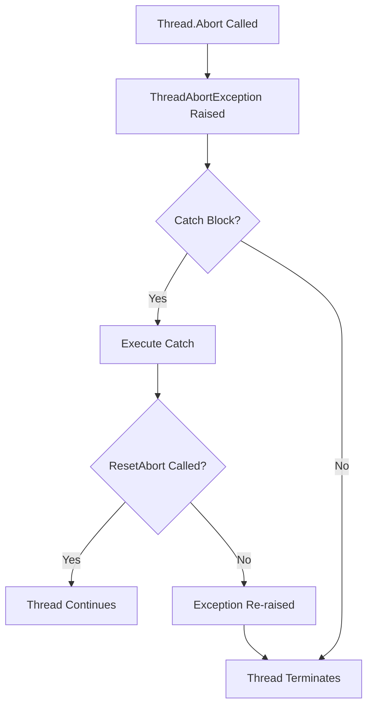

# How to Handle Thread Abort Exceptions in .NET

Author: [nawazdhandala](https://github.com/nawazdhandala)

Tags: .NET, C#, Threading, Exceptions, ASP.NET Core, Debugging

Description: Learn how to handle ThreadAbortException in .NET applications, understand why it occurs, and implement proper patterns for safe thread termination and cancellation.

---

The `ThreadAbortException` is one of the most misunderstood exceptions in .NET. It occurs when a thread is forcibly terminated, and understanding how to handle it properly is crucial for writing robust multi-threaded applications.

## Understanding ThreadAbortException

In .NET Framework, calling `Thread.Abort()` raises a `ThreadAbortException` on the target thread. This exception is special because it is automatically re-raised at the end of each catch block unless you call `Thread.ResetAbort()`.



## The Problem with Thread.Abort

`Thread.Abort()` is dangerous because it can leave your application in an inconsistent state. The thread might be aborted while holding a lock, writing to a file, or in the middle of a database transaction.

```csharp
// DANGEROUS - Don't do this
public void DangerousAbort()
{
    var thread = new Thread(() =>
    {
        using var connection = new SqlConnection(connectionString);
        connection.Open();

        // Thread could be aborted here, leaving connection in unknown state
        using var transaction = connection.BeginTransaction();

        // Or here, leaving transaction uncommitted
        ExecuteCommands(connection, transaction);

        transaction.Commit();
    });

    thread.Start();
    Thread.Sleep(100);

    // This could abort at any point in the thread
    thread.Abort(); // Don't use this!
}
```

## .NET Core and .NET 5+ Changes

Starting with .NET Core, `Thread.Abort()` throws `PlatformNotSupportedException`. This was an intentional design decision to encourage safer patterns.

```csharp
// This throws PlatformNotSupportedException in .NET Core+
try
{
    Thread.CurrentThread.Abort();
}
catch (PlatformNotSupportedException)
{
    Console.WriteLine("Thread.Abort is not supported in .NET Core");
}
```

## Handling Legacy ThreadAbortException

If you are maintaining .NET Framework code that might receive `ThreadAbortException`, handle it carefully:

```csharp
public void SafeOperation()
{
    SqlTransaction? transaction = null;
    SqlConnection? connection = null;

    try
    {
        connection = new SqlConnection(connectionString);
        connection.Open();
        transaction = connection.BeginTransaction();

        ExecuteCommands(connection, transaction);

        transaction.Commit();
    }
    catch (ThreadAbortException)
    {
        // Clean up before the exception is re-raised
        try
        {
            transaction?.Rollback();
        }
        catch
        {
            // Ignore rollback errors during abort
        }

        // Let the abort continue - don't call ResetAbort
        // unless you have a very good reason
        throw;
    }
    finally
    {
        transaction?.Dispose();
        connection?.Dispose();
    }
}
```

## Modern Alternative: Cancellation Tokens

The recommended approach for thread cancellation in modern .NET is using `CancellationToken`:

```csharp
public class WorkProcessor
{
    private readonly CancellationTokenSource _cts = new();
    private Task? _processingTask;

    public void Start()
    {
        _processingTask = Task.Run(() => ProcessWork(_cts.Token));
    }

    public async Task StopAsync()
    {
        _cts.Cancel();

        if (_processingTask != null)
        {
            try
            {
                await _processingTask;
            }
            catch (OperationCanceledException)
            {
                // Expected when cancellation is requested
            }
        }
    }

    private void ProcessWork(CancellationToken cancellationToken)
    {
        while (!cancellationToken.IsCancellationRequested)
        {
            // Check for cancellation at safe points
            cancellationToken.ThrowIfCancellationRequested();

            DoSomeWork();

            // Pass token to async operations
            ProcessItem(cancellationToken);
        }
    }

    private void ProcessItem(CancellationToken cancellationToken)
    {
        // Check frequently in long operations
        for (int i = 0; i < 1000; i++)
        {
            if (cancellationToken.IsCancellationRequested)
            {
                // Clean up before exiting
                CleanupPartialWork();
                cancellationToken.ThrowIfCancellationRequested();
            }

            ProcessSingleItem(i);
        }
    }
}
```

## Implementing Graceful Shutdown

For ASP.NET Core applications, implement `IHostedService` with proper cancellation:

```csharp
public class BackgroundWorker : BackgroundService
{
    private readonly ILogger<BackgroundWorker> _logger;

    public BackgroundWorker(ILogger<BackgroundWorker> logger)
    {
        _logger = logger;
    }

    protected override async Task ExecuteAsync(CancellationToken stoppingToken)
    {
        _logger.LogInformation("Background worker starting");

        try
        {
            while (!stoppingToken.IsCancellationRequested)
            {
                await ProcessWorkAsync(stoppingToken);
                await Task.Delay(TimeSpan.FromSeconds(10), stoppingToken);
            }
        }
        catch (OperationCanceledException) when (stoppingToken.IsCancellationRequested)
        {
            _logger.LogInformation("Background worker stopping gracefully");
        }
        catch (Exception ex)
        {
            _logger.LogError(ex, "Background worker encountered an error");
            throw;
        }
    }

    private async Task ProcessWorkAsync(CancellationToken cancellationToken)
    {
        // Always pass cancellation token to async methods
        await using var connection = new SqlConnection(connectionString);
        await connection.OpenAsync(cancellationToken);

        await using var transaction = connection.BeginTransaction();

        try
        {
            await ExecuteCommandsAsync(connection, transaction, cancellationToken);
            await transaction.CommitAsync(cancellationToken);
        }
        catch (OperationCanceledException)
        {
            await transaction.RollbackAsync();
            throw;
        }
    }
}
```

## Handling Long-Running Operations

For operations that do not natively support cancellation, use timeouts:

```csharp
public async Task<T> ExecuteWithTimeoutAsync<T>(
    Func<Task<T>> operation,
    TimeSpan timeout,
    CancellationToken cancellationToken = default)
{
    using var timeoutCts = new CancellationTokenSource(timeout);
    using var linkedCts = CancellationTokenSource.CreateLinkedTokenSource(
        cancellationToken, timeoutCts.Token);

    try
    {
        return await operation();
    }
    catch (OperationCanceledException) when (timeoutCts.IsCancellationRequested)
    {
        throw new TimeoutException($"Operation timed out after {timeout}");
    }
}

// Usage
var result = await ExecuteWithTimeoutAsync(
    () => httpClient.GetStringAsync(url),
    TimeSpan.FromSeconds(30),
    cancellationToken);
```

## Safe Resource Cleanup Pattern

Ensure resources are cleaned up even when cancellation occurs:

```csharp
public async Task ProcessWithCleanupAsync(CancellationToken cancellationToken)
{
    var resource = await AcquireResourceAsync();

    try
    {
        await ProcessResourceAsync(resource, cancellationToken);
    }
    catch (OperationCanceledException)
    {
        // Perform cleanup that must happen even on cancellation
        await CleanupPartialWorkAsync(resource);
        throw;
    }
    finally
    {
        await ReleaseResourceAsync(resource);
    }
}
```

## Migrating from Thread.Abort

If you have legacy code using `Thread.Abort`, here is how to migrate:

```csharp
// Before: .NET Framework with Thread.Abort
public class LegacyWorker
{
    private Thread? _workerThread;
    private volatile bool _shouldStop;

    public void Start()
    {
        _workerThread = new Thread(DoWork);
        _workerThread.Start();
    }

    public void Stop()
    {
        _workerThread?.Abort(); // Dangerous!
    }

    private void DoWork()
    {
        while (true)
        {
            ProcessItem();
        }
    }
}

// After: Modern .NET with CancellationToken
public class ModernWorker
{
    private Task? _workerTask;
    private CancellationTokenSource? _cts;

    public void Start()
    {
        _cts = new CancellationTokenSource();
        _workerTask = Task.Run(() => DoWorkAsync(_cts.Token));
    }

    public async Task StopAsync(TimeSpan timeout)
    {
        if (_cts == null || _workerTask == null)
            return;

        _cts.Cancel();

        try
        {
            await _workerTask.WaitAsync(timeout);
        }
        catch (OperationCanceledException)
        {
            // Expected
        }
        catch (TimeoutException)
        {
            // Worker did not stop in time - log warning
        }
        finally
        {
            _cts.Dispose();
        }
    }

    private async Task DoWorkAsync(CancellationToken cancellationToken)
    {
        while (!cancellationToken.IsCancellationRequested)
        {
            await ProcessItemAsync(cancellationToken);
        }
    }
}
```

## Handling Unresponsive Operations

Sometimes you need to abandon operations that do not respond to cancellation:

```csharp
public async Task<T?> ExecuteWithAbandonmentAsync<T>(
    Func<CancellationToken, Task<T>> operation,
    TimeSpan timeout)
{
    using var cts = new CancellationTokenSource();
    var task = operation(cts.Token);
    var completedTask = await Task.WhenAny(task, Task.Delay(timeout));

    if (completedTask == task)
    {
        return await task;
    }

    // Request cancellation but don't wait
    cts.Cancel();

    // Log that we're abandoning the operation
    // The task will complete eventually and be garbage collected
    _ = task.ContinueWith(t =>
    {
        if (t.IsFaulted)
        {
            // Log the exception
        }
    }, TaskContinuationOptions.OnlyOnFaulted);

    throw new TimeoutException("Operation abandoned after timeout");
}
```

## Summary

| Approach | When to Use |
|----------|-------------|
| **CancellationToken** | All new code - cooperative cancellation |
| **TimeoutException** | When operations exceed time limits |
| **OperationCanceledException** | When cancellation is requested |
| **Graceful shutdown** | ASP.NET Core hosted services |
| **Thread.Abort** | Never - deprecated and dangerous |

The key principle is cooperative cancellation. Instead of forcibly terminating threads, design your code to check for cancellation requests at safe points and clean up properly before exiting. This approach leads to more reliable and predictable applications.
