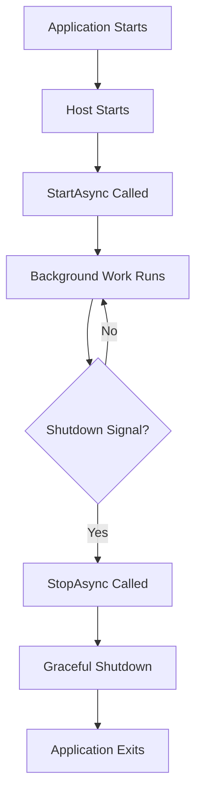

# How to Set Up Background Services in ASP.NET Core

Author: [nawazdhandala](https://www.github.com/nawazdhandala)

Tags: .NET, ASP.NET Core, C#, Background Services, IHostedService, Scheduling, Workers

Description: Learn how to implement background services in ASP.NET Core using IHostedService and BackgroundService. This guide covers scheduled tasks, queue processing, long-running operations, and best practices for reliable background processing.

Background services are essential for running tasks outside the request/response cycle in ASP.NET Core applications. This guide covers everything from simple periodic tasks to robust queue-based processing systems.

## Understanding Background Services

ASP.NET Core provides two main approaches for background work:

1. **IHostedService**: Low-level interface for background tasks
2. **BackgroundService**: Base class that simplifies IHostedService implementation



## Basic Background Service

### Creating a Simple Timed Service

```csharp
public class TimedBackgroundService : BackgroundService
{
    private readonly ILogger<TimedBackgroundService> _logger;
    private readonly TimeSpan _period = TimeSpan.FromMinutes(5);

    public TimedBackgroundService(ILogger<TimedBackgroundService> logger)
    {
        _logger = logger;
    }

    protected override async Task ExecuteAsync(CancellationToken stoppingToken)
    {
        _logger.LogInformation("Timed Background Service starting");

        using var timer = new PeriodicTimer(_period);

        while (!stoppingToken.IsCancellationRequested
            && await timer.WaitForNextTickAsync(stoppingToken))
        {
            try
            {
                await DoWorkAsync(stoppingToken);
            }
            catch (Exception ex)
            {
                _logger.LogError(ex, "Error occurred executing scheduled work");
            }
        }

        _logger.LogInformation("Timed Background Service stopping");
    }

    private async Task DoWorkAsync(CancellationToken stoppingToken)
    {
        _logger.LogInformation("Executing scheduled task at {Time}", DateTimeOffset.Now);

        // Your work here
        await Task.Delay(100, stoppingToken);

        _logger.LogInformation("Scheduled task completed");
    }
}

// Registration in Program.cs
builder.Services.AddHostedService<TimedBackgroundService>();
```

### Using Scoped Services in Background Services

Background services are singletons, but you can access scoped services:

```csharp
public class DatabaseCleanupService : BackgroundService
{
    private readonly IServiceScopeFactory _scopeFactory;
    private readonly ILogger<DatabaseCleanupService> _logger;
    private readonly TimeSpan _period = TimeSpan.FromHours(1);

    public DatabaseCleanupService(
        IServiceScopeFactory scopeFactory,
        ILogger<DatabaseCleanupService> logger)
    {
        _scopeFactory = scopeFactory;
        _logger = logger;
    }

    protected override async Task ExecuteAsync(CancellationToken stoppingToken)
    {
        using var timer = new PeriodicTimer(_period);

        while (!stoppingToken.IsCancellationRequested
            && await timer.WaitForNextTickAsync(stoppingToken))
        {
            await CleanupOldRecordsAsync(stoppingToken);
        }
    }

    private async Task CleanupOldRecordsAsync(CancellationToken stoppingToken)
    {
        _logger.LogInformation("Starting database cleanup");

        // Create a scope to resolve scoped services
        using var scope = _scopeFactory.CreateScope();
        var dbContext = scope.ServiceProvider.GetRequiredService<ApplicationDbContext>();

        var cutoffDate = DateTime.UtcNow.AddDays(-30);

        var deletedCount = await dbContext.Logs
            .Where(l => l.CreatedAt < cutoffDate)
            .ExecuteDeleteAsync(stoppingToken);

        _logger.LogInformation("Deleted {Count} old log records", deletedCount);
    }
}
```

## Queue-Based Background Processing

### Implementing a Work Queue

```csharp
public interface IBackgroundTaskQueue
{
    ValueTask QueueBackgroundWorkItemAsync(Func<CancellationToken, ValueTask> workItem);
    ValueTask<Func<CancellationToken, ValueTask>> DequeueAsync(CancellationToken cancellationToken);
}

public class BackgroundTaskQueue : IBackgroundTaskQueue
{
    private readonly Channel<Func<CancellationToken, ValueTask>> _queue;

    public BackgroundTaskQueue(int capacity = 100)
    {
        var options = new BoundedChannelOptions(capacity)
        {
            FullMode = BoundedChannelFullMode.Wait
        };
        _queue = Channel.CreateBounded<Func<CancellationToken, ValueTask>>(options);
    }

    public async ValueTask QueueBackgroundWorkItemAsync(
        Func<CancellationToken, ValueTask> workItem)
    {
        ArgumentNullException.ThrowIfNull(workItem);
        await _queue.Writer.WriteAsync(workItem);
    }

    public async ValueTask<Func<CancellationToken, ValueTask>> DequeueAsync(
        CancellationToken cancellationToken)
    {
        return await _queue.Reader.ReadAsync(cancellationToken);
    }
}
```

### Queue Processing Service

```csharp
public class QueuedHostedService : BackgroundService
{
    private readonly IBackgroundTaskQueue _taskQueue;
    private readonly ILogger<QueuedHostedService> _logger;

    public QueuedHostedService(
        IBackgroundTaskQueue taskQueue,
        ILogger<QueuedHostedService> logger)
    {
        _taskQueue = taskQueue;
        _logger = logger;
    }

    protected override async Task ExecuteAsync(CancellationToken stoppingToken)
    {
        _logger.LogInformation("Queued Hosted Service is running");

        await ProcessQueueAsync(stoppingToken);
    }

    private async Task ProcessQueueAsync(CancellationToken stoppingToken)
    {
        while (!stoppingToken.IsCancellationRequested)
        {
            try
            {
                var workItem = await _taskQueue.DequeueAsync(stoppingToken);
                await workItem(stoppingToken);
            }
            catch (OperationCanceledException)
            {
                // Expected during shutdown
            }
            catch (Exception ex)
            {
                _logger.LogError(ex, "Error occurred executing work item");
            }
        }
    }

    public override async Task StopAsync(CancellationToken cancellationToken)
    {
        _logger.LogInformation("Queued Hosted Service is stopping");
        await base.StopAsync(cancellationToken);
    }
}

// Registration
builder.Services.AddSingleton<IBackgroundTaskQueue, BackgroundTaskQueue>();
builder.Services.AddHostedService<QueuedHostedService>();
```

### Using the Queue from Controllers

```csharp
[ApiController]
[Route("api/[controller]")]
public class ReportsController : ControllerBase
{
    private readonly IBackgroundTaskQueue _taskQueue;
    private readonly ILogger<ReportsController> _logger;

    public ReportsController(
        IBackgroundTaskQueue taskQueue,
        ILogger<ReportsController> logger)
    {
        _taskQueue = taskQueue;
        _logger = logger;
    }

    [HttpPost("generate")]
    public async Task<IActionResult> GenerateReport([FromBody] ReportRequest request)
    {
        var reportId = Guid.NewGuid();

        await _taskQueue.QueueBackgroundWorkItemAsync(async token =>
        {
            _logger.LogInformation("Starting report generation {ReportId}", reportId);

            // Simulate long-running work
            await Task.Delay(TimeSpan.FromMinutes(5), token);

            _logger.LogInformation("Report {ReportId} completed", reportId);
        });

        return Accepted(new { ReportId = reportId, Status = "Processing" });
    }
}
```

## Scheduled Tasks with Cron Expressions

### Using Cronos for Cron Scheduling

```bash
dotnet add package Cronos
```

```csharp
public abstract class CronBackgroundService : BackgroundService
{
    private readonly CronExpression _cronExpression;
    private readonly TimeZoneInfo _timeZone;
    private readonly ILogger _logger;

    protected CronBackgroundService(
        string cronExpression,
        TimeZoneInfo timeZone,
        ILogger logger)
    {
        _cronExpression = CronExpression.Parse(cronExpression);
        _timeZone = timeZone;
        _logger = logger;
    }

    protected override async Task ExecuteAsync(CancellationToken stoppingToken)
    {
        while (!stoppingToken.IsCancellationRequested)
        {
            var now = DateTimeOffset.Now;
            var nextOccurrence = _cronExpression.GetNextOccurrence(now, _timeZone);

            if (nextOccurrence.HasValue)
            {
                var delay = nextOccurrence.Value - now;
                _logger.LogInformation(
                    "Next execution scheduled for {NextRun}",
                    nextOccurrence.Value);

                if (delay > TimeSpan.Zero)
                {
                    await Task.Delay(delay, stoppingToken);
                }

                if (!stoppingToken.IsCancellationRequested)
                {
                    try
                    {
                        await DoWorkAsync(stoppingToken);
                    }
                    catch (Exception ex)
                    {
                        _logger.LogError(ex, "Error executing scheduled task");
                    }
                }
            }
            else
            {
                await Task.Delay(TimeSpan.FromMinutes(1), stoppingToken);
            }
        }
    }

    protected abstract Task DoWorkAsync(CancellationToken stoppingToken);
}

// Implementation
public class DailyReportService : CronBackgroundService
{
    private readonly IServiceScopeFactory _scopeFactory;

    public DailyReportService(
        IServiceScopeFactory scopeFactory,
        ILogger<DailyReportService> logger)
        : base(
            "0 0 8 * * *", // Every day at 8:00 AM
            TimeZoneInfo.Local,
            logger)
    {
        _scopeFactory = scopeFactory;
    }

    protected override async Task DoWorkAsync(CancellationToken stoppingToken)
    {
        using var scope = _scopeFactory.CreateScope();
        var reportService = scope.ServiceProvider.GetRequiredService<IReportService>();

        await reportService.GenerateDailyReportAsync(stoppingToken);
    }
}
```

## Health Checks for Background Services

### Implementing Health Status

```csharp
public class MonitoredBackgroundService : BackgroundService
{
    private readonly ILogger<MonitoredBackgroundService> _logger;
    private DateTime _lastExecutionTime;
    private bool _isHealthy = true;
    private string? _lastError;

    public MonitoredBackgroundService(ILogger<MonitoredBackgroundService> logger)
    {
        _logger = logger;
    }

    public bool IsHealthy => _isHealthy;
    public DateTime LastExecutionTime => _lastExecutionTime;
    public string? LastError => _lastError;

    protected override async Task ExecuteAsync(CancellationToken stoppingToken)
    {
        using var timer = new PeriodicTimer(TimeSpan.FromMinutes(1));

        while (!stoppingToken.IsCancellationRequested
            && await timer.WaitForNextTickAsync(stoppingToken))
        {
            try
            {
                await DoWorkAsync(stoppingToken);
                _lastExecutionTime = DateTime.UtcNow;
                _isHealthy = true;
                _lastError = null;
            }
            catch (Exception ex)
            {
                _isHealthy = false;
                _lastError = ex.Message;
                _logger.LogError(ex, "Background service error");
            }
        }
    }

    private async Task DoWorkAsync(CancellationToken stoppingToken)
    {
        // Work implementation
        await Task.Delay(100, stoppingToken);
    }
}

// Health check
public class BackgroundServiceHealthCheck : IHealthCheck
{
    private readonly MonitoredBackgroundService _service;
    private readonly TimeSpan _maxTimeSinceLastExecution = TimeSpan.FromMinutes(5);

    public BackgroundServiceHealthCheck(MonitoredBackgroundService service)
    {
        _service = service;
    }

    public Task<HealthCheckResult> CheckHealthAsync(
        HealthCheckContext context,
        CancellationToken cancellationToken = default)
    {
        if (!_service.IsHealthy)
        {
            return Task.FromResult(HealthCheckResult.Unhealthy(
                $"Background service error: {_service.LastError}"));
        }

        var timeSinceLastExecution = DateTime.UtcNow - _service.LastExecutionTime;
        if (timeSinceLastExecution > _maxTimeSinceLastExecution)
        {
            return Task.FromResult(HealthCheckResult.Degraded(
                $"Background service hasn't run in {timeSinceLastExecution.TotalMinutes:F1} minutes"));
        }

        return Task.FromResult(HealthCheckResult.Healthy());
    }
}

// Registration
builder.Services.AddSingleton<MonitoredBackgroundService>();
builder.Services.AddHostedService(sp => sp.GetRequiredService<MonitoredBackgroundService>());
builder.Services.AddHealthChecks()
    .AddCheck<BackgroundServiceHealthCheck>("background-service");
```

## Graceful Shutdown

### Handling Shutdown Properly

```csharp
public class GracefulBackgroundService : BackgroundService
{
    private readonly ILogger<GracefulBackgroundService> _logger;
    private readonly TimeSpan _gracefulShutdownTimeout = TimeSpan.FromSeconds(30);

    public GracefulBackgroundService(ILogger<GracefulBackgroundService> logger)
    {
        _logger = logger;
    }

    protected override async Task ExecuteAsync(CancellationToken stoppingToken)
    {
        _logger.LogInformation("Service starting");

        try
        {
            while (!stoppingToken.IsCancellationRequested)
            {
                await ProcessWorkItemAsync(stoppingToken);
            }
        }
        catch (OperationCanceledException) when (stoppingToken.IsCancellationRequested)
        {
            _logger.LogInformation("Service received shutdown signal");
        }

        _logger.LogInformation("Service stopped");
    }

    private async Task ProcessWorkItemAsync(CancellationToken stoppingToken)
    {
        _logger.LogDebug("Processing work item");

        // Create a linked token that respects both shutdown and timeout
        using var cts = CancellationTokenSource.CreateLinkedTokenSource(stoppingToken);
        cts.CancelAfter(TimeSpan.FromMinutes(10)); // Work item timeout

        try
        {
            // Your work here - check cancellation frequently
            for (int i = 0; i < 100 && !cts.Token.IsCancellationRequested; i++)
            {
                await Task.Delay(100, cts.Token);
            }
        }
        catch (OperationCanceledException) when (stoppingToken.IsCancellationRequested)
        {
            _logger.LogWarning("Work item interrupted by shutdown");
            throw; // Re-throw to exit the main loop
        }
    }

    public override async Task StopAsync(CancellationToken cancellationToken)
    {
        _logger.LogInformation(
            "Stopping service, waiting up to {Timeout} for graceful shutdown",
            _gracefulShutdownTimeout);

        using var cts = CancellationTokenSource.CreateLinkedTokenSource(cancellationToken);
        cts.CancelAfter(_gracefulShutdownTimeout);

        await base.StopAsync(cts.Token);
    }
}
```

## Multiple Worker Instances

### Parallel Processing with Multiple Workers

```csharp
public class ParallelQueueProcessor : BackgroundService
{
    private readonly IBackgroundTaskQueue _taskQueue;
    private readonly ILogger<ParallelQueueProcessor> _logger;
    private readonly int _workerCount;

    public ParallelQueueProcessor(
        IBackgroundTaskQueue taskQueue,
        ILogger<ParallelQueueProcessor> logger,
        IConfiguration configuration)
    {
        _taskQueue = taskQueue;
        _logger = logger;
        _workerCount = configuration.GetValue<int>("BackgroundWorkers:Count", 4);
    }

    protected override async Task ExecuteAsync(CancellationToken stoppingToken)
    {
        _logger.LogInformation("Starting {Count} worker tasks", _workerCount);

        var workers = Enumerable.Range(0, _workerCount)
            .Select(i => ProcessQueueAsync(i, stoppingToken))
            .ToArray();

        await Task.WhenAll(workers);
    }

    private async Task ProcessQueueAsync(int workerId, CancellationToken stoppingToken)
    {
        _logger.LogInformation("Worker {WorkerId} starting", workerId);

        while (!stoppingToken.IsCancellationRequested)
        {
            try
            {
                var workItem = await _taskQueue.DequeueAsync(stoppingToken);

                _logger.LogDebug("Worker {WorkerId} processing item", workerId);
                await workItem(stoppingToken);
            }
            catch (OperationCanceledException) when (stoppingToken.IsCancellationRequested)
            {
                break;
            }
            catch (Exception ex)
            {
                _logger.LogError(ex, "Worker {WorkerId} error", workerId);
            }
        }

        _logger.LogInformation("Worker {WorkerId} stopping", workerId);
    }
}
```

## Configuration and Options

### Configurable Background Service

```csharp
public class BackgroundServiceOptions
{
    public bool Enabled { get; set; } = true;
    public int IntervalSeconds { get; set; } = 60;
    public int MaxRetries { get; set; } = 3;
    public int TimeoutSeconds { get; set; } = 300;
}

public class ConfigurableBackgroundService : BackgroundService
{
    private readonly IOptionsMonitor<BackgroundServiceOptions> _options;
    private readonly ILogger<ConfigurableBackgroundService> _logger;

    public ConfigurableBackgroundService(
        IOptionsMonitor<BackgroundServiceOptions> options,
        ILogger<ConfigurableBackgroundService> logger)
    {
        _options = options;
        _logger = logger;
    }

    protected override async Task ExecuteAsync(CancellationToken stoppingToken)
    {
        while (!stoppingToken.IsCancellationRequested)
        {
            var options = _options.CurrentValue;

            if (!options.Enabled)
            {
                _logger.LogInformation("Service is disabled, waiting...");
                await Task.Delay(TimeSpan.FromSeconds(30), stoppingToken);
                continue;
            }

            try
            {
                using var cts = CancellationTokenSource.CreateLinkedTokenSource(stoppingToken);
                cts.CancelAfter(TimeSpan.FromSeconds(options.TimeoutSeconds));

                await ExecuteWithRetryAsync(options.MaxRetries, cts.Token);
            }
            catch (Exception ex)
            {
                _logger.LogError(ex, "Failed after {Retries} retries", options.MaxRetries);
            }

            await Task.Delay(TimeSpan.FromSeconds(options.IntervalSeconds), stoppingToken);
        }
    }

    private async Task ExecuteWithRetryAsync(int maxRetries, CancellationToken cancellationToken)
    {
        for (int attempt = 1; attempt <= maxRetries; attempt++)
        {
            try
            {
                await DoWorkAsync(cancellationToken);
                return;
            }
            catch (Exception ex) when (attempt < maxRetries)
            {
                _logger.LogWarning(ex, "Attempt {Attempt} failed, retrying...", attempt);
                await Task.Delay(TimeSpan.FromSeconds(Math.Pow(2, attempt)), cancellationToken);
            }
        }
    }

    private async Task DoWorkAsync(CancellationToken cancellationToken)
    {
        // Work implementation
        await Task.Delay(100, cancellationToken);
    }
}

// Configuration in appsettings.json
// {
//   "BackgroundService": {
//     "Enabled": true,
//     "IntervalSeconds": 60,
//     "MaxRetries": 3,
//     "TimeoutSeconds": 300
//   }
// }

// Registration
builder.Services.Configure<BackgroundServiceOptions>(
    builder.Configuration.GetSection("BackgroundService"));
builder.Services.AddHostedService<ConfigurableBackgroundService>();
```

## Best Practices

1. **Handle cancellation**: Always check CancellationToken and handle OperationCanceledException
2. **Use scopes for DI**: Create scopes when using scoped services
3. **Implement health checks**: Monitor background service health
4. **Log extensively**: Background services are harder to debug
5. **Configure timeouts**: Prevent tasks from running forever
6. **Handle errors gracefully**: Don't let exceptions crash the service
7. **Support graceful shutdown**: Complete in-progress work when possible
8. **Make services configurable**: Use options pattern for flexibility

## Conclusion

Background services are powerful tools for handling async operations, scheduled tasks, and queue processing in ASP.NET Core. By following these patterns and best practices, you can build robust background processing systems that are reliable, observable, and maintainable.
