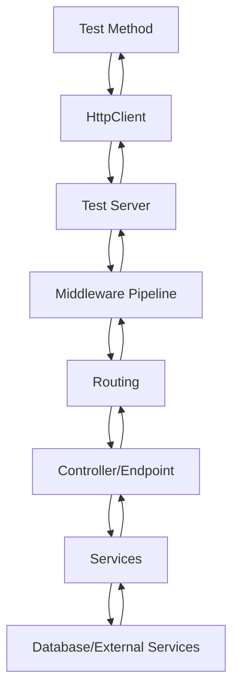

# How to Set Up Integration Testing in ASP.NET Core

Author: [nawazdhandala](https://www.github.com/nawazdhandala)

Tags: .NET, ASP.NET Core, C#, Integration Testing, Testing, WebApplicationFactory, Entity Framework

Description: Learn how to set up comprehensive integration testing in ASP.NET Core applications using WebApplicationFactory. This guide covers test server configuration, database setup, authentication mocking, and best practices for reliable integration tests.

Integration tests verify that different components of your application work together correctly. Unlike unit tests that isolate individual components, integration tests exercise the full request pipeline, including middleware, routing, model binding, and database access. This guide shows you how to set up effective integration testing in ASP.NET Core.

## Understanding Integration Testing

Integration tests in ASP.NET Core use `WebApplicationFactory` to create an in-memory test server that hosts your application. This allows you to send HTTP requests and verify responses without deploying your application.



## Project Setup

### Create Test Project

```bash
# Create test project
dotnet new xunit -n MyApp.IntegrationTests

# Add required packages
cd MyApp.IntegrationTests
dotnet add package Microsoft.AspNetCore.Mvc.Testing
dotnet add package Microsoft.EntityFrameworkCore.InMemory
dotnet add package FluentAssertions

# Add reference to web project
dotnet add reference ../MyApp.Api/MyApp.Api.csproj
```

### Project File Configuration

```xml
<Project Sdk="Microsoft.NET.Sdk">

  <PropertyGroup>
    <TargetFramework>net8.0</TargetFramework>
    <Nullable>enable</Nullable>
    <IsPackable>false</IsPackable>
    <IsTestProject>true</IsTestProject>
  </PropertyGroup>

  <ItemGroup>
    <PackageReference Include="FluentAssertions" Version="6.12.0" />
    <PackageReference Include="Microsoft.AspNetCore.Mvc.Testing" Version="8.0.0" />
    <PackageReference Include="Microsoft.EntityFrameworkCore.InMemory" Version="8.0.0" />
    <PackageReference Include="Microsoft.NET.Test.Sdk" Version="17.8.0" />
    <PackageReference Include="xunit" Version="2.6.2" />
    <PackageReference Include="xunit.runner.visualstudio" Version="2.5.4" />
  </ItemGroup>

  <ItemGroup>
    <ProjectReference Include="..\MyApp.Api\MyApp.Api.csproj" />
  </ItemGroup>

</Project>
```

## Basic WebApplicationFactory Setup

### Custom Web Application Factory

Create a custom factory that configures the test environment:

```csharp
using Microsoft.AspNetCore.Hosting;
using Microsoft.AspNetCore.Mvc.Testing;
using Microsoft.EntityFrameworkCore;
using Microsoft.Extensions.DependencyInjection;
using Microsoft.Extensions.Hosting;

namespace MyApp.IntegrationTests;

public class CustomWebApplicationFactory<TProgram>
    : WebApplicationFactory<TProgram> where TProgram : class
{
    protected override void ConfigureWebHost(IWebHostBuilder builder)
    {
        builder.ConfigureServices(services =>
        {
            // Remove the existing DbContext registration
            var descriptor = services.SingleOrDefault(
                d => d.ServiceType == typeof(DbContextOptions<ApplicationDbContext>));

            if (descriptor != null)
            {
                services.Remove(descriptor);
            }

            // Add in-memory database
            services.AddDbContext<ApplicationDbContext>(options =>
            {
                options.UseInMemoryDatabase("TestDatabase");
            });

            // Build the service provider
            var sp = services.BuildServiceProvider();

            // Create a scope to obtain a reference to the database context
            using var scope = sp.CreateScope();
            var scopedServices = scope.ServiceProvider;
            var db = scopedServices.GetRequiredService<ApplicationDbContext>();

            // Ensure the database is created
            db.Database.EnsureCreated();

            // Seed test data
            SeedTestData(db);
        });

        builder.UseEnvironment("Testing");
    }

    private static void SeedTestData(ApplicationDbContext db)
    {
        db.Users.AddRange(
            new User { Id = 1, Name = "Test User 1", Email = "user1@test.com" },
            new User { Id = 2, Name = "Test User 2", Email = "user2@test.com" }
        );
        db.SaveChanges();
    }
}
```

### Writing Basic Integration Tests

```csharp
using System.Net;
using System.Net.Http.Json;
using FluentAssertions;
using Xunit;

namespace MyApp.IntegrationTests;

public class UsersControllerTests
    : IClassFixture<CustomWebApplicationFactory<Program>>
{
    private readonly HttpClient _client;
    private readonly CustomWebApplicationFactory<Program> _factory;

    public UsersControllerTests(CustomWebApplicationFactory<Program> factory)
    {
        _factory = factory;
        _client = factory.CreateClient();
    }

    [Fact]
    public async Task GetUsers_ReturnsSuccessAndCorrectContentType()
    {
        // Act
        var response = await _client.GetAsync("/api/users");

        // Assert
        response.EnsureSuccessStatusCode();
        response.Content.Headers.ContentType!.MediaType
            .Should().Be("application/json");
    }

    [Fact]
    public async Task GetUser_ExistingUser_ReturnsUser()
    {
        // Act
        var response = await _client.GetAsync("/api/users/1");
        var user = await response.Content.ReadFromJsonAsync<UserDto>();

        // Assert
        response.StatusCode.Should().Be(HttpStatusCode.OK);
        user.Should().NotBeNull();
        user!.Name.Should().Be("Test User 1");
    }

    [Fact]
    public async Task GetUser_NonExistingUser_ReturnsNotFound()
    {
        // Act
        var response = await _client.GetAsync("/api/users/999");

        // Assert
        response.StatusCode.Should().Be(HttpStatusCode.NotFound);
    }

    [Fact]
    public async Task CreateUser_ValidData_ReturnsCreated()
    {
        // Arrange
        var newUser = new CreateUserRequest
        {
            Name = "New User",
            Email = "newuser@test.com"
        };

        // Act
        var response = await _client.PostAsJsonAsync("/api/users", newUser);

        // Assert
        response.StatusCode.Should().Be(HttpStatusCode.Created);
        response.Headers.Location.Should().NotBeNull();
    }

    [Fact]
    public async Task CreateUser_InvalidData_ReturnsBadRequest()
    {
        // Arrange
        var invalidUser = new CreateUserRequest
        {
            Name = "", // Invalid - empty name
            Email = "not-an-email" // Invalid email format
        };

        // Act
        var response = await _client.PostAsJsonAsync("/api/users", invalidUser);

        // Assert
        response.StatusCode.Should().Be(HttpStatusCode.BadRequest);
    }
}
```

## Database Testing Strategies

### Using Real Database with Testcontainers

For more realistic tests, use Testcontainers to spin up actual database containers:

```csharp
using Testcontainers.MsSql;

public class SqlServerWebApplicationFactory<TProgram>
    : WebApplicationFactory<TProgram>, IAsyncLifetime where TProgram : class
{
    private readonly MsSqlContainer _dbContainer = new MsSqlBuilder()
        .WithImage("mcr.microsoft.com/mssql/server:2022-latest")
        .Build();

    public async Task InitializeAsync()
    {
        await _dbContainer.StartAsync();
    }

    public new async Task DisposeAsync()
    {
        await _dbContainer.DisposeAsync();
    }

    protected override void ConfigureWebHost(IWebHostBuilder builder)
    {
        builder.ConfigureServices(services =>
        {
            var descriptor = services.SingleOrDefault(
                d => d.ServiceType == typeof(DbContextOptions<ApplicationDbContext>));

            if (descriptor != null)
            {
                services.Remove(descriptor);
            }

            services.AddDbContext<ApplicationDbContext>(options =>
            {
                options.UseSqlServer(_dbContainer.GetConnectionString());
            });
        });
    }
}
```

### Resetting Database Between Tests

Ensure test isolation by resetting the database:

```csharp
public class DatabaseResetTests : IClassFixture<CustomWebApplicationFactory<Program>>
{
    private readonly CustomWebApplicationFactory<Program> _factory;

    public DatabaseResetTests(CustomWebApplicationFactory<Program> factory)
    {
        _factory = factory;
    }

    private async Task ResetDatabaseAsync()
    {
        using var scope = _factory.Services.CreateScope();
        var db = scope.ServiceProvider.GetRequiredService<ApplicationDbContext>();

        await db.Database.EnsureDeletedAsync();
        await db.Database.EnsureCreatedAsync();

        // Re-seed test data
        db.Users.Add(new User { Id = 1, Name = "Test User", Email = "test@test.com" });
        await db.SaveChangesAsync();
    }

    [Fact]
    public async Task Test1_ModifiesDatabase()
    {
        await ResetDatabaseAsync();
        var client = _factory.CreateClient();

        await client.DeleteAsync("/api/users/1");

        // Database is modified
    }

    [Fact]
    public async Task Test2_HasFreshDatabase()
    {
        await ResetDatabaseAsync();
        var client = _factory.CreateClient();

        var response = await client.GetAsync("/api/users/1");

        // User exists because database was reset
        response.StatusCode.Should().Be(HttpStatusCode.OK);
    }
}
```

## Authentication and Authorization Testing

### Mocking Authentication

Create a test authentication handler:

```csharp
using System.Security.Claims;
using System.Text.Encodings.Web;
using Microsoft.AspNetCore.Authentication;
using Microsoft.Extensions.Options;

public class TestAuthHandler : AuthenticationHandler<AuthenticationSchemeOptions>
{
    public const string AuthenticationScheme = "Test";
    public const string TestUserIdHeader = "X-Test-User-Id";
    public const string TestUserRoleHeader = "X-Test-User-Role";

    public TestAuthHandler(
        IOptionsMonitor<AuthenticationSchemeOptions> options,
        ILoggerFactory logger,
        UrlEncoder encoder)
        : base(options, logger, encoder)
    {
    }

    protected override Task<AuthenticateResult> HandleAuthenticateAsync()
    {
        // Check for test headers
        if (!Request.Headers.TryGetValue(TestUserIdHeader, out var userId))
        {
            return Task.FromResult(AuthenticateResult.Fail("No test user specified"));
        }

        var claims = new List<Claim>
        {
            new(ClaimTypes.NameIdentifier, userId!),
            new(ClaimTypes.Name, $"TestUser{userId}")
        };

        // Add role if specified
        if (Request.Headers.TryGetValue(TestUserRoleHeader, out var role))
        {
            claims.Add(new Claim(ClaimTypes.Role, role!));
        }

        var identity = new ClaimsIdentity(claims, AuthenticationScheme);
        var principal = new ClaimsPrincipal(identity);
        var ticket = new AuthenticationTicket(principal, AuthenticationScheme);

        return Task.FromResult(AuthenticateResult.Success(ticket));
    }
}
```

### Configure Factory for Authentication Testing

```csharp
public class AuthenticatedWebApplicationFactory<TProgram>
    : WebApplicationFactory<TProgram> where TProgram : class
{
    protected override void ConfigureWebHost(IWebHostBuilder builder)
    {
        builder.ConfigureServices(services =>
        {
            // Configure test authentication
            services.AddAuthentication(TestAuthHandler.AuthenticationScheme)
                .AddScheme<AuthenticationSchemeOptions, TestAuthHandler>(
                    TestAuthHandler.AuthenticationScheme, _ => { });

            // Override the default authentication scheme
            services.Configure<AuthenticationOptions>(options =>
            {
                options.DefaultAuthenticateScheme = TestAuthHandler.AuthenticationScheme;
                options.DefaultChallengeScheme = TestAuthHandler.AuthenticationScheme;
            });
        });
    }
}
```

### Testing Authenticated Endpoints

```csharp
public class AuthenticatedEndpointsTests
    : IClassFixture<AuthenticatedWebApplicationFactory<Program>>
{
    private readonly HttpClient _client;

    public AuthenticatedEndpointsTests(AuthenticatedWebApplicationFactory<Program> factory)
    {
        _client = factory.CreateClient();
    }

    [Fact]
    public async Task GetProfile_Unauthenticated_ReturnsUnauthorized()
    {
        // Act
        var response = await _client.GetAsync("/api/profile");

        // Assert
        response.StatusCode.Should().Be(HttpStatusCode.Unauthorized);
    }

    [Fact]
    public async Task GetProfile_Authenticated_ReturnsProfile()
    {
        // Arrange
        _client.DefaultRequestHeaders.Add("X-Test-User-Id", "123");

        // Act
        var response = await _client.GetAsync("/api/profile");

        // Assert
        response.StatusCode.Should().Be(HttpStatusCode.OK);
    }

    [Fact]
    public async Task AdminEndpoint_NonAdmin_ReturnsForbidden()
    {
        // Arrange
        _client.DefaultRequestHeaders.Add("X-Test-User-Id", "123");
        _client.DefaultRequestHeaders.Add("X-Test-User-Role", "User");

        // Act
        var response = await _client.GetAsync("/api/admin/settings");

        // Assert
        response.StatusCode.Should().Be(HttpStatusCode.Forbidden);
    }

    [Fact]
    public async Task AdminEndpoint_Admin_ReturnsOk()
    {
        // Arrange
        _client.DefaultRequestHeaders.Add("X-Test-User-Id", "123");
        _client.DefaultRequestHeaders.Add("X-Test-User-Role", "Admin");

        // Act
        var response = await _client.GetAsync("/api/admin/settings");

        // Assert
        response.StatusCode.Should().Be(HttpStatusCode.OK);
    }
}
```

## Mocking External Services

### Replace External Services with Mocks

```csharp
public class ExternalServiceTests
    : IClassFixture<CustomWebApplicationFactory<Program>>
{
    private readonly CustomWebApplicationFactory<Program> _factory;

    public ExternalServiceTests(CustomWebApplicationFactory<Program> factory)
    {
        _factory = factory;
    }

    [Fact]
    public async Task ProcessPayment_SuccessfulPayment_ReturnsOk()
    {
        // Arrange
        var mockPaymentService = new Mock<IPaymentService>();
        mockPaymentService
            .Setup(x => x.ProcessPaymentAsync(It.IsAny<PaymentRequest>()))
            .ReturnsAsync(new PaymentResult { Success = true, TransactionId = "TXN123" });

        var client = _factory.WithWebHostBuilder(builder =>
        {
            builder.ConfigureServices(services =>
            {
                services.AddSingleton(mockPaymentService.Object);
            });
        }).CreateClient();

        // Act
        var response = await client.PostAsJsonAsync("/api/payments", new
        {
            Amount = 100,
            CardNumber = "4111111111111111"
        });

        // Assert
        response.StatusCode.Should().Be(HttpStatusCode.OK);
    }
}
```

### Using WireMock for HTTP Services

```csharp
using WireMock.Server;
using WireMock.RequestBuilders;
using WireMock.ResponseBuilders;

public class ExternalApiTests : IAsyncLifetime
{
    private WireMockServer _mockServer = null!;
    private CustomWebApplicationFactory<Program> _factory = null!;
    private HttpClient _client = null!;

    public Task InitializeAsync()
    {
        _mockServer = WireMockServer.Start();

        _factory = new CustomWebApplicationFactory<Program>()
            .WithWebHostBuilder(builder =>
            {
                builder.ConfigureServices(services =>
                {
                    services.Configure<ExternalApiOptions>(options =>
                    {
                        options.BaseUrl = _mockServer.Urls[0];
                    });
                });
            });

        _client = _factory.CreateClient();
        return Task.CompletedTask;
    }

    public Task DisposeAsync()
    {
        _mockServer.Stop();
        _factory.Dispose();
        return Task.CompletedTask;
    }

    [Fact]
    public async Task GetWeather_ExternalApiReturnsData_ReturnsWeather()
    {
        // Arrange
        _mockServer
            .Given(Request.Create().WithPath("/weather").UsingGet())
            .RespondWith(Response.Create()
                .WithStatusCode(200)
                .WithHeader("Content-Type", "application/json")
                .WithBody(@"{ ""temperature"": 72, ""condition"": ""sunny"" }"));

        // Act
        var response = await _client.GetAsync("/api/weather");

        // Assert
        response.StatusCode.Should().Be(HttpStatusCode.OK);
        var weather = await response.Content.ReadFromJsonAsync<WeatherResponse>();
        weather!.Temperature.Should().Be(72);
    }
}
```

## Best Practices

### Organizing Integration Tests

```
MyApp.IntegrationTests/
├── CustomWebApplicationFactory.cs
├── Helpers/
│   ├── TestAuthHandler.cs
│   └── HttpClientExtensions.cs
├── Controllers/
│   ├── UsersControllerTests.cs
│   ├── OrdersControllerTests.cs
│   └── ProductsControllerTests.cs
└── Scenarios/
    ├── UserRegistrationScenarioTests.cs
    └── CheckoutScenarioTests.cs
```

### Helper Extensions

```csharp
public static class HttpClientExtensions
{
    public static HttpClient WithTestUser(this HttpClient client, int userId, string role = "User")
    {
        client.DefaultRequestHeaders.Add("X-Test-User-Id", userId.ToString());
        client.DefaultRequestHeaders.Add("X-Test-User-Role", role);
        return client;
    }

    public static async Task<T?> GetFromJsonAsync<T>(
        this HttpClient client,
        string requestUri,
        HttpStatusCode expectedStatus)
    {
        var response = await client.GetAsync(requestUri);
        response.StatusCode.Should().Be(expectedStatus);
        return await response.Content.ReadFromJsonAsync<T>();
    }
}
```

## Conclusion

Integration testing in ASP.NET Core provides confidence that your application works correctly as a whole. By using `WebApplicationFactory`, you can test the full request pipeline while maintaining control over configuration and dependencies. Key practices include using in-memory or containerized databases, mocking authentication, and isolating external services with tools like WireMock.
