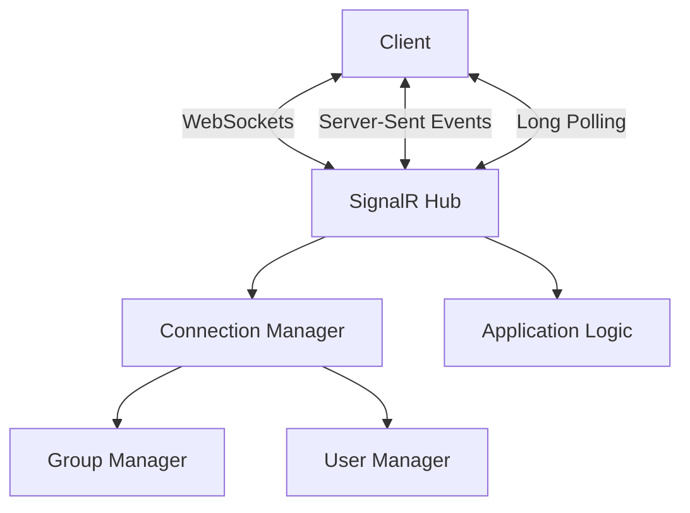
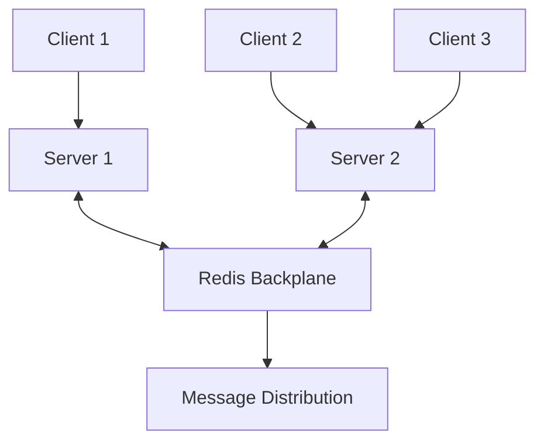

# How to Set Up SignalR in ASP.NET Core

Author: [nawazdhandala](https://www.github.com/nawazdhandala)

Tags: .NET, ASP.NET Core, C#, SignalR, WebSockets, Real-time, Notifications

Description: Learn how to implement real-time functionality in ASP.NET Core applications using SignalR. This guide covers hub creation, client connections, authentication, scaling with Redis, and best practices for building real-time features.

SignalR enables real-time, bidirectional communication between servers and clients. This guide shows you how to implement SignalR in ASP.NET Core for features like live notifications, chat, and real-time dashboards.

## Understanding SignalR

SignalR abstracts the complexity of real-time communication, automatically selecting the best transport mechanism available:



## Basic Setup

### Server Configuration

```csharp
// Program.cs
var builder = WebApplication.CreateBuilder(args);

// Add SignalR services
builder.Services.AddSignalR(options =>
{
    options.EnableDetailedErrors = builder.Environment.IsDevelopment();
    options.MaximumReceiveMessageSize = 32 * 1024; // 32KB
    options.StreamBufferCapacity = 10;
    options.KeepAliveInterval = TimeSpan.FromSeconds(15);
    options.ClientTimeoutInterval = TimeSpan.FromSeconds(30);
});

var app = builder.Build();

// Map SignalR hubs
app.MapHub<ChatHub>("/hubs/chat");
app.MapHub<NotificationHub>("/hubs/notifications");

app.Run();
```

### Creating a Basic Hub

```csharp
using Microsoft.AspNetCore.SignalR;

public class ChatHub : Hub
{
    private readonly ILogger<ChatHub> _logger;

    public ChatHub(ILogger<ChatHub> logger)
    {
        _logger = logger;
    }

    public override async Task OnConnectedAsync()
    {
        _logger.LogInformation("Client connected: {ConnectionId}", Context.ConnectionId);
        await Clients.All.SendAsync("UserConnected", Context.ConnectionId);
        await base.OnConnectedAsync();
    }

    public override async Task OnDisconnectedAsync(Exception? exception)
    {
        _logger.LogInformation("Client disconnected: {ConnectionId}", Context.ConnectionId);
        await Clients.All.SendAsync("UserDisconnected", Context.ConnectionId);
        await base.OnDisconnectedAsync(exception);
    }

    public async Task SendMessage(string user, string message)
    {
        _logger.LogInformation("Message from {User}: {Message}", user, message);
        await Clients.All.SendAsync("ReceiveMessage", user, message);
    }

    public async Task SendMessageToGroup(string groupName, string user, string message)
    {
        await Clients.Group(groupName).SendAsync("ReceiveMessage", user, message);
    }

    public async Task JoinGroup(string groupName)
    {
        await Groups.AddToGroupAsync(Context.ConnectionId, groupName);
        await Clients.Group(groupName).SendAsync("UserJoined", Context.ConnectionId, groupName);
    }

    public async Task LeaveGroup(string groupName)
    {
        await Groups.RemoveFromGroupAsync(Context.ConnectionId, groupName);
        await Clients.Group(groupName).SendAsync("UserLeft", Context.ConnectionId, groupName);
    }
}
```

## Client Implementation

### JavaScript Client

```bash
npm install @microsoft/signalr
```

```javascript
import * as signalR from "@microsoft/signalr";

class ChatClient {
    constructor() {
        this.connection = new signalR.HubConnectionBuilder()
            .withUrl("/hubs/chat", {
                accessTokenFactory: () => this.getAccessToken()
            })
            .withAutomaticReconnect([0, 2000, 5000, 10000, 30000])
            .configureLogging(signalR.LogLevel.Information)
            .build();

        this.setupEventHandlers();
    }

    setupEventHandlers() {
        this.connection.on("ReceiveMessage", (user, message) => {
            console.log(`${user}: ${message}`);
            this.onMessageReceived?.(user, message);
        });

        this.connection.on("UserConnected", (connectionId) => {
            console.log(`User connected: ${connectionId}`);
        });

        this.connection.on("UserDisconnected", (connectionId) => {
            console.log(`User disconnected: ${connectionId}`);
        });

        this.connection.onreconnecting((error) => {
            console.log("Reconnecting...", error);
        });

        this.connection.onreconnected((connectionId) => {
            console.log("Reconnected:", connectionId);
        });

        this.connection.onclose((error) => {
            console.log("Connection closed:", error);
        });
    }

    async start() {
        try {
            await this.connection.start();
            console.log("SignalR Connected");
        } catch (err) {
            console.error("SignalR Connection Error:", err);
            setTimeout(() => this.start(), 5000);
        }
    }

    async sendMessage(user, message) {
        try {
            await this.connection.invoke("SendMessage", user, message);
        } catch (err) {
            console.error("Error sending message:", err);
        }
    }

    async joinGroup(groupName) {
        await this.connection.invoke("JoinGroup", groupName);
    }

    async leaveGroup(groupName) {
        await this.connection.invoke("LeaveGroup", groupName);
    }

    getAccessToken() {
        return localStorage.getItem("accessToken");
    }
}

// Usage
const chat = new ChatClient();
chat.onMessageReceived = (user, message) => {
    // Update UI
};
await chat.start();
await chat.joinGroup("general");
await chat.sendMessage("John", "Hello everyone!");
```

### .NET Client

```csharp
using Microsoft.AspNetCore.SignalR.Client;

public class SignalRClient : IAsyncDisposable
{
    private readonly HubConnection _connection;
    private readonly ILogger<SignalRClient> _logger;

    public event Action<string, string>? MessageReceived;

    public SignalRClient(string hubUrl, ILogger<SignalRClient> logger)
    {
        _logger = logger;

        _connection = new HubConnectionBuilder()
            .WithUrl(hubUrl, options =>
            {
                options.AccessTokenProvider = () => Task.FromResult(GetAccessToken());
            })
            .WithAutomaticReconnect(new[] { TimeSpan.Zero, TimeSpan.FromSeconds(2),
                TimeSpan.FromSeconds(5), TimeSpan.FromSeconds(10) })
            .AddJsonProtocol()
            .Build();

        SetupEventHandlers();
    }

    private void SetupEventHandlers()
    {
        _connection.On<string, string>("ReceiveMessage", (user, message) =>
        {
            _logger.LogInformation("Message from {User}: {Message}", user, message);
            MessageReceived?.Invoke(user, message);
        });

        _connection.Reconnecting += error =>
        {
            _logger.LogWarning("Reconnecting: {Error}", error?.Message);
            return Task.CompletedTask;
        };

        _connection.Reconnected += connectionId =>
        {
            _logger.LogInformation("Reconnected: {ConnectionId}", connectionId);
            return Task.CompletedTask;
        };

        _connection.Closed += error =>
        {
            _logger.LogWarning("Connection closed: {Error}", error?.Message);
            return Task.CompletedTask;
        };
    }

    public async Task StartAsync(CancellationToken cancellationToken = default)
    {
        while (!cancellationToken.IsCancellationRequested)
        {
            try
            {
                await _connection.StartAsync(cancellationToken);
                _logger.LogInformation("Connected to SignalR hub");
                return;
            }
            catch (Exception ex)
            {
                _logger.LogError(ex, "Failed to connect, retrying in 5 seconds");
                await Task.Delay(5000, cancellationToken);
            }
        }
    }

    public async Task SendMessageAsync(string user, string message)
    {
        await _connection.InvokeAsync("SendMessage", user, message);
    }

    public async Task JoinGroupAsync(string groupName)
    {
        await _connection.InvokeAsync("JoinGroup", groupName);
    }

    private string? GetAccessToken()
    {
        // Get token from your auth service
        return null;
    }

    public async ValueTask DisposeAsync()
    {
        await _connection.DisposeAsync();
    }
}
```

## Authentication and Authorization

### JWT Authentication

```csharp
// Program.cs
builder.Services.AddAuthentication(JwtBearerDefaults.AuthenticationScheme)
    .AddJwtBearer(options =>
    {
        options.TokenValidationParameters = new TokenValidationParameters
        {
            ValidateIssuer = true,
            ValidateAudience = true,
            ValidateLifetime = true,
            ValidateIssuerSigningKey = true,
            ValidIssuer = builder.Configuration["Jwt:Issuer"],
            ValidAudience = builder.Configuration["Jwt:Audience"],
            IssuerSigningKey = new SymmetricSecurityKey(
                Encoding.UTF8.GetBytes(builder.Configuration["Jwt:Key"]!))
        };

        // Configure JWT for SignalR
        options.Events = new JwtBearerEvents
        {
            OnMessageReceived = context =>
            {
                var accessToken = context.Request.Query["access_token"];

                // If the request is for a hub...
                var path = context.HttpContext.Request.Path;
                if (!string.IsNullOrEmpty(accessToken) &&
                    path.StartsWithSegments("/hubs"))
                {
                    context.Token = accessToken;
                }
                return Task.CompletedTask;
            }
        };
    });

app.UseAuthentication();
app.UseAuthorization();

app.MapHub<ChatHub>("/hubs/chat").RequireAuthorization();
```

### Authorized Hub

```csharp
[Authorize]
public class SecureChatHub : Hub
{
    public override async Task OnConnectedAsync()
    {
        var userId = Context.User?.FindFirst(ClaimTypes.NameIdentifier)?.Value;
        var userName = Context.User?.Identity?.Name;

        if (!string.IsNullOrEmpty(userId))
        {
            // Add to user-specific group
            await Groups.AddToGroupAsync(Context.ConnectionId, $"user:{userId}");
        }

        await base.OnConnectedAsync();
    }

    [Authorize(Roles = "Admin")]
    public async Task SendAdminMessage(string message)
    {
        await Clients.All.SendAsync("AdminMessage", message);
    }

    public async Task SendPrivateMessage(string targetUserId, string message)
    {
        var senderId = Context.User?.FindFirst(ClaimTypes.NameIdentifier)?.Value;
        await Clients.Group($"user:{targetUserId}")
            .SendAsync("PrivateMessage", senderId, message);
    }
}
```

## Strongly Typed Hubs

```csharp
// Define client interface
public interface IChatClient
{
    Task ReceiveMessage(string user, string message);
    Task UserConnected(string connectionId, string userName);
    Task UserDisconnected(string connectionId);
    Task ReceiveNotification(NotificationDto notification);
}

// Strongly typed hub
public class TypedChatHub : Hub<IChatClient>
{
    private readonly IUserService _userService;

    public TypedChatHub(IUserService userService)
    {
        _userService = userService;
    }

    public override async Task OnConnectedAsync()
    {
        var userName = Context.User?.Identity?.Name ?? "Anonymous";
        await Clients.All.UserConnected(Context.ConnectionId, userName);
        await base.OnConnectedAsync();
    }

    public async Task SendMessage(string message)
    {
        var userName = Context.User?.Identity?.Name ?? "Anonymous";
        // Compile-time checking - no typos possible!
        await Clients.All.ReceiveMessage(userName, message);
    }

    public async Task SendToUser(string userId, NotificationDto notification)
    {
        await Clients.User(userId).ReceiveNotification(notification);
    }
}
```

## Sending Messages from Outside Hubs

### Using IHubContext

```csharp
public class NotificationService
{
    private readonly IHubContext<NotificationHub, INotificationClient> _hubContext;

    public NotificationService(IHubContext<NotificationHub, INotificationClient> hubContext)
    {
        _hubContext = hubContext;
    }

    public async Task SendToAllAsync(string message)
    {
        await _hubContext.Clients.All.ReceiveNotification(new NotificationDto
        {
            Message = message,
            Timestamp = DateTime.UtcNow
        });
    }

    public async Task SendToUserAsync(string userId, string message)
    {
        await _hubContext.Clients.User(userId).ReceiveNotification(new NotificationDto
        {
            Message = message,
            Timestamp = DateTime.UtcNow
        });
    }

    public async Task SendToGroupAsync(string groupName, string message)
    {
        await _hubContext.Clients.Group(groupName).ReceiveNotification(new NotificationDto
        {
            Message = message,
            Timestamp = DateTime.UtcNow
        });
    }
}

// Usage in a controller
[ApiController]
[Route("api/[controller]")]
public class NotificationsController : ControllerBase
{
    private readonly NotificationService _notificationService;

    public NotificationsController(NotificationService notificationService)
    {
        _notificationService = notificationService;
    }

    [HttpPost("broadcast")]
    public async Task<IActionResult> Broadcast([FromBody] string message)
    {
        await _notificationService.SendToAllAsync(message);
        return Ok();
    }
}
```

## Scaling with Redis

For multi-server deployments, use Redis backplane:

```bash
dotnet add package Microsoft.AspNetCore.SignalR.StackExchangeRedis
```

```csharp
// Program.cs
builder.Services.AddSignalR()
    .AddStackExchangeRedis(builder.Configuration.GetConnectionString("Redis")!,
        options =>
        {
            options.Configuration.ChannelPrefix = RedisChannel.Literal("MyApp");
        });
```



## Streaming

### Server-to-Client Streaming

```csharp
public class StreamingHub : Hub
{
    public async IAsyncEnumerable<int> StreamCounter(
        int count,
        int delay,
        [EnumeratorCancellation] CancellationToken cancellationToken)
    {
        for (var i = 0; i < count; i++)
        {
            cancellationToken.ThrowIfCancellationRequested();
            yield return i;
            await Task.Delay(delay, cancellationToken);
        }
    }

    public async IAsyncEnumerable<StockPrice> StreamStockPrices(
        string[] symbols,
        [EnumeratorCancellation] CancellationToken cancellationToken)
    {
        while (!cancellationToken.IsCancellationRequested)
        {
            foreach (var symbol in symbols)
            {
                yield return new StockPrice
                {
                    Symbol = symbol,
                    Price = Random.Shared.Next(100, 500),
                    Timestamp = DateTime.UtcNow
                };
            }
            await Task.Delay(1000, cancellationToken);
        }
    }
}

// Client (JavaScript)
const stream = connection.stream("StreamStockPrices", ["AAPL", "GOOGL", "MSFT"]);

stream.subscribe({
    next: (price) => {
        console.log(`${price.symbol}: $${price.price}`);
    },
    complete: () => {
        console.log("Stream completed");
    },
    error: (err) => {
        console.error("Stream error:", err);
    }
});
```

### Client-to-Server Streaming

```csharp
public class UploadHub : Hub
{
    public async Task UploadStream(IAsyncEnumerable<string> stream)
    {
        await foreach (var item in stream)
        {
            Console.WriteLine($"Received: {item}");
        }
    }
}

// Client (JavaScript)
const subject = new signalR.Subject();
connection.send("UploadStream", subject);

// Send items
subject.next("Item 1");
subject.next("Item 2");
subject.next("Item 3");

// Complete the stream
subject.complete();
```

## Best Practices

### Connection Management

```csharp
public class ConnectionTracker
{
    private readonly ConcurrentDictionary<string, HashSet<string>> _userConnections = new();

    public void AddConnection(string userId, string connectionId)
    {
        _userConnections.AddOrUpdate(
            userId,
            _ => new HashSet<string> { connectionId },
            (_, connections) =>
            {
                connections.Add(connectionId);
                return connections;
            });
    }

    public void RemoveConnection(string userId, string connectionId)
    {
        if (_userConnections.TryGetValue(userId, out var connections))
        {
            connections.Remove(connectionId);
            if (connections.Count == 0)
            {
                _userConnections.TryRemove(userId, out _);
            }
        }
    }

    public bool IsUserOnline(string userId) =>
        _userConnections.ContainsKey(userId);

    public IEnumerable<string> GetUserConnections(string userId) =>
        _userConnections.TryGetValue(userId, out var connections)
            ? connections
            : Enumerable.Empty<string>();
}
```

### Error Handling

```csharp
public class RobustHub : Hub
{
    private readonly ILogger<RobustHub> _logger;

    public RobustHub(ILogger<RobustHub> logger)
    {
        _logger = logger;
    }

    public async Task<Result> SendMessage(MessageRequest request)
    {
        try
        {
            // Validate
            if (string.IsNullOrWhiteSpace(request.Message))
            {
                return Result.Failure("Message cannot be empty");
            }

            // Process
            await Clients.All.SendAsync("ReceiveMessage",
                Context.User?.Identity?.Name,
                request.Message);

            return Result.Success();
        }
        catch (Exception ex)
        {
            _logger.LogError(ex, "Error sending message");
            return Result.Failure("Failed to send message");
        }
    }
}

public record Result(bool IsSuccess, string? Error = null)
{
    public static Result Success() => new(true);
    public static Result Failure(string error) => new(false, error);
}
```

## Conclusion

SignalR makes it easy to add real-time functionality to ASP.NET Core applications. Key takeaways:

1. **Use strongly typed hubs**: Compile-time safety for client methods
2. **Implement authentication**: Secure your hubs with JWT
3. **Scale with Redis**: Use Redis backplane for multi-server deployments
4. **Handle reconnection**: Configure automatic reconnect on clients
5. **Use streaming**: For continuous data like stock prices
6. **Track connections**: Manage user presence properly
7. **Handle errors gracefully**: Return results instead of throwing exceptions

With these patterns, you can build robust real-time features like chat, notifications, live dashboards, and collaborative editing.
