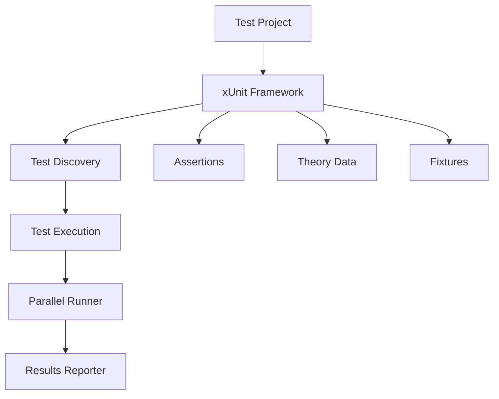

# How to Set Up Unit Testing in .NET with xUnit

Author: [nawazdhandala](https://www.github.com/nawazdhandala)

Tags: .NET, C#, xUnit, Testing, Unit Testing, Best Practices

Description: Learn how to set up comprehensive unit testing in .NET applications using xUnit. This guide covers project configuration, test organization, assertions, mocking with Moq, and best practices for writing maintainable tests.

Unit testing is essential for building reliable .NET applications. xUnit is one of the most popular testing frameworks in the .NET ecosystem, known for its clean syntax, extensibility, and excellent integration with modern .NET tooling. This guide will walk you through setting up xUnit from scratch and writing effective unit tests.

## Why xUnit?

xUnit has become the de facto standard for .NET testing due to several key advantages:

- **Modern design**: Built specifically for .NET Core and modern .NET
- **Clean syntax**: Uses attributes like `[Fact]` and `[Theory]` instead of verbose setup methods
- **Isolation**: Each test runs in a new instance, preventing state leakage
- **Extensibility**: Easy to extend with custom attributes and assertions
- **Parallel execution**: Tests run in parallel by default for faster feedback



## Project Setup

### Creating a Test Project

Start by creating a new xUnit test project alongside your main application:

```bash
# Create solution structure
dotnet new sln -n MyApplication
dotnet new webapi -n MyApplication.Api
dotnet new xunit -n MyApplication.Tests

# Add projects to solution
dotnet sln add MyApplication.Api/MyApplication.Api.csproj
dotnet sln add MyApplication.Tests/MyApplication.Tests.csproj

# Add reference from tests to main project
dotnet add MyApplication.Tests/MyApplication.Tests.csproj reference MyApplication.Api/MyApplication.Api.csproj
```

### Installing Required Packages

The xUnit template includes basic packages, but you'll want additional libraries for comprehensive testing:

```bash
cd MyApplication.Tests

# Core testing packages (already included in template)
# dotnet add package xunit
# dotnet add package xunit.runner.visualstudio

# Mocking library
dotnet add package Moq

# Fluent assertions for readable tests
dotnet add package FluentAssertions

# Code coverage
dotnet add package coverlet.collector
```

### Project File Configuration

Your test project's `.csproj` file should look like this:

```xml
<Project Sdk="Microsoft.NET.Sdk">

  <PropertyGroup>
    <TargetFramework>net8.0</TargetFramework>
    <ImplicitUsings>enable</ImplicitUsings>
    <Nullable>enable</Nullable>
    <IsPackable>false</IsPackable>
    <IsTestProject>true</IsTestProject>
  </PropertyGroup>

  <ItemGroup>
    <PackageReference Include="coverlet.collector" Version="6.0.0" />
    <PackageReference Include="FluentAssertions" Version="6.12.0" />
    <PackageReference Include="Microsoft.NET.Test.Sdk" Version="17.8.0" />
    <PackageReference Include="Moq" Version="4.20.70" />
    <PackageReference Include="xunit" Version="2.6.2" />
    <PackageReference Include="xunit.runner.visualstudio" Version="2.5.4" />
  </ItemGroup>

  <ItemGroup>
    <ProjectReference Include="..\MyApplication.Api\MyApplication.Api.csproj" />
  </ItemGroup>

</Project>
```

## Writing Your First Tests

### Basic Test Structure with Facts

A `[Fact]` is a test that takes no parameters and always runs with the same inputs:

```csharp
using Xunit;

namespace MyApplication.Tests;

public class CalculatorTests
{
    [Fact]
    public void Add_TwoPositiveNumbers_ReturnsCorrectSum()
    {
        // Arrange
        var calculator = new Calculator();

        // Act
        var result = calculator.Add(2, 3);

        // Assert
        Assert.Equal(5, result);
    }

    [Fact]
    public void Divide_ByZero_ThrowsDivideByZeroException()
    {
        // Arrange
        var calculator = new Calculator();

        // Act & Assert
        Assert.Throws<DivideByZeroException>(() => calculator.Divide(10, 0));
    }
}
```

### Parameterized Tests with Theories

`[Theory]` allows you to run the same test with different inputs:

```csharp
public class CalculatorTheoryTests
{
    [Theory]
    [InlineData(1, 2, 3)]
    [InlineData(-1, -2, -3)]
    [InlineData(0, 0, 0)]
    [InlineData(100, -50, 50)]
    public void Add_VariousInputs_ReturnsCorrectSum(int a, int b, int expected)
    {
        // Arrange
        var calculator = new Calculator();

        // Act
        var result = calculator.Add(a, b);

        // Assert
        Assert.Equal(expected, result);
    }

    [Theory]
    [MemberData(nameof(DivisionTestCases))]
    public void Divide_ValidInputs_ReturnsCorrectResult(
        decimal numerator,
        decimal denominator,
        decimal expected)
    {
        var calculator = new Calculator();
        var result = calculator.Divide(numerator, denominator);
        Assert.Equal(expected, result);
    }

    public static IEnumerable<object[]> DivisionTestCases =>
        new List<object[]>
        {
            new object[] { 10m, 2m, 5m },
            new object[] { 9m, 3m, 3m },
            new object[] { 100m, 4m, 25m },
        };
}
```

## Testing with Dependencies

### Using Moq for Mocking

When testing classes with dependencies, use Moq to create mock objects:

```csharp
using Moq;
using Xunit;

public class UserServiceTests
{
    private readonly Mock<IUserRepository> _userRepositoryMock;
    private readonly Mock<IEmailService> _emailServiceMock;
    private readonly UserService _sut; // System Under Test

    public UserServiceTests()
    {
        _userRepositoryMock = new Mock<IUserRepository>();
        _emailServiceMock = new Mock<IEmailService>();
        _sut = new UserService(
            _userRepositoryMock.Object,
            _emailServiceMock.Object);
    }

    [Fact]
    public async Task CreateUser_ValidData_SavesUserAndSendsEmail()
    {
        // Arrange
        var request = new CreateUserRequest
        {
            Email = "test@example.com",
            Name = "Test User"
        };

        _userRepositoryMock
            .Setup(x => x.CreateAsync(It.IsAny<User>()))
            .ReturnsAsync(new User { Id = 1, Email = request.Email });

        _emailServiceMock
            .Setup(x => x.SendWelcomeEmailAsync(It.IsAny<string>()))
            .Returns(Task.CompletedTask);

        // Act
        var result = await _sut.CreateUserAsync(request);

        // Assert
        Assert.NotNull(result);
        Assert.Equal(1, result.Id);

        _userRepositoryMock.Verify(
            x => x.CreateAsync(It.Is<User>(u => u.Email == request.Email)),
            Times.Once);

        _emailServiceMock.Verify(
            x => x.SendWelcomeEmailAsync(request.Email),
            Times.Once);
    }

    [Fact]
    public async Task GetUser_UserNotFound_ReturnsNull()
    {
        // Arrange
        _userRepositoryMock
            .Setup(x => x.GetByIdAsync(It.IsAny<int>()))
            .ReturnsAsync((User?)null);

        // Act
        var result = await _sut.GetUserAsync(999);

        // Assert
        Assert.Null(result);
    }
}
```

### Using FluentAssertions

FluentAssertions provides more readable assertions:

```csharp
using FluentAssertions;
using Xunit;

public class ProductServiceTests
{
    [Fact]
    public void GetProducts_ReturnsCorrectProducts()
    {
        // Arrange
        var service = new ProductService();

        // Act
        var products = service.GetProducts();

        // Assert with FluentAssertions
        products.Should().NotBeNull();
        products.Should().HaveCount(3);
        products.Should().Contain(p => p.Name == "Widget");
        products.First().Price.Should().BeGreaterThan(0);
    }

    [Fact]
    public async Task CreateProduct_InvalidPrice_ThrowsValidationException()
    {
        // Arrange
        var service = new ProductService();
        var invalidProduct = new Product { Name = "Test", Price = -10 };

        // Act
        var act = async () => await service.CreateProductAsync(invalidProduct);

        // Assert
        await act.Should()
            .ThrowAsync<ValidationException>()
            .WithMessage("*Price*must be positive*");
    }
}
```

## Test Fixtures and Shared Context

### Class Fixtures for Expensive Setup

When tests need to share expensive setup, use class fixtures:

```csharp
// The fixture - created once for all tests in the class
public class DatabaseFixture : IDisposable
{
    public DatabaseFixture()
    {
        // Expensive setup - runs once
        Connection = new SqlConnection("...");
        Connection.Open();
        // Seed test data
    }

    public SqlConnection Connection { get; }

    public void Dispose()
    {
        Connection.Dispose();
    }
}

// Tests using the fixture
public class DatabaseTests : IClassFixture<DatabaseFixture>
{
    private readonly DatabaseFixture _fixture;

    public DatabaseTests(DatabaseFixture fixture)
    {
        _fixture = fixture;
    }

    [Fact]
    public void Query_ReturnsData()
    {
        // Use _fixture.Connection
        var command = _fixture.Connection.CreateCommand();
        // ...
    }
}
```

### Collection Fixtures for Cross-Class Sharing

Share fixtures across multiple test classes:

```csharp
// Define the collection
[CollectionDefinition("Database collection")]
public class DatabaseCollection : ICollectionFixture<DatabaseFixture>
{
    // This class has no code - it's just a marker
}

// Use in multiple test classes
[Collection("Database collection")]
public class UserRepositoryTests
{
    private readonly DatabaseFixture _fixture;

    public UserRepositoryTests(DatabaseFixture fixture)
    {
        _fixture = fixture;
    }

    // Tests...
}

[Collection("Database collection")]
public class OrderRepositoryTests
{
    private readonly DatabaseFixture _fixture;

    public OrderRepositoryTests(DatabaseFixture fixture)
    {
        _fixture = fixture;
    }

    // Tests...
}
```

## Running Tests

### Command Line

```bash
# Run all tests
dotnet test

# Run with detailed output
dotnet test --logger "console;verbosity=detailed"

# Run specific tests
dotnet test --filter "FullyQualifiedName~UserServiceTests"

# Run with coverage
dotnet test --collect:"XPlat Code Coverage"

# Run tests in parallel (default) or sequentially
dotnet test -- xunit.parallelizeAssembly=true
dotnet test -- xunit.parallelizeTestCollections=false
```

### Test Configuration with xunit.runner.json

Create `xunit.runner.json` in your test project:

```json
{
  "$schema": "https://xunit.net/schema/current/xunit.runner.schema.json",
  "parallelizeAssembly": true,
  "parallelizeTestCollections": true,
  "maxParallelThreads": 0,
  "diagnosticMessages": false,
  "methodDisplay": "classAndMethod"
}
```

## Best Practices

### Test Naming Conventions

Use descriptive names that explain the scenario:

```csharp
// Pattern: MethodName_Scenario_ExpectedBehavior
[Fact]
public void CreateOrder_EmptyCart_ThrowsInvalidOperationException()

[Fact]
public async Task ProcessPayment_InsufficientFunds_ReturnsDeclinedStatus()

[Fact]
public void CalculateDiscount_PremiumMember_AppliesTwentyPercentOff()
```

### Arrange-Act-Assert Pattern

Always structure tests with clear sections:

```csharp
[Fact]
public async Task UpdateUser_ValidChanges_ReturnsUpdatedUser()
{
    // Arrange - Set up test data and mocks
    var userId = 1;
    var updateRequest = new UpdateUserRequest { Name = "New Name" };
    _repositoryMock
        .Setup(x => x.UpdateAsync(It.IsAny<User>()))
        .ReturnsAsync(new User { Id = userId, Name = "New Name" });

    // Act - Execute the method under test
    var result = await _sut.UpdateUserAsync(userId, updateRequest);

    // Assert - Verify the outcome
    result.Should().NotBeNull();
    result.Name.Should().Be("New Name");
}
```

### Test Independence

Each test should be independent and not rely on other tests:

```csharp
public class OrderTests
{
    // BAD - Tests depend on shared state
    private static Order _sharedOrder;

    // GOOD - Each test creates its own data
    [Fact]
    public void CalculateTotal_MultipleItems_SumsCorrectly()
    {
        var order = new Order();
        order.AddItem(new OrderItem { Price = 10 });
        order.AddItem(new OrderItem { Price = 20 });

        var total = order.CalculateTotal();

        Assert.Equal(30, total);
    }
}
```

## Conclusion

Setting up unit testing with xUnit in .NET provides a solid foundation for building reliable applications. The combination of xUnit's clean syntax, Moq's powerful mocking capabilities, and FluentAssertions' readable assertions creates an excellent testing experience.

Key takeaways:

1. **Start early**: Set up testing from the beginning of your project
2. **Use Theory for parameterized tests**: Reduce code duplication with data-driven tests
3. **Mock dependencies**: Isolate units under test with Moq
4. **Follow naming conventions**: Make test failures self-documenting
5. **Keep tests independent**: Avoid shared state between tests
6. **Run tests frequently**: Integrate with CI/CD for continuous feedback

With these practices in place, you'll have confidence in your code and catch bugs before they reach production.
