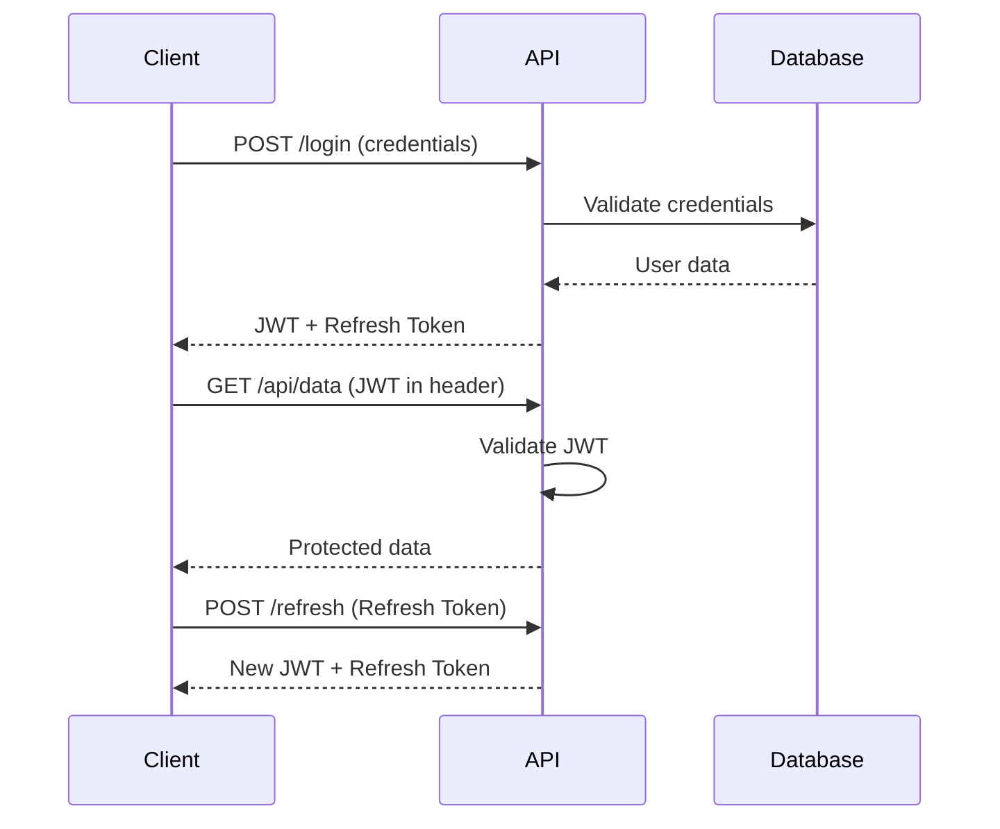

# How to Set Up JWT Authentication in ASP.NET Core

Author: [nawazdhandala](https://github.com/nawazdhandala)

Tags: C#, ASP.NET Core, JWT, Authentication, Security, .NET, API

Description: Learn how to implement JWT authentication in ASP.NET Core with complete examples covering token generation, validation, refresh tokens, and security best practices.

---

JSON Web Tokens (JWT) provide a stateless authentication mechanism for APIs. This guide shows you how to implement secure JWT authentication in ASP.NET Core from scratch.

## Understanding JWT Authentication Flow



## Installation

```bash
dotnet add package Microsoft.AspNetCore.Authentication.JwtBearer
dotnet add package System.IdentityModel.Tokens.Jwt
```

## Configuration

### JWT Settings

```csharp
// appsettings.json
{
  "JwtSettings": {
    "Secret": "your-256-bit-secret-key-here-make-it-long-enough",
    "Issuer": "https://yourdomain.com",
    "Audience": "https://yourdomain.com",
    "AccessTokenExpirationMinutes": 15,
    "RefreshTokenExpirationDays": 7
  }
}
```

### Settings Class

```csharp
public class JwtSettings
{
    public string Secret { get; set; } = string.Empty;
    public string Issuer { get; set; } = string.Empty;
    public string Audience { get; set; } = string.Empty;
    public int AccessTokenExpirationMinutes { get; set; } = 15;
    public int RefreshTokenExpirationDays { get; set; } = 7;
}
```

### Program.cs Setup

```csharp
using Microsoft.AspNetCore.Authentication.JwtBearer;
using Microsoft.IdentityModel.Tokens;
using System.Text;

var builder = WebApplication.CreateBuilder(args);

// Bind JWT settings
var jwtSettings = builder.Configuration.GetSection("JwtSettings").Get<JwtSettings>()!;
builder.Services.Configure<JwtSettings>(builder.Configuration.GetSection("JwtSettings"));

// Add authentication
builder.Services.AddAuthentication(options =>
{
    options.DefaultAuthenticateScheme = JwtBearerDefaults.AuthenticationScheme;
    options.DefaultChallengeScheme = JwtBearerDefaults.AuthenticationScheme;
})
.AddJwtBearer(options =>
{
    options.TokenValidationParameters = new TokenValidationParameters
    {
        ValidateIssuer = true,
        ValidateAudience = true,
        ValidateLifetime = true,
        ValidateIssuerSigningKey = true,
        ValidIssuer = jwtSettings.Issuer,
        ValidAudience = jwtSettings.Audience,
        IssuerSigningKey = new SymmetricSecurityKey(Encoding.UTF8.GetBytes(jwtSettings.Secret)),
        ClockSkew = TimeSpan.Zero // Remove default 5 minute tolerance
    };

    options.Events = new JwtBearerEvents
    {
        OnAuthenticationFailed = context =>
        {
            if (context.Exception.GetType() == typeof(SecurityTokenExpiredException))
            {
                context.Response.Headers.Append("Token-Expired", "true");
            }
            return Task.CompletedTask;
        }
    };
});

builder.Services.AddAuthorization();

// Register services
builder.Services.AddScoped<ITokenService, TokenService>();
builder.Services.AddScoped<IAuthService, AuthService>();

var app = builder.Build();

app.UseAuthentication();
app.UseAuthorization();

app.MapControllers();

app.Run();
```

## Token Service Implementation

```csharp
public interface ITokenService
{
    string GenerateAccessToken(User user);
    string GenerateRefreshToken();
    ClaimsPrincipal? GetPrincipalFromExpiredToken(string token);
}

public class TokenService : ITokenService
{
    private readonly JwtSettings _jwtSettings;

    public TokenService(IOptions<JwtSettings> jwtSettings)
    {
        _jwtSettings = jwtSettings.Value;
    }

    public string GenerateAccessToken(User user)
    {
        var key = new SymmetricSecurityKey(Encoding.UTF8.GetBytes(_jwtSettings.Secret));
        var credentials = new SigningCredentials(key, SecurityAlgorithms.HmacSha256);

        var claims = new List<Claim>
        {
            new(ClaimTypes.NameIdentifier, user.Id.ToString()),
            new(ClaimTypes.Email, user.Email),
            new(ClaimTypes.Name, user.Username),
            new("jti", Guid.NewGuid().ToString())
        };

        // Add roles
        foreach (var role in user.Roles)
        {
            claims.Add(new Claim(ClaimTypes.Role, role));
        }

        var token = new JwtSecurityToken(
            issuer: _jwtSettings.Issuer,
            audience: _jwtSettings.Audience,
            claims: claims,
            expires: DateTime.UtcNow.AddMinutes(_jwtSettings.AccessTokenExpirationMinutes),
            signingCredentials: credentials
        );

        return new JwtSecurityTokenHandler().WriteToken(token);
    }

    public string GenerateRefreshToken()
    {
        var randomNumber = new byte[64];
        using var rng = RandomNumberGenerator.Create();
        rng.GetBytes(randomNumber);
        return Convert.ToBase64String(randomNumber);
    }

    public ClaimsPrincipal? GetPrincipalFromExpiredToken(string token)
    {
        var tokenValidationParameters = new TokenValidationParameters
        {
            ValidateIssuer = true,
            ValidateAudience = true,
            ValidateLifetime = false, // Allow expired tokens
            ValidateIssuerSigningKey = true,
            ValidIssuer = _jwtSettings.Issuer,
            ValidAudience = _jwtSettings.Audience,
            IssuerSigningKey = new SymmetricSecurityKey(Encoding.UTF8.GetBytes(_jwtSettings.Secret))
        };

        var tokenHandler = new JwtSecurityTokenHandler();

        try
        {
            var principal = tokenHandler.ValidateToken(token, tokenValidationParameters, out var securityToken);

            if (securityToken is not JwtSecurityToken jwtSecurityToken ||
                !jwtSecurityToken.Header.Alg.Equals(SecurityAlgorithms.HmacSha256,
                    StringComparison.InvariantCultureIgnoreCase))
            {
                return null;
            }

            return principal;
        }
        catch
        {
            return null;
        }
    }
}
```

## Authentication Service

```csharp
public interface IAuthService
{
    Task<AuthResult> LoginAsync(LoginRequest request);
    Task<AuthResult> RefreshTokenAsync(RefreshTokenRequest request);
    Task RevokeTokenAsync(string userId);
}

public class AuthService : IAuthService
{
    private readonly IUserRepository _userRepository;
    private readonly ITokenService _tokenService;
    private readonly IRefreshTokenRepository _refreshTokenRepository;
    private readonly IPasswordHasher<User> _passwordHasher;

    public AuthService(
        IUserRepository userRepository,
        ITokenService tokenService,
        IRefreshTokenRepository refreshTokenRepository,
        IPasswordHasher<User> passwordHasher)
    {
        _userRepository = userRepository;
        _tokenService = tokenService;
        _refreshTokenRepository = refreshTokenRepository;
        _passwordHasher = passwordHasher;
    }

    public async Task<AuthResult> LoginAsync(LoginRequest request)
    {
        var user = await _userRepository.GetByEmailAsync(request.Email);

        if (user == null)
        {
            return AuthResult.Failure("Invalid credentials");
        }

        var result = _passwordHasher.VerifyHashedPassword(
            user, user.PasswordHash, request.Password);

        if (result == PasswordVerificationResult.Failed)
        {
            return AuthResult.Failure("Invalid credentials");
        }

        var accessToken = _tokenService.GenerateAccessToken(user);
        var refreshToken = _tokenService.GenerateRefreshToken();

        // Store refresh token
        await _refreshTokenRepository.SaveAsync(new RefreshToken
        {
            Token = refreshToken,
            UserId = user.Id,
            ExpiresAt = DateTime.UtcNow.AddDays(7),
            CreatedAt = DateTime.UtcNow
        });

        return AuthResult.Success(accessToken, refreshToken);
    }

    public async Task<AuthResult> RefreshTokenAsync(RefreshTokenRequest request)
    {
        var principal = _tokenService.GetPrincipalFromExpiredToken(request.AccessToken);

        if (principal == null)
        {
            return AuthResult.Failure("Invalid access token");
        }

        var userId = principal.FindFirstValue(ClaimTypes.NameIdentifier);

        if (string.IsNullOrEmpty(userId))
        {
            return AuthResult.Failure("Invalid access token");
        }

        var storedToken = await _refreshTokenRepository.GetByTokenAsync(request.RefreshToken);

        if (storedToken == null ||
            storedToken.UserId.ToString() != userId ||
            storedToken.ExpiresAt < DateTime.UtcNow ||
            storedToken.IsRevoked)
        {
            return AuthResult.Failure("Invalid refresh token");
        }

        var user = await _userRepository.GetByIdAsync(storedToken.UserId);

        if (user == null)
        {
            return AuthResult.Failure("User not found");
        }

        // Generate new tokens
        var newAccessToken = _tokenService.GenerateAccessToken(user);
        var newRefreshToken = _tokenService.GenerateRefreshToken();

        // Revoke old refresh token and save new one
        storedToken.IsRevoked = true;
        await _refreshTokenRepository.UpdateAsync(storedToken);

        await _refreshTokenRepository.SaveAsync(new RefreshToken
        {
            Token = newRefreshToken,
            UserId = user.Id,
            ExpiresAt = DateTime.UtcNow.AddDays(7),
            CreatedAt = DateTime.UtcNow
        });

        return AuthResult.Success(newAccessToken, newRefreshToken);
    }

    public async Task RevokeTokenAsync(string userId)
    {
        await _refreshTokenRepository.RevokeAllForUserAsync(int.Parse(userId));
    }
}
```

## Auth Controller

```csharp
[ApiController]
[Route("api/[controller]")]
public class AuthController : ControllerBase
{
    private readonly IAuthService _authService;

    public AuthController(IAuthService authService)
    {
        _authService = authService;
    }

    [HttpPost("login")]
    public async Task<IActionResult> Login([FromBody] LoginRequest request)
    {
        var result = await _authService.LoginAsync(request);

        if (!result.IsSuccess)
        {
            return Unauthorized(new { message = result.Error });
        }

        return Ok(new
        {
            accessToken = result.AccessToken,
            refreshToken = result.RefreshToken,
            expiresIn = 900 // 15 minutes in seconds
        });
    }

    [HttpPost("refresh")]
    public async Task<IActionResult> Refresh([FromBody] RefreshTokenRequest request)
    {
        var result = await _authService.RefreshTokenAsync(request);

        if (!result.IsSuccess)
        {
            return Unauthorized(new { message = result.Error });
        }

        return Ok(new
        {
            accessToken = result.AccessToken,
            refreshToken = result.RefreshToken
        });
    }

    [Authorize]
    [HttpPost("logout")]
    public async Task<IActionResult> Logout()
    {
        var userId = User.FindFirstValue(ClaimTypes.NameIdentifier);

        if (userId != null)
        {
            await _authService.RevokeTokenAsync(userId);
        }

        return NoContent();
    }
}
```

## Protecting Endpoints

```csharp
[ApiController]
[Route("api/[controller]")]
public class UsersController : ControllerBase
{
    // Requires authentication
    [Authorize]
    [HttpGet("me")]
    public IActionResult GetCurrentUser()
    {
        var userId = User.FindFirstValue(ClaimTypes.NameIdentifier);
        var email = User.FindFirstValue(ClaimTypes.Email);

        return Ok(new { userId, email });
    }

    // Requires specific role
    [Authorize(Roles = "Admin")]
    [HttpGet]
    public async Task<IActionResult> GetAllUsers()
    {
        // Only admins can access
        return Ok(await _userService.GetAllAsync());
    }

    // Requires specific policy
    [Authorize(Policy = "RequireManagerRole")]
    [HttpDelete("{id}")]
    public async Task<IActionResult> DeleteUser(int id)
    {
        await _userService.DeleteAsync(id);
        return NoContent();
    }
}
```

## Custom Authorization Policies

```csharp
// Program.cs
builder.Services.AddAuthorization(options =>
{
    options.AddPolicy("RequireManagerRole", policy =>
        policy.RequireRole("Manager", "Admin"));

    options.AddPolicy("MinimumAge", policy =>
        policy.Requirements.Add(new MinimumAgeRequirement(18)));

    options.AddPolicy("CanEditResource", policy =>
        policy.Requirements.Add(new ResourceOwnerRequirement()));
});

// Custom requirement
public class MinimumAgeRequirement : IAuthorizationRequirement
{
    public int MinimumAge { get; }

    public MinimumAgeRequirement(int minimumAge)
    {
        MinimumAge = minimumAge;
    }
}

// Handler
public class MinimumAgeHandler : AuthorizationHandler<MinimumAgeRequirement>
{
    protected override Task HandleRequirementAsync(
        AuthorizationHandlerContext context,
        MinimumAgeRequirement requirement)
    {
        var dateOfBirthClaim = context.User.FindFirst("DateOfBirth");

        if (dateOfBirthClaim == null)
        {
            return Task.CompletedTask;
        }

        var dateOfBirth = DateTime.Parse(dateOfBirthClaim.Value);
        var age = DateTime.Today.Year - dateOfBirth.Year;

        if (age >= requirement.MinimumAge)
        {
            context.Succeed(requirement);
        }

        return Task.CompletedTask;
    }
}
```

## Security Best Practices

### 1. Secure Secret Storage

```csharp
// Never hardcode secrets - use User Secrets or Azure Key Vault
// Development: User Secrets
dotnet user-secrets set "JwtSettings:Secret" "your-secret-key"

// Production: Azure Key Vault
builder.Configuration.AddAzureKeyVault(
    new Uri($"https://{keyVaultName}.vault.azure.net/"),
    new DefaultAzureCredential());
```

### 2. HTTPS Only

```csharp
app.UseHttpsRedirection();

// In production, also set HSTS
app.UseHsts();
```

### 3. Token Rotation

```csharp
// Implement refresh token rotation
// Each refresh generates a new refresh token
// Old tokens are invalidated
```

## Best Practices Summary

| Practice | Description |
|----------|-------------|
| **Short-lived access tokens** | 15-60 minutes expiration |
| **Refresh token rotation** | New refresh token on each refresh |
| **Secure secret storage** | Use Key Vault, not config files |
| **HTTPS only** | Never transmit tokens over HTTP |
| **Validate all claims** | Issuer, audience, expiration |
| **Revocation support** | Allow logout/token revocation |

## Conclusion

JWT authentication in ASP.NET Core provides a scalable, stateless authentication mechanism for your APIs. Implement proper token refresh flows, secure your secrets, and always use HTTPS. Remember to validate all token claims and support token revocation for complete security.
