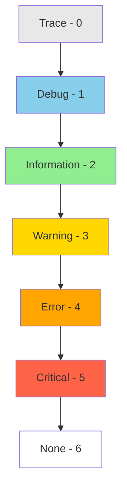

# How to Set Up Logging in ASP.NET Core

Author: [nawazdhandala](https://github.com/nawazdhandala)

Tags: C#, ASP.NET Core, Logging, Observability, .NET, Debugging, Monitoring

Description: Learn how to configure logging in ASP.NET Core with practical examples covering built-in providers, structured logging, Serilog integration, and production best practices.

---

Effective logging is essential for debugging, monitoring, and understanding application behavior. ASP.NET Core provides a flexible logging infrastructure that supports multiple providers and structured logging out of the box.

## Built-in Logging Basics

### Default Configuration

```csharp
var builder = WebApplication.CreateBuilder(args);

// Logging is configured by default from appsettings.json
var app = builder.Build();

app.MapGet("/", (ILogger<Program> logger) =>
{
    logger.LogInformation("Home endpoint accessed");
    return "Hello World";
});

app.Run();
```

### appsettings.json Configuration

```json
{
  "Logging": {
    "LogLevel": {
      "Default": "Information",
      "Microsoft.AspNetCore": "Warning",
      "Microsoft.EntityFrameworkCore": "Warning",
      "System": "Warning"
    },
    "Console": {
      "FormatterName": "json",
      "FormatterOptions": {
        "SingleLine": true,
        "IncludeScopes": true,
        "TimestampFormat": "yyyy-MM-dd HH:mm:ss "
      }
    }
  }
}
```

## Log Levels



### Using Log Levels

```csharp
public class OrderService
{
    private readonly ILogger<OrderService> _logger;

    public OrderService(ILogger<OrderService> logger)
    {
        _logger = logger;
    }

    public async Task<Order> ProcessOrderAsync(OrderRequest request)
    {
        _logger.LogTrace("Entering ProcessOrderAsync with request: {@Request}", request);

        _logger.LogDebug("Validating order for customer {CustomerId}", request.CustomerId);

        _logger.LogInformation("Processing order {OrderId} for customer {CustomerId}",
            request.OrderId, request.CustomerId);

        if (request.Total > 10000)
        {
            _logger.LogWarning("High value order detected: {OrderId} with total {Total}",
                request.OrderId, request.Total);
        }

        try
        {
            var order = await CreateOrderAsync(request);
            _logger.LogInformation("Order {OrderId} created successfully", order.Id);
            return order;
        }
        catch (PaymentException ex)
        {
            _logger.LogError(ex, "Payment failed for order {OrderId}", request.OrderId);
            throw;
        }
        catch (Exception ex)
        {
            _logger.LogCritical(ex, "Critical failure processing order {OrderId}", request.OrderId);
            throw;
        }
    }
}
```

## Structured Logging

Structured logging captures data as searchable properties, not just text.

```csharp
public class UserService
{
    private readonly ILogger<UserService> _logger;

    public async Task<User> GetUserAsync(int userId)
    {
        // AVOID: String interpolation loses structure
        _logger.LogInformation($"Getting user {userId}"); // Bad!

        // GOOD: Message template preserves structure
        _logger.LogInformation("Getting user {UserId}", userId);

        // Multiple properties
        _logger.LogInformation(
            "User {UserId} accessed resource {Resource} at {Timestamp}",
            userId,
            "/api/profile",
            DateTime.UtcNow);

        // Complex objects with @ for destructuring
        var user = await _repository.GetByIdAsync(userId);
        _logger.LogDebug("Retrieved user: {@User}", user);

        return user;
    }
}
```

## Log Scopes

Scopes add context to all logs within a block:

```csharp
public class OrderController : ControllerBase
{
    private readonly ILogger<OrderController> _logger;
    private readonly IOrderService _orderService;

    [HttpPost]
    public async Task<IActionResult> CreateOrder([FromBody] OrderRequest request)
    {
        // Add context to all logs in this scope
        using (_logger.BeginScope(new Dictionary<string, object>
        {
            ["CorrelationId"] = HttpContext.TraceIdentifier,
            ["UserId"] = User.FindFirst("sub")?.Value,
            ["OrderId"] = request.OrderId
        }))
        {
            _logger.LogInformation("Order creation started");

            var order = await _orderService.ProcessOrderAsync(request);

            _logger.LogInformation("Order creation completed");

            return Ok(order);
        }
    }
}
```

## Serilog Integration

Serilog is a popular logging library with rich formatting and sink support.

### Installation

```bash
dotnet add package Serilog.AspNetCore
dotnet add package Serilog.Sinks.Console
dotnet add package Serilog.Sinks.File
dotnet add package Serilog.Sinks.Seq
```

### Configuration

```csharp
using Serilog;

var builder = WebApplication.CreateBuilder(args);

// Configure Serilog
Log.Logger = new LoggerConfiguration()
    .MinimumLevel.Debug()
    .MinimumLevel.Override("Microsoft", Serilog.Events.LogEventLevel.Warning)
    .MinimumLevel.Override("Microsoft.AspNetCore", Serilog.Events.LogEventLevel.Warning)
    .Enrich.FromLogContext()
    .Enrich.WithMachineName()
    .Enrich.WithThreadId()
    .WriteTo.Console(outputTemplate:
        "[{Timestamp:HH:mm:ss} {Level:u3}] {Message:lj}{NewLine}{Exception}")
    .WriteTo.File("logs/app-.log",
        rollingInterval: RollingInterval.Day,
        retainedFileCountLimit: 30)
    .WriteTo.Seq("http://localhost:5341")
    .CreateLogger();

builder.Host.UseSerilog();

var app = builder.Build();

// Add request logging middleware
app.UseSerilogRequestLogging(options =>
{
    options.MessageTemplate =
        "HTTP {RequestMethod} {RequestPath} responded {StatusCode} in {Elapsed:0.0000} ms";
    options.EnrichDiagnosticContext = (diagnosticContext, httpContext) =>
    {
        diagnosticContext.Set("RequestHost", httpContext.Request.Host.Value);
        diagnosticContext.Set("UserAgent", httpContext.Request.Headers["User-Agent"]);
    };
});

app.MapControllers();

try
{
    Log.Information("Starting web application");
    app.Run();
}
catch (Exception ex)
{
    Log.Fatal(ex, "Application terminated unexpectedly");
}
finally
{
    Log.CloseAndFlush();
}
```

### Serilog appsettings.json

```json
{
  "Serilog": {
    "Using": ["Serilog.Sinks.Console", "Serilog.Sinks.File"],
    "MinimumLevel": {
      "Default": "Information",
      "Override": {
        "Microsoft": "Warning",
        "System": "Warning"
      }
    },
    "WriteTo": [
      {
        "Name": "Console",
        "Args": {
          "theme": "Serilog.Sinks.SystemConsole.Themes.AnsiConsoleTheme::Code, Serilog.Sinks.Console"
        }
      },
      {
        "Name": "File",
        "Args": {
          "path": "logs/app-.log",
          "rollingInterval": "Day",
          "retainedFileCountLimit": 30
        }
      }
    ],
    "Enrich": ["FromLogContext", "WithMachineName", "WithThreadId"]
  }
}
```

## Custom Log Enrichment

```csharp
public class RequestEnrichmentMiddleware
{
    private readonly RequestDelegate _next;

    public RequestEnrichmentMiddleware(RequestDelegate next)
    {
        _next = next;
    }

    public async Task InvokeAsync(HttpContext context)
    {
        // Add properties to all logs for this request
        using (LogContext.PushProperty("CorrelationId", context.TraceIdentifier))
        using (LogContext.PushProperty("ClientIp", context.Connection.RemoteIpAddress))
        using (LogContext.PushProperty("UserAgent", context.Request.Headers.UserAgent.ToString()))
        {
            await _next(context);
        }
    }
}

// Register middleware
app.UseMiddleware<RequestEnrichmentMiddleware>();
```

## High-Performance Logging

Use source generators for zero-allocation logging (NET 6+):

```csharp
public partial class OrderService
{
    private readonly ILogger<OrderService> _logger;

    [LoggerMessage(
        EventId = 1001,
        Level = LogLevel.Information,
        Message = "Processing order {OrderId} for customer {CustomerId}")]
    partial void LogOrderProcessing(int orderId, int customerId);

    [LoggerMessage(
        EventId = 1002,
        Level = LogLevel.Warning,
        Message = "High value order: {OrderId} total {Total}")]
    partial void LogHighValueOrder(int orderId, decimal total);

    [LoggerMessage(
        EventId = 1003,
        Level = LogLevel.Error,
        Message = "Order processing failed for {OrderId}")]
    partial void LogOrderFailed(int orderId, Exception exception);

    public async Task<Order> ProcessOrderAsync(OrderRequest request)
    {
        LogOrderProcessing(request.OrderId, request.CustomerId);

        if (request.Total > 10000)
        {
            LogHighValueOrder(request.OrderId, request.Total);
        }

        try
        {
            return await CreateOrderAsync(request);
        }
        catch (Exception ex)
        {
            LogOrderFailed(request.OrderId, ex);
            throw;
        }
    }
}
```

## Filtering Logs

```csharp
builder.Logging.AddFilter("Microsoft.EntityFrameworkCore.Database.Command", LogLevel.Warning);
builder.Logging.AddFilter<ConsoleLoggerProvider>("Microsoft", LogLevel.Warning);

// Custom filter
builder.Logging.AddFilter((provider, category, logLevel) =>
{
    // Only log EF commands in Development
    if (category == "Microsoft.EntityFrameworkCore.Database.Command")
    {
        return builder.Environment.IsDevelopment();
    }
    return true;
});
```

## Sensitive Data Protection

```csharp
public class SensitiveDataDestructuringPolicy : IDestructuringPolicy
{
    public bool TryDestructure(object value, ILogEventPropertyValueFactory propertyValueFactory,
        out LogEventPropertyValue result)
    {
        if (value is User user)
        {
            result = new StructureValue(new[]
            {
                new LogEventProperty("Id", new ScalarValue(user.Id)),
                new LogEventProperty("Email", new ScalarValue(MaskEmail(user.Email))),
                new LogEventProperty("Name", new ScalarValue(user.Name))
                // Exclude sensitive properties like PasswordHash
            });
            return true;
        }

        result = null;
        return false;
    }

    private static string MaskEmail(string email)
    {
        var parts = email.Split('@');
        if (parts.Length != 2) return "***";
        return $"{parts[0][0]}***@{parts[1]}";
    }
}

// Register
Log.Logger = new LoggerConfiguration()
    .Destructure.With<SensitiveDataDestructuringPolicy>()
    .CreateLogger();
```

## Production Configuration

```csharp
if (builder.Environment.IsProduction())
{
    Log.Logger = new LoggerConfiguration()
        .MinimumLevel.Information()
        .MinimumLevel.Override("Microsoft", LogEventLevel.Warning)
        .Enrich.FromLogContext()
        .Enrich.WithProperty("Environment", "Production")
        .Enrich.WithProperty("Application", "MyApp")
        .WriteTo.Console(new JsonFormatter())
        .WriteTo.Async(a => a.File(
            new JsonFormatter(),
            "logs/app-.json",
            rollingInterval: RollingInterval.Hour,
            retainedFileCountLimit: 168)) // 7 days
        .CreateLogger();
}
```

## Best Practices Summary

| Practice | Description |
|----------|-------------|
| **Use structured logging** | Use message templates, not string interpolation |
| **Include correlation IDs** | Track requests across services |
| **Appropriate log levels** | Use correct level for each message |
| **Don't log sensitive data** | Mask PII, exclude secrets |
| **Use scopes** | Add context for related operations |
| **Configure per environment** | More verbose in dev, structured in prod |
| **Use high-perf logging** | Source generators for hot paths |

## Conclusion

ASP.NET Core's logging infrastructure provides a solid foundation for application observability. Use structured logging with message templates, add context with scopes, and consider Serilog for production applications. Always protect sensitive data and configure appropriate log levels per environment. Effective logging is your first line of defense when debugging production issues.
