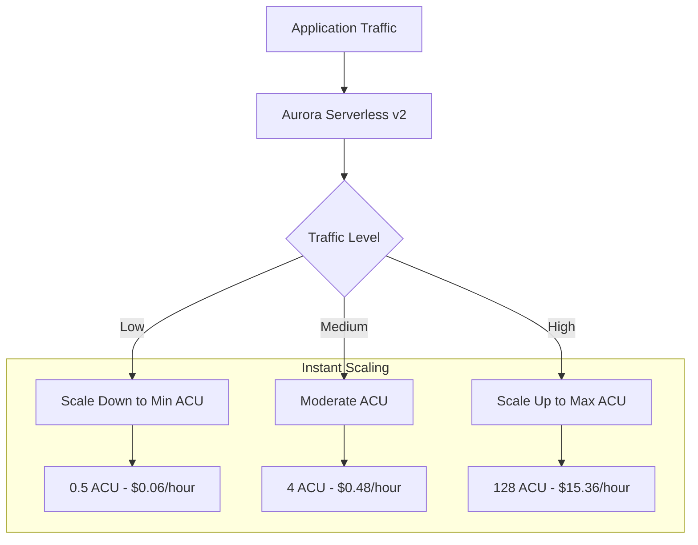

# How to Set Up Aurora Serverless v2

Author: [nawazdhandala](https://www.github.com/nawazdhandala)

Tags: AWS, Aurora, Serverless, Database, PostgreSQL, MySQL, Auto Scaling

Description: A comprehensive guide to setting up Amazon Aurora Serverless v2, including capacity configuration, networking, monitoring, and cost optimization strategies.

---

Aurora Serverless v2 automatically scales database capacity based on application demand. Unlike v1, it scales instantly and can handle production workloads with unpredictable traffic patterns while maintaining cost efficiency during idle periods.

## Understanding Aurora Serverless v2

Aurora Serverless v2 scales in increments of 0.5 ACUs (Aurora Capacity Units). One ACU provides approximately 2 GB of memory and corresponding compute and networking.



## Step 1: Create the Aurora Cluster

### Using AWS CLI

```bash
# Create the DB cluster
aws rds create-db-cluster \
  --db-cluster-identifier my-serverless-cluster \
  --engine aurora-postgresql \
  --engine-version 15.4 \
  --engine-mode provisioned \
  --serverless-v2-scaling-configuration MinCapacity=0.5,MaxCapacity=16 \
  --master-username admin \
  --master-user-password "YourSecurePassword123!" \
  --db-subnet-group-name my-subnet-group \
  --vpc-security-group-ids sg-xxxxxx \
  --storage-encrypted \
  --region us-east-1

# Create the DB instance
aws rds create-db-instance \
  --db-instance-identifier my-serverless-instance \
  --db-cluster-identifier my-serverless-cluster \
  --engine aurora-postgresql \
  --db-instance-class db.serverless \
  --region us-east-1
```

### Using CloudFormation

```yaml
AWSTemplateFormatVersion: '2010-09-09'
Description: Aurora Serverless v2 Setup

Parameters:
  Environment:
    Type: String
    Default: production
  DatabaseName:
    Type: String
    Default: myapp
  MinCapacity:
    Type: Number
    Default: 0.5
  MaxCapacity:
    Type: Number
    Default: 16

Resources:
  # Subnet Group
  DBSubnetGroup:
    Type: AWS::RDS::DBSubnetGroup
    Properties:
      DBSubnetGroupDescription: Subnet group for Aurora Serverless
      SubnetIds:
        - !Ref PrivateSubnet1
        - !Ref PrivateSubnet2
      Tags:
        - Key: Environment
          Value: !Ref Environment

  # Security Group
  DatabaseSecurityGroup:
    Type: AWS::EC2::SecurityGroup
    Properties:
      GroupDescription: Security group for Aurora Serverless
      VpcId: !Ref VPC
      SecurityGroupIngress:
        - IpProtocol: tcp
          FromPort: 5432
          ToPort: 5432
          SourceSecurityGroupId: !Ref ApplicationSecurityGroup
      Tags:
        - Key: Name
          Value: aurora-serverless-sg

  # Secrets Manager Secret for credentials
  DatabaseSecret:
    Type: AWS::SecretsManager::Secret
    Properties:
      Name: !Sub '${Environment}/aurora/credentials'
      GenerateSecretString:
        SecretStringTemplate: '{"username": "admin"}'
        GenerateStringKey: password
        PasswordLength: 32
        ExcludeCharacters: '"@/\'

  # Aurora Cluster
  AuroraCluster:
    Type: AWS::RDS::DBCluster
    Properties:
      DBClusterIdentifier: !Sub '${Environment}-serverless-cluster'
      Engine: aurora-postgresql
      EngineVersion: '15.4'
      DatabaseName: !Ref DatabaseName
      MasterUsername: !Sub '{{resolve:secretsmanager:${DatabaseSecret}:SecretString:username}}'
      MasterUserPassword: !Sub '{{resolve:secretsmanager:${DatabaseSecret}:SecretString:password}}'
      DBSubnetGroupName: !Ref DBSubnetGroup
      VpcSecurityGroupIds:
        - !Ref DatabaseSecurityGroup
      ServerlessV2ScalingConfiguration:
        MinCapacity: !Ref MinCapacity
        MaxCapacity: !Ref MaxCapacity
      StorageEncrypted: true
      EnableCloudwatchLogsExports:
        - postgresql
      BackupRetentionPeriod: 7
      DeletionProtection: true
      Tags:
        - Key: Environment
          Value: !Ref Environment

  # Primary Instance
  AuroraInstance:
    Type: AWS::RDS::DBInstance
    Properties:
      DBInstanceIdentifier: !Sub '${Environment}-serverless-instance-1'
      DBClusterIdentifier: !Ref AuroraCluster
      Engine: aurora-postgresql
      DBInstanceClass: db.serverless
      PubliclyAccessible: false
      EnablePerformanceInsights: true
      PerformanceInsightsRetentionPeriod: 7

  # Read Replica (optional)
  AuroraReadReplica:
    Type: AWS::RDS::DBInstance
    Properties:
      DBInstanceIdentifier: !Sub '${Environment}-serverless-instance-2'
      DBClusterIdentifier: !Ref AuroraCluster
      Engine: aurora-postgresql
      DBInstanceClass: db.serverless
      PubliclyAccessible: false

  # Secret Attachment
  SecretTargetAttachment:
    Type: AWS::SecretsManager::SecretTargetAttachment
    Properties:
      SecretId: !Ref DatabaseSecret
      TargetId: !Ref AuroraCluster
      TargetType: AWS::RDS::DBCluster

Outputs:
  ClusterEndpoint:
    Description: Aurora cluster endpoint
    Value: !GetAtt AuroraCluster.Endpoint.Address
    Export:
      Name: !Sub '${Environment}-aurora-endpoint'

  ReaderEndpoint:
    Description: Aurora reader endpoint
    Value: !GetAtt AuroraCluster.ReadEndpoint.Address
    Export:
      Name: !Sub '${Environment}-aurora-reader-endpoint'

  SecretArn:
    Description: Database credentials secret ARN
    Value: !Ref DatabaseSecret
    Export:
      Name: !Sub '${Environment}-aurora-secret'
```

## Step 2: Configure Capacity Settings

Choose appropriate min/max capacity based on your workload:

| Workload Type | Min ACU | Max ACU | Notes |
|---------------|---------|---------|-------|
| Development | 0.5 | 2 | Pause when idle |
| Light Production | 0.5 | 8 | Variable traffic |
| Standard Production | 2 | 32 | Consistent traffic |
| High Performance | 8 | 128 | Heavy workloads |

### Modify Capacity After Creation

```bash
aws rds modify-db-cluster \
  --db-cluster-identifier my-serverless-cluster \
  --serverless-v2-scaling-configuration MinCapacity=1,MaxCapacity=32 \
  --apply-immediately
```

## Step 3: Connect to the Database

### Application Connection String

```javascript
const { Pool } = require('pg');
const { SecretsManagerClient, GetSecretValueCommand } = require('@aws-sdk/client-secrets-manager');

async function createPool() {
  const client = new SecretsManagerClient({ region: 'us-east-1' });
  const response = await client.send(
    new GetSecretValueCommand({ SecretId: 'production/aurora/credentials' })
  );

  const secret = JSON.parse(response.SecretString);

  return new Pool({
    host: secret.host,
    port: secret.port,
    database: secret.dbname,
    user: secret.username,
    password: secret.password,
    ssl: { rejectUnauthorized: false },
    max: 20,
    idleTimeoutMillis: 30000,
    connectionTimeoutMillis: 10000
  });
}
```

### Using IAM Authentication

```javascript
const { RDSClient, GetDBInstanceEndpointCommand } = require('@aws-sdk/client-rds');
const { Signer } = require('@aws-sdk/rds-signer');

async function getIAMToken() {
  const signer = new Signer({
    hostname: 'my-cluster.cluster-xxxxx.us-east-1.rds.amazonaws.com',
    port: 5432,
    username: 'iam_user',
    region: 'us-east-1'
  });

  return await signer.getAuthToken();
}

async function connect() {
  const token = await getIAMToken();

  const pool = new Pool({
    host: 'my-cluster.cluster-xxxxx.us-east-1.rds.amazonaws.com',
    port: 5432,
    database: 'myapp',
    user: 'iam_user',
    password: token,
    ssl: { rejectUnauthorized: false }
  });

  return pool;
}
```

## Step 4: Set Up Monitoring

### CloudWatch Alarms

```yaml
# High ACU Usage Alarm
HighACUAlarm:
  Type: AWS::CloudWatch::Alarm
  Properties:
    AlarmName: Aurora-High-ACU-Usage
    AlarmDescription: ACU usage above 80%
    MetricName: ACUUtilization
    Namespace: AWS/RDS
    Dimensions:
      - Name: DBClusterIdentifier
        Value: !Ref AuroraCluster
    Statistic: Average
    Period: 300
    EvaluationPeriods: 3
    Threshold: 80
    ComparisonOperator: GreaterThanThreshold
    AlarmActions:
      - !Ref AlertTopic

# Scaling Events Alarm
ScalingEventsAlarm:
  Type: AWS::CloudWatch::Alarm
  Properties:
    AlarmName: Aurora-Frequent-Scaling
    MetricName: ServerlessDatabaseCapacity
    Namespace: AWS/RDS
    Dimensions:
      - Name: DBClusterIdentifier
        Value: !Ref AuroraCluster
    Statistic: SampleCount
    Period: 3600
    EvaluationPeriods: 1
    Threshold: 10
    ComparisonOperator: GreaterThanThreshold
    AlarmActions:
      - !Ref AlertTopic
```

### Key Metrics to Monitor

```bash
# Current ACU utilization
aws cloudwatch get-metric-statistics \
  --namespace AWS/RDS \
  --metric-name ServerlessDatabaseCapacity \
  --dimensions Name=DBClusterIdentifier,Value=my-serverless-cluster \
  --start-time $(date -u -d '1 hour ago' +%Y-%m-%dT%H:%M:%SZ) \
  --end-time $(date -u +%Y-%m-%dT%H:%M:%SZ) \
  --period 300 \
  --statistics Average
```

## Step 5: Cost Optimization

### Estimate Costs

Aurora Serverless v2 pricing (us-east-1):
- $0.12 per ACU-hour (PostgreSQL)
- $0.10 per ACU-hour (MySQL)
- Storage: $0.10 per GB-month
- I/O: $0.20 per million requests

```python
# Cost estimation script
def estimate_monthly_cost(
    avg_acu: float,
    storage_gb: float,
    io_millions: float,
    hours_per_month: int = 730
) -> float:
    acu_cost = avg_acu * 0.12 * hours_per_month
    storage_cost = storage_gb * 0.10
    io_cost = io_millions * 0.20

    return acu_cost + storage_cost + io_cost

# Example: 4 ACU average, 100GB storage, 50M I/O
cost = estimate_monthly_cost(4, 100, 50)
print(f"Estimated monthly cost: ${cost:.2f}")
# Output: Estimated monthly cost: $360.60
```

### Optimize Min Capacity

For non-production environments, set minimum to 0.5 ACU:

```bash
aws rds modify-db-cluster \
  --db-cluster-identifier dev-serverless-cluster \
  --serverless-v2-scaling-configuration MinCapacity=0.5,MaxCapacity=4 \
  --apply-immediately
```

### Use Aurora I/O-Optimized

For I/O-heavy workloads, consider Aurora I/O-Optimized pricing:

```bash
aws rds modify-db-cluster \
  --db-cluster-identifier my-serverless-cluster \
  --storage-type aurora-iopt1 \
  --apply-immediately
```

## Step 6: Performance Tuning

### Parameter Group Configuration

```yaml
AuroraParameterGroup:
  Type: AWS::RDS::DBClusterParameterGroup
  Properties:
    Family: aurora-postgresql15
    Description: Optimized parameters for serverless
    Parameters:
      shared_preload_libraries: pg_stat_statements
      log_statement: ddl
      log_min_duration_statement: 1000
      idle_in_transaction_session_timeout: 300000
      statement_timeout: 30000
```

### Connection Pooling with RDS Proxy

```yaml
RDSProxy:
  Type: AWS::RDS::DBProxy
  Properties:
    DBProxyName: aurora-serverless-proxy
    EngineFamily: POSTGRESQL
    Auth:
      - AuthScheme: SECRETS
        SecretArn: !Ref DatabaseSecret
        IAMAuth: REQUIRED
    RoleArn: !GetAtt RDSProxyRole.Arn
    VpcSecurityGroupIds:
      - !Ref ProxySecurityGroup
    VpcSubnetIds:
      - !Ref PrivateSubnet1
      - !Ref PrivateSubnet2
    RequireTLS: true

RDSProxyTargetGroup:
  Type: AWS::RDS::DBProxyTargetGroup
  Properties:
    DBProxyName: !Ref RDSProxy
    TargetGroupName: default
    DBClusterIdentifiers:
      - !Ref AuroraCluster
    ConnectionPoolConfig:
      MaxConnectionsPercent: 100
      MaxIdleConnectionsPercent: 50
```

## Common Issues and Solutions

### Slow Cold Starts

If your database scales to minimum and experiences slow response on first request:

1. Increase minimum ACU
2. Keep a connection pool warmed up
3. Use scheduled scaling for predictable traffic

### Unexpected Scaling

If capacity fluctuates too much:

```sql
-- Check which queries consume the most resources
SELECT query, calls, total_exec_time, mean_exec_time
FROM pg_stat_statements
ORDER BY total_exec_time DESC
LIMIT 10;
```

### Connection Limits

Each ACU supports approximately 1,000 connections. If you hit limits:

1. Use RDS Proxy
2. Implement connection pooling in your application
3. Increase max ACU capacity

---

Aurora Serverless v2 provides an excellent balance between performance and cost for variable workloads. Start with conservative min/max settings, monitor your ACU usage patterns, and adjust capacity limits based on actual needs. For serverless applications like Lambda, always pair Aurora Serverless v2 with RDS Proxy for optimal connection management.
