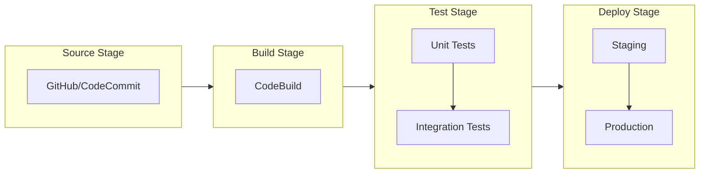

# How to Set Up CodePipeline for CI/CD

Author: [nawazdhandala](https://www.github.com/nawazdhandala)

Tags: AWS, CodePipeline, CI/CD, DevOps, CodeBuild, CodeDeploy, Automation

Description: A comprehensive guide to setting up AWS CodePipeline for continuous integration and deployment, including source integration, build stages, and deployment configurations.

---

AWS CodePipeline is a fully managed continuous delivery service that automates your release pipelines. It integrates seamlessly with other AWS services and third-party tools, making it a powerful choice for teams already invested in the AWS ecosystem.

## Understanding CodePipeline Architecture

CodePipeline orchestrates the flow of code changes through defined stages. Each stage contains one or more actions that perform tasks like building, testing, or deploying your application.



## Prerequisites

Before setting up CodePipeline, ensure you have:

- An AWS account with appropriate IAM permissions
- Source code in GitHub, CodeCommit, or S3
- A buildspec.yml file for CodeBuild
- Target infrastructure for deployment (ECS, EC2, Lambda, etc.)

## Step 1: Create IAM Roles

CodePipeline needs IAM roles to interact with other AWS services.

### Pipeline Service Role

```json
{
  "Version": "2012-10-17",
  "Statement": [
    {
      "Effect": "Allow",
      "Action": [
        "codecommit:GetBranch",
        "codecommit:GetCommit",
        "codecommit:UploadArchive",
        "codecommit:GetUploadArchiveStatus"
      ],
      "Resource": "*"
    },
    {
      "Effect": "Allow",
      "Action": [
        "codebuild:BatchGetBuilds",
        "codebuild:StartBuild"
      ],
      "Resource": "*"
    },
    {
      "Effect": "Allow",
      "Action": [
        "codedeploy:CreateDeployment",
        "codedeploy:GetDeployment",
        "codedeploy:GetDeploymentConfig",
        "codedeploy:GetApplicationRevision",
        "codedeploy:RegisterApplicationRevision"
      ],
      "Resource": "*"
    },
    {
      "Effect": "Allow",
      "Action": [
        "s3:GetObject",
        "s3:PutObject",
        "s3:GetBucketVersioning"
      ],
      "Resource": [
        "arn:aws:s3:::your-artifact-bucket",
        "arn:aws:s3:::your-artifact-bucket/*"
      ]
    }
  ]
}
```

Create the role using AWS CLI:

```bash
aws iam create-role \
  --role-name CodePipelineServiceRole \
  --assume-role-policy-document file://trust-policy.json

aws iam put-role-policy \
  --role-name CodePipelineServiceRole \
  --policy-name CodePipelinePolicy \
  --policy-document file://pipeline-policy.json
```

## Step 2: Create the Artifact Bucket

CodePipeline stores artifacts between stages in an S3 bucket:

```bash
aws s3 mb s3://my-pipeline-artifacts-$(aws sts get-caller-identity --query Account --output text)

aws s3api put-bucket-versioning \
  --bucket my-pipeline-artifacts-$(aws sts get-caller-identity --query Account --output text) \
  --versioning-configuration Status=Enabled
```

## Step 3: Configure CodeBuild

Create a buildspec.yml in your repository root:

```yaml
version: 0.2

env:
  variables:
    NODE_ENV: "production"
  parameter-store:
    DB_PASSWORD: "/myapp/db/password"

phases:
  install:
    runtime-versions:
      nodejs: 18
    commands:
      - npm ci

  pre_build:
    commands:
      - echo "Running tests..."
      - npm test
      - echo "Running linting..."
      - npm run lint

  build:
    commands:
      - echo "Building application..."
      - npm run build
      - echo "Build completed on $(date)"

  post_build:
    commands:
      - echo "Packaging artifacts..."
      - zip -r application.zip dist/ package.json

artifacts:
  files:
    - application.zip
    - appspec.yml
    - scripts/**/*
  discard-paths: no

cache:
  paths:
    - node_modules/**/*
```

Create the CodeBuild project:

```bash
aws codebuild create-project \
  --name my-app-build \
  --source type=CODEPIPELINE \
  --artifacts type=CODEPIPELINE \
  --environment type=LINUX_CONTAINER,computeType=BUILD_GENERAL1_SMALL,image=aws/codebuild/amazonlinux2-x86_64-standard:4.0 \
  --service-role arn:aws:iam::ACCOUNT_ID:role/CodeBuildServiceRole
```

## Step 4: Create the Pipeline

Use CloudFormation or the CLI to create your pipeline:

```yaml
# pipeline.yaml - CloudFormation Template
AWSTemplateFormatVersion: '2010-09-09'
Description: CI/CD Pipeline for My Application

Parameters:
  GitHubOwner:
    Type: String
    Description: GitHub repository owner
  GitHubRepo:
    Type: String
    Description: GitHub repository name
  GitHubBranch:
    Type: String
    Default: main
    Description: GitHub branch to track

Resources:
  ArtifactBucket:
    Type: AWS::S3::Bucket
    Properties:
      VersioningConfiguration:
        Status: Enabled

  CodePipeline:
    Type: AWS::CodePipeline::Pipeline
    Properties:
      Name: my-app-pipeline
      RoleArn: !GetAtt PipelineRole.Arn
      ArtifactStore:
        Type: S3
        Location: !Ref ArtifactBucket
      Stages:
        - Name: Source
          Actions:
            - Name: SourceAction
              ActionTypeId:
                Category: Source
                Owner: ThirdParty
                Provider: GitHub
                Version: '1'
              Configuration:
                Owner: !Ref GitHubOwner
                Repo: !Ref GitHubRepo
                Branch: !Ref GitHubBranch
                OAuthToken: '{{resolve:secretsmanager:github-token:SecretString:token}}'
              OutputArtifacts:
                - Name: SourceOutput

        - Name: Build
          Actions:
            - Name: BuildAction
              ActionTypeId:
                Category: Build
                Owner: AWS
                Provider: CodeBuild
                Version: '1'
              Configuration:
                ProjectName: !Ref CodeBuildProject
              InputArtifacts:
                - Name: SourceOutput
              OutputArtifacts:
                - Name: BuildOutput

        - Name: DeployStaging
          Actions:
            - Name: DeployToStaging
              ActionTypeId:
                Category: Deploy
                Owner: AWS
                Provider: ECS
                Version: '1'
              Configuration:
                ClusterName: staging-cluster
                ServiceName: my-app-staging
                FileName: imagedefinitions.json
              InputArtifacts:
                - Name: BuildOutput

        - Name: Approval
          Actions:
            - Name: ManualApproval
              ActionTypeId:
                Category: Approval
                Owner: AWS
                Provider: Manual
                Version: '1'
              Configuration:
                NotificationArn: !Ref ApprovalTopic
                CustomData: "Please review staging deployment before production"

        - Name: DeployProduction
          Actions:
            - Name: DeployToProduction
              ActionTypeId:
                Category: Deploy
                Owner: AWS
                Provider: ECS
                Version: '1'
              Configuration:
                ClusterName: production-cluster
                ServiceName: my-app-production
                FileName: imagedefinitions.json
              InputArtifacts:
                - Name: BuildOutput
```

## Step 5: Configure GitHub Connection

For GitHub repositories, use CodeStar Connections for better security:

```bash
aws codestar-connections create-connection \
  --provider-type GitHub \
  --connection-name my-github-connection
```

After creating, authorize the connection in the AWS Console.

Update your pipeline source stage to use the connection:

```yaml
- Name: Source
  Actions:
    - Name: SourceAction
      ActionTypeId:
        Category: Source
        Owner: AWS
        Provider: CodeStarSourceConnection
        Version: '1'
      Configuration:
        ConnectionArn: !Ref GitHubConnection
        FullRepositoryId: "owner/repo"
        BranchName: main
        OutputArtifactFormat: CODE_ZIP
      OutputArtifacts:
        - Name: SourceOutput
```

## Step 6: Add Notifications

Set up SNS notifications for pipeline events:

```bash
aws sns create-topic --name pipeline-notifications

aws codestar-notifications create-notification-rule \
  --name my-pipeline-notifications \
  --resource "arn:aws:codepipeline:us-east-1:ACCOUNT_ID:my-app-pipeline" \
  --detail-type FULL \
  --event-type-ids \
    codepipeline-pipeline-pipeline-execution-failed \
    codepipeline-pipeline-pipeline-execution-succeeded \
  --targets TargetType=SNS,TargetAddress=arn:aws:sns:us-east-1:ACCOUNT_ID:pipeline-notifications
```

## Common Pipeline Patterns

### Blue-Green Deployment

```yaml
- Name: DeployBlueGreen
  Actions:
    - Name: CreateChangeSet
      ActionTypeId:
        Category: Deploy
        Owner: AWS
        Provider: CloudFormation
        Version: '1'
      Configuration:
        ActionMode: CHANGE_SET_REPLACE
        StackName: my-app-stack
        ChangeSetName: my-app-changeset
        TemplatePath: BuildOutput::template.yaml
        Capabilities: CAPABILITY_IAM
      InputArtifacts:
        - Name: BuildOutput
      RunOrder: 1

    - Name: ExecuteChangeSet
      ActionTypeId:
        Category: Deploy
        Owner: AWS
        Provider: CloudFormation
        Version: '1'
      Configuration:
        ActionMode: CHANGE_SET_EXECUTE
        StackName: my-app-stack
        ChangeSetName: my-app-changeset
      RunOrder: 2
```

### Parallel Test Stages

```yaml
- Name: Test
  Actions:
    - Name: UnitTests
      ActionTypeId:
        Category: Test
        Owner: AWS
        Provider: CodeBuild
        Version: '1'
      Configuration:
        ProjectName: unit-tests
      InputArtifacts:
        - Name: BuildOutput
      RunOrder: 1

    - Name: IntegrationTests
      ActionTypeId:
        Category: Test
        Owner: AWS
        Provider: CodeBuild
        Version: '1'
      Configuration:
        ProjectName: integration-tests
      InputArtifacts:
        - Name: BuildOutput
      RunOrder: 1

    - Name: SecurityScan
      ActionTypeId:
        Category: Test
        Owner: AWS
        Provider: CodeBuild
        Version: '1'
      Configuration:
        ProjectName: security-scan
      InputArtifacts:
        - Name: BuildOutput
      RunOrder: 1
```

## Troubleshooting Common Issues

### Pipeline Stuck in InProgress

Check CloudWatch Logs for the specific action:

```bash
aws codepipeline get-pipeline-execution \
  --pipeline-name my-app-pipeline \
  --pipeline-execution-id <execution-id>
```

### Source Stage Fails

Verify GitHub connection is authorized:

```bash
aws codestar-connections list-connections
```

### Build Fails with Permission Errors

Ensure the CodeBuild service role has required permissions:

```bash
aws iam get-role-policy \
  --role-name CodeBuildServiceRole \
  --policy-name CodeBuildPolicy
```

## Best Practices

1. **Use separate pipelines for different environments** - Keep staging and production pipelines isolated
2. **Implement approval gates** - Require manual approval before production deployments
3. **Store secrets in Secrets Manager** - Never hardcode credentials in buildspec
4. **Enable pipeline artifact encryption** - Use KMS keys for sensitive data
5. **Set up comprehensive notifications** - Alert on failures immediately
6. **Use infrastructure as code** - Define pipelines in CloudFormation or Terraform

---

CodePipeline provides a robust foundation for CI/CD on AWS. Start with a simple source-build-deploy pipeline and gradually add testing stages, approval gates, and parallel deployments as your needs evolve.
