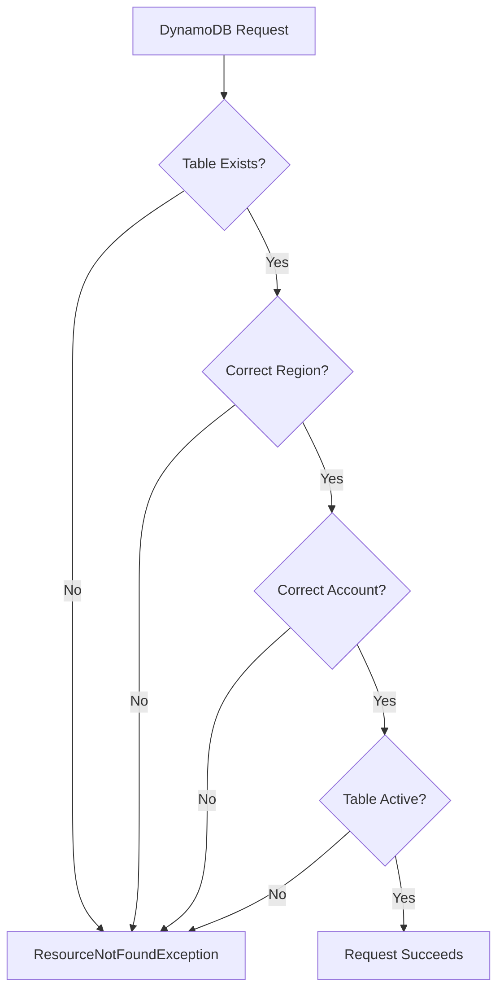

# How to Handle "Table does not exist" DynamoDB Errors

Author: [nawazdhandala](https://www.github.com/nawazdhandala)

Tags: AWS, DynamoDB, Troubleshooting, NoSQL, Database, Error Handling

Description: A practical guide to diagnosing and resolving "Table does not exist" errors in DynamoDB, covering common causes, debugging techniques, and prevention strategies.

---

The "ResourceNotFoundException: Requested resource not found" or "Table does not exist" error in DynamoDB is one of the most common issues developers encounter. While it seems straightforward, the root cause can be subtle and frustrating to debug.

## Understanding the Error

When DynamoDB cannot find the table you are trying to access, it returns:

```
ResourceNotFoundException: Requested resource not found: Table: my-table not found
```

This error can occur during any operation - reads, writes, queries, or scans.



## Common Causes and Solutions

### 1. Table Name Mismatch

The most frequent cause is a simple typo or case sensitivity issue. DynamoDB table names are case-sensitive.

```javascript
// Wrong - case mismatch
const params = {
  TableName: 'Users',  // Actual table is 'users'
  Key: { userId: '123' }
};

// Correct
const params = {
  TableName: 'users',
  Key: { userId: '123' }
};
```

**Solution:** Verify the exact table name:

```bash
aws dynamodb list-tables --region us-east-1
```

### 2. Wrong AWS Region

DynamoDB tables are region-specific. Accessing a table in the wrong region triggers this error.

```javascript
// Wrong - table exists in us-east-1, but client is configured for us-west-2
const client = new DynamoDBClient({ region: 'us-west-2' });

// Correct
const client = new DynamoDBClient({ region: 'us-east-1' });
```

**Solution:** Check which region your table exists in:

```bash
# List tables in different regions
for region in us-east-1 us-west-2 eu-west-1; do
  echo "Region: $region"
  aws dynamodb list-tables --region $region --query 'TableNames[*]' --output text
done
```

### 3. Wrong AWS Account

When working with multiple AWS accounts, your credentials might point to a different account than where the table exists.

**Solution:** Verify your current account:

```bash
aws sts get-caller-identity
```

Compare the account ID with where the table should exist.

### 4. Table Still Creating

DynamoDB tables have a creation time. Accessing a table before it becomes ACTIVE fails.

```javascript
// This might fail if the table is still being created
async function createAndUseTable() {
  await dynamodb.createTable(params).promise();

  // Error! Table might not be ready
  await dynamodb.putItem(itemParams).promise();
}
```

**Solution:** Wait for the table to become active:

```javascript
const { DynamoDBClient, CreateTableCommand, DescribeTableCommand } = require('@aws-sdk/client-dynamodb');

async function waitForTableActive(client, tableName, maxAttempts = 30) {
  for (let i = 0; i < maxAttempts; i++) {
    try {
      const response = await client.send(
        new DescribeTableCommand({ TableName: tableName })
      );

      if (response.Table.TableStatus === 'ACTIVE') {
        console.log(`Table ${tableName} is now active`);
        return true;
      }

      console.log(`Table status: ${response.Table.TableStatus}, waiting...`);
      await new Promise(resolve => setTimeout(resolve, 2000));
    } catch (error) {
      if (error.name === 'ResourceNotFoundException') {
        console.log('Table not found yet, waiting...');
        await new Promise(resolve => setTimeout(resolve, 2000));
      } else {
        throw error;
      }
    }
  }
  throw new Error(`Table ${tableName} did not become active within timeout`);
}

// Usage
await createTable(params);
await waitForTableActive(client, 'my-table');
await putItem(itemParams);
```

### 5. Environment Variable Misconfiguration

Table names often come from environment variables that differ between environments.

```javascript
// If DYNAMODB_TABLE is not set, this becomes undefined
const tableName = process.env.DYNAMODB_TABLE;

const params = {
  TableName: tableName,  // undefined -> error
  Key: { id: '123' }
};
```

**Solution:** Validate environment variables at startup:

```javascript
function validateConfig() {
  const required = ['DYNAMODB_TABLE', 'AWS_REGION'];
  const missing = required.filter(key => !process.env[key]);

  if (missing.length > 0) {
    throw new Error(`Missing required environment variables: ${missing.join(', ')}`);
  }
}

validateConfig();

const TABLE_NAME = process.env.DYNAMODB_TABLE;
```

### 6. IAM Permission Issues Masquerading as Not Found

Sometimes, insufficient IAM permissions return a "not found" error instead of "access denied" for security reasons.

**Solution:** Verify IAM permissions:

```json
{
  "Version": "2012-10-17",
  "Statement": [
    {
      "Effect": "Allow",
      "Action": [
        "dynamodb:GetItem",
        "dynamodb:PutItem",
        "dynamodb:Query",
        "dynamodb:Scan",
        "dynamodb:UpdateItem",
        "dynamodb:DeleteItem",
        "dynamodb:DescribeTable"
      ],
      "Resource": [
        "arn:aws:dynamodb:us-east-1:123456789012:table/my-table",
        "arn:aws:dynamodb:us-east-1:123456789012:table/my-table/index/*"
      ]
    }
  ]
}
```

Test permissions with a describe call:

```bash
aws dynamodb describe-table --table-name my-table --region us-east-1
```

### 7. Table Deleted or Being Deleted

If someone deleted the table or it is in DELETING status, operations will fail.

**Solution:** Check table status:

```bash
aws dynamodb describe-table --table-name my-table --region us-east-1 \
  --query 'Table.TableStatus'
```

## Robust Error Handling Pattern

Implement comprehensive error handling to provide better debugging information:

```javascript
const { DynamoDBClient, GetItemCommand } = require('@aws-sdk/client-dynamodb');

class DynamoDBService {
  constructor(tableName, region) {
    this.tableName = tableName;
    this.region = region;
    this.client = new DynamoDBClient({ region });
  }

  async getItem(key) {
    const params = {
      TableName: this.tableName,
      Key: key
    };

    try {
      const result = await this.client.send(new GetItemCommand(params));
      return result.Item;
    } catch (error) {
      if (error.name === 'ResourceNotFoundException') {
        // Provide detailed debugging information
        const debugInfo = {
          tableName: this.tableName,
          region: this.region,
          accountId: await this.getAccountId(),
          error: error.message
        };

        console.error('DynamoDB table not found. Debug info:', debugInfo);

        // Check if table exists in other regions
        await this.suggestCorrectRegion();

        throw new Error(
          `Table "${this.tableName}" not found in region "${this.region}". ` +
          `Verify table name, region, and account.`
        );
      }
      throw error;
    }
  }

  async getAccountId() {
    const { STSClient, GetCallerIdentityCommand } = require('@aws-sdk/client-sts');
    const sts = new STSClient({ region: this.region });
    const identity = await sts.send(new GetCallerIdentityCommand({}));
    return identity.Account;
  }

  async suggestCorrectRegion() {
    const regions = ['us-east-1', 'us-west-2', 'eu-west-1', 'ap-southeast-1'];

    for (const region of regions) {
      try {
        const { DynamoDBClient, ListTablesCommand } = require('@aws-sdk/client-dynamodb');
        const client = new DynamoDBClient({ region });
        const result = await client.send(new ListTablesCommand({}));

        if (result.TableNames.includes(this.tableName)) {
          console.log(`Found table "${this.tableName}" in region: ${region}`);
          return region;
        }
      } catch (e) {
        // Ignore errors, continue checking
      }
    }

    console.log(`Table "${this.tableName}" not found in common regions`);
    return null;
  }
}
```

## Prevention Strategies

### 1. Use Infrastructure as Code

Define tables in CloudFormation or Terraform to ensure consistency:

```yaml
# CloudFormation
Resources:
  UsersTable:
    Type: AWS::DynamoDB::Table
    Properties:
      TableName: !Sub '${Environment}-users'
      AttributeDefinitions:
        - AttributeName: userId
          AttributeType: S
      KeySchema:
        - AttributeName: userId
          KeyType: HASH
      BillingMode: PAY_PER_REQUEST
```

### 2. Implement Health Checks

Verify table accessibility at application startup:

```javascript
async function healthCheck() {
  const tables = [
    process.env.USERS_TABLE,
    process.env.ORDERS_TABLE,
    process.env.PRODUCTS_TABLE
  ];

  for (const tableName of tables) {
    try {
      await dynamodb.send(new DescribeTableCommand({ TableName: tableName }));
      console.log(`Table ${tableName} is accessible`);
    } catch (error) {
      console.error(`Table ${tableName} is NOT accessible:`, error.message);
      process.exit(1);
    }
  }
}

// Run at startup
healthCheck();
```

### 3. Use Table Name Constants

Centralize table name configuration:

```javascript
// config/tables.js
module.exports = {
  USERS: process.env.USERS_TABLE || 'users',
  ORDERS: process.env.ORDERS_TABLE || 'orders',
  PRODUCTS: process.env.PRODUCTS_TABLE || 'products'
};

// Usage
const { USERS } = require('./config/tables');

const params = {
  TableName: USERS,
  Key: { userId }
};
```

## Debugging Checklist

When you encounter "Table does not exist":

1. **Verify table name** - Check for typos and case sensitivity
2. **Check region** - Ensure client and table are in the same region
3. **Verify account** - Run `aws sts get-caller-identity`
4. **Check table status** - Ensure table is ACTIVE, not CREATING or DELETING
5. **Verify environment variables** - Log the actual table name being used
6. **Check IAM permissions** - Test with `dynamodb:DescribeTable`
7. **Review recent changes** - Check if table was recently deleted or renamed

---

The "Table does not exist" error usually has a simple cause, but finding it requires systematic debugging. By implementing proper error handling, validation, and infrastructure as code, you can minimize these issues and quickly resolve them when they occur.
