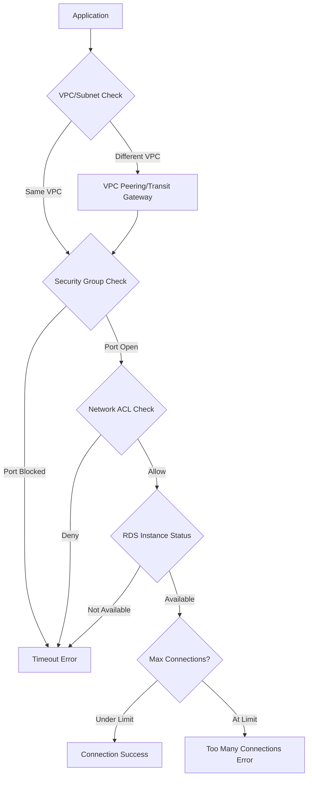

# How to Fix "Connection timeout" RDS Errors

Author: [nawazdhandala](https://www.github.com/nawazdhandala)

Tags: AWS, RDS, Database, Troubleshooting, Networking, Security Groups, Connection Pooling

Description: A practical guide to diagnosing and resolving connection timeout errors with Amazon RDS, covering network configuration, security groups, and connection pooling strategies.

---

Connection timeout errors with Amazon RDS are frustrating because they can stem from multiple sources - network configuration, security groups, database settings, or application code. This guide walks through systematic debugging and resolution strategies.

## Understanding RDS Connection Flow

Before diving into solutions, understand what happens when your application connects to RDS:



## Common Causes and Solutions

### 1. Security Group Misconfiguration

The most common cause. RDS security groups must explicitly allow inbound traffic on the database port.

**Diagnose:**

```bash
# Get RDS security group
aws rds describe-db-instances \
  --db-instance-identifier my-database \
  --query 'DBInstances[0].VpcSecurityGroups[*].VpcSecurityGroupId' \
  --output text

# Check inbound rules
aws ec2 describe-security-groups \
  --group-ids sg-xxxxxx \
  --query 'SecurityGroups[0].IpPermissions'
```

**Solution:**

```bash
# Allow access from application security group
aws ec2 authorize-security-group-ingress \
  --group-id sg-rds-security-group \
  --protocol tcp \
  --port 5432 \
  --source-group sg-application-security-group
```

CloudFormation example:

```yaml
RDSSecurityGroup:
  Type: AWS::EC2::SecurityGroup
  Properties:
    GroupDescription: RDS Security Group
    VpcId: !Ref VPC
    SecurityGroupIngress:
      - IpProtocol: tcp
        FromPort: 5432
        ToPort: 5432
        SourceSecurityGroupId: !Ref ApplicationSecurityGroup
```

### 2. Subnet and Route Table Issues

Your application and RDS must be in subnets that can communicate.

**Diagnose:**

```bash
# Get RDS subnet group
aws rds describe-db-instances \
  --db-instance-identifier my-database \
  --query 'DBInstances[0].DBSubnetGroup.Subnets[*].[SubnetIdentifier,SubnetAvailabilityZone.Name]' \
  --output table

# Check if subnets are in the same VPC
aws ec2 describe-subnets \
  --subnet-ids subnet-xxxxx \
  --query 'Subnets[*].[SubnetId,VpcId,CidrBlock]' \
  --output table
```

**For Lambda in VPC:**

Ensure Lambda is in a subnet with a route to the RDS subnet:

```yaml
LambdaFunction:
  Type: AWS::Lambda::Function
  Properties:
    VpcConfig:
      SecurityGroupIds:
        - !Ref LambdaSecurityGroup
      SubnetIds:
        - !Ref PrivateSubnet1
        - !Ref PrivateSubnet2
```

### 3. Network ACL Blocking Traffic

Network ACLs are stateless and can block return traffic even if security groups allow it.

**Diagnose:**

```bash
# Get NACL for RDS subnet
aws ec2 describe-network-acls \
  --filters "Name=association.subnet-id,Values=subnet-xxxxx" \
  --query 'NetworkAcls[0].Entries'
```

**Solution:**

Ensure both inbound and outbound rules allow the traffic:

```yaml
# Inbound rule - allow database port
- RuleNumber: 100
  Protocol: 6  # TCP
  RuleAction: allow
  CidrBlock: 10.0.0.0/16
  PortRange:
    From: 5432
    To: 5432

# Outbound rule - allow ephemeral ports for responses
- RuleNumber: 100
  Protocol: 6
  RuleAction: allow
  CidrBlock: 10.0.0.0/16
  PortRange:
    From: 1024
    To: 65535
```

### 4. RDS Instance Not Publicly Accessible

If connecting from outside AWS, ensure public accessibility is enabled.

**Diagnose:**

```bash
aws rds describe-db-instances \
  --db-instance-identifier my-database \
  --query 'DBInstances[0].PubliclyAccessible'
```

**Solution (if needed):**

```bash
aws rds modify-db-instance \
  --db-instance-identifier my-database \
  --publicly-accessible \
  --apply-immediately
```

Note: Public accessibility requires an internet gateway and public subnets. For production, use VPN or Direct Connect instead.

### 5. DNS Resolution Issues

RDS endpoints use DNS that resolves to private IPs. DNS issues cause connection failures.

**Diagnose:**

```bash
# From within VPC (EC2 instance or Lambda)
nslookup my-database.xxxxx.us-east-1.rds.amazonaws.com

# Check if endpoint resolves
dig +short my-database.xxxxx.us-east-1.rds.amazonaws.com
```

**For custom VPCs:**

Ensure DNS resolution and DNS hostnames are enabled:

```bash
aws ec2 modify-vpc-attribute \
  --vpc-id vpc-xxxxx \
  --enable-dns-support '{"Value":true}'

aws ec2 modify-vpc-attribute \
  --vpc-id vpc-xxxxx \
  --enable-dns-hostnames '{"Value":true}'
```

### 6. Connection Timeout in Application Code

The default timeout might be too short for cold starts or high latency scenarios.

**Node.js with pg:**

```javascript
const { Pool } = require('pg');

const pool = new Pool({
  host: process.env.RDS_HOSTNAME,
  port: 5432,
  database: process.env.RDS_DATABASE,
  user: process.env.RDS_USERNAME,
  password: process.env.RDS_PASSWORD,
  connectionTimeoutMillis: 10000,  // 10 seconds
  idleTimeoutMillis: 30000,
  max: 20
});
```

**Python with psycopg2:**

```python
import psycopg2
from psycopg2 import pool

connection_pool = psycopg2.pool.ThreadedConnectionPool(
    minconn=1,
    maxconn=20,
    host=os.environ['RDS_HOSTNAME'],
    database=os.environ['RDS_DATABASE'],
    user=os.environ['RDS_USERNAME'],
    password=os.environ['RDS_PASSWORD'],
    connect_timeout=10  # 10 seconds
)
```

### 7. Max Connections Exceeded

RDS instances have connection limits based on instance size.

**Diagnose:**

```sql
-- Check current connections
SELECT count(*) FROM pg_stat_activity;

-- Check max connections
SHOW max_connections;

-- See what's using connections
SELECT usename, application_name, client_addr, state, count(*)
FROM pg_stat_activity
GROUP BY usename, application_name, client_addr, state
ORDER BY count(*) DESC;
```

**Solution - Use Connection Pooling:**

Deploy RDS Proxy for serverless workloads:

```yaml
RDSProxy:
  Type: AWS::RDS::DBProxy
  Properties:
    DBProxyName: my-database-proxy
    EngineFamily: POSTGRESQL
    Auth:
      - AuthScheme: SECRETS
        SecretArn: !Ref DatabaseSecret
        IAMAuth: DISABLED
    RoleArn: !GetAtt RDSProxyRole.Arn
    VpcSecurityGroupIds:
      - !Ref RDSProxySecurityGroup
    VpcSubnetIds:
      - !Ref PrivateSubnet1
      - !Ref PrivateSubnet2

RDSProxyTargetGroup:
  Type: AWS::RDS::DBProxyTargetGroup
  Properties:
    DBProxyName: !Ref RDSProxy
    TargetGroupName: default
    DBInstanceIdentifiers:
      - !Ref Database
    ConnectionPoolConfig:
      MaxConnectionsPercent: 100
      MaxIdleConnectionsPercent: 50
      ConnectionBorrowTimeout: 120
```

### 8. SSL/TLS Configuration Issues

If SSL is required but not properly configured:

```javascript
const { Pool } = require('pg');
const fs = require('fs');

const pool = new Pool({
  host: process.env.RDS_HOSTNAME,
  ssl: {
    rejectUnauthorized: true,
    ca: fs.readFileSync('/path/to/rds-ca-2019-root.pem')
  }
});
```

Download the RDS CA certificate:

```bash
wget https://truststore.pki.rds.amazonaws.com/global/global-bundle.pem
```

## Comprehensive Debugging Script

Use this script to systematically check connectivity:

```bash
#!/bin/bash

RDS_ENDPOINT="my-database.xxxxx.us-east-1.rds.amazonaws.com"
RDS_PORT=5432

echo "=== RDS Connection Debugging ==="

# 1. DNS Resolution
echo -e "\n1. DNS Resolution:"
nslookup $RDS_ENDPOINT

# 2. TCP Connectivity
echo -e "\n2. TCP Connectivity Test:"
nc -zv $RDS_ENDPOINT $RDS_PORT -w 5 2>&1

# 3. SSL Connectivity
echo -e "\n3. SSL Handshake Test:"
echo | openssl s_client -connect $RDS_ENDPOINT:$RDS_PORT -starttls postgres 2>/dev/null | head -20

# 4. Database Connection
echo -e "\n4. Database Connection Test:"
PGPASSWORD=$RDS_PASSWORD psql -h $RDS_ENDPOINT -U $RDS_USERNAME -d $RDS_DATABASE -c "SELECT 1;" 2>&1

# 5. Connection count
echo -e "\n5. Current Connection Count:"
PGPASSWORD=$RDS_PASSWORD psql -h $RDS_ENDPOINT -U $RDS_USERNAME -d $RDS_DATABASE -c "SELECT count(*) FROM pg_stat_activity;" 2>&1
```

## Lambda-Specific Solutions

Lambda functions have unique challenges with RDS connections.

### Use RDS Proxy

```javascript
const { RDSDataClient, ExecuteStatementCommand } = require('@aws-sdk/client-rds-data');

// Connect via RDS Proxy endpoint instead of direct RDS
const client = new RDSDataClient({ region: 'us-east-1' });
```

### Reuse Connections

```javascript
// Initialize connection outside handler
let pool;

function getPool() {
  if (!pool) {
    pool = new Pool({
      host: process.env.PROXY_ENDPOINT,
      max: 1,  // Single connection per Lambda instance
      idleTimeoutMillis: 120000
    });
  }
  return pool;
}

exports.handler = async (event) => {
  const client = await getPool().connect();
  try {
    const result = await client.query('SELECT * FROM users WHERE id = $1', [event.userId]);
    return result.rows[0];
  } finally {
    client.release();
  }
};
```

## Monitoring and Alerts

Set up CloudWatch alarms for connection issues:

```yaml
DatabaseConnectionsAlarm:
  Type: AWS::CloudWatch::Alarm
  Properties:
    AlarmName: RDS-High-Connections
    MetricName: DatabaseConnections
    Namespace: AWS/RDS
    Dimensions:
      - Name: DBInstanceIdentifier
        Value: !Ref Database
    Statistic: Average
    Period: 300
    EvaluationPeriods: 2
    Threshold: 80
    ComparisonOperator: GreaterThanThreshold
    AlarmActions:
      - !Ref AlertTopic
```

---

RDS connection timeouts usually stem from network configuration issues. Start by verifying security groups, then check subnet routing, and finally review application-level timeout settings. For serverless workloads, RDS Proxy eliminates most connection management headaches and should be your default choice.
