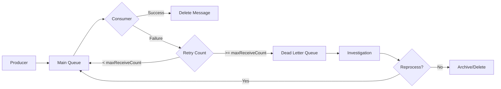

# How to Handle "Dead letter queue" SQS Messages

Author: [nawazdhandala](https://www.github.com/nawazdhandala)

Tags: AWS, SQS, Dead Letter Queue, Message Processing, Error Handling, Reliability

Description: A comprehensive guide to setting up and managing SQS dead letter queues, including message inspection, reprocessing strategies, and monitoring best practices.

---

Dead letter queues (DLQs) in Amazon SQS capture messages that fail processing after multiple attempts. Properly handling DLQ messages is critical for maintaining system reliability and ensuring no data is lost.

## Understanding Dead Letter Queues

When a message cannot be processed successfully, it moves to the DLQ after exhausting its retry attempts.



## Step 1: Create the Dead Letter Queue

Always create the DLQ first, then reference it in your main queue.

### Using AWS CLI

```bash
# Create the DLQ
aws sqs create-queue \
  --queue-name my-app-dlq \
  --attributes '{
    "MessageRetentionPeriod": "1209600",
    "VisibilityTimeout": "300"
  }'

# Get the DLQ ARN
DLQ_ARN=$(aws sqs get-queue-attributes \
  --queue-url https://sqs.us-east-1.amazonaws.com/123456789012/my-app-dlq \
  --attribute-names QueueArn \
  --query 'Attributes.QueueArn' \
  --output text)

# Create the main queue with DLQ redrive policy
aws sqs create-queue \
  --queue-name my-app-queue \
  --attributes "{
    \"RedrivePolicy\": \"{\\\"deadLetterTargetArn\\\":\\\"$DLQ_ARN\\\",\\\"maxReceiveCount\\\":\\\"3\\\"}\",
    \"VisibilityTimeout\": \"60\",
    \"MessageRetentionPeriod\": \"345600\"
  }"
```

### Using CloudFormation

```yaml
AWSTemplateFormatVersion: '2010-09-09'
Description: SQS Queue with Dead Letter Queue

Resources:
  DeadLetterQueue:
    Type: AWS::SQS::Queue
    Properties:
      QueueName: my-app-dlq
      MessageRetentionPeriod: 1209600  # 14 days
      VisibilityTimeout: 300
      Tags:
        - Key: Purpose
          Value: DLQ

  MainQueue:
    Type: AWS::SQS::Queue
    Properties:
      QueueName: my-app-queue
      VisibilityTimeout: 60
      MessageRetentionPeriod: 345600  # 4 days
      RedrivePolicy:
        deadLetterTargetArn: !GetAtt DeadLetterQueue.Arn
        maxReceiveCount: 3
      Tags:
        - Key: Purpose
          Value: Main

  # Redrive allow policy on DLQ
  DeadLetterQueuePolicy:
    Type: AWS::SQS::RedriveAllowPolicy
    Properties:
      QueueUrl: !Ref DeadLetterQueue
      RedrivePermission: byQueue
      SourceQueueArns:
        - !GetAtt MainQueue.Arn

Outputs:
  MainQueueUrl:
    Value: !Ref MainQueue
  DeadLetterQueueUrl:
    Value: !Ref DeadLetterQueue
```

## Step 2: Inspect DLQ Messages

Before reprocessing, understand why messages failed.

### View Message Count

```bash
aws sqs get-queue-attributes \
  --queue-url https://sqs.us-east-1.amazonaws.com/123456789012/my-app-dlq \
  --attribute-names ApproximateNumberOfMessages
```

### Sample Messages Without Removing

```bash
# Receive messages without deleting
aws sqs receive-message \
  --queue-url https://sqs.us-east-1.amazonaws.com/123456789012/my-app-dlq \
  --max-number-of-messages 10 \
  --attribute-names All \
  --message-attribute-names All \
  --visibility-timeout 0
```

### Inspection Script

```python
import boto3
import json
from datetime import datetime

sqs = boto3.client('sqs')
DLQ_URL = 'https://sqs.us-east-1.amazonaws.com/123456789012/my-app-dlq'

def inspect_dlq_messages(max_messages=100):
    """Inspect DLQ messages without removing them."""
    messages = []

    while len(messages) < max_messages:
        response = sqs.receive_message(
            QueueUrl=DLQ_URL,
            MaxNumberOfMessages=10,
            AttributeNames=['All'],
            MessageAttributeNames=['All'],
            VisibilityTimeout=0  # Don't hide messages
        )

        if 'Messages' not in response:
            break

        for msg in response['Messages']:
            messages.append({
                'message_id': msg['MessageId'],
                'body': json.loads(msg['Body']) if msg['Body'].startswith('{') else msg['Body'],
                'receive_count': msg['Attributes'].get('ApproximateReceiveCount'),
                'first_received': msg['Attributes'].get('ApproximateFirstReceiveTimestamp'),
                'sent_timestamp': msg['Attributes'].get('SentTimestamp'),
                'attributes': msg.get('MessageAttributes', {})
            })

    return messages

def analyze_failures(messages):
    """Group messages by failure patterns."""
    patterns = {}

    for msg in messages:
        body = msg['body']

        # Extract error type if present
        error_type = 'unknown'
        if isinstance(body, dict):
            error_type = body.get('error_type', body.get('type', 'unknown'))

        if error_type not in patterns:
            patterns[error_type] = []
        patterns[error_type].append(msg)

    return patterns

# Usage
messages = inspect_dlq_messages()
patterns = analyze_failures(messages)

for pattern, msgs in patterns.items():
    print(f"{pattern}: {len(msgs)} messages")
```

## Step 3: Reprocess Messages

### Manual Reprocessing

```python
import boto3
import json

sqs = boto3.client('sqs')
DLQ_URL = 'https://sqs.us-east-1.amazonaws.com/123456789012/my-app-dlq'
MAIN_QUEUE_URL = 'https://sqs.us-east-1.amazonaws.com/123456789012/my-app-queue'

def reprocess_messages(filter_func=None, max_messages=100):
    """Move messages from DLQ back to main queue."""
    processed = 0

    while processed < max_messages:
        response = sqs.receive_message(
            QueueUrl=DLQ_URL,
            MaxNumberOfMessages=10,
            AttributeNames=['All'],
            MessageAttributeNames=['All'],
            VisibilityTimeout=300
        )

        if 'Messages' not in response:
            break

        for msg in response['Messages']:
            # Apply filter if provided
            if filter_func and not filter_func(msg):
                # Return message to queue
                sqs.change_message_visibility(
                    QueueUrl=DLQ_URL,
                    ReceiptHandle=msg['ReceiptHandle'],
                    VisibilityTimeout=0
                )
                continue

            # Send to main queue
            sqs.send_message(
                QueueUrl=MAIN_QUEUE_URL,
                MessageBody=msg['Body'],
                MessageAttributes=msg.get('MessageAttributes', {})
            )

            # Delete from DLQ
            sqs.delete_message(
                QueueUrl=DLQ_URL,
                ReceiptHandle=msg['ReceiptHandle']
            )

            processed += 1
            print(f"Reprocessed message: {msg['MessageId']}")

    return processed

# Reprocess all messages
reprocess_messages()

# Reprocess only specific messages
def only_order_messages(msg):
    body = json.loads(msg['Body'])
    return body.get('type') == 'order'

reprocess_messages(filter_func=only_order_messages)
```

### Using AWS Console Redrive

AWS provides a built-in redrive feature:

```bash
# Start redrive
aws sqs start-message-move-task \
  --source-arn arn:aws:sqs:us-east-1:123456789012:my-app-dlq \
  --destination-arn arn:aws:sqs:us-east-1:123456789012:my-app-queue \
  --max-number-of-messages-per-second 100

# Check redrive status
aws sqs list-message-move-tasks \
  --source-arn arn:aws:sqs:us-east-1:123456789012:my-app-dlq
```

## Step 4: Fix and Reprocess Pattern

Sometimes you need to modify messages before reprocessing.

```python
def fix_and_reprocess(transform_func, max_messages=100):
    """Transform messages before reprocessing."""
    processed = 0

    while processed < max_messages:
        response = sqs.receive_message(
            QueueUrl=DLQ_URL,
            MaxNumberOfMessages=10,
            VisibilityTimeout=300
        )

        if 'Messages' not in response:
            break

        for msg in response['Messages']:
            original_body = json.loads(msg['Body'])

            # Apply transformation
            try:
                fixed_body = transform_func(original_body)
            except Exception as e:
                print(f"Failed to transform message {msg['MessageId']}: {e}")
                continue

            # Send fixed message to main queue
            sqs.send_message(
                QueueUrl=MAIN_QUEUE_URL,
                MessageBody=json.dumps(fixed_body)
            )

            # Delete original from DLQ
            sqs.delete_message(
                QueueUrl=DLQ_URL,
                ReceiptHandle=msg['ReceiptHandle']
            )

            processed += 1

    return processed

# Example: Fix missing required field
def add_missing_timestamp(body):
    if 'timestamp' not in body:
        body['timestamp'] = datetime.utcnow().isoformat()
    return body

fix_and_reprocess(add_missing_timestamp)
```

## Step 5: Set Up Monitoring and Alerts

### CloudWatch Alarms

```yaml
DLQMessagesAlarm:
  Type: AWS::CloudWatch::Alarm
  Properties:
    AlarmName: SQS-DLQ-Messages-Present
    AlarmDescription: Messages in dead letter queue
    MetricName: ApproximateNumberOfMessagesVisible
    Namespace: AWS/SQS
    Dimensions:
      - Name: QueueName
        Value: my-app-dlq
    Statistic: Sum
    Period: 300
    EvaluationPeriods: 1
    Threshold: 1
    ComparisonOperator: GreaterThanOrEqualToThreshold
    AlarmActions:
      - !Ref AlertTopic

DLQHighVolumeAlarm:
  Type: AWS::CloudWatch::Alarm
  Properties:
    AlarmName: SQS-DLQ-High-Volume
    AlarmDescription: High volume of DLQ messages
    MetricName: ApproximateNumberOfMessagesVisible
    Namespace: AWS/SQS
    Dimensions:
      - Name: QueueName
        Value: my-app-dlq
    Statistic: Sum
    Period: 300
    EvaluationPeriods: 1
    Threshold: 100
    ComparisonOperator: GreaterThanOrEqualToThreshold
    AlarmActions:
      - !Ref AlertTopic
```

### Lambda for Automatic DLQ Processing

```javascript
const { SQSClient, ReceiveMessageCommand, DeleteMessageCommand, SendMessageCommand } = require('@aws-sdk/client-sqs');
const { SNSClient, PublishCommand } = require('@aws-sdk/client-sns');

const sqs = new SQSClient({});
const sns = new SNSClient({});

const DLQ_URL = process.env.DLQ_URL;
const MAIN_QUEUE_URL = process.env.MAIN_QUEUE_URL;
const ALERT_TOPIC = process.env.ALERT_TOPIC;

exports.handler = async (event) => {
  // Triggered by CloudWatch Events on schedule or alarm

  const messages = [];
  let hasMore = true;

  while (hasMore && messages.length < 100) {
    const response = await sqs.send(new ReceiveMessageCommand({
      QueueUrl: DLQ_URL,
      MaxNumberOfMessages: 10,
      AttributeNames: ['All'],
      VisibilityTimeout: 300
    }));

    if (!response.Messages || response.Messages.length === 0) {
      hasMore = false;
    } else {
      messages.push(...response.Messages);
    }
  }

  if (messages.length === 0) {
    return { status: 'No messages in DLQ' };
  }

  // Analyze messages
  const analysis = analyzeMessages(messages);

  // Send alert
  await sns.send(new PublishCommand({
    TopicArn: ALERT_TOPIC,
    Subject: `DLQ Alert: ${messages.length} messages pending`,
    Message: JSON.stringify(analysis, null, 2)
  }));

  // Auto-retry if error is transient
  let retried = 0;
  for (const msg of messages) {
    if (isTransientError(msg)) {
      await sqs.send(new SendMessageCommand({
        QueueUrl: MAIN_QUEUE_URL,
        MessageBody: msg.Body,
        DelaySeconds: 60  // Delay retry by 1 minute
      }));

      await sqs.send(new DeleteMessageCommand({
        QueueUrl: DLQ_URL,
        ReceiptHandle: msg.ReceiptHandle
      }));

      retried++;
    }
  }

  return {
    totalMessages: messages.length,
    autoRetried: retried,
    analysis
  };
};

function analyzeMessages(messages) {
  const byError = {};

  for (const msg of messages) {
    const body = JSON.parse(msg.Body);
    const errorType = body.error?.type || 'unknown';

    if (!byError[errorType]) {
      byError[errorType] = 0;
    }
    byError[errorType]++;
  }

  return byError;
}

function isTransientError(msg) {
  const body = JSON.parse(msg.Body);
  const transientErrors = ['timeout', 'rate_limit', 'service_unavailable'];
  return transientErrors.includes(body.error?.type);
}
```

## Step 6: Implement Proper Error Handling in Consumers

Prevent messages from reaching the DLQ unnecessarily.

```javascript
const { SQSClient, DeleteMessageCommand, ChangeMessageVisibilityCommand } = require('@aws-sdk/client-sqs');

const sqs = new SQSClient({});

exports.handler = async (event) => {
  const failures = [];

  for (const record of event.Records) {
    try {
      await processMessage(record);
    } catch (error) {
      console.error(`Error processing message ${record.messageId}:`, error);

      if (isRetryableError(error)) {
        // Extend visibility timeout for retry
        await sqs.send(new ChangeMessageVisibilityCommand({
          QueueUrl: getQueueUrl(record.eventSourceARN),
          ReceiptHandle: record.receiptHandle,
          VisibilityTimeout: 300
        }));

        failures.push({
          itemIdentifier: record.messageId
        });
      } else {
        // Non-retryable error - let it go to DLQ
        console.error('Non-retryable error, message will go to DLQ');
        failures.push({
          itemIdentifier: record.messageId
        });
      }
    }
  }

  // Return partial batch failure response
  return {
    batchItemFailures: failures
  };
};

function isRetryableError(error) {
  const retryableCodes = [
    'ETIMEDOUT',
    'ECONNRESET',
    'ServiceUnavailable',
    'ThrottlingException'
  ];

  return retryableCodes.some(code =>
    error.code === code || error.message?.includes(code)
  );
}
```

## Best Practices

1. **Set appropriate maxReceiveCount** - Usually 3-5 for most workloads
2. **Configure longer retention on DLQ** - 14 days gives time for investigation
3. **Monitor DLQ depth** - Alert when messages start accumulating
4. **Include error context** - Add error details to message attributes
5. **Automate transient failure retries** - Reduce manual intervention
6. **Archive before deleting** - Store DLQ messages in S3 for audit trails

---

Dead letter queues are essential for building reliable message-driven systems. Set them up from the start, monitor them continuously, and have clear procedures for investigating and reprocessing failed messages. The goal is to never lose a message while maintaining visibility into system failures.
