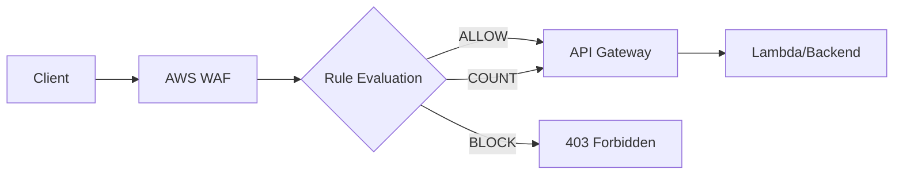

# How to Configure WAF Rules for API Gateway

Author: [nawazdhandala](https://www.github.com/nawazdhandala)

Tags: AWS, WAF, API Gateway, Security, Web Application Firewall, Rate Limiting, DDoS Protection

Description: A comprehensive guide to configuring AWS WAF rules for API Gateway, including rate limiting, SQL injection protection, geo-blocking, and custom rule creation.

---

AWS WAF (Web Application Firewall) protects your API Gateway endpoints from common web exploits. Properly configured WAF rules can prevent SQL injection, cross-site scripting (XSS), DDoS attacks, and unauthorized access patterns.

## Understanding WAF Architecture

WAF sits between your users and API Gateway, inspecting every request before it reaches your API.



## Step 1: Create a Web ACL

A Web ACL (Access Control List) is the container for your WAF rules.

```bash
aws wafv2 create-web-acl \
  --name api-gateway-waf \
  --scope REGIONAL \
  --default-action Allow={} \
  --visibility-config SampledRequestsEnabled=true,CloudWatchMetricsEnabled=true,MetricName=ApiGatewayWAF \
  --rules file://rules.json \
  --region us-east-1
```

Or using CloudFormation:

```yaml
AWSTemplateFormatVersion: '2010-09-09'
Description: WAF Configuration for API Gateway

Resources:
  ApiGatewayWebACL:
    Type: AWS::WAFv2::WebACL
    Properties:
      Name: api-gateway-waf
      Scope: REGIONAL
      DefaultAction:
        Allow: {}
      VisibilityConfig:
        SampledRequestsEnabled: true
        CloudWatchMetricsEnabled: true
        MetricName: ApiGatewayWAF
      Rules:
        - Name: AWSManagedRulesCommonRuleSet
          Priority: 1
          OverrideAction:
            None: {}
          Statement:
            ManagedRuleGroupStatement:
              VendorName: AWS
              Name: AWSManagedRulesCommonRuleSet
          VisibilityConfig:
            SampledRequestsEnabled: true
            CloudWatchMetricsEnabled: true
            MetricName: CommonRuleSet
```

## Step 2: Add AWS Managed Rules

AWS provides pre-configured rule sets for common threats:

### Common Rule Set (Core Protection)

```yaml
- Name: AWSManagedRulesCommonRuleSet
  Priority: 1
  OverrideAction:
    None: {}
  Statement:
    ManagedRuleGroupStatement:
      VendorName: AWS
      Name: AWSManagedRulesCommonRuleSet
      ExcludedRules:
        - Name: SizeRestrictions_BODY  # Exclude if you need large payloads
  VisibilityConfig:
    SampledRequestsEnabled: true
    CloudWatchMetricsEnabled: true
    MetricName: CommonRules
```

### SQL Injection Protection

```yaml
- Name: AWSManagedRulesSQLiRuleSet
  Priority: 2
  OverrideAction:
    None: {}
  Statement:
    ManagedRuleGroupStatement:
      VendorName: AWS
      Name: AWSManagedRulesSQLiRuleSet
  VisibilityConfig:
    SampledRequestsEnabled: true
    CloudWatchMetricsEnabled: true
    MetricName: SQLiRules
```

### Known Bad Inputs

```yaml
- Name: AWSManagedRulesKnownBadInputsRuleSet
  Priority: 3
  OverrideAction:
    None: {}
  Statement:
    ManagedRuleGroupStatement:
      VendorName: AWS
      Name: AWSManagedRulesKnownBadInputsRuleSet
  VisibilityConfig:
    SampledRequestsEnabled: true
    CloudWatchMetricsEnabled: true
    MetricName: KnownBadInputs
```

## Step 3: Configure Rate Limiting

Protect your API from abuse with rate-based rules:

### Basic Rate Limiting

```yaml
- Name: RateLimitRule
  Priority: 4
  Action:
    Block: {}
  Statement:
    RateBasedStatement:
      Limit: 2000  # Requests per 5-minute period
      AggregateKeyType: IP
  VisibilityConfig:
    SampledRequestsEnabled: true
    CloudWatchMetricsEnabled: true
    MetricName: RateLimit
```

### Rate Limiting by API Key

```yaml
- Name: RateLimitByApiKey
  Priority: 5
  Action:
    Block: {}
  Statement:
    RateBasedStatement:
      Limit: 1000
      AggregateKeyType: CUSTOM_KEYS
      CustomKeys:
        - Header:
            Name: x-api-key
            TextTransformations:
              - Priority: 0
                Type: NONE
  VisibilityConfig:
    SampledRequestsEnabled: true
    CloudWatchMetricsEnabled: true
    MetricName: RateLimitByApiKey
```

### Endpoint-Specific Rate Limiting

```yaml
- Name: LoginRateLimit
  Priority: 6
  Action:
    Block: {}
  Statement:
    RateBasedStatement:
      Limit: 100  # Stricter limit for login endpoint
      AggregateKeyType: IP
      ScopeDownStatement:
        ByteMatchStatement:
          SearchString: /auth/login
          FieldToMatch:
            UriPath: {}
          TextTransformations:
            - Priority: 0
              Type: LOWERCASE
          PositionalConstraint: CONTAINS
  VisibilityConfig:
    SampledRequestsEnabled: true
    CloudWatchMetricsEnabled: true
    MetricName: LoginRateLimit
```

## Step 4: Geo-Blocking Rules

Restrict access by country:

```yaml
- Name: GeoBlockRule
  Priority: 7
  Action:
    Block:
      CustomResponse:
        ResponseCode: 403
        CustomResponseBodyKey: geo-blocked
  Statement:
    GeoMatchStatement:
      CountryCodes:
        - RU
        - CN
        - KP
  VisibilityConfig:
    SampledRequestsEnabled: true
    CloudWatchMetricsEnabled: true
    MetricName: GeoBlock

CustomResponseBodies:
  geo-blocked:
    ContentType: APPLICATION_JSON
    Content: '{"error": "Access denied from your region"}'
```

### Allow Only Specific Countries

```yaml
- Name: GeoAllowRule
  Priority: 8
  Action:
    Block: {}
  Statement:
    NotStatement:
      Statement:
        GeoMatchStatement:
          CountryCodes:
            - US
            - CA
            - GB
            - DE
  VisibilityConfig:
    SampledRequestsEnabled: true
    CloudWatchMetricsEnabled: true
    MetricName: GeoAllow
```

## Step 5: Custom Rules for API Protection

### Block Requests Without Required Headers

```yaml
- Name: RequireApiKey
  Priority: 9
  Action:
    Block:
      CustomResponse:
        ResponseCode: 401
        CustomResponseBodyKey: missing-api-key
  Statement:
    NotStatement:
      Statement:
        ByteMatchStatement:
          SearchString: ""
          FieldToMatch:
            SingleHeader:
              Name: x-api-key
          TextTransformations:
            - Priority: 0
              Type: NONE
          PositionalConstraint: CONTAINS
  VisibilityConfig:
    SampledRequestsEnabled: true
    CloudWatchMetricsEnabled: true
    MetricName: RequireApiKey
```

### Block Large Payloads

```yaml
- Name: BlockLargePayloads
  Priority: 10
  Action:
    Block: {}
  Statement:
    SizeConstraintStatement:
      FieldToMatch:
        Body:
          OversizeHandling: MATCH
      ComparisonOperator: GT
      Size: 10240  # 10KB
      TextTransformations:
        - Priority: 0
          Type: NONE
  VisibilityConfig:
    SampledRequestsEnabled: true
    CloudWatchMetricsEnabled: true
    MetricName: LargePayloads
```

### IP Whitelist for Admin Endpoints

```yaml
- Name: AdminIPWhitelist
  Priority: 0  # Highest priority
  Action:
    Allow: {}
  Statement:
    AndStatement:
      Statements:
        - ByteMatchStatement:
            SearchString: /admin
            FieldToMatch:
              UriPath: {}
            TextTransformations:
              - Priority: 0
                Type: LOWERCASE
            PositionalConstraint: STARTS_WITH
        - IPSetReferenceStatement:
            Arn: !GetAtt AdminIPSet.Arn
  VisibilityConfig:
    SampledRequestsEnabled: true
    CloudWatchMetricsEnabled: true
    MetricName: AdminWhitelist

AdminIPSet:
  Type: AWS::WAFv2::IPSet
  Properties:
    Name: admin-ips
    Scope: REGIONAL
    IPAddressVersion: IPV4
    Addresses:
      - 203.0.113.0/24
      - 198.51.100.0/24
```

## Step 6: Associate WAF with API Gateway

```bash
# Get the API Gateway ARN
API_ARN="arn:aws:apigateway:us-east-1::/restapis/abc123/stages/prod"

# Associate WAF with API Gateway
aws wafv2 associate-web-acl \
  --web-acl-arn arn:aws:wafv2:us-east-1:123456789012:regional/webacl/api-gateway-waf/abc123 \
  --resource-arn $API_ARN \
  --region us-east-1
```

CloudFormation association:

```yaml
WebACLAssociation:
  Type: AWS::WAFv2::WebACLAssociation
  Properties:
    ResourceArn: !Sub 'arn:aws:apigateway:${AWS::Region}::/restapis/${ApiGateway}/stages/prod'
    WebACLArn: !GetAtt ApiGatewayWebACL.Arn
```

## Step 7: Enable Logging

Configure WAF logging for debugging and compliance:

```yaml
WAFLogConfig:
  Type: AWS::WAFv2::LoggingConfiguration
  Properties:
    ResourceArn: !GetAtt ApiGatewayWebACL.Arn
    LogDestinationConfigs:
      - !Sub 'arn:aws:firehose:${AWS::Region}:${AWS::AccountId}:deliverystream/aws-waf-logs-api-gateway'
    LoggingFilter:
      DefaultBehavior: DROP
      Filters:
        - Behavior: KEEP
          Conditions:
            - ActionCondition:
                Action: BLOCK
          Requirement: MEETS_ANY
```

Query blocked requests in CloudWatch Logs Insights:

```sql
fields @timestamp, httpRequest.clientIp, httpRequest.uri, action, terminatingRuleId
| filter action = "BLOCK"
| sort @timestamp desc
| limit 100
```

## Testing WAF Rules

### Test SQL Injection Protection

```bash
# This should be blocked
curl -X POST "https://api.example.com/search" \
  -H "Content-Type: application/json" \
  -d '{"query": "1 OR 1=1; DROP TABLE users;--"}'
```

### Test Rate Limiting

```bash
# Send many requests quickly
for i in {1..100}; do
  curl -s -o /dev/null -w "%{http_code}\n" "https://api.example.com/api/test"
done
```

### Test Geo-Blocking

Use a VPN or proxy to test from blocked regions, or temporarily add your country to the block list.

## Common Issues and Solutions

### False Positives

If legitimate requests are being blocked:

1. Check CloudWatch metrics for which rule is triggering
2. Add specific exclusions to managed rules
3. Use COUNT action first to test before blocking

```yaml
# Use COUNT instead of blocking to test
OverrideAction:
  Count: {}
```

### Performance Impact

WAF adds minimal latency (typically 1-2ms). If you notice issues:

1. Reduce the number of rules
2. Order rules by likelihood of matching (most common first)
3. Use rule groups to organize related rules

---

AWS WAF provides essential protection for your API Gateway endpoints. Start with AWS managed rules for baseline protection, then add custom rules for your specific requirements. Always test new rules in COUNT mode before enabling blocking, and monitor your WAF metrics to identify and address false positives.
