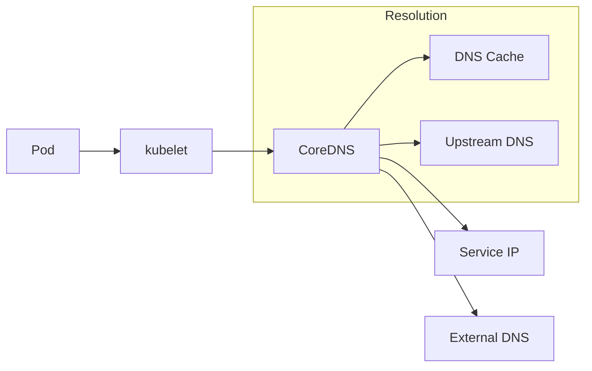

# How to Debug Kubernetes DNS Issues

Author: [nawazdhandala](https://www.github.com/nawazdhandala)

Tags: Kubernetes, DNS, Networking, Troubleshooting, CoreDNS, DevOps

Description: A systematic guide to diagnosing and fixing Kubernetes DNS problems, from basic resolution failures to advanced CoreDNS tuning.

---

DNS issues in Kubernetes are frustrating because they manifest as vague errors - timeouts, connection refused, "unknown host." This guide gives you a systematic approach to find and fix DNS problems fast.

## How Kubernetes DNS Works

This diagram illustrates the DNS resolution flow in Kubernetes. When a pod needs to resolve a name, the request flows through kubelet to CoreDNS, which either serves from cache, resolves cluster-internal names, or forwards to upstream DNS for external domains.



CoreDNS runs as pods in `kube-system` and serves DNS for:
- **Service discovery**: `service-name.namespace.svc.cluster.local`
- **Pod DNS**: `pod-ip.namespace.pod.cluster.local`
- **External names**: Forward to upstream DNS

## Quick DNS Health Check

These three commands give you a rapid assessment of your cluster's DNS health. Run them in sequence to identify whether CoreDNS is running, reachable, and resolving names correctly.

```bash
# Check CoreDNS pods are running - should show Running status
kubectl get pods -n kube-system -l k8s-app=kube-dns

# Check CoreDNS service exists and has a ClusterIP assigned
kubectl get svc -n kube-system kube-dns

# Test actual DNS resolution from inside the cluster
# This creates a temporary pod, runs nslookup, and cleans up automatically
kubectl run dnstest --rm -it --image=busybox:1.28 --restart=Never -- nslookup kubernetes.default
```

If the last command fails, you have a DNS problem.

## Step 1: Verify CoreDNS Is Running

Start troubleshooting by confirming CoreDNS pods are healthy. These commands show pod status, recent events, and any error messages in the logs.

```bash
# Check pod status with node placement information
# Look for Running status and 1/1 Ready
kubectl get pods -n kube-system -l k8s-app=kube-dns -o wide

# Check for restarts or errors in pod events
# High restart counts indicate instability
kubectl describe pods -n kube-system -l k8s-app=kube-dns

# Check recent logs for error messages
# Common issues will appear here
kubectl logs -n kube-system -l k8s-app=kube-dns --tail=100
```

Common issues in logs:
- `connection refused` - Upstream DNS unreachable
- `SERVFAIL` - DNS query failed
- `i/o timeout` - Network connectivity issues

## Step 2: Test DNS from Inside a Pod

Testing from inside the cluster gives you the same perspective as your application pods. This debug pod includes all the DNS diagnostic tools you need.

```bash
# Create a debug pod with DNS tools (dig, nslookup, host)
# The --rm flag ensures cleanup after exit
kubectl run dnsutils --rm -it --image=tutum/dnsutils --restart=Never -- bash
```

Inside the pod:

These commands progressively test different aspects of DNS resolution. Start with cluster-internal resolution, then test external, and finally examine the configuration.

```bash
# Test internal service resolution using the full FQDN
# This should return the kubernetes API server ClusterIP
nslookup kubernetes.default.svc.cluster.local

# Test with explicit DNS server IP (useful if resolv.conf is wrong)
# Replace 10.96.0.10 with your actual kube-dns ClusterIP
nslookup kubernetes.default.svc.cluster.local 10.96.0.10

# Test external resolution to verify upstream forwarding works
nslookup google.com

# Check DNS configuration - verify nameserver and search domains
cat /etc/resolv.conf

# Detailed DNS query showing full resolution path
# The +search flag uses the search domains from resolv.conf
dig +search kubernetes.default

# Test with timeout to check for slow responses
# Should complete in under 1 second normally
timeout 5 nslookup kubernetes.default
```

## Step 3: Check Pod DNS Configuration

Examine the DNS configuration of a problematic pod. Incorrect resolv.conf settings are a common cause of DNS failures.

```bash
# Check resolv.conf in a problematic pod
# Replace <pod-name> with the actual pod name
kubectl exec -it <pod-name> -- cat /etc/resolv.conf
```

Expected output:
```
nameserver 10.96.0.10
search default.svc.cluster.local svc.cluster.local cluster.local
options ndots:5
```

### Common resolv.conf Issues

**Wrong nameserver IP:**

If the nameserver IP doesn't match your CoreDNS service, DNS queries will fail. This command retrieves the correct IP.

```bash
# Find correct CoreDNS ClusterIP - this should match the nameserver in resolv.conf
kubectl get svc -n kube-system kube-dns -o jsonpath='{.spec.clusterIP}'
```

**Missing search domains:**
DNS won't resolve short names like `my-service` without proper search domains.

**ndots too high/low:**
- `ndots:5` means names with fewer than 5 dots search local domains first
- Lower values cause external lookups for internal names

## Step 4: Test DNS Service Connectivity

If DNS resolution fails, verify network connectivity to the DNS service. These tests check whether pods can actually reach CoreDNS on both TCP and UDP.

```bash
# Test TCP connectivity to DNS (port 53)
# Should show "open" if network path is clear
kubectl run nettest --rm -it --image=busybox --restart=Never -- \
  nc -vz 10.96.0.10 53

# Test UDP connectivity (DNS primarily uses UDP)
# UDP issues often cause intermittent failures
kubectl run nettest --rm -it --image=busybox --restart=Never -- \
  nc -vzu 10.96.0.10 53
```

If TCP works but UDP doesn't, you have a network policy or firewall issue.

## Step 5: Check CoreDNS Configuration

Review the CoreDNS Corefile to understand how DNS queries are handled. Misconfigurations here affect all cluster DNS resolution.

```bash
# View CoreDNS ConfigMap containing the Corefile
kubectl get configmap coredns -n kube-system -o yaml
```

Default Corefile:

This is a typical CoreDNS configuration. Each plugin handles a specific aspect of DNS resolution.

```
.:53 {
    errors                           # Log errors to stdout
    health {                         # Health check endpoint
       lameduck 5s                   # Graceful shutdown delay
    }
    ready                            # Readiness probe endpoint at :8181
    kubernetes cluster.local in-addr.arpa ip6.arpa {
       pods insecure                 # Allow pod DNS lookups
       fallthrough in-addr.arpa ip6.arpa  # Pass reverse lookups through
       ttl 30                        # Cache TTL for cluster DNS
    }
    prometheus :9153                 # Metrics endpoint for monitoring
    forward . /etc/resolv.conf {    # Forward external queries to upstream
       max_concurrent 1000           # Limit concurrent upstream queries
    }
    cache 30                         # Cache all responses for 30 seconds
    loop                             # Detect and break forwarding loops
    reload                           # Auto-reload config on changes
    loadbalance                      # Round-robin A/AAAA records
}
```

### Critical Directives

- **kubernetes**: Handles cluster DNS
- **forward**: Forwards external queries to upstream
- **cache**: DNS caching (increase for performance)
- **loop**: Detects forwarding loops

## Step 6: Debug Specific Issues

### Issue: "Could not resolve host"

When a specific hostname fails to resolve, verify that the service exists and has endpoints. Missing endpoints are a common cause.

```bash
# Test the exact failing name to see the error message
kubectl exec -it <pod> -- nslookup <failing-hostname>

# Check if service exists in the expected namespace
kubectl get svc <service-name> -n <namespace>

# Check endpoints - if empty, no pods match the service selector
kubectl get endpoints <service-name> -n <namespace>
```

### Issue: Slow DNS Resolution

Slow DNS can cause application timeouts. These commands help identify whether the issue is with CoreDNS capacity or upstream resolution.

```bash
# Time DNS queries to measure actual latency
# Should be under 10ms for cluster-internal names
kubectl exec -it <pod> -- time nslookup kubernetes.default

# Check CoreDNS metrics for performance data
# Forward prometheus port to access metrics locally
kubectl port-forward -n kube-system svc/kube-dns 9153:9153
curl localhost:9153/metrics | grep coredns_dns_request_duration
```

Fixes for slow DNS:
1. Increase CoreDNS replicas
2. Increase cache TTL
3. Add node-local DNS cache

### Issue: External DNS Not Working

When pods can resolve cluster services but not external domains, the problem is usually with upstream DNS forwarding.

```bash
# Check what upstream DNS CoreDNS is using
kubectl exec -n kube-system -it <coredns-pod> -- cat /etc/resolv.conf

# Test external resolution directly from CoreDNS pod
# Bypasses the forward configuration to test upstream directly
kubectl exec -n kube-system -it <coredns-pod> -- nslookup google.com 8.8.8.8
```

Fix: Update forward directive in Corefile:

If the node's resolv.conf is misconfigured, explicitly set reliable upstream DNS servers.

```
forward . 8.8.8.8 8.8.4.4 {
   max_concurrent 1000
}
```

### Issue: Intermittent DNS Failures

Usually caused by:
1. **UDP packet loss** - Add TCP fallback
2. **Race condition** - Known conntrack issue in older kernels
3. **CoreDNS overloaded** - Scale up or add caching

Fix for conntrack race condition (kernel < 5.9):

This DNS configuration option works around a known Linux kernel bug that causes DNS lookup failures when both A and AAAA queries are sent simultaneously.

```yaml
# Add to pod spec to work around conntrack race condition
dnsConfig:
  options:
    - name: single-request-reopen  # Serialize A and AAAA lookups
```

Or use NodeLocal DNSCache (recommended).

## Step 7: Scale and Optimize CoreDNS

### Increase Replicas

If CoreDNS is overloaded, scaling horizontally distributes the query load across more pods.

```bash
# Scale CoreDNS to 3 replicas for higher availability and throughput
kubectl scale deployment coredns -n kube-system --replicas=3
```

### Add Horizontal Pod Autoscaler

Automatic scaling ensures CoreDNS capacity matches demand. This HPA configuration scales based on CPU utilization.

```yaml
# HPA automatically scales CoreDNS based on CPU usage
apiVersion: autoscaling/v2
kind: HorizontalPodAutoscaler
metadata:
  name: coredns
  namespace: kube-system
spec:
  scaleTargetRef:
    apiVersion: apps/v1
    kind: Deployment
    name: coredns
  minReplicas: 2        # Always keep at least 2 for HA
  maxReplicas: 10       # Cap maximum replicas
  metrics:
    - type: Resource
      resource:
        name: cpu
        target:
          type: Utilization
          averageUtilization: 70  # Scale up at 70% CPU
```

### Increase Cache Size

Longer cache TTL reduces upstream queries and improves response times for frequently accessed names.

```yaml
# Edit CoreDNS ConfigMap to increase cache duration
cache 300  # 5 minutes instead of 30 seconds
```

### Deploy NodeLocal DNSCache

NodeLocal DNS runs a caching DNS agent on each node, dramatically reducing latency and CoreDNS load.

NodeLocal DNSCache runs a DNS caching agent on every node. This eliminates cross-node DNS traffic and provides sub-millisecond response times for cached queries.

```bash
# Install NodeLocal DNSCache daemonset
# This deploys a DNS cache pod on every node
kubectl apply -f https://raw.githubusercontent.com/kubernetes/kubernetes/master/cluster/addons/dns/nodelocaldns/nodelocaldns.yaml
```

Update kubelet to use local cache:

After deploying NodeLocal DNSCache, configure kubelet to use the local cache IP instead of the CoreDNS ClusterIP.

```yaml
# /var/lib/kubelet/config.yaml
clusterDNS:
  - 169.254.20.10  # NodeLocal DNS IP (link-local address)
```

## Step 8: Network Policy Considerations

If you use Network Policies, ensure DNS traffic is allowed:

This NetworkPolicy explicitly allows all pods in the namespace to reach CoreDNS. Without this, strict network policies can block DNS resolution.

```yaml
# NetworkPolicy to allow DNS egress traffic
apiVersion: networking.k8s.io/v1
kind: NetworkPolicy
metadata:
  name: allow-dns
  namespace: default
spec:
  podSelector: {}           # Apply to all pods in namespace
  policyTypes:
    - Egress
  egress:
    - to:
        - namespaceSelector:
            matchLabels:
              kubernetes.io/metadata.name: kube-system  # Target kube-system namespace
          podSelector:
            matchLabels:
              k8s-app: kube-dns  # Target CoreDNS pods
      ports:
        - protocol: UDP
          port: 53           # Standard DNS port (UDP)
        - protocol: TCP
          port: 53           # DNS over TCP (for large responses)
```

## Step 9: Custom DNS Configuration

### Per-Pod DNS Config

For special cases, you can override DNS settings at the pod level. This is useful for pods that need custom nameservers or search domains.

```yaml
apiVersion: v1
kind: Pod
metadata:
  name: custom-dns-pod
spec:
  dnsPolicy: "None"          # Ignore cluster DNS, use only dnsConfig
  dnsConfig:
    nameservers:
      - 10.96.0.10           # Primary: cluster DNS
      - 8.8.8.8              # Fallback: Google DNS
    searches:
      - default.svc.cluster.local
      - svc.cluster.local
      - cluster.local
    options:
      - name: ndots
        value: "2"           # Lower ndots for faster external lookups
      - name: timeout
        value: "3"           # 3 second timeout per query
      - name: attempts
        value: "2"           # Retry failed queries twice
  containers:
    - name: app
      image: nginx
```

### DNS Policy Options

- `ClusterFirst` (default): Use cluster DNS, fall back to upstream
- `ClusterFirstWithHostNet`: Same as above for hostNetwork pods
- `Default`: Use node's DNS
- `None`: Use only dnsConfig settings

## Troubleshooting Checklist

This script automates the key DNS diagnostic checks. Run it to quickly assess your cluster's DNS health and identify common problems.

```bash
#!/bin/bash
# Automated DNS troubleshooting script for Kubernetes
# Run this to quickly diagnose DNS issues

echo "=== CoreDNS Pods ==="
kubectl get pods -n kube-system -l k8s-app=kube-dns -o wide

echo -e "\n=== CoreDNS Service ==="
kubectl get svc -n kube-system kube-dns

echo -e "\n=== CoreDNS Endpoints ==="
# Empty endpoints means CoreDNS pods aren't healthy
kubectl get endpoints -n kube-system kube-dns

echo -e "\n=== CoreDNS Logs (last 20 lines) ==="
kubectl logs -n kube-system -l k8s-app=kube-dns --tail=20

echo -e "\n=== DNS Test from busybox ==="
# $RANDOM ensures unique pod name to avoid conflicts
kubectl run dnstest-$RANDOM --rm -it --image=busybox:1.28 --restart=Never -- \
  nslookup kubernetes.default.svc.cluster.local 2>&1 || echo "DNS test failed"

echo -e "\n=== CoreDNS ConfigMap ==="
kubectl get configmap coredns -n kube-system -o yaml
```

## Common Fixes Summary

| Symptom | Likely Cause | Fix |
|---------|--------------|-----|
| All DNS fails | CoreDNS not running | Check pods, restart if needed |
| External DNS fails | Bad upstream config | Update forward in Corefile |
| Slow resolution | Overloaded CoreDNS | Scale up, add NodeLocal DNS |
| Intermittent failures | Conntrack race | Use single-request-reopen |
| Service not found | Wrong namespace | Use FQDN: svc.ns.svc.cluster.local |
| DNS works, app fails | ndots misconfiguration | Check resolv.conf ndots value |

---

DNS issues are almost always one of: CoreDNS not running, network policies blocking UDP/53, wrong upstream configuration, or resolver misconfiguration in pods. Work through this checklist systematically and you'll find the problem.
