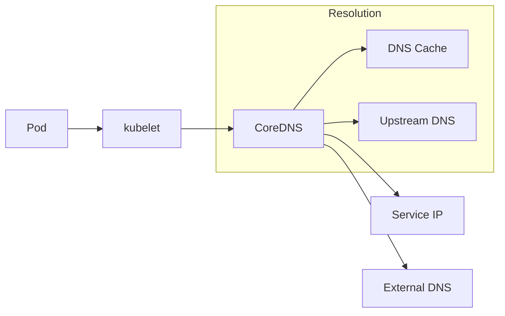

# How to Debug Kubernetes DNS Issues

Author: [nawazdhandala](https://www.github.com/nawazdhandala)

Tags: Kubernetes, DNS, Networking, Troubleshooting, CoreDNS, DevOps

Description: A systematic guide to diagnosing and fixing Kubernetes DNS problems, from basic resolution failures to advanced CoreDNS tuning.

---

DNS issues in Kubernetes are frustrating because they manifest as vague errors - timeouts, connection refused, "unknown host." This guide gives you a systematic approach to find and fix DNS problems fast.

## How Kubernetes DNS Works



CoreDNS runs as pods in `kube-system` and serves DNS for:
- **Service discovery**: `service-name.namespace.svc.cluster.local`
- **Pod DNS**: `pod-ip.namespace.pod.cluster.local`
- **External names**: Forward to upstream DNS

## Quick DNS Health Check

```bash
# Check CoreDNS pods are running
kubectl get pods -n kube-system -l k8s-app=kube-dns

# Check CoreDNS service
kubectl get svc -n kube-system kube-dns

# Check if DNS resolution works from a test pod
kubectl run dnstest --rm -it --image=busybox:1.28 --restart=Never -- nslookup kubernetes.default
```

If the last command fails, you have a DNS problem.

## Step 1: Verify CoreDNS Is Running

```bash
# Check pod status
kubectl get pods -n kube-system -l k8s-app=kube-dns -o wide

# Check for restarts or errors
kubectl describe pods -n kube-system -l k8s-app=kube-dns

# Check logs
kubectl logs -n kube-system -l k8s-app=kube-dns --tail=100
```

Common issues in logs:
- `connection refused` - Upstream DNS unreachable
- `SERVFAIL` - DNS query failed
- `i/o timeout` - Network connectivity issues

## Step 2: Test DNS from Inside a Pod

```bash
# Create a debug pod with DNS tools
kubectl run dnsutils --rm -it --image=tutum/dnsutils --restart=Never -- bash
```

Inside the pod:

```bash
# Test internal service resolution
nslookup kubernetes.default.svc.cluster.local

# Test with specific DNS server
nslookup kubernetes.default.svc.cluster.local 10.96.0.10

# Test external resolution
nslookup google.com

# Check DNS configuration
cat /etc/resolv.conf

# Detailed DNS query
dig +search kubernetes.default

# Test with timeout
timeout 5 nslookup kubernetes.default
```

## Step 3: Check Pod DNS Configuration

```bash
# Check resolv.conf in a problematic pod
kubectl exec -it <pod-name> -- cat /etc/resolv.conf
```

Expected output:
```
nameserver 10.96.0.10
search default.svc.cluster.local svc.cluster.local cluster.local
options ndots:5
```

### Common resolv.conf Issues

**Wrong nameserver IP:**
```bash
# Find correct CoreDNS ClusterIP
kubectl get svc -n kube-system kube-dns -o jsonpath='{.spec.clusterIP}'
```

**Missing search domains:**
DNS won't resolve short names like `my-service` without proper search domains.

**ndots too high/low:**
- `ndots:5` means names with fewer than 5 dots search local domains first
- Lower values cause external lookups for internal names

## Step 4: Test DNS Service Connectivity

```bash
# Test TCP connectivity to DNS
kubectl run nettest --rm -it --image=busybox --restart=Never -- \
  nc -vz 10.96.0.10 53

# Test UDP connectivity
kubectl run nettest --rm -it --image=busybox --restart=Never -- \
  nc -vzu 10.96.0.10 53
```

If TCP works but UDP doesn't, you have a network policy or firewall issue.

## Step 5: Check CoreDNS Configuration

```bash
# View CoreDNS ConfigMap
kubectl get configmap coredns -n kube-system -o yaml
```

Default Corefile:
```
.:53 {
    errors
    health {
       lameduck 5s
    }
    ready
    kubernetes cluster.local in-addr.arpa ip6.arpa {
       pods insecure
       fallthrough in-addr.arpa ip6.arpa
       ttl 30
    }
    prometheus :9153
    forward . /etc/resolv.conf {
       max_concurrent 1000
    }
    cache 30
    loop
    reload
    loadbalance
}
```

### Critical Directives

- **kubernetes**: Handles cluster DNS
- **forward**: Forwards external queries to upstream
- **cache**: DNS caching (increase for performance)
- **loop**: Detects forwarding loops

## Step 6: Debug Specific Issues

### Issue: "Could not resolve host"

```bash
# Test the exact failing name
kubectl exec -it <pod> -- nslookup <failing-hostname>

# Check if service exists
kubectl get svc <service-name> -n <namespace>

# Check endpoints
kubectl get endpoints <service-name> -n <namespace>
```

### Issue: Slow DNS Resolution

```bash
# Time DNS queries
kubectl exec -it <pod> -- time nslookup kubernetes.default

# Check CoreDNS metrics
kubectl port-forward -n kube-system svc/kube-dns 9153:9153
curl localhost:9153/metrics | grep coredns_dns_request_duration
```

Fixes for slow DNS:
1. Increase CoreDNS replicas
2. Increase cache TTL
3. Add node-local DNS cache

### Issue: External DNS Not Working

```bash
# Check upstream DNS in CoreDNS
kubectl exec -n kube-system -it <coredns-pod> -- cat /etc/resolv.conf

# Test external resolution from CoreDNS pod
kubectl exec -n kube-system -it <coredns-pod> -- nslookup google.com 8.8.8.8
```

Fix: Update forward directive in Corefile:
```
forward . 8.8.8.8 8.8.4.4 {
   max_concurrent 1000
}
```

### Issue: Intermittent DNS Failures

Usually caused by:
1. **UDP packet loss** - Add TCP fallback
2. **Race condition** - Known conntrack issue in older kernels
3. **CoreDNS overloaded** - Scale up or add caching

Fix for conntrack race condition (kernel < 5.9):
```yaml
# Add to pod spec
dnsConfig:
  options:
    - name: single-request-reopen
```

Or use NodeLocal DNSCache (recommended).

## Step 7: Scale and Optimize CoreDNS

### Increase Replicas

```bash
kubectl scale deployment coredns -n kube-system --replicas=3
```

### Add Horizontal Pod Autoscaler

```yaml
apiVersion: autoscaling/v2
kind: HorizontalPodAutoscaler
metadata:
  name: coredns
  namespace: kube-system
spec:
  scaleTargetRef:
    apiVersion: apps/v1
    kind: Deployment
    name: coredns
  minReplicas: 2
  maxReplicas: 10
  metrics:
    - type: Resource
      resource:
        name: cpu
        target:
          type: Utilization
          averageUtilization: 70
```

### Increase Cache Size

```yaml
# Edit CoreDNS ConfigMap
cache 300  # 5 minutes instead of 30 seconds
```

### Deploy NodeLocal DNSCache

NodeLocal DNS runs a caching DNS agent on each node, dramatically reducing latency and CoreDNS load.

```bash
# Install NodeLocal DNSCache
kubectl apply -f https://raw.githubusercontent.com/kubernetes/kubernetes/master/cluster/addons/dns/nodelocaldns/nodelocaldns.yaml
```

Update kubelet to use local cache:
```yaml
# /var/lib/kubelet/config.yaml
clusterDNS:
  - 169.254.20.10  # NodeLocal DNS IP
```

## Step 8: Network Policy Considerations

If you use Network Policies, ensure DNS traffic is allowed:

```yaml
apiVersion: networking.k8s.io/v1
kind: NetworkPolicy
metadata:
  name: allow-dns
  namespace: default
spec:
  podSelector: {}
  policyTypes:
    - Egress
  egress:
    - to:
        - namespaceSelector:
            matchLabels:
              kubernetes.io/metadata.name: kube-system
          podSelector:
            matchLabels:
              k8s-app: kube-dns
      ports:
        - protocol: UDP
          port: 53
        - protocol: TCP
          port: 53
```

## Step 9: Custom DNS Configuration

### Per-Pod DNS Config

```yaml
apiVersion: v1
kind: Pod
metadata:
  name: custom-dns-pod
spec:
  dnsPolicy: "None"
  dnsConfig:
    nameservers:
      - 10.96.0.10
      - 8.8.8.8
    searches:
      - default.svc.cluster.local
      - svc.cluster.local
      - cluster.local
    options:
      - name: ndots
        value: "2"
      - name: timeout
        value: "3"
      - name: attempts
        value: "2"
  containers:
    - name: app
      image: nginx
```

### DNS Policy Options

- `ClusterFirst` (default): Use cluster DNS, fall back to upstream
- `ClusterFirstWithHostNet`: Same as above for hostNetwork pods
- `Default`: Use node's DNS
- `None`: Use only dnsConfig settings

## Troubleshooting Checklist

```bash
#!/bin/bash
echo "=== CoreDNS Pods ==="
kubectl get pods -n kube-system -l k8s-app=kube-dns -o wide

echo -e "\n=== CoreDNS Service ==="
kubectl get svc -n kube-system kube-dns

echo -e "\n=== CoreDNS Endpoints ==="
kubectl get endpoints -n kube-system kube-dns

echo -e "\n=== CoreDNS Logs (last 20 lines) ==="
kubectl logs -n kube-system -l k8s-app=kube-dns --tail=20

echo -e "\n=== DNS Test from busybox ==="
kubectl run dnstest-$RANDOM --rm -it --image=busybox:1.28 --restart=Never -- \
  nslookup kubernetes.default.svc.cluster.local 2>&1 || echo "DNS test failed"

echo -e "\n=== CoreDNS ConfigMap ==="
kubectl get configmap coredns -n kube-system -o yaml
```

## Common Fixes Summary

| Symptom | Likely Cause | Fix |
|---------|--------------|-----|
| All DNS fails | CoreDNS not running | Check pods, restart if needed |
| External DNS fails | Bad upstream config | Update forward in Corefile |
| Slow resolution | Overloaded CoreDNS | Scale up, add NodeLocal DNS |
| Intermittent failures | Conntrack race | Use single-request-reopen |
| Service not found | Wrong namespace | Use FQDN: svc.ns.svc.cluster.local |
| DNS works, app fails | ndots misconfiguration | Check resolv.conf ndots value |

---

DNS issues are almost always one of: CoreDNS not running, network policies blocking UDP/53, wrong upstream configuration, or resolver misconfiguration in pods. Work through this checklist systematically and you'll find the problem.
