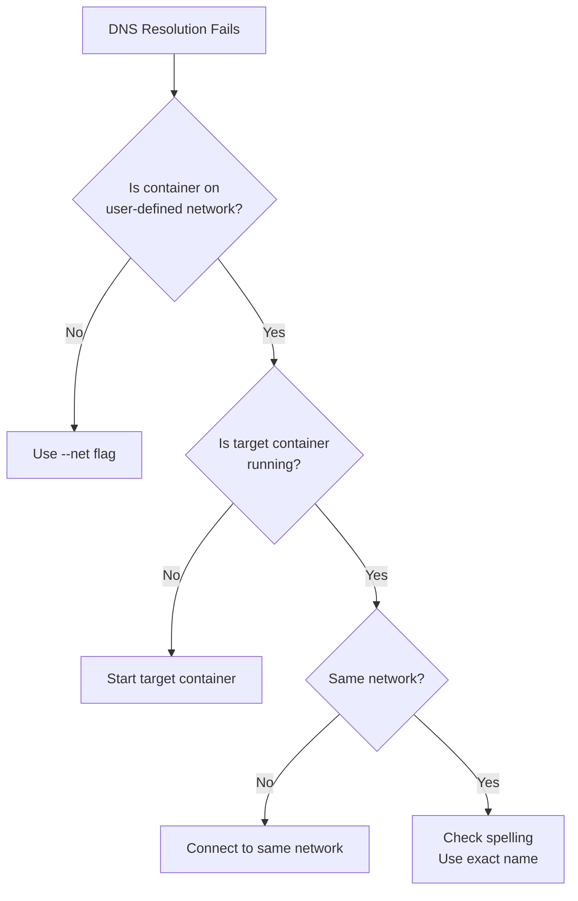

# Docker DNS Not Working? 5 Fixes That Work (2026)

Author: [nawazdhandala](https://www.github.com/nawazdhandala)

Tags: Docker, Networking, DevOps, Troubleshooting, DNS

Description: Fix Docker container DNS resolution in minutes. Debug name resolution failures, configure custom DNS servers, and solve networking issues fast.

"Connection refused" and "Name or service not known" are the most common Docker networking errors. They usually stem from DNS misconfiguration. Understanding how Docker's embedded DNS works and knowing the right debugging tools saves hours of frustration.

---

## How Docker DNS Works

Docker runs an embedded DNS server at `127.0.0.11` inside every container on user-defined networks. This server:

1. Resolves container names to their IP addresses
2. Resolves service names (in Swarm) to virtual IPs
3. Forwards external queries to upstream DNS servers

### Default Bridge vs User-Defined Networks

This example demonstrates the critical difference between default and user-defined networks for DNS resolution:

```bash
# Default bridge network - NO built-in DNS
# Container names cannot be resolved on the default bridge network
docker run --rm alpine ping other-container
# FAILS: "bad address 'other-container'"

# User-defined network - DNS resolution works
# First, create a custom network
docker network create mynet
# Start a container on that network with a name
docker run -d --network mynet --name db postgres:16
# Now other containers on the same network can resolve "db" by name
docker run --rm --network mynet alpine ping db
# SUCCESS: resolves db to container IP
```

**Key insight:** Container name resolution only works on user-defined networks, not the default bridge.

---

## Common DNS Problems and Solutions

### Problem 1: "Name does not resolve"

The following error occurs when trying to reach a container that doesn't exist or isn't on the same network:

```bash
docker run --rm --network mynet alpine ping api
# ping: bad address 'api'
```

**Diagnose:**

Use these commands to investigate why the container name isn't resolving:

```bash
# Check if container exists and is on the same network
# This shows all containers connected to the network
docker network inspect mynet | grep -A5 "Containers"

# Verify the target container is running (stopped containers don't resolve)
docker ps --filter "name=api"
```

**Solutions:**
- Container must be on the same user-defined network
- Container must be running (stopped containers don't resolve)
- Use the exact container name (case-sensitive)

### Problem 2: External DNS Fails

When containers cannot resolve external hostnames like google.com:

```bash
docker run --rm alpine ping google.com
# ping: bad address 'google.com'
```

**Diagnose:**

Check the DNS configuration inside the container:

```bash
# Check what DNS servers the container uses
# Should show 127.0.0.11 for Docker's embedded DNS
docker run --rm alpine cat /etc/resolv.conf

# Test direct DNS lookup to identify where resolution fails
docker run --rm alpine nslookup google.com
```

**Solutions:**

```bash
# Specify DNS servers explicitly when running containers
docker run --dns 8.8.8.8 --dns 8.8.4.4 alpine ping google.com

# Or configure daemon-wide by editing Docker's configuration
# /etc/docker/daemon.json
{
  "dns": ["8.8.8.8", "8.8.4.4"]
}
```

### Problem 3: DNS Works, But Connection Fails

Sometimes DNS resolves correctly but the connection still fails:

```bash
# DNS resolves - ping works
docker run --rm --network mynet alpine ping db
# PING db (172.18.0.2): 56 data bytes
# 64 bytes from 172.18.0.2: seq=0 ttl=64 time=0.123 ms

# But TCP connection fails
docker run --rm --network mynet alpine nc -zv db 5432
# nc: connect to db (172.18.0.2) port 5432 (tcp) failed: Connection refused
```

**Diagnose:**

The issue is with the service, not DNS. Investigate the target container:

```bash
# Check if the port is actually exposed inside the container
# This shows what ports the process is listening on
docker exec db netstat -tlnp
# or use ss (newer tool, same purpose)
docker exec db ss -tlnp

# Check container logs for startup errors
docker logs db
```

**Solutions:**
- Service might not be listening yet (startup timing)
- Service might be bound to localhost instead of 0.0.0.0
- Port number might be wrong

### Problem 4: Stale DNS Cache

After recreating a container, old IPs might be cached.

```bash
# Recreate container - gets a new IP address
docker rm -f api
docker run -d --name api --network mynet myapp

# Old IP might still be cached in other containers
```

**Solution:**
Docker's embedded DNS has a very short TTL, but if you see stale entries:

```bash
# Restart the container experiencing issues to clear its DNS cache
docker restart client-container

# Or use explicit IP for debugging (not recommended for production)
docker inspect api --format '{{range .NetworkSettings.Networks}}{{.IPAddress}}{{end}}'
```

---

## Debugging Tools

### Using nslookup

nslookup is a quick way to test DNS resolution:

```bash
# Basic lookup - test container name resolution
docker run --rm --network mynet alpine nslookup db

# Query specific DNS server to isolate DNS issues
docker run --rm alpine nslookup google.com 8.8.8.8

# Inside a running container - useful for debugging live issues
docker exec mycontainer nslookup api
```

### Using dig (More Detailed)

dig provides more detailed DNS information than nslookup:

```bash
# Install dig in alpine (requires bind-tools package)
docker run --rm --network mynet alpine sh -c "apk add bind-tools && dig db"

# Short answer only - useful for scripting
docker run --rm alpine sh -c "apk add bind-tools && dig +short google.com"

# Query Docker's embedded DNS directly to verify it's working
docker run --rm --network mynet alpine sh -c "apk add bind-tools && dig @127.0.0.11 db"
```

### Using getent (System Resolver)

getent uses the system resolver, testing the same path your application uses:

```bash
# Test what the container's resolver returns
# This is exactly what most applications use for name resolution
docker run --rm --network mynet alpine getent hosts db
# 172.18.0.2      db
```

### Network Debugging Container

Create a debugging container with all tools pre-installed:

This Dockerfile creates a comprehensive network debugging toolkit:

```dockerfile
# Dockerfile.netdebug
FROM alpine:3.19
# Install comprehensive networking tools
RUN apk add --no-cache \
    bind-tools \
    curl \
    netcat-openbsd \
    tcpdump \
    iputils \
    busybox-extras
# Keep container running indefinitely for interactive debugging
CMD ["sleep", "infinity"]
```

Build and use the debugging container:

```bash
# Build the debugging image
docker build -t netdebug -f Dockerfile.netdebug .
# Run it on your network for interactive debugging
docker run -d --name debug --network mynet netdebug
# Connect interactively
docker exec -it debug sh
```

---

## DNS Configuration Options

### Container-Level DNS

Override DNS settings for individual containers when needed:

```bash
# Override DNS servers - useful when default DNS is unreliable
docker run --dns 8.8.8.8 --dns 1.1.1.1 myapp

# Override search domains - enables short names like "api" instead of "api.example.com"
docker run --dns-search example.com myapp

# Override DNS options - tune timeout and retry behavior
docker run --dns-opt timeout:2 --dns-opt attempts:3 myapp

# Override hostname - sets the container's hostname
docker run --hostname api.local myapp
```

### Compose DNS Configuration

Configure DNS settings declaratively in Docker Compose:

```yaml
services:
  api:
    image: myapp
    # Primary and fallback DNS servers
    dns:
      - 8.8.8.8
      - 8.8.4.4
    # Search domains for short name resolution
    dns_search:
      - example.com
      - internal.example.com
    # DNS resolver options
    dns_opt:
      - timeout:2
      - attempts:3
```

### Daemon-Level DNS

Configure DNS for all containers by modifying Docker daemon settings:

```json
// /etc/docker/daemon.json
{
  "dns": ["8.8.8.8", "8.8.4.4"],
  "dns-search": ["example.com"],
  "dns-opts": ["timeout:2", "attempts:3"]
}
```

After modifying daemon.json, restart Docker to apply changes:

```bash
# Restart Docker to apply daemon configuration changes
sudo systemctl restart docker
```

---

## Service Discovery Patterns

### Pattern 1: Environment Variables (Simple)

The simplest approach: pass service hostnames via environment variables:

```yaml
services:
  api:
    environment:
      # Service hostnames passed as environment variables
      DATABASE_HOST: db
      REDIS_HOST: cache

  db:
    image: postgres:16

  cache:
    image: redis:7
```

### Pattern 2: Docker Compose Links (Legacy)

Links create aliases for container names. This is a legacy feature but still supported:

```yaml
services:
  api:
    links:
      # Creates alias 'database' that resolves to the 'db' container
      - "db:database"
```

### Pattern 3: Network Aliases

Network aliases allow a single container to respond to multiple DNS names:

```yaml
services:
  db:
    image: postgres:16
    networks:
      backend:
        # Multiple names that all resolve to this container
        aliases:
          - database
          - postgres
          - primary-db

networks:
  backend:
```

Now `api` can reach the database via `db`, `database`, `postgres`, or `primary-db`.

### Pattern 4: External Service Discovery

For production, use proper service discovery:

This example uses HashiCorp Consul for production-grade service discovery:

```yaml
services:
  # Consul service discovery server
  consul:
    image: hashicorp/consul:latest
    command: agent -server -bootstrap -ui

  api:
    image: myapp
    environment:
      # Application connects to Consul for service discovery
      CONSUL_HTTP_ADDR: consul:8500
    depends_on:
      - consul
```

---

## Troubleshooting Flowchart



---

## Real-World Debugging Session

A step-by-step debugging process for DNS issues:

```bash
# 1. Verify network exists
docker network ls | grep mynet

# 2. Check both containers are on it
# Lists all container names on the network
docker network inspect mynet --format '{{range .Containers}}{{.Name}} {{end}}'

# 3. Get container IP manually to test connectivity without DNS
docker inspect db --format '{{range .NetworkSettings.Networks}}{{.IPAddress}}{{end}}'
# Output: 172.18.0.2

# 4. Test connectivity by IP (bypasses DNS)
# If this works but DNS doesn't, it's a DNS issue
docker exec api ping -c 2 172.18.0.2

# 5. Test DNS resolution
docker exec api nslookup db

# 6. Test port connectivity (TCP layer)
docker exec api nc -zv db 5432

# 7. Check what's listening in target (inside the db container)
docker exec db ss -tlnp

# 8. Check for firewall rules (host level) that might block traffic
sudo iptables -L -n | grep 172.18

# 9. Check Docker's embedded DNS configuration
# Should show: nameserver 127.0.0.11
docker exec api cat /etc/resolv.conf
```

---

## Quick Reference

Common DNS debugging commands:

```bash
# Check container's DNS config - first step in debugging
docker exec mycontainer cat /etc/resolv.conf

# Test internal DNS - container to container
docker exec mycontainer nslookup other-container

# Test external DNS - container to internet
docker exec mycontainer nslookup google.com

# Run with custom DNS when default DNS fails
docker run --dns 8.8.8.8 myapp

# List containers on network to verify connectivity
docker network inspect mynet

# Add running container to network (connect without restart)
docker network connect mynet existing-container

# Create network with custom DNS options
docker network create --driver bridge --opt "com.docker.network.bridge.host_binding_ipv4"="0.0.0.0" mynet
```

---

## Summary

- Container name resolution only works on user-defined networks
- Docker's embedded DNS runs at 127.0.0.11 inside containers
- Use `nslookup`, `dig`, and `getent` to debug DNS issues
- External DNS can be configured at container, compose, or daemon level
- Network aliases provide multiple DNS names for a single container
- Most "connection refused" errors are DNS-adjacent but actually port/service issues

When DNS fails, work through the checklist: right network, container running, correct name spelling, then check the actual service.
