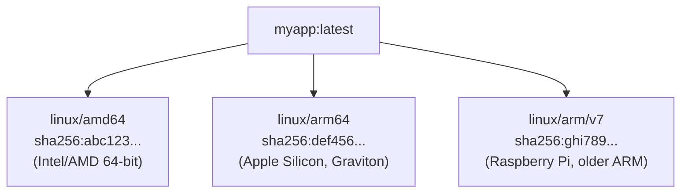

# How to Build Multi-Architecture Docker Images (ARM64 + AMD64)

Author: [nawazdhandala](https://www.github.com/nawazdhandala)

Tags: Docker, Containers, DevOps, CI/CD, ARM64, BuildKit

Description: Master docker buildx, QEMU emulation, manifest lists, and CI integration to build images that run on both Intel and Apple Silicon machines.

Apple Silicon Macs, AWS Graviton instances, and Raspberry Pis all use ARM64 processors. If you're only building AMD64 images, you're forcing these machines to run emulation (slow) or excluding them entirely. Multi-architecture images solve this by packaging multiple platform variants in a single tag.

---

## Understanding Multi-Arch Images

A multi-arch image is actually a **manifest list** - a pointer to platform-specific images:

This diagram shows how a single image tag contains references to multiple platform-specific images. Docker automatically selects the correct one based on your system architecture.



When you `docker pull myapp:latest`, Docker automatically selects the right variant for your platform.

---

## Setting Up Buildx

Docker Buildx extends the `docker build` command with multi-platform support.

### Check Buildx Installation

Verify buildx is available on your system. It comes pre-installed with Docker Desktop and recent Docker Engine versions.

```bash
# Check buildx version - should be installed with Docker Desktop
docker buildx version
# docker buildx version v0.12.0

# List available builders and their supported platforms
docker buildx ls
```

### Create a Multi-Platform Builder

The default builder only supports your native platform. Create a new builder with the docker-container driver to enable cross-platform builds.

```bash
# Create a new builder instance with docker-container driver
# This driver supports multiple platforms via QEMU emulation
docker buildx create --name multiarch --driver docker-container --bootstrap

# Set the new builder as the default
docker buildx use multiarch

# Verify supported platforms (should show amd64, arm64, arm/v7, etc.)
docker buildx inspect multiarch
```

Output shows supported platforms:
```
Platforms: linux/amd64, linux/amd64/v2, linux/amd64/v3, linux/arm64, linux/arm/v7, linux/arm/v6
```

---

## Building Multi-Arch Images

### Basic Multi-Platform Build

The simplest way to build for multiple platforms. The --push flag is required because multi-platform images can't be loaded into local Docker directly.

```bash
# Build for AMD64 and ARM64, then push to registry
# Multi-platform images must be pushed directly - can't load locally
docker buildx build \
  --platform linux/amd64,linux/arm64 \   # Target platforms
  --tag myregistry/myapp:latest \         # Image tag
  --push \                                 # Push to registry
  .
```

**Note:** Multi-platform builds must be pushed to a registry. You can't load multi-platform images into local Docker directly.

### Build and Load Locally (Single Platform)

For local testing, build just your native platform:

When developing locally, build only for your current platform. The --load flag makes the image available in your local Docker daemon.

```bash
# Build for current platform and load into Docker
# Use this for local development and testing
docker buildx build --load -t myapp:latest .

# Or explicitly specify platform for cross-platform testing
docker buildx build --platform linux/arm64 --load -t myapp:latest .
```

### Build with Multiple Tags

Create multiple tags in a single build operation. This is useful for version tagging (latest, semver, commit SHA).

```bash
# Build with multiple tags - common for releases
docker buildx build \
  --platform linux/amd64,linux/arm64 \
  --tag myregistry/myapp:latest \    # Latest tag
  --tag myregistry/myapp:1.0.0 \     # Exact version
  --tag myregistry/myapp:1.0 \       # Minor version
  --push \
  .
```

---

## Writing Multi-Arch Dockerfiles

Most Dockerfiles work across architectures without changes. Issues arise with:

1. Architecture-specific base images
2. Architecture-specific binaries
3. Platform-specific build steps

### Handling Architecture-Specific Dependencies

Buildx automatically sets ARG values for target platform. Use these to download the correct binaries for each architecture.

```dockerfile
FROM node:22-alpine

# These ARGs are automatically set by buildx during multi-platform builds
ARG TARGETPLATFORM    # e.g., linux/amd64, linux/arm64
ARG TARGETARCH        # e.g., amd64, arm64
ARG TARGETVARIANT     # e.g., v7 for arm/v7

WORKDIR /app

# Download architecture-specific binary based on TARGETARCH
# Map Docker arch names to download URL conventions
RUN case "${TARGETARCH}" in \
    "amd64") ARCH="x64" ;; \
    "arm64") ARCH="arm64" ;; \
    *) echo "Unsupported arch: ${TARGETARCH}" && exit 1 ;; \
    esac && \
    curl -fsSL "https://example.com/binary-${ARCH}.tar.gz" | tar -xz

COPY . .
RUN npm install
CMD ["node", "index.js"]
```

### Cross-Compilation for Go

Go makes cross-compilation easy:

Go has built-in support for cross-compilation. Simply set GOOS and GOARCH environment variables and Go produces a binary for the target platform.

```dockerfile
# Build stage - compiles Go code
FROM golang:1.22 AS builder

# These are set automatically by buildx
ARG TARGETOS     # e.g., linux
ARG TARGETARCH   # e.g., amd64, arm64

WORKDIR /app
COPY . .

# Go cross-compiles automatically with GOOS and GOARCH
# CGO_ENABLED=0 creates a static binary without C dependencies
RUN CGO_ENABLED=0 GOOS=${TARGETOS} GOARCH=${TARGETARCH} \
    go build -o /app/server .

# Final stage - minimal runtime image
FROM alpine:3.19
COPY --from=builder /app/server /server
CMD ["/server"]
```

### Rust Cross-Compilation

Rust requires installing the target toolchain for each architecture. This example uses musl for static binaries.

```dockerfile
FROM rust:1.75 AS builder

ARG TARGETPLATFORM  # Set by buildx

# Install the appropriate Rust target based on platform
RUN case "${TARGETPLATFORM}" in \
    "linux/amd64") TARGET="x86_64-unknown-linux-musl" ;; \
    "linux/arm64") TARGET="aarch64-unknown-linux-musl" ;; \
    esac && \
    rustup target add ${TARGET}

WORKDIR /app
COPY . .

# Build for the target platform
RUN case "${TARGETPLATFORM}" in \
    "linux/amd64") TARGET="x86_64-unknown-linux-musl" ;; \
    "linux/arm64") TARGET="aarch64-unknown-linux-musl" ;; \
    esac && \
    cargo build --release --target ${TARGET} && \
    cp target/${TARGET}/release/myapp /myapp

FROM alpine:3.19
COPY --from=builder /myapp /myapp
CMD ["/myapp"]
```

---

## QEMU Emulation

Buildx uses QEMU to emulate foreign architectures. This is automatic on Docker Desktop.

### Install QEMU on Linux

On Linux servers, you need to install QEMU user-mode emulation to build for non-native architectures.

```bash
# Install QEMU static binaries for all architectures
# This enables building ARM images on x86 and vice versa
docker run --privileged --rm tonistiigi/binfmt --install all

# Verify installation - run an ARM64 container on AMD64 host
docker run --rm --platform linux/arm64 alpine uname -m
# Should output: aarch64
```

### Emulation Performance

QEMU emulation is slow (5-20x). Strategies to minimize it:

1. **Use multi-stage builds** - Build on native, copy to target
2. **Cache dependencies** - Don't rebuild libraries on every change
3. **Use native builders** - Cross-compile when possible

This pattern runs the build stage natively and uses cross-compilation, avoiding QEMU emulation entirely during the slow compilation phase.

```dockerfile
# Good: Compile natively using BUILDPLATFORM, cross-compile for TARGETPLATFORM
# The --platform=$BUILDPLATFORM runs the builder on your native architecture
FROM --platform=$BUILDPLATFORM golang:1.22 AS builder
ARG TARGETOS TARGETARCH

# Go cross-compiles - no emulation needed for compilation
RUN GOOS=${TARGETOS} GOARCH=${TARGETARCH} go build -o /app .

# Final image runs on target platform
FROM alpine:3.19
COPY --from=builder /app /app
```

The `--platform=$BUILDPLATFORM` ensures the builder runs natively, then Go cross-compiles.

---

## CI/CD Integration

### GitHub Actions

This workflow sets up QEMU and buildx, then builds and pushes multi-platform images. The cache configuration speeds up subsequent builds.

```yaml
# .github/workflows/build.yml
name: Build Multi-Arch Image

on:
  push:
    branches: [main]
    tags: ['v*']

jobs:
  build:
    runs-on: ubuntu-latest
    steps:
      - uses: actions/checkout@v4

      # Install QEMU for cross-platform emulation
      - name: Set up QEMU
        uses: docker/setup-qemu-action@v3

      # Set up buildx for multi-platform builds
      - name: Set up Docker Buildx
        uses: docker/setup-buildx-action@v3

      # Authenticate with Docker Hub
      - name: Login to Docker Hub
        uses: docker/login-action@v3
        with:
          username: ${{ secrets.DOCKERHUB_USERNAME }}
          password: ${{ secrets.DOCKERHUB_TOKEN }}

      # Build and push multi-platform image
      - name: Build and push
        uses: docker/build-push-action@v5
        with:
          context: .
          platforms: linux/amd64,linux/arm64  # Target platforms
          push: true
          tags: |
            myregistry/myapp:latest
            myregistry/myapp:${{ github.sha }}
          cache-from: type=gha       # Use GitHub Actions cache
          cache-to: type=gha,mode=max
```

### GitLab CI

GitLab CI configuration for multi-platform builds using Docker-in-Docker service.

```yaml
# .gitlab-ci.yml
build:
  image: docker:24
  services:
    - docker:24-dind            # Docker-in-Docker for building
  variables:
    DOCKER_TLS_CERTDIR: "/certs"
  before_script:
    # Login to GitLab registry
    - docker login -u $CI_REGISTRY_USER -p $CI_REGISTRY_PASSWORD $CI_REGISTRY
    # Install QEMU for cross-platform builds
    - docker run --privileged --rm tonistiigi/binfmt --install all
    # Create and use buildx builder
    - docker buildx create --use
  script:
    # Build for multiple platforms and push
    - docker buildx build
      --platform linux/amd64,linux/arm64
      --tag $CI_REGISTRY_IMAGE:$CI_COMMIT_SHA
      --tag $CI_REGISTRY_IMAGE:latest
      --push .
```

### CircleCI

CircleCI configuration using a machine executor which provides a full VM for Docker operations.

```yaml
# .circleci/config.yml
version: 2.1

jobs:
  build:
    machine:
      image: ubuntu-2204:current  # Full VM for Docker operations
    steps:
      - checkout

      # Install QEMU emulation support
      - run:
          name: Setup QEMU
          command: docker run --privileged --rm tonistiigi/binfmt --install all

      # Create multi-platform builder
      - run:
          name: Setup Buildx
          command: |
            docker buildx create --name multiarch --use
            docker buildx inspect --bootstrap

      # Build and push multi-platform image
      - run:
          name: Build and Push
          command: |
            echo $DOCKER_PASSWORD | docker login -u $DOCKER_USER --password-stdin
            docker buildx build \
              --platform linux/amd64,linux/arm64 \
              --tag myregistry/myapp:$CIRCLE_SHA1 \
              --push .
```

---

## Inspecting Multi-Arch Images

### View Manifest List

Use imagetools to inspect the manifest list and see which platforms are included in a multi-arch image.

```bash
# Inspect the manifest list to see all platform variants
docker buildx imagetools inspect myregistry/myapp:latest
```

Output:
```
Name:      myregistry/myapp:latest
MediaType: application/vnd.oci.image.index.v1+json
Digest:    sha256:abc123...

Manifests:
  Name:        myregistry/myapp:latest@sha256:def456...
  MediaType:   application/vnd.oci.image.manifest.v1+json
  Platform:    linux/amd64

  Name:        myregistry/myapp:latest@sha256:ghi789...
  MediaType:   application/vnd.oci.image.manifest.v1+json
  Platform:    linux/arm64
```

### Pull Specific Architecture

Force pulling or running a specific platform variant, useful for testing or when you need to override the automatic selection.

```bash
# Pull specific platform variant (useful for testing)
docker pull --platform linux/arm64 myregistry/myapp:latest

# Run container with explicit platform (uses emulation if non-native)
docker run --platform linux/arm64 myregistry/myapp:latest
```

---

## Common Patterns

### Pattern: Separate Build Jobs Per Architecture

For complex builds, run architecture-specific jobs in parallel:

When emulation is too slow, build each architecture separately in parallel, then combine them into a single manifest. This pattern is ideal for complex builds with native compilation.

```yaml
# GitHub Actions - parallel native builds with manifest merging
jobs:
  # Build AMD64 image
  build-amd64:
    runs-on: ubuntu-latest
    steps:
      - uses: docker/build-push-action@v5
        with:
          platforms: linux/amd64
          tags: myregistry/myapp:${{ github.sha }}-amd64
          push: true

  # Build ARM64 image (can use ARM runner for native builds)
  build-arm64:
    runs-on: ubuntu-latest  # or self-hosted ARM runner
    steps:
      - uses: docker/build-push-action@v5
        with:
          platforms: linux/arm64
          tags: myregistry/myapp:${{ github.sha }}-arm64
          push: true

  # Combine into multi-arch manifest
  create-manifest:
    needs: [build-amd64, build-arm64]  # Wait for both builds
    runs-on: ubuntu-latest
    steps:
      - name: Create manifest
        run: |
          # Combine platform-specific images into single manifest
          docker buildx imagetools create \
            --tag myregistry/myapp:latest \
            myregistry/myapp:${{ github.sha }}-amd64 \
            myregistry/myapp:${{ github.sha }}-arm64
```

### Pattern: Native ARM Builds on Graviton

Use AWS CodeBuild with ARM instances:

Running builds on native ARM instances (like AWS Graviton) eliminates emulation overhead entirely. This is the fastest option for ARM builds.

```yaml
# buildspec.yml - AWS CodeBuild on Graviton (ARM) instances
version: 0.2
phases:
  build:
    commands:
      # Native ARM build - no emulation needed
      - docker build -t myregistry/myapp:arm64 .
      - docker push myregistry/myapp:arm64
```

---

## Troubleshooting

### Build Fails on ARM64

If ARM64 builds fail, verify QEMU emulation is working correctly.

```bash
# Test if QEMU emulation is working
docker run --rm --platform linux/arm64 alpine uname -m

# If it fails, reinstall QEMU support
docker run --privileged --rm tonistiigi/binfmt --install all
```

### Slow Builds

Use registry-based caching to speed up multi-platform builds by reusing layers between builds.

```bash
# Use registry-based build cache for faster rebuilds
docker buildx build \
  --platform linux/amd64,linux/arm64 \
  --cache-from type=registry,ref=myregistry/myapp:cache \   # Pull cache from registry
  --cache-to type=registry,ref=myregistry/myapp:cache,mode=max \  # Push cache to registry
  --push \
  -t myregistry/myapp:latest .
```

### Wrong Architecture Selected

Force a specific platform when Docker selects the wrong architecture automatically.

```bash
# Force specific platform when running
docker run --platform linux/amd64 myregistry/myapp:latest

# Check what architecture an image was built for
docker inspect myregistry/myapp:latest | jq '.[0].Architecture'
```

---

## Quick Reference

Essential commands for working with multi-architecture Docker images.

```bash
# Create multi-platform builder with docker-container driver
docker buildx create --name multiarch --use

# Build for multiple platforms and push to registry
docker buildx build --platform linux/amd64,linux/arm64 --push -t myapp:latest .

# Build for current platform only (for local testing)
docker buildx build --load -t myapp:latest .

# Install QEMU for cross-platform emulation
docker run --privileged --rm tonistiigi/binfmt --install all

# Inspect manifest to see available platforms
docker buildx imagetools inspect myapp:latest

# Create manifest from existing platform-specific images
docker buildx imagetools create --tag myapp:latest myapp:amd64 myapp:arm64
```

---

## Summary

- Multi-arch images bundle platform variants in a single tag
- Buildx with QEMU enables building for foreign architectures
- Use `$BUILDPLATFORM` in FROM for native compilation, then cross-compile
- Go cross-compiles easily; other languages may need more setup
- Cache builds aggressively - emulation is slow
- CI pipelines should include QEMU setup and buildx configuration
- Consider parallel native builds for complex projects

Building multi-arch images future-proofs your containers for the ARM64 future.
