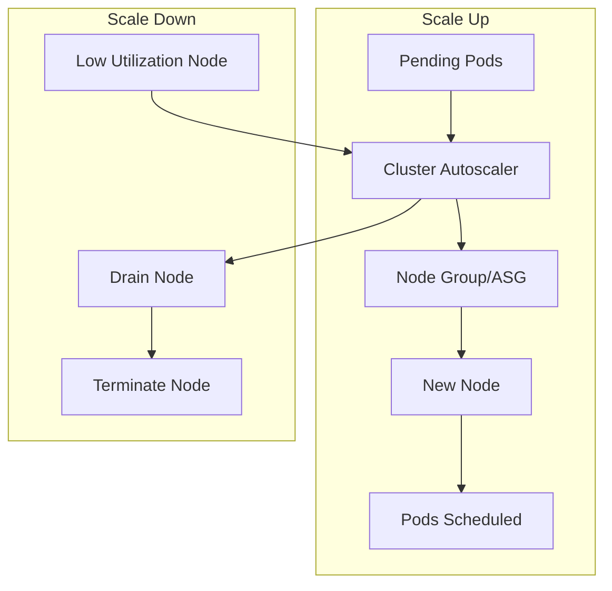

# How to Configure Cluster Autoscaler for Kubernetes

Author: [nawazdhandala](https://www.github.com/nawazdhandala)

Tags: Kubernetes, Cluster Autoscaler, Scaling, Cloud, Cost Optimization, DevOps

Description: A complete guide to setting up Cluster Autoscaler on AWS EKS, GCP GKE, and Azure AKS, including configuration options, node group strategies, and cost optimization.

---

HPA scales pods, but what happens when you run out of node capacity? Cluster Autoscaler adds and removes nodes automatically based on pending pods and node utilization.

## How Cluster Autoscaler Works



**Scale Up:** When pods can't be scheduled due to insufficient resources, CA adds nodes.

**Scale Down:** When nodes are underutilized (< 50% by default) for a period, CA removes them.

## AWS EKS Setup

### Create Node Group with Auto Scaling

```bash
# Create managed node group
eksctl create nodegroup \
  --cluster my-cluster \
  --name general-workers \
  --node-type m5.large \
  --nodes-min 2 \
  --nodes-max 20 \
  --nodes 3 \
  --asg-access  # Required for Cluster Autoscaler
```

### IAM Policy for Cluster Autoscaler

```json
{
  "Version": "2012-10-17",
  "Statement": [
    {
      "Effect": "Allow",
      "Action": [
        "autoscaling:DescribeAutoScalingGroups",
        "autoscaling:DescribeAutoScalingInstances",
        "autoscaling:DescribeLaunchConfigurations",
        "autoscaling:DescribeScalingActivities",
        "autoscaling:DescribeTags",
        "ec2:DescribeImages",
        "ec2:DescribeInstanceTypes",
        "ec2:DescribeLaunchTemplateVersions",
        "ec2:GetInstanceTypesFromInstanceRequirements",
        "eks:DescribeNodegroup"
      ],
      "Resource": ["*"]
    },
    {
      "Effect": "Allow",
      "Action": [
        "autoscaling:SetDesiredCapacity",
        "autoscaling:TerminateInstanceInAutoScalingGroup"
      ],
      "Resource": ["*"],
      "Condition": {
        "StringEquals": {
          "aws:ResourceTag/k8s.io/cluster-autoscaler/my-cluster": "owned"
        }
      }
    }
  ]
}
```

### Deploy Cluster Autoscaler on EKS

```yaml
apiVersion: apps/v1
kind: Deployment
metadata:
  name: cluster-autoscaler
  namespace: kube-system
  labels:
    app: cluster-autoscaler
spec:
  replicas: 1
  selector:
    matchLabels:
      app: cluster-autoscaler
  template:
    metadata:
      labels:
        app: cluster-autoscaler
    spec:
      serviceAccountName: cluster-autoscaler
      containers:
        - name: cluster-autoscaler
          image: registry.k8s.io/autoscaling/cluster-autoscaler:v1.28.0
          command:
            - ./cluster-autoscaler
            - --v=4
            - --stderrthreshold=info
            - --cloud-provider=aws
            - --skip-nodes-with-local-storage=false
            - --expander=least-waste
            - --node-group-auto-discovery=asg:tag=k8s.io/cluster-autoscaler/enabled,k8s.io/cluster-autoscaler/my-cluster
            - --balance-similar-node-groups
            - --skip-nodes-with-system-pods=false
          resources:
            requests:
              cpu: 100m
              memory: 300Mi
          env:
            - name: AWS_REGION
              value: us-west-2
      nodeSelector:
        kubernetes.io/os: linux
      affinity:
        nodeAffinity:
          requiredDuringSchedulingIgnoredDuringExecution:
            nodeSelectorTerms:
              - matchExpressions:
                  - key: eks.amazonaws.com/nodegroup
                    operator: In
                    values:
                      - system  # Run on system node group
```

### Using IRSA (IAM Roles for Service Accounts)

```bash
# Create IAM role for service account
eksctl create iamserviceaccount \
  --cluster=my-cluster \
  --namespace=kube-system \
  --name=cluster-autoscaler \
  --attach-policy-arn=arn:aws:iam::ACCOUNT_ID:policy/ClusterAutoscalerPolicy \
  --override-existing-serviceaccounts \
  --approve
```

## GCP GKE Setup

GKE has built-in cluster autoscaler:

```bash
# Enable on existing cluster
gcloud container clusters update my-cluster \
  --enable-autoscaling \
  --min-nodes=1 \
  --max-nodes=20 \
  --zone=us-central1-a

# Or per node pool
gcloud container node-pools update default-pool \
  --cluster=my-cluster \
  --enable-autoscaling \
  --min-nodes=2 \
  --max-nodes=20 \
  --zone=us-central1-a
```

### GKE Autoscaling Profiles

```bash
# Balanced (default)
gcloud container clusters update my-cluster \
  --autoscaling-profile=balanced

# Optimize utilization (more aggressive scale down)
gcloud container clusters update my-cluster \
  --autoscaling-profile=optimize-utilization
```

## Azure AKS Setup

```bash
# Enable cluster autoscaler
az aks update \
  --resource-group myResourceGroup \
  --name myAKSCluster \
  --enable-cluster-autoscaler \
  --min-count 2 \
  --max-count 20

# Per node pool
az aks nodepool update \
  --resource-group myResourceGroup \
  --cluster-name myAKSCluster \
  --name nodepool1 \
  --enable-cluster-autoscaler \
  --min-count 2 \
  --max-count 20
```

## Cluster Autoscaler Configuration

### Key Parameters

```bash
# Core settings
--scale-down-enabled=true                    # Enable scale down
--scale-down-delay-after-add=10m            # Wait after adding node
--scale-down-delay-after-delete=0s          # Wait after deleting node
--scale-down-delay-after-failure=3m         # Wait after failed scale down
--scale-down-unneeded-time=10m              # How long node must be unneeded
--scale-down-utilization-threshold=0.5      # Scale down if < 50% utilized

# Safety settings
--max-node-provision-time=15m               # Timeout for node provisioning
--max-graceful-termination-sec=600          # Max time for pod eviction
--skip-nodes-with-local-storage=true        # Don't scale down nodes with local storage
--skip-nodes-with-system-pods=true          # Don't scale down nodes with kube-system pods

# Expander strategy
--expander=least-waste                      # Choose node group wisely
```

### Expander Strategies

| Strategy | Description | Use Case |
|----------|-------------|----------|
| `random` | Random node group | Simple setups |
| `most-pods` | Fits most pending pods | Batch workloads |
| `least-waste` | Least resource waste | Cost optimization |
| `price` | Lowest price (cloud) | Cost sensitive |
| `priority` | User-defined priority | Complex setups |

### Priority Expander Configuration

```yaml
apiVersion: v1
kind: ConfigMap
metadata:
  name: cluster-autoscaler-priority-expander
  namespace: kube-system
data:
  priorities: |-
    10:
      - .*spot.*           # Prefer spot instances
    20:
      - .*general.*        # Then general purpose
    50:
      - .*compute.*        # Then compute optimized
```

## Multiple Node Groups Strategy

### Different Instance Types for Different Workloads

```yaml
# Node Group 1: General workloads
apiVersion: eksctl.io/v1alpha5
kind: ClusterConfig
metadata:
  name: my-cluster
  region: us-west-2
managedNodeGroups:
  - name: general
    instanceType: m5.large
    minSize: 2
    maxSize: 20
    labels:
      workload: general
    tags:
      k8s.io/cluster-autoscaler/enabled: "true"
      k8s.io/cluster-autoscaler/my-cluster: "owned"

  - name: memory-optimized
    instanceType: r5.xlarge
    minSize: 0
    maxSize: 10
    labels:
      workload: memory-intensive
    taints:
      - key: workload
        value: memory-intensive
        effect: NoSchedule

  - name: gpu
    instanceType: p3.2xlarge
    minSize: 0
    maxSize: 5
    labels:
      workload: gpu
    taints:
      - key: nvidia.com/gpu
        value: "true"
        effect: NoSchedule
```

### Pod with Node Selector

```yaml
apiVersion: v1
kind: Pod
metadata:
  name: memory-intensive-app
spec:
  nodeSelector:
    workload: memory-intensive
  tolerations:
    - key: workload
      value: memory-intensive
      effect: NoSchedule
  containers:
    - name: app
      image: memory-app:latest
      resources:
        requests:
          memory: 16Gi
```

## Prevent Scale Down for Critical Pods

### Pod Disruption Budget

```yaml
apiVersion: policy/v1
kind: PodDisruptionBudget
metadata:
  name: critical-app
spec:
  minAvailable: 2
  selector:
    matchLabels:
      app: critical-app
```

### Safe to Evict Annotation

```yaml
metadata:
  annotations:
    cluster-autoscaler.kubernetes.io/safe-to-evict: "false"
```

### Pod Priority

```yaml
apiVersion: scheduling.k8s.io/v1
kind: PriorityClass
metadata:
  name: critical
value: 1000000
globalDefault: false
description: "Critical pods that prevent scale down"
---
apiVersion: v1
kind: Pod
metadata:
  name: critical-pod
spec:
  priorityClassName: critical
```

## Cost Optimization with Spot/Preemptible Nodes

### AWS Spot Instances

```yaml
managedNodeGroups:
  - name: spot-workers
    instanceTypes:
      - m5.large
      - m5a.large
      - m4.large
    spot: true
    minSize: 0
    maxSize: 50
    labels:
      lifecycle: spot
    taints:
      - key: spot
        value: "true"
        effect: NoSchedule
```

### Handle Spot Termination

```yaml
apiVersion: apps/v1
kind: Deployment
metadata:
  name: fault-tolerant-app
spec:
  template:
    spec:
      nodeSelector:
        lifecycle: spot
      tolerations:
        - key: spot
          value: "true"
          effect: NoSchedule
      terminationGracePeriodSeconds: 30
      containers:
        - name: app
          lifecycle:
            preStop:
              exec:
                command: ["/bin/sh", "-c", "sleep 25"]
```

## Monitoring Cluster Autoscaler

### Check Status

```bash
# View CA logs
kubectl logs -n kube-system -l app=cluster-autoscaler -f

# Check status ConfigMap
kubectl get configmap cluster-autoscaler-status -n kube-system -o yaml
```

### Prometheus Metrics

```yaml
apiVersion: monitoring.coreos.com/v1
kind: ServiceMonitor
metadata:
  name: cluster-autoscaler
  namespace: monitoring
spec:
  selector:
    matchLabels:
      app: cluster-autoscaler
  endpoints:
    - port: metrics
      interval: 30s
```

Key metrics:
- `cluster_autoscaler_nodes_count` - Current node count
- `cluster_autoscaler_unschedulable_pods_count` - Pending pods
- `cluster_autoscaler_scaled_up_nodes_total` - Scale up events
- `cluster_autoscaler_scaled_down_nodes_total` - Scale down events

### Alerts

```yaml
apiVersion: monitoring.coreos.com/v1
kind: PrometheusRule
metadata:
  name: cluster-autoscaler-alerts
spec:
  groups:
    - name: cluster-autoscaler
      rules:
        - alert: ClusterAutoscalerUnschedulablePods
          expr: cluster_autoscaler_unschedulable_pods_count > 0
          for: 15m
          labels:
            severity: warning
          annotations:
            summary: "Pods cannot be scheduled"

        - alert: ClusterAutoscalerNodeGroupAtMax
          expr: |
            cluster_autoscaler_nodes_count
            ==
            cluster_autoscaler_max_nodes_count
          for: 30m
          labels:
            severity: critical
          annotations:
            summary: "Node group at maximum capacity"
```

## Troubleshooting

### Pods Stuck Pending

```bash
# Check why pod is pending
kubectl describe pod <pod-name>

# Check CA logs for scale up decisions
kubectl logs -n kube-system -l app=cluster-autoscaler | grep -i "scale"

# Check CA status
kubectl get configmap cluster-autoscaler-status -n kube-system -o yaml
```

### Scale Up Not Happening

Common causes:
1. **Max nodes reached** - Increase max in node group
2. **Pod doesn't fit any node type** - Check resource requests
3. **Node selector/affinity mismatch** - Verify labels
4. **Taints without tolerations** - Add tolerations

### Scale Down Not Happening

Common causes:
1. **Pods with local storage** - Use `--skip-nodes-with-local-storage=false`
2. **Pods without PDB** - CA is being cautious
3. **System pods** - Use `--skip-nodes-with-system-pods=false`
4. **Safe-to-evict annotation** - Check annotations

```bash
# Find what's blocking scale down
kubectl logs -n kube-system -l app=cluster-autoscaler | grep "cannot be removed"
```

## Best Practices

1. **Start conservative** - Set wide min/max ranges, tune over time
2. **Use multiple node groups** - Different instance types for different workloads
3. **Set resource requests** - CA needs accurate requests to make decisions
4. **Use PDBs** - Protect critical workloads during scale down
5. **Monitor scale events** - Track scaling patterns
6. **Test failure scenarios** - What happens when spot instances are reclaimed?
7. **Right-size max nodes** - Don't set max too high (cost explosion risk)

---

Cluster Autoscaler is essential for cost-efficient Kubernetes. Combined with HPA, it ensures you have the right number of pods on the right number of nodes. Start with sensible defaults, monitor the behavior, and tune based on your workload patterns.
