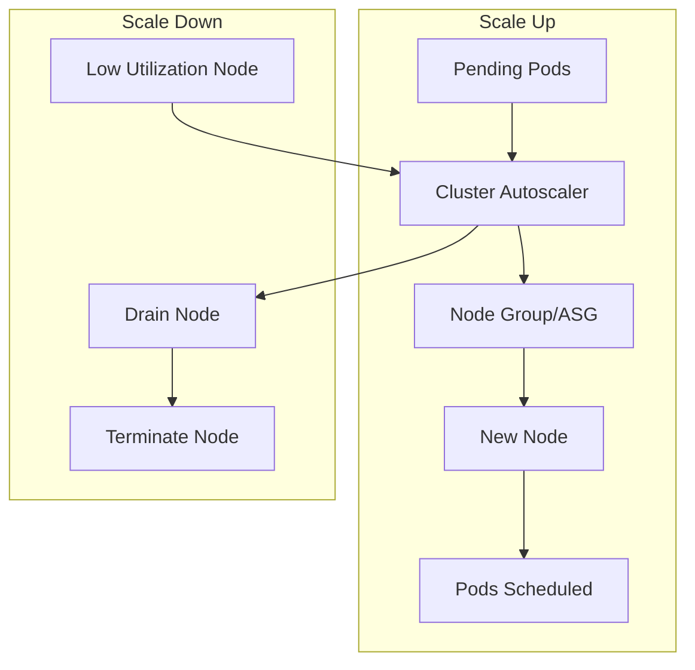

# How to Configure Cluster Autoscaler for Kubernetes

Author: [nawazdhandala](https://www.github.com/nawazdhandala)

Tags: Kubernetes, Cluster Autoscaler, Scaling, Cloud, Cost Optimization, DevOps

Description: A complete guide to setting up Cluster Autoscaler on AWS EKS, GCP GKE, and Azure AKS, including configuration options, node group strategies, and cost optimization.

---

HPA scales pods, but what happens when you run out of node capacity? Cluster Autoscaler adds and removes nodes automatically based on pending pods and node utilization.

## How Cluster Autoscaler Works



**Scale Up:** When pods can't be scheduled due to insufficient resources, CA adds nodes.

**Scale Down:** When nodes are underutilized (< 50% by default) for a period, CA removes them.

## AWS EKS Setup

### Create Node Group with Auto Scaling

This command creates an EKS managed node group with auto scaling enabled. The asg-access flag grants permissions needed for Cluster Autoscaler.

```bash
# Create managed node group with auto scaling configuration
eksctl create nodegroup \
  --cluster my-cluster \
  --name general-workers \
  --node-type m5.large \
  --nodes-min 2 \      # Minimum nodes (scale down limit)
  --nodes-max 20 \     # Maximum nodes (scale up limit)
  --nodes 3 \          # Initial/desired node count
  --asg-access         # Required IAM permissions for Cluster Autoscaler
```

### IAM Policy for Cluster Autoscaler

This policy grants Cluster Autoscaler the permissions to describe and modify Auto Scaling Groups. The condition restricts modifications to your specific cluster.

```json
{
  "Version": "2012-10-17",
  "Statement": [
    {
      "Effect": "Allow",
      "Action": [
        "autoscaling:DescribeAutoScalingGroups",      // Read ASG configuration
        "autoscaling:DescribeAutoScalingInstances",   // Read instance status
        "autoscaling:DescribeLaunchConfigurations",   // Read launch configs
        "autoscaling:DescribeScalingActivities",      // Read scaling history
        "autoscaling:DescribeTags",                   // Read ASG tags
        "ec2:DescribeImages",                         // Read AMI info
        "ec2:DescribeInstanceTypes",                  // Read instance type specs
        "ec2:DescribeLaunchTemplateVersions",         // Read launch templates
        "ec2:GetInstanceTypesFromInstanceRequirements",
        "eks:DescribeNodegroup"                       // Read EKS nodegroup info
      ],
      "Resource": ["*"]
    },
    {
      "Effect": "Allow",
      "Action": [
        "autoscaling:SetDesiredCapacity",             // Scale node group size
        "autoscaling:TerminateInstanceInAutoScalingGroup"  // Remove nodes
      ],
      "Resource": ["*"],
      "Condition": {
        "StringEquals": {
          // Only allow modifications to this specific cluster
          "aws:ResourceTag/k8s.io/cluster-autoscaler/my-cluster": "owned"
        }
      }
    }
  ]
}
```

### Deploy Cluster Autoscaler on EKS

This Deployment runs Cluster Autoscaler in the kube-system namespace. Key configurations include cloud provider, expander strategy, and node group auto-discovery.

```yaml
apiVersion: apps/v1
kind: Deployment
metadata:
  name: cluster-autoscaler
  namespace: kube-system
  labels:
    app: cluster-autoscaler
spec:
  replicas: 1  # Single replica - CA has leader election
  selector:
    matchLabels:
      app: cluster-autoscaler
  template:
    metadata:
      labels:
        app: cluster-autoscaler
    spec:
      serviceAccountName: cluster-autoscaler  # Service account with IAM role
      containers:
        - name: cluster-autoscaler
          image: registry.k8s.io/autoscaling/cluster-autoscaler:v1.28.0
          command:
            - ./cluster-autoscaler
            - --v=4                                    # Verbosity level for logging
            - --stderrthreshold=info
            - --cloud-provider=aws                     # Cloud provider plugin
            - --skip-nodes-with-local-storage=false    # Scale down nodes with local storage
            - --expander=least-waste                   # Node selection strategy
            - --node-group-auto-discovery=asg:tag=k8s.io/cluster-autoscaler/enabled,k8s.io/cluster-autoscaler/my-cluster
            - --balance-similar-node-groups            # Balance nodes across AZs
            - --skip-nodes-with-system-pods=false      # Allow scaling nodes with system pods
          resources:
            requests:
              cpu: 100m
              memory: 300Mi
          env:
            - name: AWS_REGION
              value: us-west-2  # Must match your cluster region
      nodeSelector:
        kubernetes.io/os: linux
      affinity:
        nodeAffinity:
          requiredDuringSchedulingIgnoredDuringExecution:
            nodeSelectorTerms:
              - matchExpressions:
                  - key: eks.amazonaws.com/nodegroup
                    operator: In
                    values:
                      - system  # Run on dedicated system node group
```

### Using IRSA (IAM Roles for Service Accounts)

IRSA provides secure, pod-level IAM permissions without managing access keys. This creates a service account linked to an IAM role.

```bash
# Create IAM service account with attached policy
eksctl create iamserviceaccount \
  --cluster=my-cluster \
  --namespace=kube-system \
  --name=cluster-autoscaler \
  --attach-policy-arn=arn:aws:iam::ACCOUNT_ID:policy/ClusterAutoscalerPolicy \
  --override-existing-serviceaccounts \
  --approve
```

## GCP GKE Setup

GKE has built-in cluster autoscaler:

GKE's native autoscaler requires no separate deployment. Enable it via gcloud commands.

```bash
# Enable autoscaling on existing cluster (applies to default node pool)
gcloud container clusters update my-cluster \
  --enable-autoscaling \
  --min-nodes=1 \
  --max-nodes=20 \
  --zone=us-central1-a

# Or configure per node pool for granular control
gcloud container node-pools update default-pool \
  --cluster=my-cluster \
  --enable-autoscaling \
  --min-nodes=2 \
  --max-nodes=20 \
  --zone=us-central1-a
```

### GKE Autoscaling Profiles

GKE offers autoscaling profiles that control how aggressively the autoscaler scales down.

```bash
# Balanced profile (default) - moderate scale-down behavior
gcloud container clusters update my-cluster \
  --autoscaling-profile=balanced

# Optimize utilization - more aggressive scale down for cost savings
gcloud container clusters update my-cluster \
  --autoscaling-profile=optimize-utilization
```

## Azure AKS Setup

Enable the built-in cluster autoscaler on AKS with simple CLI commands.

```bash
# Enable cluster autoscaler on the entire cluster
az aks update \
  --resource-group myResourceGroup \
  --name myAKSCluster \
  --enable-cluster-autoscaler \
  --min-count 2 \
  --max-count 20

# Configure per node pool for different workload types
az aks nodepool update \
  --resource-group myResourceGroup \
  --cluster-name myAKSCluster \
  --name nodepool1 \
  --enable-cluster-autoscaler \
  --min-count 2 \
  --max-count 20
```

## Cluster Autoscaler Configuration

### Key Parameters

These parameters control Cluster Autoscaler behavior. Tune them based on your workload patterns and cost requirements.

```bash
# Core settings - control when and how scaling occurs
--scale-down-enabled=true                    # Enable scale down (default: true)
--scale-down-delay-after-add=10m            # Wait after adding node before considering scale down
--scale-down-delay-after-delete=0s          # Wait after deleting node before next scale down
--scale-down-delay-after-failure=3m         # Wait after failed scale down attempt
--scale-down-unneeded-time=10m              # How long node must be underutilized before removal
--scale-down-utilization-threshold=0.5      # Scale down if node is < 50% utilized

# Safety settings - prevent disruptions
--max-node-provision-time=15m               # Timeout for node to become ready
--max-graceful-termination-sec=600          # Max time for pod eviction during scale down
--skip-nodes-with-local-storage=true        # Protect nodes with emptyDir or hostPath volumes
--skip-nodes-with-system-pods=true          # Protect nodes running kube-system pods

# Expander strategy - how to choose which node group to scale
--expander=least-waste                      # Choose node group that wastes least resources
```

### Expander Strategies

| Strategy | Description | Use Case |
|----------|-------------|----------|
| `random` | Random node group | Simple setups |
| `most-pods` | Fits most pending pods | Batch workloads |
| `least-waste` | Least resource waste | Cost optimization |
| `price` | Lowest price (cloud) | Cost sensitive |
| `priority` | User-defined priority | Complex setups |

### Priority Expander Configuration

The priority expander lets you define preference order for node groups. Lower numbers have higher priority.

```yaml
apiVersion: v1
kind: ConfigMap
metadata:
  name: cluster-autoscaler-priority-expander
  namespace: kube-system
data:
  priorities: |-
    10:
      - .*spot.*           # Highest priority: prefer spot instances for cost savings
    20:
      - .*general.*        # Second priority: general purpose nodes
    50:
      - .*compute.*        # Lowest priority: compute optimized (more expensive)
```

## Multiple Node Groups Strategy

### Different Instance Types for Different Workloads

This eksctl configuration creates multiple node groups optimized for different workload types. Taints ensure pods are scheduled on appropriate nodes.

```yaml
# Node Group 1: General workloads - default for most applications
apiVersion: eksctl.io/v1alpha5
kind: ClusterConfig
metadata:
  name: my-cluster
  region: us-west-2
managedNodeGroups:
  - name: general
    instanceType: m5.large
    minSize: 2              # Always keep 2 nodes running
    maxSize: 20             # Scale up to 20 nodes max
    labels:
      workload: general     # Label for node selection
    tags:
      k8s.io/cluster-autoscaler/enabled: "true"      # Enable auto-discovery
      k8s.io/cluster-autoscaler/my-cluster: "owned"  # Cluster ownership tag

  - name: memory-optimized
    instanceType: r5.xlarge  # High memory instance type
    minSize: 0               # Scale to zero when not needed
    maxSize: 10
    labels:
      workload: memory-intensive
    taints:
      - key: workload
        value: memory-intensive
        effect: NoSchedule   # Only pods with toleration can schedule

  - name: gpu
    instanceType: p3.2xlarge  # GPU instance for ML workloads
    minSize: 0                # Scale to zero - expensive instances
    maxSize: 5
    labels:
      workload: gpu
    taints:
      - key: nvidia.com/gpu
        value: "true"
        effect: NoSchedule    # Requires GPU toleration
```

### Pod with Node Selector

This pod configuration ensures scheduling on memory-optimized nodes by using nodeSelector and tolerations.

```yaml
apiVersion: v1
kind: Pod
metadata:
  name: memory-intensive-app
spec:
  nodeSelector:
    workload: memory-intensive  # Select nodes with this label
  tolerations:
    - key: workload
      value: memory-intensive
      effect: NoSchedule        # Tolerate the taint on memory nodes
  containers:
    - name: app
      image: memory-app:latest
      resources:
        requests:
          memory: 16Gi          # Request ensures proper node sizing
```

## Prevent Scale Down for Critical Pods

### Pod Disruption Budget

PDBs protect critical workloads during scale-down by ensuring minimum availability.

```yaml
apiVersion: policy/v1
kind: PodDisruptionBudget
metadata:
  name: critical-app
spec:
  minAvailable: 2        # Always keep at least 2 pods running
  selector:
    matchLabels:
      app: critical-app  # Apply to pods with this label
```

### Safe to Evict Annotation

This annotation prevents Cluster Autoscaler from evicting specific pods during scale-down.

```yaml
metadata:
  annotations:
    # Prevent CA from evicting this pod during scale down
    cluster-autoscaler.kubernetes.io/safe-to-evict: "false"
```

### Pod Priority

High-priority pods are less likely to be evicted and can preempt lower-priority pods.

```yaml
# Define a priority class for critical workloads
apiVersion: scheduling.k8s.io/v1
kind: PriorityClass
metadata:
  name: critical
value: 1000000           # High value = high priority
globalDefault: false     # Don't apply to all pods by default
description: "Critical pods that prevent scale down"
---
# Assign priority class to critical pods
apiVersion: v1
kind: Pod
metadata:
  name: critical-pod
spec:
  priorityClassName: critical  # Use the critical priority class
```

## Cost Optimization with Spot/Preemptible Nodes

### AWS Spot Instances

Spot instances provide up to 90% cost savings. Configure multiple instance types for better availability.

```yaml
managedNodeGroups:
  - name: spot-workers
    instanceTypes:
      - m5.large     # Multiple instance types for spot pool diversity
      - m5a.large
      - m4.large
    spot: true       # Enable spot instances
    minSize: 0       # Scale to zero when not needed
    maxSize: 50      # Higher max for bursty workloads
    labels:
      lifecycle: spot  # Label for pod selection
    taints:
      - key: spot
        value: "true"
        effect: NoSchedule  # Only fault-tolerant workloads
```

### Handle Spot Termination

Configure applications to handle spot termination gracefully with appropriate grace periods and lifecycle hooks.

```yaml
apiVersion: apps/v1
kind: Deployment
metadata:
  name: fault-tolerant-app
spec:
  template:
    spec:
      nodeSelector:
        lifecycle: spot          # Run on spot instances
      tolerations:
        - key: spot
          value: "true"
          effect: NoSchedule     # Tolerate spot taint
      terminationGracePeriodSeconds: 30  # Time for graceful shutdown
      containers:
        - name: app
          lifecycle:
            preStop:
              exec:
                # Delay to allow load balancer to drain connections
                command: ["/bin/sh", "-c", "sleep 25"]
```

## Monitoring Cluster Autoscaler

### Check Status

These commands help troubleshoot autoscaling behavior and decisions.

```bash
# View Cluster Autoscaler logs for scaling decisions
kubectl logs -n kube-system -l app=cluster-autoscaler -f

# Check CA status ConfigMap for current state
kubectl get configmap cluster-autoscaler-status -n kube-system -o yaml
```

### Prometheus Metrics

Configure Prometheus to scrape Cluster Autoscaler metrics for dashboards and alerting.

```yaml
# ServiceMonitor for Prometheus Operator
apiVersion: monitoring.coreos.com/v1
kind: ServiceMonitor
metadata:
  name: cluster-autoscaler
  namespace: monitoring
spec:
  selector:
    matchLabels:
      app: cluster-autoscaler
  endpoints:
    - port: metrics
      interval: 30s  # Scrape every 30 seconds
```

Key metrics:
- `cluster_autoscaler_nodes_count` - Current node count
- `cluster_autoscaler_unschedulable_pods_count` - Pending pods
- `cluster_autoscaler_scaled_up_nodes_total` - Scale up events
- `cluster_autoscaler_scaled_down_nodes_total` - Scale down events

### Alerts

Set up alerts to detect scaling issues before they impact applications.

```yaml
apiVersion: monitoring.coreos.com/v1
kind: PrometheusRule
metadata:
  name: cluster-autoscaler-alerts
spec:
  groups:
    - name: cluster-autoscaler
      rules:
        # Alert when pods are stuck pending for too long
        - alert: ClusterAutoscalerUnschedulablePods
          expr: cluster_autoscaler_unschedulable_pods_count > 0
          for: 15m  # Alert if pending for 15 minutes
          labels:
            severity: warning
          annotations:
            summary: "Pods cannot be scheduled"

        # Alert when node group hits maximum capacity
        - alert: ClusterAutoscalerNodeGroupAtMax
          expr: |
            cluster_autoscaler_nodes_count
            ==
            cluster_autoscaler_max_nodes_count
          for: 30m
          labels:
            severity: critical
          annotations:
            summary: "Node group at maximum capacity"
```

## Troubleshooting

### Pods Stuck Pending

Diagnose why pods cannot be scheduled with these commands.

```bash
# Check pod events for scheduling failures
kubectl describe pod <pod-name>

# Search CA logs for scale up decisions and failures
kubectl logs -n kube-system -l app=cluster-autoscaler | grep -i "scale"

# View CA status ConfigMap for overall state
kubectl get configmap cluster-autoscaler-status -n kube-system -o yaml
```

### Scale Up Not Happening

Common causes:
1. **Max nodes reached** - Increase max in node group
2. **Pod doesn't fit any node type** - Check resource requests
3. **Node selector/affinity mismatch** - Verify labels
4. **Taints without tolerations** - Add tolerations

### Scale Down Not Happening

Common causes:
1. **Pods with local storage** - Use `--skip-nodes-with-local-storage=false`
2. **Pods without PDB** - CA is being cautious
3. **System pods** - Use `--skip-nodes-with-system-pods=false`
4. **Safe-to-evict annotation** - Check annotations

Use this command to find what is blocking scale down.

```bash
# Find pods preventing scale down
kubectl logs -n kube-system -l app=cluster-autoscaler | grep "cannot be removed"
```

## Best Practices

1. **Start conservative** - Set wide min/max ranges, tune over time
2. **Use multiple node groups** - Different instance types for different workloads
3. **Set resource requests** - CA needs accurate requests to make decisions
4. **Use PDBs** - Protect critical workloads during scale down
5. **Monitor scale events** - Track scaling patterns
6. **Test failure scenarios** - What happens when spot instances are reclaimed?
7. **Right-size max nodes** - Don't set max too high (cost explosion risk)

---

Cluster Autoscaler is essential for cost-efficient Kubernetes. Combined with HPA, it ensures you have the right number of pods on the right number of nodes. Start with sensible defaults, monitor the behavior, and tune based on your workload patterns.
