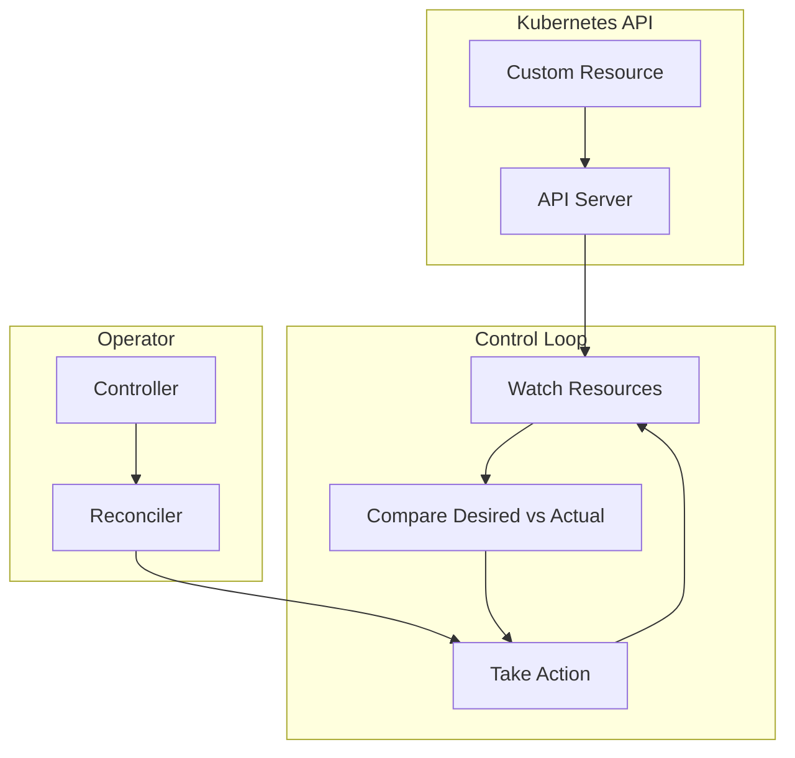

# How to Implement Custom Controllers and Operators in Kubernetes

Author: [nawazdhandala](https://www.github.com/nawazdhandala)

Tags: Kubernetes, Operators, Custom Controllers, CRD, Go, Kubebuilder, DevOps

Description: A comprehensive guide to building custom Kubernetes controllers and operators using Kubebuilder, including CRD design, reconciliation loops, and production deployment patterns.

---

Operators extend Kubernetes to manage complex applications automatically. Instead of writing scripts and runbooks, you encode operational knowledge into code that runs in your cluster.

## Understanding Controllers and Operators



### Controller vs Operator

| Term | Description |
|------|-------------|
| Controller | Code that watches resources and reconciles state |
| Operator | Controller + Custom Resource Definitions (CRDs) |
| CRD | Custom API type extending Kubernetes |
| Reconciler | Function that ensures desired state matches actual state |

## Setting Up Your Development Environment

### Install Kubebuilder

```bash
# Download kubebuilder
curl -L -o kubebuilder https://go.kubebuilder.io/dl/latest/$(go env GOOS)/$(go env GOARCH)
chmod +x kubebuilder
sudo mv kubebuilder /usr/local/bin/

# Verify installation
kubebuilder version
```

### Initialize Project

```bash
# Create project directory
mkdir my-operator && cd my-operator

# Initialize Go module
go mod init github.com/myorg/my-operator

# Initialize kubebuilder project
kubebuilder init --domain myorg.com --repo github.com/myorg/my-operator

# Create API (CRD + Controller)
kubebuilder create api --group apps --version v1 --kind Application
```

## Creating a Custom Resource Definition

### Define the API

Edit `api/v1/application_types.go`:

```go
package v1

import (
    metav1 "k8s.io/apimachinery/pkg/apis/meta/v1"
)

// ApplicationSpec defines the desired state of Application
type ApplicationSpec struct {
    // Image is the container image to deploy
    // +kubebuilder:validation:Required
    Image string `json:"image"`

    // Replicas is the number of desired pods
    // +kubebuilder:validation:Minimum=1
    // +kubebuilder:validation:Maximum=10
    // +kubebuilder:default=1
    Replicas int32 `json:"replicas,omitempty"`

    // Port is the container port
    // +kubebuilder:validation:Minimum=1
    // +kubebuilder:validation:Maximum=65535
    // +kubebuilder:default=8080
    Port int32 `json:"port,omitempty"`

    // Resources defines compute resources
    Resources ResourceRequirements `json:"resources,omitempty"`

    // Environment variables
    Env []EnvVar `json:"env,omitempty"`
}

type ResourceRequirements struct {
    // CPU request (e.g., "100m")
    CPU string `json:"cpu,omitempty"`
    // Memory request (e.g., "128Mi")
    Memory string `json:"memory,omitempty"`
}

type EnvVar struct {
    Name  string `json:"name"`
    Value string `json:"value"`
}

// ApplicationStatus defines the observed state of Application
type ApplicationStatus struct {
    // Conditions represent the latest observations
    Conditions []metav1.Condition `json:"conditions,omitempty"`

    // AvailableReplicas is the number of ready pods
    AvailableReplicas int32 `json:"availableReplicas,omitempty"`

    // Phase represents the current lifecycle phase
    // +kubebuilder:validation:Enum=Pending;Running;Failed
    Phase string `json:"phase,omitempty"`
}

// +kubebuilder:object:root=true
// +kubebuilder:subresource:status
// +kubebuilder:printcolumn:name="Image",type="string",JSONPath=".spec.image"
// +kubebuilder:printcolumn:name="Replicas",type="integer",JSONPath=".spec.replicas"
// +kubebuilder:printcolumn:name="Available",type="integer",JSONPath=".status.availableReplicas"
// +kubebuilder:printcolumn:name="Phase",type="string",JSONPath=".status.phase"
// +kubebuilder:printcolumn:name="Age",type="date",JSONPath=".metadata.creationTimestamp"

// Application is the Schema for the applications API
type Application struct {
    metav1.TypeMeta   `json:",inline"`
    metav1.ObjectMeta `json:"metadata,omitempty"`

    Spec   ApplicationSpec   `json:"spec,omitempty"`
    Status ApplicationStatus `json:"status,omitempty"`
}

// +kubebuilder:object:root=true

// ApplicationList contains a list of Application
type ApplicationList struct {
    metav1.TypeMeta `json:",inline"`
    metav1.ListMeta `json:"metadata,omitempty"`
    Items           []Application `json:"items"`
}

func init() {
    SchemeBuilder.Register(&Application{}, &ApplicationList{})
}
```

### Generate CRD

```bash
# Generate manifests (CRDs, RBAC)
make manifests

# View generated CRD
cat config/crd/bases/apps.myorg.com_applications.yaml
```

## Implementing the Controller

Edit `internal/controller/application_controller.go`:

```go
package controller

import (
    "context"
    "fmt"

    appsv1 "k8s.io/api/apps/v1"
    corev1 "k8s.io/api/core/v1"
    "k8s.io/apimachinery/pkg/api/errors"
    "k8s.io/apimachinery/pkg/api/resource"
    metav1 "k8s.io/apimachinery/pkg/apis/meta/v1"
    "k8s.io/apimachinery/pkg/runtime"
    "k8s.io/apimachinery/pkg/types"
    "k8s.io/apimachinery/pkg/util/intstr"
    ctrl "sigs.k8s.io/controller-runtime"
    "sigs.k8s.io/controller-runtime/pkg/client"
    "sigs.k8s.io/controller-runtime/pkg/controller/controllerutil"
    "sigs.k8s.io/controller-runtime/pkg/log"

    myappsv1 "github.com/myorg/my-operator/api/v1"
)

// ApplicationReconciler reconciles an Application object
type ApplicationReconciler struct {
    client.Client
    Scheme *runtime.Scheme
}

// +kubebuilder:rbac:groups=apps.myorg.com,resources=applications,verbs=get;list;watch;create;update;patch;delete
// +kubebuilder:rbac:groups=apps.myorg.com,resources=applications/status,verbs=get;update;patch
// +kubebuilder:rbac:groups=apps.myorg.com,resources=applications/finalizers,verbs=update
// +kubebuilder:rbac:groups=apps,resources=deployments,verbs=get;list;watch;create;update;patch;delete
// +kubebuilder:rbac:groups=core,resources=services,verbs=get;list;watch;create;update;patch;delete

func (r *ApplicationReconciler) Reconcile(ctx context.Context, req ctrl.Request) (ctrl.Result, error) {
    logger := log.FromContext(ctx)
    logger.Info("Reconciling Application", "name", req.Name, "namespace", req.Namespace)

    // Fetch the Application instance
    app := &myappsv1.Application{}
    if err := r.Get(ctx, req.NamespacedName, app); err != nil {
        if errors.IsNotFound(err) {
            logger.Info("Application resource not found. Ignoring since object must be deleted")
            return ctrl.Result{}, nil
        }
        logger.Error(err, "Failed to get Application")
        return ctrl.Result{}, err
    }

    // Handle deletion
    if !app.DeletionTimestamp.IsZero() {
        return r.handleDeletion(ctx, app)
    }

    // Add finalizer if not present
    if !controllerutil.ContainsFinalizer(app, "apps.myorg.com/finalizer") {
        controllerutil.AddFinalizer(app, "apps.myorg.com/finalizer")
        if err := r.Update(ctx, app); err != nil {
            return ctrl.Result{}, err
        }
    }

    // Reconcile Deployment
    if err := r.reconcileDeployment(ctx, app); err != nil {
        return ctrl.Result{}, err
    }

    // Reconcile Service
    if err := r.reconcileService(ctx, app); err != nil {
        return ctrl.Result{}, err
    }

    // Update status
    if err := r.updateStatus(ctx, app); err != nil {
        return ctrl.Result{}, err
    }

    return ctrl.Result{}, nil
}

func (r *ApplicationReconciler) reconcileDeployment(ctx context.Context, app *myappsv1.Application) error {
    logger := log.FromContext(ctx)

    deployment := &appsv1.Deployment{}
    err := r.Get(ctx, types.NamespacedName{Name: app.Name, Namespace: app.Namespace}, deployment)

    if err != nil && errors.IsNotFound(err) {
        // Create new deployment
        deployment = r.deploymentForApplication(app)
        if err := controllerutil.SetControllerReference(app, deployment, r.Scheme); err != nil {
            return err
        }
        logger.Info("Creating Deployment", "name", deployment.Name)
        return r.Create(ctx, deployment)
    } else if err != nil {
        return err
    }

    // Update existing deployment if needed
    if needsUpdate(deployment, app) {
        deployment.Spec.Replicas = &app.Spec.Replicas
        deployment.Spec.Template.Spec.Containers[0].Image = app.Spec.Image
        logger.Info("Updating Deployment", "name", deployment.Name)
        return r.Update(ctx, deployment)
    }

    return nil
}

func (r *ApplicationReconciler) deploymentForApplication(app *myappsv1.Application) *appsv1.Deployment {
    labels := map[string]string{
        "app":        app.Name,
        "controller": "application-operator",
    }

    replicas := app.Spec.Replicas

    envVars := []corev1.EnvVar{}
    for _, env := range app.Spec.Env {
        envVars = append(envVars, corev1.EnvVar{
            Name:  env.Name,
            Value: env.Value,
        })
    }

    resources := corev1.ResourceRequirements{}
    if app.Spec.Resources.CPU != "" || app.Spec.Resources.Memory != "" {
        resources.Requests = corev1.ResourceList{}
        resources.Limits = corev1.ResourceList{}
        if app.Spec.Resources.CPU != "" {
            resources.Requests[corev1.ResourceCPU] = resource.MustParse(app.Spec.Resources.CPU)
            resources.Limits[corev1.ResourceCPU] = resource.MustParse(app.Spec.Resources.CPU)
        }
        if app.Spec.Resources.Memory != "" {
            resources.Requests[corev1.ResourceMemory] = resource.MustParse(app.Spec.Resources.Memory)
            resources.Limits[corev1.ResourceMemory] = resource.MustParse(app.Spec.Resources.Memory)
        }
    }

    return &appsv1.Deployment{
        ObjectMeta: metav1.ObjectMeta{
            Name:      app.Name,
            Namespace: app.Namespace,
            Labels:    labels,
        },
        Spec: appsv1.DeploymentSpec{
            Replicas: &replicas,
            Selector: &metav1.LabelSelector{
                MatchLabels: labels,
            },
            Template: corev1.PodTemplateSpec{
                ObjectMeta: metav1.ObjectMeta{
                    Labels: labels,
                },
                Spec: corev1.PodSpec{
                    Containers: []corev1.Container{{
                        Name:      "app",
                        Image:     app.Spec.Image,
                        Ports: []corev1.ContainerPort{{
                            ContainerPort: app.Spec.Port,
                            Protocol:      corev1.ProtocolTCP,
                        }},
                        Env:       envVars,
                        Resources: resources,
                    }},
                },
            },
        },
    }
}

func (r *ApplicationReconciler) reconcileService(ctx context.Context, app *myappsv1.Application) error {
    logger := log.FromContext(ctx)

    service := &corev1.Service{}
    err := r.Get(ctx, types.NamespacedName{Name: app.Name, Namespace: app.Namespace}, service)

    if err != nil && errors.IsNotFound(err) {
        service = r.serviceForApplication(app)
        if err := controllerutil.SetControllerReference(app, service, r.Scheme); err != nil {
            return err
        }
        logger.Info("Creating Service", "name", service.Name)
        return r.Create(ctx, service)
    }

    return err
}

func (r *ApplicationReconciler) serviceForApplication(app *myappsv1.Application) *corev1.Service {
    labels := map[string]string{
        "app": app.Name,
    }

    return &corev1.Service{
        ObjectMeta: metav1.ObjectMeta{
            Name:      app.Name,
            Namespace: app.Namespace,
            Labels:    labels,
        },
        Spec: corev1.ServiceSpec{
            Selector: labels,
            Ports: []corev1.ServicePort{{
                Port:       app.Spec.Port,
                TargetPort: intstr.FromInt(int(app.Spec.Port)),
                Protocol:   corev1.ProtocolTCP,
            }},
            Type: corev1.ServiceTypeClusterIP,
        },
    }
}

func (r *ApplicationReconciler) updateStatus(ctx context.Context, app *myappsv1.Application) error {
    deployment := &appsv1.Deployment{}
    if err := r.Get(ctx, types.NamespacedName{Name: app.Name, Namespace: app.Namespace}, deployment); err != nil {
        return err
    }

    app.Status.AvailableReplicas = deployment.Status.AvailableReplicas

    if deployment.Status.AvailableReplicas == *deployment.Spec.Replicas {
        app.Status.Phase = "Running"
    } else if deployment.Status.AvailableReplicas > 0 {
        app.Status.Phase = "Pending"
    } else {
        app.Status.Phase = "Pending"
    }

    return r.Status().Update(ctx, app)
}

func (r *ApplicationReconciler) handleDeletion(ctx context.Context, app *myappsv1.Application) (ctrl.Result, error) {
    logger := log.FromContext(ctx)

    if controllerutil.ContainsFinalizer(app, "apps.myorg.com/finalizer") {
        // Perform cleanup
        logger.Info("Performing cleanup for Application", "name", app.Name)

        // Remove finalizer
        controllerutil.RemoveFinalizer(app, "apps.myorg.com/finalizer")
        if err := r.Update(ctx, app); err != nil {
            return ctrl.Result{}, err
        }
    }

    return ctrl.Result{}, nil
}

func needsUpdate(deployment *appsv1.Deployment, app *myappsv1.Application) bool {
    if *deployment.Spec.Replicas != app.Spec.Replicas {
        return true
    }
    if len(deployment.Spec.Template.Spec.Containers) > 0 &&
        deployment.Spec.Template.Spec.Containers[0].Image != app.Spec.Image {
        return true
    }
    return false
}

// SetupWithManager sets up the controller with the Manager
func (r *ApplicationReconciler) SetupWithManager(mgr ctrl.Manager) error {
    return ctrl.NewControllerManagedBy(mgr).
        For(&myappsv1.Application{}).
        Owns(&appsv1.Deployment{}).
        Owns(&corev1.Service{}).
        Complete(r)
}
```

## Testing the Operator

### Unit Tests

```go
// internal/controller/application_controller_test.go
package controller

import (
    "context"
    "time"

    . "github.com/onsi/ginkgo/v2"
    . "github.com/onsi/gomega"
    appsv1 "k8s.io/api/apps/v1"
    corev1 "k8s.io/api/core/v1"
    metav1 "k8s.io/apimachinery/pkg/apis/meta/v1"
    "k8s.io/apimachinery/pkg/types"

    myappsv1 "github.com/myorg/my-operator/api/v1"
)

var _ = Describe("Application Controller", func() {
    const (
        AppName      = "test-app"
        AppNamespace = "default"
        timeout      = time.Second * 10
        interval     = time.Millisecond * 250
    )

    Context("When creating an Application", func() {
        It("Should create a Deployment and Service", func() {
            ctx := context.Background()

            app := &myappsv1.Application{
                ObjectMeta: metav1.ObjectMeta{
                    Name:      AppName,
                    Namespace: AppNamespace,
                },
                Spec: myappsv1.ApplicationSpec{
                    Image:    "nginx:latest",
                    Replicas: 2,
                    Port:     80,
                },
            }

            Expect(k8sClient.Create(ctx, app)).Should(Succeed())

            // Verify Deployment is created
            deploymentLookupKey := types.NamespacedName{Name: AppName, Namespace: AppNamespace}
            createdDeployment := &appsv1.Deployment{}

            Eventually(func() bool {
                err := k8sClient.Get(ctx, deploymentLookupKey, createdDeployment)
                return err == nil
            }, timeout, interval).Should(BeTrue())

            Expect(*createdDeployment.Spec.Replicas).Should(Equal(int32(2)))
            Expect(createdDeployment.Spec.Template.Spec.Containers[0].Image).Should(Equal("nginx:latest"))

            // Verify Service is created
            serviceLookupKey := types.NamespacedName{Name: AppName, Namespace: AppNamespace}
            createdService := &corev1.Service{}

            Eventually(func() bool {
                err := k8sClient.Get(ctx, serviceLookupKey, createdService)
                return err == nil
            }, timeout, interval).Should(BeTrue())
        })
    })
})
```

Run tests:

```bash
make test
```

### Local Testing

```bash
# Install CRDs
make install

# Run controller locally
make run

# In another terminal, create an Application
kubectl apply -f - <<EOF
apiVersion: apps.myorg.com/v1
kind: Application
metadata:
  name: my-app
  namespace: default
spec:
  image: nginx:latest
  replicas: 3
  port: 80
  resources:
    cpu: "100m"
    memory: "128Mi"
  env:
    - name: ENV
      value: production
EOF

# Check resources
kubectl get applications
kubectl get deployments
kubectl get services
```

## Building and Deploying

### Build Container Image

```bash
# Build and push image
make docker-build docker-push IMG=myregistry/my-operator:v1.0.0
```

### Deploy to Cluster

```bash
# Deploy the operator
make deploy IMG=myregistry/my-operator:v1.0.0

# Check operator is running
kubectl get pods -n my-operator-system
```

### Helm Chart

Generate Helm chart:

```bash
kubebuilder edit --plugins=helm/v1-alpha
```

Or create manually:

```yaml
# charts/my-operator/values.yaml
replicaCount: 1

image:
  repository: myregistry/my-operator
  tag: v1.0.0
  pullPolicy: IfNotPresent

resources:
  limits:
    cpu: 200m
    memory: 128Mi
  requests:
    cpu: 100m
    memory: 64Mi

serviceAccount:
  create: true
  name: my-operator
```

## Advanced Patterns

### Webhook Validation

```go
// api/v1/application_webhook.go
package v1

import (
    "k8s.io/apimachinery/pkg/runtime"
    ctrl "sigs.k8s.io/controller-runtime"
    "sigs.k8s.io/controller-runtime/pkg/webhook"
    "sigs.k8s.io/controller-runtime/pkg/webhook/admission"
)

func (r *Application) SetupWebhookWithManager(mgr ctrl.Manager) error {
    return ctrl.NewWebhookManagedBy(mgr).
        For(r).
        Complete()
}

// +kubebuilder:webhook:path=/mutate-apps-myorg-com-v1-application,mutating=true,failurePolicy=fail,sideEffects=None,groups=apps.myorg.com,resources=applications,verbs=create;update,versions=v1,name=mapplication.kb.io,admissionReviewVersions=v1

var _ webhook.Defaulter = &Application{}

// Default implements webhook.Defaulter
func (r *Application) Default() {
    if r.Spec.Replicas == 0 {
        r.Spec.Replicas = 1
    }
    if r.Spec.Port == 0 {
        r.Spec.Port = 8080
    }
}

// +kubebuilder:webhook:path=/validate-apps-myorg-com-v1-application,mutating=false,failurePolicy=fail,sideEffects=None,groups=apps.myorg.com,resources=applications,verbs=create;update,versions=v1,name=vapplication.kb.io,admissionReviewVersions=v1

var _ webhook.Validator = &Application{}

// ValidateCreate implements webhook.Validator
func (r *Application) ValidateCreate() (admission.Warnings, error) {
    return nil, r.validateApplication()
}

// ValidateUpdate implements webhook.Validator
func (r *Application) ValidateUpdate(old runtime.Object) (admission.Warnings, error) {
    return nil, r.validateApplication()
}

// ValidateDelete implements webhook.Validator
func (r *Application) ValidateDelete() (admission.Warnings, error) {
    return nil, nil
}

func (r *Application) validateApplication() error {
    // Custom validation logic
    return nil
}
```

### Status Conditions

```go
import (
    metav1 "k8s.io/apimachinery/pkg/apis/meta/v1"
    "k8s.io/apimachinery/pkg/api/meta"
)

func (r *ApplicationReconciler) setCondition(app *myappsv1.Application, conditionType string, status metav1.ConditionStatus, reason, message string) {
    meta.SetStatusCondition(&app.Status.Conditions, metav1.Condition{
        Type:               conditionType,
        Status:             status,
        Reason:             reason,
        Message:            message,
        LastTransitionTime: metav1.Now(),
    })
}

// Usage in reconciler
r.setCondition(app, "Ready", metav1.ConditionTrue, "DeploymentReady", "Deployment has minimum availability")
r.setCondition(app, "Progressing", metav1.ConditionFalse, "NewReplicaSetAvailable", "Deployment has completed")
```

### Leader Election

```go
// main.go
mgr, err := ctrl.NewManager(ctrl.GetConfigOrDie(), ctrl.Options{
    Scheme:                 scheme,
    LeaderElection:         true,
    LeaderElectionID:       "my-operator.myorg.com",
    LeaderElectionNamespace: "my-operator-system",
})
```

## Monitoring the Operator

### Metrics

```go
import (
    "github.com/prometheus/client_golang/prometheus"
    "sigs.k8s.io/controller-runtime/pkg/metrics"
)

var (
    reconcileTotal = prometheus.NewCounterVec(
        prometheus.CounterOpts{
            Name: "application_reconcile_total",
            Help: "Total number of reconciliations",
        },
        []string{"name", "namespace", "result"},
    )
)

func init() {
    metrics.Registry.MustRegister(reconcileTotal)
}

// In reconciler
reconcileTotal.WithLabelValues(app.Name, app.Namespace, "success").Inc()
```

### ServiceMonitor

```yaml
apiVersion: monitoring.coreos.com/v1
kind: ServiceMonitor
metadata:
  name: my-operator
  namespace: my-operator-system
spec:
  selector:
    matchLabels:
      control-plane: controller-manager
  endpoints:
    - port: https
      scheme: https
      bearerTokenFile: /var/run/secrets/kubernetes.io/serviceaccount/token
      tlsConfig:
        insecureSkipVerify: true
```

## Best Practices

1. **Use owner references** - Let Kubernetes garbage collect child resources
2. **Implement finalizers** - Clean up external resources on deletion
3. **Use status subresource** - Update status separately from spec
4. **Add webhooks** - Validate resources before they're stored
5. **Enable leader election** - Run multiple replicas safely
6. **Export metrics** - Monitor operator health and performance
7. **Write comprehensive tests** - Unit, integration, and e2e tests
8. **Handle edge cases** - Resource not found, conflicts, rate limiting

---

Custom controllers and operators let you automate complex operational tasks in Kubernetes. Start with simple controllers, add CRDs when you need custom APIs, and gradually add webhooks and advanced features. Use Kubebuilder to generate boilerplate and focus on your business logic.
