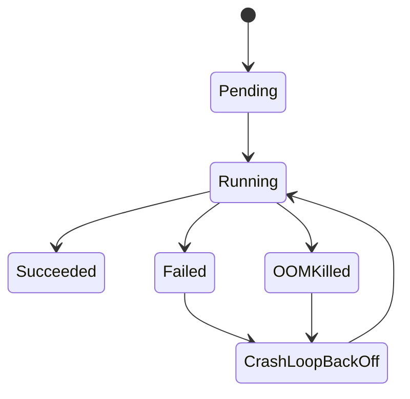

# How to Debug CrashLoopBackOff and OOMKilled Pods in Kubernetes

Author: [nawazdhandala](https://www.github.com/nawazdhandala)

Tags: Kubernetes, Troubleshooting, CrashLoopBackOff, OOMKilled, Debugging, DevOps

Description: A systematic guide to diagnosing and fixing CrashLoopBackOff and OOMKilled errors in Kubernetes, including common causes, debugging techniques, and prevention strategies.

---

CrashLoopBackOff and OOMKilled are the two most common pod failures in Kubernetes. This guide gives you a systematic approach to diagnose and fix them quickly.

## Understanding Pod States



### CrashLoopBackOff

The container starts, crashes, Kubernetes restarts it, it crashes again. After repeated failures, Kubernetes backs off (waits longer between restarts).

**Backoff timing**: 10s, 20s, 40s, 80s, 160s, 300s (max)

### OOMKilled

The container exceeded its memory limit or the node ran out of memory. Kubernetes kills the container.

## Quick Diagnosis Commands

```bash
# Get pod status
kubectl get pods -n <namespace>

# Describe pod for events and state
kubectl describe pod <pod-name> -n <namespace>

# Get logs (current container)
kubectl logs <pod-name> -n <namespace>

# Get logs (previous crashed container)
kubectl logs <pod-name> -n <namespace> --previous

# Get logs for specific container
kubectl logs <pod-name> -c <container-name> -n <namespace> --previous

# Check events
kubectl get events -n <namespace> --sort-by='.lastTimestamp' | grep <pod-name>
```

## CrashLoopBackOff Debugging

### Step 1: Check the Logs

```bash
# Current container logs
kubectl logs <pod-name> -n <namespace>

# Previous container logs (crucial for crashes)
kubectl logs <pod-name> -n <namespace> --previous
```

If logs are empty, the container might be crashing before producing output. Check init containers:

```bash
kubectl logs <pod-name> -c <init-container-name> -n <namespace>
```

### Step 2: Examine Pod Events

```bash
kubectl describe pod <pod-name> -n <namespace>
```

Look for:
- **Back-off restarting failed container** - Generic crash
- **Error: ImagePullBackOff** - Image issue, not crash
- **Error: ErrImagePull** - Can't pull image
- **Liveness probe failed** - Health check killing the container

### Step 3: Common Causes and Fixes

#### Cause 1: Application Error

**Symptoms**: Error messages in logs

```bash
kubectl logs <pod-name> --previous
# Error: Cannot connect to database
# Error: Missing required environment variable
```

**Fix**: Fix the application error, check environment variables, check secrets

```bash
# Check environment variables
kubectl exec <pod-name> -- env

# Check if secrets/configmaps exist
kubectl get secret <secret-name> -n <namespace>
kubectl get configmap <config-name> -n <namespace>
```

#### Cause 2: Missing or Wrong Image

**Symptoms**: `ErrImagePull` or `ImagePullBackOff`

```bash
kubectl describe pod <pod-name> | grep -A 5 "Events"
# Warning  Failed   pull image "myapp:wrong-tag": not found
```

**Fix**: Verify image exists and tag is correct

```bash
# Test pulling the image
docker pull myregistry/myapp:tag
```

#### Cause 3: Permission Denied

**Symptoms**:

```
Error: cannot open /data/config: permission denied
```

**Fix**: Check securityContext and volume permissions

```yaml
spec:
  securityContext:
    runAsUser: 1000
    fsGroup: 1000
  containers:
    - name: app
      securityContext:
        runAsNonRoot: true
```

#### Cause 4: Command/Entrypoint Issues

**Symptoms**: Container exits immediately

```bash
# Check the command being run
kubectl get pod <pod-name> -o jsonpath='{.spec.containers[0].command}'
```

**Fix**: Verify command exists in image

```yaml
spec:
  containers:
    - name: app
      command: ["/bin/sh", "-c"]
      args: ["exec /app/server"]
```

#### Cause 5: Liveness Probe Killing Container

**Symptoms**:

```
Warning  Unhealthy  Liveness probe failed: HTTP probe failed
```

**Fix**: Adjust probe settings

```yaml
livenessProbe:
  httpGet:
    path: /healthz
    port: 8080
  initialDelaySeconds: 30  # Give app time to start
  periodSeconds: 10
  failureThreshold: 3      # Allow some failures
```

#### Cause 6: Resource Limits Too Low

**Symptoms**: OOMKilled (memory) or slow/hanging (CPU)

```bash
kubectl describe pod <pod-name> | grep -A 3 "Last State"
# Reason: OOMKilled
```

**Fix**: Increase resource limits (see OOMKilled section below)

### Step 4: Debug Interactively

If the container crashes too fast to debug:

```bash
# Override entrypoint to keep container running
kubectl run debug-pod --rm -it \
  --image=myapp:tag \
  --overrides='{"spec":{"containers":[{"name":"debug","image":"myapp:tag","command":["sleep","infinity"]}]}}' \
  -- /bin/sh

# Or use kubectl debug (requires Kubernetes 1.18+)
kubectl debug <pod-name> -it --copy-to=debug-pod --container=myapp -- /bin/sh
```

## OOMKilled Debugging

### Step 1: Confirm OOMKilled

```bash
kubectl describe pod <pod-name> | grep -A 5 "Last State"
```

Output:
```
Last State:     Terminated
  Reason:       OOMKilled
  Exit Code:    137
  Started:      Mon, 06 Jan 2026 10:00:00 +0000
  Finished:     Mon, 06 Jan 2026 10:05:00 +0000
```

Exit code 137 = SIGKILL (usually OOM)

### Step 2: Check Memory Usage

```bash
# Current usage
kubectl top pod <pod-name> -n <namespace>

# Check limits
kubectl get pod <pod-name> -o jsonpath='{.spec.containers[*].resources}'
```

### Step 3: Common Causes and Fixes

#### Cause 1: Memory Limit Too Low

**Fix**: Increase memory limit based on actual usage

```bash
# Check what the pod actually needs
kubectl top pods -n <namespace> --containers
```

```yaml
resources:
  requests:
    memory: 256Mi
  limits:
    memory: 512Mi  # Increase this
```

#### Cause 2: Memory Leak in Application

**Symptoms**: Memory usage grows over time until OOM

**Fix**: Profile the application, fix the leak

```bash
# Watch memory over time
watch kubectl top pod <pod-name>
```

#### Cause 3: JVM Heap Configuration

**Symptoms**: Java apps ignoring container limits

**Fix**: Set JVM heap explicitly

```yaml
env:
  - name: JAVA_OPTS
    value: "-Xmx384m -Xms256m"
  # Or use container-aware options (Java 10+)
  - name: JAVA_OPTS
    value: "-XX:+UseContainerSupport -XX:MaxRAMPercentage=75.0"
```

#### Cause 4: Node Memory Pressure

**Symptoms**: Multiple pods OOMKilled across the node

```bash
# Check node conditions
kubectl describe node <node-name> | grep -A 5 "Conditions"

# Check memory pressure
kubectl get nodes -o custom-columns=NAME:.metadata.name,MEM:.status.conditions[?(@.type==\"MemoryPressure\")].status
```

**Fix**: Add more nodes, reduce workload, or evict low-priority pods

### Step 4: Calculate Right Memory Limit

```bash
# Collect metrics over time
kubectl top pods -n <namespace> --containers | tee -a memory-metrics.txt

# After collecting enough data, find P99
cat memory-metrics.txt | awk '{print $3}' | sort -n | tail -1
```

Set limit to P99 + 20% buffer:

```yaml
resources:
  requests:
    memory: 256Mi   # P50 usage
  limits:
    memory: 384Mi   # P99 + buffer
```

## Prevention Strategies

### Set Resource Requests and Limits

```yaml
resources:
  requests:
    cpu: 100m
    memory: 256Mi
  limits:
    cpu: 500m
    memory: 512Mi
```

### Use Quality of Service Classes

**Guaranteed** (requests = limits): Highest priority, last to be killed

```yaml
resources:
  requests:
    cpu: 500m
    memory: 512Mi
  limits:
    cpu: 500m
    memory: 512Mi
```

### Implement Proper Health Checks

```yaml
livenessProbe:
  httpGet:
    path: /healthz
    port: 8080
  initialDelaySeconds: 30
  periodSeconds: 10
  failureThreshold: 3

readinessProbe:
  httpGet:
    path: /ready
    port: 8080
  initialDelaySeconds: 5
  periodSeconds: 5

startupProbe:
  httpGet:
    path: /healthz
    port: 8080
  failureThreshold: 30
  periodSeconds: 10
```

### Use Vertical Pod Autoscaler

Let VPA recommend right-sized resources:

```yaml
apiVersion: autoscaling.k8s.io/v1
kind: VerticalPodAutoscaler
metadata:
  name: myapp-vpa
spec:
  targetRef:
    apiVersion: apps/v1
    kind: Deployment
    name: myapp
  updatePolicy:
    updateMode: "Off"  # Just recommendations
```

## Monitoring and Alerting

### Prometheus Alerts

```yaml
apiVersion: monitoring.coreos.com/v1
kind: PrometheusRule
metadata:
  name: pod-alerts
spec:
  groups:
    - name: pods
      rules:
        - alert: PodCrashLooping
          expr: |
            rate(kube_pod_container_status_restarts_total[15m]) > 0
          for: 5m
          labels:
            severity: warning
          annotations:
            summary: "Pod {{ $labels.pod }} is crash looping"

        - alert: PodOOMKilled
          expr: |
            kube_pod_container_status_last_terminated_reason{reason="OOMKilled"} == 1
          for: 0m
          labels:
            severity: warning
          annotations:
            summary: "Pod {{ $labels.pod }} was OOMKilled"

        - alert: ContainerMemoryNearLimit
          expr: |
            container_memory_usage_bytes / container_spec_memory_limit_bytes > 0.9
          for: 5m
          labels:
            severity: warning
          annotations:
            summary: "Container {{ $labels.container }} memory at 90% of limit"
```

## Debugging Checklist

### CrashLoopBackOff

- [ ] Check `kubectl logs --previous`
- [ ] Check `kubectl describe pod` events
- [ ] Verify image and tag exist
- [ ] Check environment variables and secrets
- [ ] Verify command/entrypoint
- [ ] Check liveness probe configuration
- [ ] Test image locally with `docker run`

### OOMKilled

- [ ] Confirm OOMKilled in pod status
- [ ] Check current memory usage with `kubectl top`
- [ ] Compare usage to limits
- [ ] Check for memory leaks (usage trending up)
- [ ] Verify JVM/runtime memory settings
- [ ] Check node memory pressure
- [ ] Increase limits or optimize application

---

Most CrashLoopBackOff issues come down to: wrong image, missing configs, or aggressive liveness probes. Most OOMKilled issues are simply memory limits set too low. Start with logs and events, then work through the checklist systematically.
