# How to Diagnose Slow Kubernetes Deployments

Author: [nawazdhandala](https://www.github.com/nawazdhandala)

Tags: Kubernetes, Troubleshooting, Deployments, Performance, DevOps

Description: A systematic guide to diagnosing and fixing slow Kubernetes deployments, from image pull delays to probe timeouts and scheduling bottlenecks.

---

Deployments that take 10 minutes when they should take 30 seconds are frustrating and dangerous. This guide helps you find and fix the bottlenecks.

## Deployment Timeline

A healthy deployment follows this timeline:

```mermaid
gantt
    title Normal Deployment Timeline
    dateFormat X
    axisFormat %s

    section Pod Creation
    API accepts request    :0, 1
    Scheduler places pod   :1, 2

    section Image
    Pull image            :2, 5

    section Container
    Container starts      :5, 6
    Startup probe passes  :6, 10

    section Traffic
    Readiness passes      :10, 11
    Receives traffic      :11, 12
```



When deployments are slow, one of these phases is taking too long.

## Quick Diagnosis

```bash
# Watch deployment progress
kubectl rollout status deployment/<name> -n <namespace>

# Watch pod creation
kubectl get pods -n <namespace> -w

# Get deployment events
kubectl describe deployment <name> -n <namespace>

# Get pod events (for specific slow pod)
kubectl describe pod <pod-name> -n <namespace>

# Timeline of events
kubectl get events -n <namespace> --sort-by='.lastTimestamp'
```

## Problem 1: Image Pull Delays

### Symptoms

```bash
kubectl describe pod <pod-name>
# Events:
# Normal   Pulling    2m ago   Pulling image "myapp:latest"
# Normal   Pulled     30s ago  Successfully pulled image "myapp:latest"
```

Image pull took 1.5 minutes.

### Causes and Fixes

#### Cause 1: Large Images

```bash
# Check image size
docker images myapp:latest
# REPOSITORY   SIZE
# myapp        2.1GB  # Too large!
```

**Fix**: Optimize your Dockerfile

```dockerfile
# Before: 2.1GB
FROM node:18
COPY . .
RUN npm install
CMD ["node", "server.js"]

# After: 150MB
FROM node:18-alpine AS builder
WORKDIR /app
COPY package*.json ./
RUN npm ci --only=production

FROM node:18-alpine
WORKDIR /app
COPY --from=builder /app/node_modules ./node_modules
COPY . .
CMD ["node", "server.js"]
```

#### Cause 2: No Image Caching

**Fix**: Use `imagePullPolicy: IfNotPresent`

```yaml
spec:
  containers:
    - name: myapp
      image: myapp:v1.2.3  # Use specific tag, not :latest
      imagePullPolicy: IfNotPresent
```

#### Cause 3: Registry Throttling

DockerHub, GCR, and others have rate limits.

**Fix**: Use a local registry mirror or pull-through cache

```yaml
# Configure containerd to use mirror
# /etc/containerd/config.toml
[plugins."io.containerd.grpc.v1.cri".registry.mirrors]
  [plugins."io.containerd.grpc.v1.cri".registry.mirrors."docker.io"]
    endpoint = ["https://mirror.gcr.io"]
```

#### Cause 4: Authentication Delays

**Fix**: Pre-create image pull secrets

```bash
kubectl create secret docker-registry regcred \
  --docker-server=<registry> \
  --docker-username=<user> \
  --docker-password=<password>
```

### Measure Image Pull Time

```bash
# Time image pull manually
time crictl pull <image>

# Check kubelet logs for pull times
journalctl -u kubelet | grep "Successfully pulled"
```

## Problem 2: Scheduling Delays

### Symptoms

```bash
kubectl describe pod <pod-name>
# Events:
# Warning  FailedScheduling  default-scheduler  0/10 nodes are available
```

### Causes and Fixes

#### Cause 1: Insufficient Resources

```bash
kubectl describe nodes | grep -A 5 "Allocated resources"
```

**Fix**: Add nodes or reduce resource requests

```yaml
resources:
  requests:
    cpu: 100m     # Reduce if possible
    memory: 128Mi
```

#### Cause 2: Node Affinity/Selector Mismatch

```bash
kubectl describe pod <pod-name>
# 0/10 nodes are available: 1 node(s) had untolerated taint
```

**Fix**: Check node labels and taints

```bash
# View node labels
kubectl get nodes --show-labels

# View node taints
kubectl describe nodes | grep Taints

# Add toleration if needed
spec:
  tolerations:
    - key: "dedicated"
      operator: "Equal"
      value: "web"
      effect: "NoSchedule"
```

#### Cause 3: PVC Binding (WaitForFirstConsumer)

```bash
kubectl describe pod <pod-name>
# waiting for first consumer to be created before binding
```

This is expected behavior but adds latency.

**Fix**: Pre-create PVCs or use immediate binding

```yaml
volumeBindingMode: Immediate  # Instead of WaitForFirstConsumer
```

#### Cause 4: Scheduler Overload

```bash
kubectl logs -n kube-system -l component=kube-scheduler
```

**Fix**: Check scheduler health, consider multiple schedulers for large clusters

## Problem 3: Container Startup Delays

### Symptoms

Container is Running but not Ready for a long time.

```bash
kubectl get pods
# NAME        READY   STATUS    RESTARTS   AGE
# myapp-xxx   0/1     Running   0          5m
```

### Causes and Fixes

#### Cause 1: Slow Application Startup

**Fix**: Optimize startup or use startup probe

```yaml
startupProbe:
  httpGet:
    path: /healthz
    port: 8080
  failureThreshold: 30
  periodSeconds: 10
  # App has 5 minutes to start
```

#### Cause 2: Database/Service Dependencies

Application waits for dependencies on startup.

**Fix**: Use init containers

```yaml
initContainers:
  - name: wait-for-db
    image: busybox
    command: ['sh', '-c', 'until nc -z postgres 5432; do sleep 1; done']
```

#### Cause 3: Heavy Initialization

Application loads large caches or indexes on startup.

**Fix**: Lazy loading or warm cache separately

```yaml
lifecycle:
  postStart:
    exec:
      command: ["/bin/sh", "-c", "/app/warm-cache.sh &"]
```

## Problem 4: Probe Configuration Issues

### Symptoms

Pod keeps restarting or never becomes Ready.

```bash
kubectl describe pod <pod-name>
# Warning  Unhealthy  Readiness probe failed: connection refused
```

### Causes and Fixes

#### Cause 1: initialDelaySeconds Too Short

```yaml
# Bad: Probe starts before app is listening
readinessProbe:
  initialDelaySeconds: 5  # Too short

# Good: Give app time to start
readinessProbe:
  initialDelaySeconds: 30
```

#### Cause 2: Probe Endpoint Wrong

```bash
# Test the endpoint manually
kubectl exec <pod-name> -- curl -v localhost:8080/healthz
```

#### Cause 3: Probe Timeout Too Short

```yaml
readinessProbe:
  httpGet:
    path: /ready
    port: 8080
  timeoutSeconds: 10  # Increase if endpoint is slow
  periodSeconds: 5
  failureThreshold: 3
```

#### Recommended Probe Configuration

```yaml
startupProbe:
  httpGet:
    path: /healthz
    port: 8080
  failureThreshold: 30
  periodSeconds: 10

livenessProbe:
  httpGet:
    path: /healthz
    port: 8080
  initialDelaySeconds: 0  # Startup probe handles initial delay
  periodSeconds: 10
  timeoutSeconds: 5
  failureThreshold: 3

readinessProbe:
  httpGet:
    path: /ready
    port: 8080
  initialDelaySeconds: 0
  periodSeconds: 5
  timeoutSeconds: 3
  failureThreshold: 3
```

## Problem 5: Rolling Update Strategy

### Symptoms

Deployment progresses very slowly.

```bash
kubectl rollout status deployment/myapp
# Waiting for deployment "myapp" rollout to finish: 1 out of 10 new replicas have been updated
```

### Causes and Fixes

#### Cause 1: Conservative Strategy

```yaml
strategy:
  type: RollingUpdate
  rollingUpdate:
    maxUnavailable: 0     # Only 1 pod at a time
    maxSurge: 1
```

**Fix**: More aggressive (if appropriate)

```yaml
strategy:
  type: RollingUpdate
  rollingUpdate:
    maxUnavailable: 25%
    maxSurge: 25%
```

#### Cause 2: Slow Health Checks

Each pod takes 60 seconds to become Ready = 10 pods take 10 minutes.

**Fix**: Optimize probe timing or parallelize

#### Cause 3: PodDisruptionBudget Blocking

```bash
kubectl get pdb -n <namespace>
kubectl describe pdb <pdb-name>
```

**Fix**: Adjust PDB or add more replicas

## Problem 6: API Server / etcd Slowness

### Symptoms

All operations are slow, not just deployments.

```bash
time kubectl get pods
# real    0m15.234s  # Should be < 1s
```

### Diagnosis

```bash
# Check API server latency
kubectl get --raw /metrics | grep apiserver_request_duration

# Check etcd
kubectl -n kube-system logs -l component=etcd | grep "took too long"
```

**Fix**: Scale API servers, check etcd disk performance

## Deployment Timing Analysis

### Script to Measure Deployment Time

```bash
#!/bin/bash
DEPLOYMENT=$1
NAMESPACE=${2:-default}

echo "Deploying $DEPLOYMENT..."
START=$(date +%s)

kubectl rollout restart deployment/$DEPLOYMENT -n $NAMESPACE
kubectl rollout status deployment/$DEPLOYMENT -n $NAMESPACE

END=$(date +%s)
echo "Deployment took $((END-START)) seconds"

# Breakdown by pod
kubectl get pods -n $NAMESPACE -l app=$DEPLOYMENT -o json | \
  jq -r '.items[] | "\(.metadata.name): \(.status.conditions[] | select(.type=="Ready") | .lastTransitionTime)"'
```

### Prometheus Metrics

```promql
# Deployment duration
histogram_quantile(0.99,
  sum(rate(workqueue_work_duration_seconds_bucket{name="deployment"}[5m])) by (le)
)

# Pod startup latency
histogram_quantile(0.99,
  sum(rate(kubelet_pod_start_duration_seconds_bucket[5m])) by (le)
)

# Container startup latency
histogram_quantile(0.99,
  sum(rate(kubelet_container_manager_latency_microseconds_bucket{operation_type="start"}[5m])) by (le)
)
```

## Optimization Checklist

- [ ] Image size < 500MB (ideally < 200MB)
- [ ] Using specific image tags, not :latest
- [ ] imagePullPolicy: IfNotPresent
- [ ] Resource requests appropriately sized
- [ ] Startup probe for slow-starting apps
- [ ] Reasonable probe timeouts
- [ ] Rolling update strategy balanced for your needs
- [ ] Init containers for dependencies
- [ ] No unnecessary node affinity constraints
- [ ] Registry mirror for high-traffic clusters

---

Slow deployments are usually caused by: large images, aggressive probes, or scheduler constraints. Measure each phase of the deployment, identify the bottleneck, and fix it systematically. A well-optimized deployment should complete in under 2 minutes for most applications.
