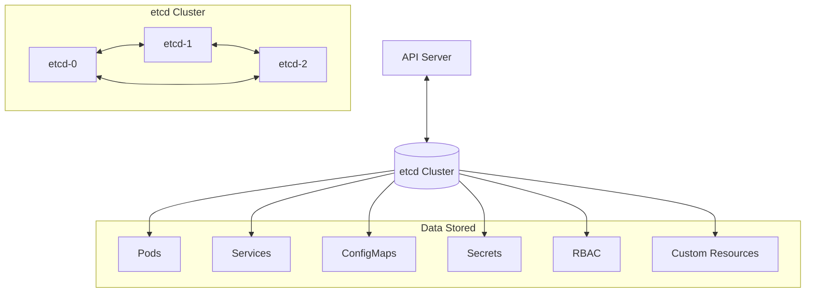

# How to Set Up etcd Backup and Recovery in Kubernetes

Author: [nawazdhandala](https://www.github.com/nawazdhandala)

Tags: Kubernetes, etcd, Backup, Disaster Recovery, High Availability, DevOps

Description: A comprehensive guide to backing up and recovering etcd in Kubernetes, including automated snapshots, disaster recovery procedures, and cluster restoration.

---

etcd is the brain of your Kubernetes cluster. It stores all cluster state - deployments, services, secrets, everything. If etcd is lost without backups, your cluster is unrecoverable. Here's how to protect it.

## Understanding etcd in Kubernetes



## Finding Your etcd Setup

### Managed Kubernetes (EKS, GKE, AKS)

etcd is managed by the cloud provider. You cannot access it directly. Use Velero or similar tools for backup.

### Self-Managed Kubernetes

```bash
# Find etcd pods
kubectl get pods -n kube-system | grep etcd

# Check etcd configuration
kubectl describe pod etcd-<node-name> -n kube-system

# Or check static pod manifest
cat /etc/kubernetes/manifests/etcd.yaml
```

## Manual etcd Backup

### Using etcdctl

```bash
# Set environment variables
export ETCDCTL_API=3
export ETCDCTL_ENDPOINTS=https://127.0.0.1:2379
export ETCDCTL_CACERT=/etc/kubernetes/pki/etcd/ca.crt
export ETCDCTL_CERT=/etc/kubernetes/pki/etcd/server.crt
export ETCDCTL_KEY=/etc/kubernetes/pki/etcd/server.key

# Create snapshot
etcdctl snapshot save /backup/etcd-snapshot-$(date +%Y%m%d-%H%M%S).db

# Verify snapshot
etcdctl snapshot status /backup/etcd-snapshot-*.db --write-out=table
```

### From Outside the Cluster

```bash
# Copy certs from master node
scp root@master:/etc/kubernetes/pki/etcd/ca.crt .
scp root@master:/etc/kubernetes/pki/etcd/server.crt .
scp root@master:/etc/kubernetes/pki/etcd/server.key .

# Create snapshot
ETCDCTL_API=3 etcdctl snapshot save snapshot.db \
  --endpoints=https://<master-ip>:2379 \
  --cacert=ca.crt \
  --cert=server.crt \
  --key=server.key
```

## Automated etcd Backup

### CronJob for Backup

```yaml
apiVersion: batch/v1
kind: CronJob
metadata:
  name: etcd-backup
  namespace: kube-system
spec:
  schedule: "0 */6 * * *"  # Every 6 hours
  jobTemplate:
    spec:
      template:
        spec:
          hostNetwork: true
          nodeSelector:
            node-role.kubernetes.io/control-plane: ""
          tolerations:
            - key: node-role.kubernetes.io/control-plane
              effect: NoSchedule
          containers:
            - name: backup
              image: bitnami/etcd:3.5
              command:
                - /bin/sh
                - -c
                - |
                  ETCDCTL_API=3 etcdctl snapshot save /backup/etcd-$(date +%Y%m%d-%H%M%S).db \
                    --endpoints=https://127.0.0.1:2379 \
                    --cacert=/etc/kubernetes/pki/etcd/ca.crt \
                    --cert=/etc/kubernetes/pki/etcd/server.crt \
                    --key=/etc/kubernetes/pki/etcd/server.key

                  # Verify backup
                  ETCDCTL_API=3 etcdctl snapshot status /backup/etcd-*.db

                  # Cleanup old backups (keep last 10)
                  ls -t /backup/etcd-*.db | tail -n +11 | xargs -r rm
              volumeMounts:
                - name: etcd-certs
                  mountPath: /etc/kubernetes/pki/etcd
                  readOnly: true
                - name: backup
                  mountPath: /backup
          volumes:
            - name: etcd-certs
              hostPath:
                path: /etc/kubernetes/pki/etcd
            - name: backup
              hostPath:
                path: /var/lib/etcd-backup
          restartPolicy: OnFailure
```

### Backup to S3

```yaml
apiVersion: batch/v1
kind: CronJob
metadata:
  name: etcd-backup-s3
  namespace: kube-system
spec:
  schedule: "0 2 * * *"  # Daily at 2 AM
  jobTemplate:
    spec:
      template:
        spec:
          hostNetwork: true
          nodeSelector:
            node-role.kubernetes.io/control-plane: ""
          tolerations:
            - key: node-role.kubernetes.io/control-plane
              effect: NoSchedule
          containers:
            - name: backup
              image: amazon/aws-cli
              env:
                - name: AWS_ACCESS_KEY_ID
                  valueFrom:
                    secretKeyRef:
                      name: aws-credentials
                      key: access-key
                - name: AWS_SECRET_ACCESS_KEY
                  valueFrom:
                    secretKeyRef:
                      name: aws-credentials
                      key: secret-key
              command:
                - /bin/sh
                - -c
                - |
                  # Install etcdctl
                  curl -L https://github.com/etcd-io/etcd/releases/download/v3.5.9/etcd-v3.5.9-linux-amd64.tar.gz | tar xz
                  mv etcd-v3.5.9-linux-amd64/etcdctl /usr/local/bin/

                  # Create snapshot
                  SNAPSHOT_FILE="etcd-$(date +%Y%m%d-%H%M%S).db"
                  ETCDCTL_API=3 etcdctl snapshot save /tmp/$SNAPSHOT_FILE \
                    --endpoints=https://127.0.0.1:2379 \
                    --cacert=/etc/kubernetes/pki/etcd/ca.crt \
                    --cert=/etc/kubernetes/pki/etcd/server.crt \
                    --key=/etc/kubernetes/pki/etcd/server.key

                  # Upload to S3
                  aws s3 cp /tmp/$SNAPSHOT_FILE s3://my-etcd-backups/cluster-name/

                  # Cleanup old backups in S3 (keep 30 days)
                  aws s3 ls s3://my-etcd-backups/cluster-name/ | \
                    while read -r line; do
                      createDate=$(echo $line | awk '{print $1" "$2}')
                      createDate=$(date -d "$createDate" +%s)
                      olderThan=$(date --date="30 days ago" +%s)
                      if [[ $createDate -lt $olderThan ]]; then
                        fileName=$(echo $line | awk '{print $4}')
                        aws s3 rm s3://my-etcd-backups/cluster-name/$fileName
                      fi
                    done
              volumeMounts:
                - name: etcd-certs
                  mountPath: /etc/kubernetes/pki/etcd
                  readOnly: true
          volumes:
            - name: etcd-certs
              hostPath:
                path: /etc/kubernetes/pki/etcd
          restartPolicy: OnFailure
```

## etcd Restoration

### Single-Node Restoration

```bash
# Stop API server and etcd
mv /etc/kubernetes/manifests/kube-apiserver.yaml /tmp/
mv /etc/kubernetes/manifests/etcd.yaml /tmp/

# Wait for containers to stop
sleep 30

# Backup current data (just in case)
mv /var/lib/etcd /var/lib/etcd.bak

# Restore from snapshot
ETCDCTL_API=3 etcdctl snapshot restore /backup/etcd-snapshot.db \
  --data-dir=/var/lib/etcd \
  --name=<node-name> \
  --initial-cluster=<node-name>=https://<node-ip>:2380 \
  --initial-advertise-peer-urls=https://<node-ip>:2380

# Fix permissions
chown -R etcd:etcd /var/lib/etcd

# Restore manifests
mv /tmp/etcd.yaml /etc/kubernetes/manifests/
mv /tmp/kube-apiserver.yaml /etc/kubernetes/manifests/

# Wait for cluster to come up
sleep 60
kubectl get nodes
```

### Multi-Node Restoration

Restore on all control plane nodes:

```bash
# On ALL control plane nodes:

# 1. Stop API server and etcd
systemctl stop kubelet
mv /etc/kubernetes/manifests/kube-apiserver.yaml /tmp/
mv /etc/kubernetes/manifests/etcd.yaml /tmp/
sleep 30

# 2. Backup current data
mv /var/lib/etcd /var/lib/etcd.bak

# 3. Restore from snapshot (run on each node with correct values)
# Node 1:
ETCDCTL_API=3 etcdctl snapshot restore /backup/etcd-snapshot.db \
  --data-dir=/var/lib/etcd \
  --name=node1 \
  --initial-cluster=node1=https://10.0.0.1:2380,node2=https://10.0.0.2:2380,node3=https://10.0.0.3:2380 \
  --initial-advertise-peer-urls=https://10.0.0.1:2380

# Node 2:
ETCDCTL_API=3 etcdctl snapshot restore /backup/etcd-snapshot.db \
  --data-dir=/var/lib/etcd \
  --name=node2 \
  --initial-cluster=node1=https://10.0.0.1:2380,node2=https://10.0.0.2:2380,node3=https://10.0.0.3:2380 \
  --initial-advertise-peer-urls=https://10.0.0.2:2380

# Node 3:
ETCDCTL_API=3 etcdctl snapshot restore /backup/etcd-snapshot.db \
  --data-dir=/var/lib/etcd \
  --name=node3 \
  --initial-cluster=node1=https://10.0.0.1:2380,node2=https://10.0.0.2:2380,node3=https://10.0.0.3:2380 \
  --initial-advertise-peer-urls=https://10.0.0.3:2380

# 4. Fix permissions
chown -R etcd:etcd /var/lib/etcd

# 5. Restore manifests
mv /tmp/etcd.yaml /etc/kubernetes/manifests/
mv /tmp/kube-apiserver.yaml /etc/kubernetes/manifests/
systemctl start kubelet
```

## Disaster Recovery Script

```bash
#!/bin/bash
# etcd-restore.sh

set -e

SNAPSHOT_FILE=$1
ETCD_NAME=$2
INITIAL_CLUSTER=$3
ADVERTISE_URL=$4

if [ -z "$SNAPSHOT_FILE" ] || [ -z "$ETCD_NAME" ]; then
    echo "Usage: $0 <snapshot-file> <etcd-name> [initial-cluster] [advertise-url]"
    exit 1
fi

# Default values for single-node
INITIAL_CLUSTER=${INITIAL_CLUSTER:-"$ETCD_NAME=https://127.0.0.1:2380"}
ADVERTISE_URL=${ADVERTISE_URL:-"https://127.0.0.1:2380"}

echo "=== Starting etcd restore ==="
echo "Snapshot: $SNAPSHOT_FILE"
echo "Node name: $ETCD_NAME"
echo "Initial cluster: $INITIAL_CLUSTER"
echo "Advertise URL: $ADVERTISE_URL"

# Verify snapshot
echo "=== Verifying snapshot ==="
ETCDCTL_API=3 etcdctl snapshot status "$SNAPSHOT_FILE" --write-out=table

# Stop kubelet and move manifests
echo "=== Stopping control plane components ==="
systemctl stop kubelet
mv /etc/kubernetes/manifests/kube-apiserver.yaml /tmp/ 2>/dev/null || true
mv /etc/kubernetes/manifests/etcd.yaml /tmp/ 2>/dev/null || true
sleep 30

# Backup current data
echo "=== Backing up current etcd data ==="
if [ -d /var/lib/etcd ]; then
    mv /var/lib/etcd /var/lib/etcd.bak.$(date +%Y%m%d-%H%M%S)
fi

# Restore
echo "=== Restoring from snapshot ==="
ETCDCTL_API=3 etcdctl snapshot restore "$SNAPSHOT_FILE" \
    --data-dir=/var/lib/etcd \
    --name="$ETCD_NAME" \
    --initial-cluster="$INITIAL_CLUSTER" \
    --initial-advertise-peer-urls="$ADVERTISE_URL"

# Fix permissions
chown -R etcd:etcd /var/lib/etcd 2>/dev/null || true

# Restore manifests
echo "=== Restarting control plane ==="
mv /tmp/etcd.yaml /etc/kubernetes/manifests/ 2>/dev/null || true
mv /tmp/kube-apiserver.yaml /etc/kubernetes/manifests/ 2>/dev/null || true
systemctl start kubelet

# Wait and verify
echo "=== Waiting for cluster to come up ==="
sleep 60
kubectl get nodes || echo "Cluster still starting..."

echo "=== Restore complete ==="
```

## Monitoring etcd Backups

### Prometheus Alerts

```yaml
apiVersion: monitoring.coreos.com/v1
kind: PrometheusRule
metadata:
  name: etcd-backup-alerts
spec:
  groups:
    - name: etcd-backup
      rules:
        - alert: EtcdBackupFailed
          expr: |
            kube_job_status_failed{job_name=~"etcd-backup.*"} > 0
          for: 5m
          labels:
            severity: critical
          annotations:
            summary: "etcd backup job failed"

        - alert: EtcdBackupMissing
          expr: |
            time() - kube_job_status_completion_time{job_name=~"etcd-backup.*"} > 86400
          for: 1h
          labels:
            severity: warning
          annotations:
            summary: "No successful etcd backup in 24 hours"
```

### Check etcd Health

```bash
# Endpoint health
ETCDCTL_API=3 etcdctl endpoint health \
  --endpoints=https://127.0.0.1:2379 \
  --cacert=/etc/kubernetes/pki/etcd/ca.crt \
  --cert=/etc/kubernetes/pki/etcd/server.crt \
  --key=/etc/kubernetes/pki/etcd/server.key

# Member list
ETCDCTL_API=3 etcdctl member list \
  --endpoints=https://127.0.0.1:2379 \
  --cacert=/etc/kubernetes/pki/etcd/ca.crt \
  --cert=/etc/kubernetes/pki/etcd/server.crt \
  --key=/etc/kubernetes/pki/etcd/server.key

# Database size
ETCDCTL_API=3 etcdctl endpoint status --write-out=table \
  --endpoints=https://127.0.0.1:2379 \
  --cacert=/etc/kubernetes/pki/etcd/ca.crt \
  --cert=/etc/kubernetes/pki/etcd/server.crt \
  --key=/etc/kubernetes/pki/etcd/server.key
```

## etcd Maintenance

### Defragmentation

etcd can grow large over time. Defragment to reclaim space:

```bash
# Check current size
ETCDCTL_API=3 etcdctl endpoint status --write-out=table

# Defragment
ETCDCTL_API=3 etcdctl defrag \
  --endpoints=https://127.0.0.1:2379 \
  --cacert=/etc/kubernetes/pki/etcd/ca.crt \
  --cert=/etc/kubernetes/pki/etcd/server.crt \
  --key=/etc/kubernetes/pki/etcd/server.key
```

### Compaction

```bash
# Get current revision
REV=$(ETCDCTL_API=3 etcdctl endpoint status --write-out=json | jq -r '.[].Status.header.revision')

# Compact
ETCDCTL_API=3 etcdctl compact $REV \
  --endpoints=https://127.0.0.1:2379 \
  --cacert=/etc/kubernetes/pki/etcd/ca.crt \
  --cert=/etc/kubernetes/pki/etcd/server.crt \
  --key=/etc/kubernetes/pki/etcd/server.key
```

## Best Practices

1. **Backup frequency**: At least hourly for production
2. **Backup retention**: Keep 7-30 days of backups
3. **Offsite storage**: Store backups outside the cluster
4. **Test restores**: Monthly restore tests to verify backups work
5. **Monitor backup jobs**: Alert on failures immediately
6. **Document procedures**: Step-by-step runbooks for DR
7. **Encrypt backups**: etcd contains secrets in plain text

## What etcd Backup Does NOT Include

- Persistent Volume data (use Velero)
- External resources (DNS, load balancers)
- Container images
- Logs and metrics

For complete cluster recovery, combine etcd backup with Velero for PV data.

---

etcd backup is your last line of defense. Without it, a failed etcd cluster means rebuilding from scratch. Set up automated backups today, test them regularly, and sleep better knowing your cluster state is protected.
