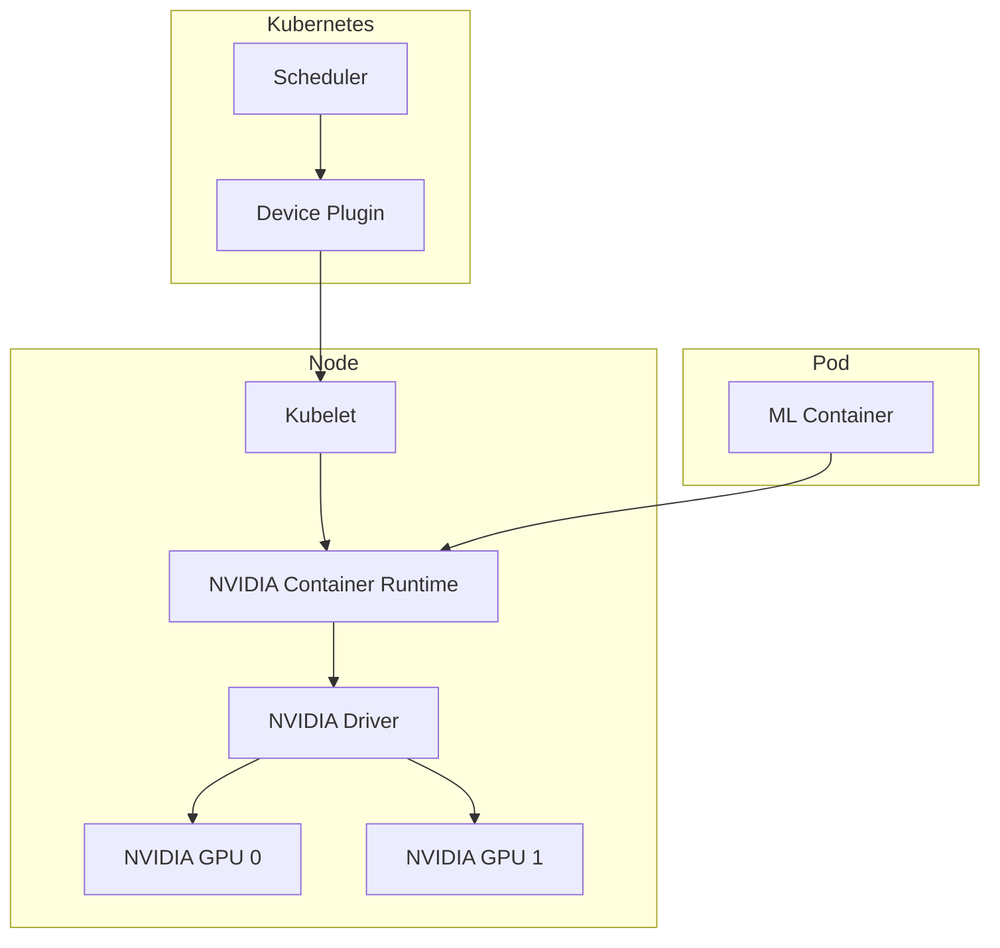

# How to Set Up GPU Workloads in Kubernetes for ML/AI

Author: [nawazdhandala](https://www.github.com/nawazdhandala)

Tags: Kubernetes, GPU, Machine Learning, AI, NVIDIA, Deep Learning, DevOps

Description: A practical guide to running GPU workloads in Kubernetes for machine learning and AI, including NVIDIA device plugin setup, resource scheduling, and multi-GPU training configurations.

---

GPUs are essential for machine learning workloads. Kubernetes can schedule GPU resources just like CPU and memory, but setup requires specific drivers, plugins, and configurations. Here's how to get it working.

## GPU Architecture in Kubernetes



## Prerequisites

### 1. NVIDIA Drivers on Nodes

```bash
# Ubuntu/Debian
sudo apt-get update
sudo apt-get install -y nvidia-driver-535

# Verify installation
nvidia-smi
```

### 2. NVIDIA Container Toolkit

```bash
# Add repository
distribution=$(. /etc/os-release;echo $ID$VERSION_ID)
curl -s -L https://nvidia.github.io/nvidia-docker/gpgkey | sudo apt-key add -
curl -s -L https://nvidia.github.io/nvidia-docker/$distribution/nvidia-docker.list | \
  sudo tee /etc/apt/sources.list.d/nvidia-docker.list

# Install
sudo apt-get update
sudo apt-get install -y nvidia-container-toolkit

# Configure containerd
sudo nvidia-ctk runtime configure --runtime=containerd
sudo systemctl restart containerd
```

## Installing NVIDIA Device Plugin

### Using Helm

```bash
helm repo add nvdp https://nvidia.github.io/k8s-device-plugin
helm repo update

helm install nvidia-device-plugin nvdp/nvidia-device-plugin \
  --namespace nvidia-device-plugin \
  --create-namespace \
  --set gfd.enabled=true
```

### Using YAML

```yaml
apiVersion: apps/v1
kind: DaemonSet
metadata:
  name: nvidia-device-plugin-daemonset
  namespace: kube-system
spec:
  selector:
    matchLabels:
      name: nvidia-device-plugin-ds
  template:
    metadata:
      labels:
        name: nvidia-device-plugin-ds
    spec:
      tolerations:
        - key: nvidia.com/gpu
          operator: Exists
          effect: NoSchedule
      priorityClassName: system-node-critical
      containers:
        - name: nvidia-device-plugin-ctr
          image: nvcr.io/nvidia/k8s-device-plugin:v0.14.3
          env:
            - name: FAIL_ON_INIT_ERROR
              value: "false"
          securityContext:
            allowPrivilegeEscalation: false
            capabilities:
              drop: ["ALL"]
          volumeMounts:
            - name: device-plugin
              mountPath: /var/lib/kubelet/device-plugins
      volumes:
        - name: device-plugin
          hostPath:
            path: /var/lib/kubelet/device-plugins
```

### Verify Installation

```bash
# Check device plugin pods
kubectl get pods -n kube-system -l name=nvidia-device-plugin-ds

# Check GPU resources on nodes
kubectl get nodes -o json | jq '.items[].status.capacity["nvidia.com/gpu"]'

# Describe a GPU node
kubectl describe node <gpu-node-name> | grep -A 10 "Capacity"
```

## Running GPU Workloads

### Basic GPU Pod

```yaml
apiVersion: v1
kind: Pod
metadata:
  name: gpu-test
spec:
  restartPolicy: OnFailure
  containers:
    - name: cuda-container
      image: nvcr.io/nvidia/cuda:12.2.0-base-ubuntu22.04
      command: ["nvidia-smi"]
      resources:
        limits:
          nvidia.com/gpu: 1
```

### ML Training Job

```yaml
apiVersion: batch/v1
kind: Job
metadata:
  name: pytorch-training
spec:
  template:
    spec:
      restartPolicy: OnFailure
      containers:
        - name: pytorch
          image: pytorch/pytorch:2.1.0-cuda12.1-cudnn8-runtime
          command:
            - python
            - /scripts/train.py
          resources:
            limits:
              nvidia.com/gpu: 1
              memory: 16Gi
              cpu: 4
            requests:
              memory: 8Gi
              cpu: 2
          volumeMounts:
            - name: training-data
              mountPath: /data
            - name: model-output
              mountPath: /output
            - name: scripts
              mountPath: /scripts
      volumes:
        - name: training-data
          persistentVolumeClaim:
            claimName: training-data-pvc
        - name: model-output
          persistentVolumeClaim:
            claimName: model-output-pvc
        - name: scripts
          configMap:
            name: training-scripts
```

### Inference Deployment

```yaml
apiVersion: apps/v1
kind: Deployment
metadata:
  name: ml-inference
spec:
  replicas: 2
  selector:
    matchLabels:
      app: ml-inference
  template:
    metadata:
      labels:
        app: ml-inference
    spec:
      containers:
        - name: inference
          image: myregistry/ml-model:v1
          ports:
            - containerPort: 8080
          resources:
            limits:
              nvidia.com/gpu: 1
              memory: 8Gi
            requests:
              memory: 4Gi
          env:
            - name: MODEL_PATH
              value: /models/best_model.pt
          readinessProbe:
            httpGet:
              path: /health
              port: 8080
            initialDelaySeconds: 30
            periodSeconds: 10
          volumeMounts:
            - name: models
              mountPath: /models
      volumes:
        - name: models
          persistentVolumeClaim:
            claimName: models-pvc
      affinity:
        nodeAffinity:
          requiredDuringSchedulingIgnoredDuringExecution:
            nodeSelectorTerms:
              - matchExpressions:
                  - key: nvidia.com/gpu.product
                    operator: In
                    values:
                      - Tesla-T4
                      - Tesla-V100
```

## Multi-GPU Training

### Single Node Multi-GPU

```yaml
apiVersion: batch/v1
kind: Job
metadata:
  name: multi-gpu-training
spec:
  template:
    spec:
      restartPolicy: OnFailure
      containers:
        - name: pytorch
          image: pytorch/pytorch:2.1.0-cuda12.1-cudnn8-runtime
          command:
            - torchrun
            - --nproc_per_node=4
            - /scripts/train_distributed.py
          resources:
            limits:
              nvidia.com/gpu: 4
              memory: 64Gi
              cpu: 16
          env:
            - name: NCCL_DEBUG
              value: INFO
          volumeMounts:
            - name: shm
              mountPath: /dev/shm
            - name: data
              mountPath: /data
      volumes:
        - name: shm
          emptyDir:
            medium: Memory
            sizeLimit: 16Gi
        - name: data
          persistentVolumeClaim:
            claimName: training-data
```

### Distributed Training with PyTorch

```yaml
apiVersion: kubeflow.org/v1
kind: PyTorchJob
metadata:
  name: distributed-training
spec:
  pytorchReplicaSpecs:
    Master:
      replicas: 1
      restartPolicy: OnFailure
      template:
        spec:
          containers:
            - name: pytorch
              image: myregistry/pytorch-training:latest
              command:
                - python
                - -m
                - torch.distributed.launch
                - --nproc_per_node=2
                - --nnodes=3
                - --node_rank=0
                - /scripts/train.py
              resources:
                limits:
                  nvidia.com/gpu: 2
              volumeMounts:
                - name: shm
                  mountPath: /dev/shm
          volumes:
            - name: shm
              emptyDir:
                medium: Memory
    Worker:
      replicas: 2
      restartPolicy: OnFailure
      template:
        spec:
          containers:
            - name: pytorch
              image: myregistry/pytorch-training:latest
              command:
                - python
                - -m
                - torch.distributed.launch
                - --nproc_per_node=2
                - --nnodes=3
                - /scripts/train.py
              resources:
                limits:
                  nvidia.com/gpu: 2
              volumeMounts:
                - name: shm
                  mountPath: /dev/shm
          volumes:
            - name: shm
              emptyDir:
                medium: Memory
```

## GPU Sharing with MIG

NVIDIA Multi-Instance GPU (MIG) allows partitioning A100 GPUs:

```yaml
# Enable MIG mode (on the node)
# sudo nvidia-smi -i 0 -mig 1

# Create MIG profiles
# sudo nvidia-smi mig -cgi 9,9,9 -C

# Device plugin config for MIG
apiVersion: v1
kind: ConfigMap
metadata:
  name: nvidia-device-plugin-config
  namespace: nvidia-device-plugin
data:
  config.yaml: |
    version: v1
    sharing:
      mig:
        strategy: single
    flags:
      migStrategy: single
```

Request MIG devices:

```yaml
resources:
  limits:
    nvidia.com/mig-1g.5gb: 1  # Request one MIG slice
```

## GPU Time-Slicing

For sharing GPUs without MIG:

```yaml
apiVersion: v1
kind: ConfigMap
metadata:
  name: nvidia-device-plugin-config
  namespace: nvidia-device-plugin
data:
  config.yaml: |
    version: v1
    sharing:
      timeSlicing:
        renameByDefault: false
        resources:
          - name: nvidia.com/gpu
            replicas: 4  # Each GPU appears as 4 resources
```

## Node Labeling and Selection

### GPU Feature Discovery

```bash
# Install GPU Feature Discovery
kubectl apply -f https://raw.githubusercontent.com/NVIDIA/gpu-feature-discovery/v0.8.1/deployments/static/nfd.yaml
kubectl apply -f https://raw.githubusercontent.com/NVIDIA/gpu-feature-discovery/v0.8.1/deployments/static/gpu-feature-discovery-daemonset.yaml
```

Labels added automatically:
- `nvidia.com/gpu.product` - GPU model (e.g., Tesla-T4)
- `nvidia.com/gpu.memory` - GPU memory
- `nvidia.com/cuda.driver.major` - CUDA driver version
- `nvidia.com/mig.capable` - MIG support

### Using Labels

```yaml
spec:
  affinity:
    nodeAffinity:
      requiredDuringSchedulingIgnoredDuringExecution:
        nodeSelectorTerms:
          - matchExpressions:
              - key: nvidia.com/gpu.product
                operator: In
                values:
                  - NVIDIA-A100-SXM4-40GB
              - key: nvidia.com/gpu.memory
                operator: Gt
                values:
                  - "30000"
```

## Spot GPU Instances

```yaml
apiVersion: apps/v1
kind: Deployment
metadata:
  name: gpu-training
spec:
  template:
    spec:
      tolerations:
        - key: kubernetes.azure.com/scalesetpriority
          operator: Equal
          value: spot
          effect: NoSchedule
        - key: nvidia.com/gpu
          operator: Exists
          effect: NoSchedule
      nodeSelector:
        kubernetes.azure.com/scalesetpriority: spot
      containers:
        - name: training
          image: training:latest
          resources:
            limits:
              nvidia.com/gpu: 1
```

## Monitoring GPU Resources

### DCGM Exporter

```bash
helm repo add gpu-helm-charts https://nvidia.github.io/dcgm-exporter/helm-charts
helm install dcgm-exporter gpu-helm-charts/dcgm-exporter \
  --namespace monitoring \
  --set serviceMonitor.enabled=true
```

### Key Metrics

```promql
# GPU utilization
DCGM_FI_DEV_GPU_UTIL

# GPU memory utilization
DCGM_FI_DEV_FB_USED / DCGM_FI_DEV_FB_FREE

# GPU temperature
DCGM_FI_DEV_GPU_TEMP

# Power usage
DCGM_FI_DEV_POWER_USAGE
```

### Alerts

```yaml
apiVersion: monitoring.coreos.com/v1
kind: PrometheusRule
metadata:
  name: gpu-alerts
spec:
  groups:
    - name: gpu
      rules:
        - alert: GPUHighTemperature
          expr: DCGM_FI_DEV_GPU_TEMP > 85
          for: 5m
          labels:
            severity: warning
          annotations:
            summary: "GPU temperature above 85C"

        - alert: GPUMemoryExhausted
          expr: DCGM_FI_DEV_FB_USED / (DCGM_FI_DEV_FB_USED + DCGM_FI_DEV_FB_FREE) > 0.95
          for: 5m
          labels:
            severity: critical
          annotations:
            summary: "GPU memory utilization above 95%"

        - alert: GPUXIDErrors
          expr: increase(DCGM_FI_DEV_XID_ERRORS[1h]) > 0
          for: 0m
          labels:
            severity: warning
          annotations:
            summary: "GPU XID errors detected"
```

## Cloud-Specific Setup

### AWS EKS

```bash
# Create GPU node group
eksctl create nodegroup \
  --cluster my-cluster \
  --name gpu-nodes \
  --node-type p3.2xlarge \
  --nodes 2 \
  --nodes-min 0 \
  --nodes-max 5 \
  --node-ami-family Ubuntu2004 \
  --managed
```

### GKE

```bash
gcloud container node-pools create gpu-pool \
  --cluster=my-cluster \
  --machine-type=n1-standard-4 \
  --accelerator type=nvidia-tesla-t4,count=1 \
  --num-nodes=2 \
  --zone=us-central1-a

# Install NVIDIA drivers
kubectl apply -f https://raw.githubusercontent.com/GoogleCloudPlatform/container-engine-accelerators/master/nvidia-driver-installer/cos/daemonset-preloaded.yaml
```

### Azure AKS

```bash
az aks nodepool add \
  --resource-group myResourceGroup \
  --cluster-name myAKSCluster \
  --name gpunodepool \
  --node-count 2 \
  --node-vm-size Standard_NC6s_v3 \
  --node-taints nvidia.com/gpu=present:NoSchedule
```

## JupyterHub for ML Teams

```yaml
# values.yaml for JupyterHub
singleuser:
  profileList:
    - display_name: "Small CPU"
      description: "2 CPU, 4GB RAM"
      default: true
      kubespawner_override:
        cpu_guarantee: 1
        cpu_limit: 2
        mem_guarantee: 2G
        mem_limit: 4G
    - display_name: "GPU Instance"
      description: "4 CPU, 16GB RAM, 1 GPU"
      kubespawner_override:
        cpu_guarantee: 2
        cpu_limit: 4
        mem_guarantee: 8G
        mem_limit: 16G
        extra_resource_limits:
          nvidia.com/gpu: "1"
        extra_resource_guarantees:
          nvidia.com/gpu: "1"
        tolerations:
          - key: nvidia.com/gpu
            operator: Exists
            effect: NoSchedule
```

```bash
helm install jupyterhub jupyterhub/jupyterhub \
  --namespace jupyterhub \
  --create-namespace \
  --values values.yaml
```

## Best Practices

1. **Use taints and tolerations** - Reserve GPU nodes for GPU workloads only
2. **Right-size GPU requests** - GPUs can't be fractionally allocated (without MIG)
3. **Use shared memory** - Mount `/dev/shm` for multi-GPU communication
4. **Monitor utilization** - GPUs are expensive; track actual usage
5. **Consider spot instances** - Up to 90% savings for fault-tolerant training
6. **Enable MIG where possible** - Better GPU utilization for inference
7. **Use appropriate storage** - Fast NVMe for training data
8. **Pin CUDA versions** - Ensure driver/toolkit compatibility

## Troubleshooting

### Pod Can't Find GPU

```bash
# Check device plugin
kubectl logs -n kube-system -l name=nvidia-device-plugin-ds

# Verify GPU resources
kubectl get node <node> -o yaml | grep -A 5 "capacity"

# Check NVIDIA driver on node
kubectl debug node/<node> -it --image=ubuntu -- nvidia-smi
```

### CUDA Version Mismatch

```bash
# Check driver version
nvidia-smi | head -3

# In container
nvcc --version

# Use matching CUDA image
image: nvcr.io/nvidia/cuda:12.2.0-base-ubuntu22.04
```

### Out of Memory

```yaml
# Increase shared memory
volumes:
  - name: shm
    emptyDir:
      medium: Memory
      sizeLimit: 16Gi
volumeMounts:
  - name: shm
    mountPath: /dev/shm
```

---

GPU workloads in Kubernetes require careful setup but enable powerful ML/AI capabilities at scale. Start with the NVIDIA device plugin, verify GPU detection, and gradually move to more complex distributed training setups. Monitor utilization to ensure you're getting value from expensive GPU resources.
