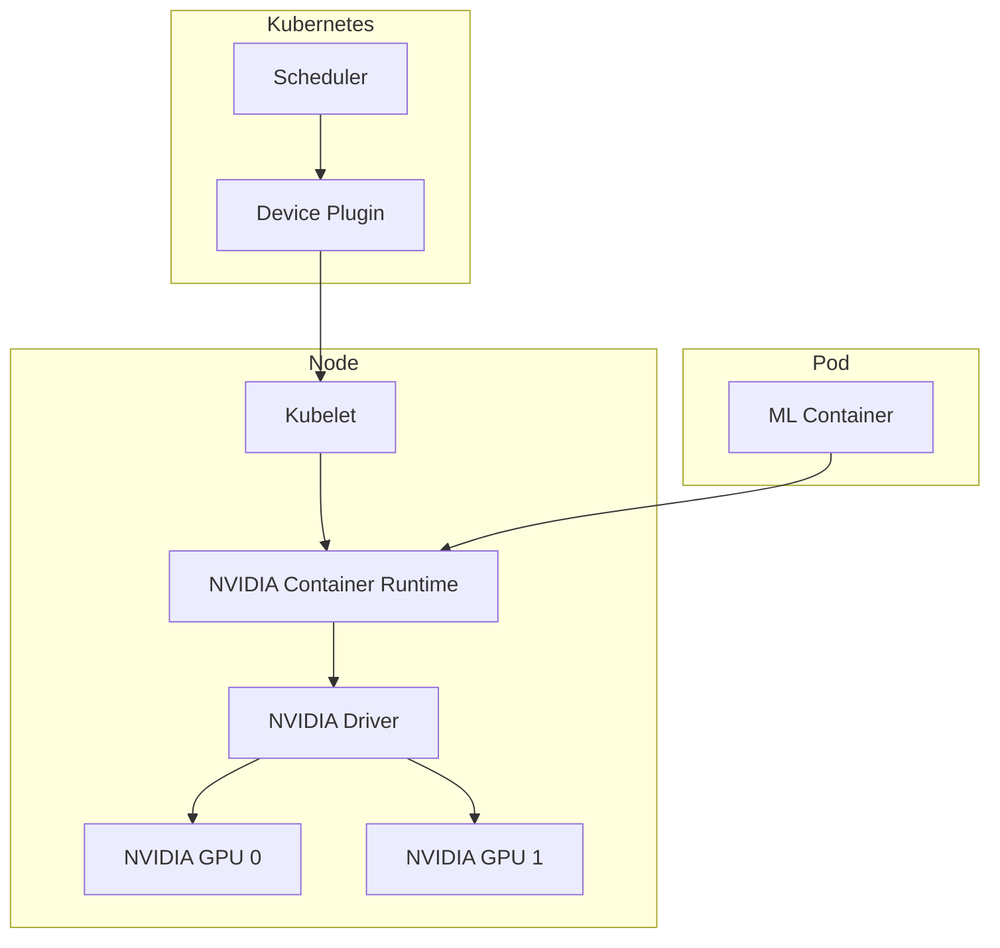

# How to Set Up GPU Workloads in Kubernetes for ML/AI

Author: [nawazdhandala](https://www.github.com/nawazdhandala)

Tags: Kubernetes, GPU, Machine Learning, AI, NVIDIA, Deep Learning, DevOps

Description: A practical guide to running GPU workloads in Kubernetes for machine learning and AI, including NVIDIA device plugin setup, resource scheduling, and multi-GPU training configurations.

---

GPUs are essential for machine learning workloads. Kubernetes can schedule GPU resources just like CPU and memory, but setup requires specific drivers, plugins, and configurations. Here's how to get it working.

## GPU Architecture in Kubernetes



## Prerequisites

### 1. NVIDIA Drivers on Nodes

The NVIDIA driver must be installed on every node that has GPUs. The driver version should match your GPU hardware and be compatible with the CUDA version your applications require.

```bash
# Ubuntu/Debian - install NVIDIA driver version 535
sudo apt-get update
sudo apt-get install -y nvidia-driver-535

# Verify installation - shows GPU info, driver version, and memory
nvidia-smi
```

### 2. NVIDIA Container Toolkit

The NVIDIA Container Toolkit enables containers to access GPU resources. It configures the container runtime to inject the necessary NVIDIA libraries and device files into containers.

```bash
# Add NVIDIA repository for container toolkit packages
distribution=$(. /etc/os-release;echo $ID$VERSION_ID)
curl -s -L https://nvidia.github.io/nvidia-docker/gpgkey | sudo apt-key add -
curl -s -L https://nvidia.github.io/nvidia-docker/$distribution/nvidia-docker.list | \
  sudo tee /etc/apt/sources.list.d/nvidia-docker.list

# Install the container toolkit
sudo apt-get update
sudo apt-get install -y nvidia-container-toolkit

# Configure containerd to use NVIDIA runtime and restart
sudo nvidia-ctk runtime configure --runtime=containerd
sudo systemctl restart containerd
```

## Installing NVIDIA Device Plugin

### Using Helm

The NVIDIA Device Plugin exposes GPUs as schedulable resources to Kubernetes. GPU Feature Discovery (GFD) automatically labels nodes with GPU properties for advanced scheduling.

```bash
# Add NVIDIA device plugin Helm repository
helm repo add nvdp https://nvidia.github.io/k8s-device-plugin
helm repo update

# Install with GPU Feature Discovery enabled for automatic node labeling
helm install nvidia-device-plugin nvdp/nvidia-device-plugin \
  --namespace nvidia-device-plugin \
  --create-namespace \
  --set gfd.enabled=true           # Enable GPU Feature Discovery
```

### Using YAML

This DaemonSet runs the device plugin on every node. It tolerates GPU taints and mounts the device plugin socket directory to register GPUs with kubelet.

```yaml
apiVersion: apps/v1
kind: DaemonSet
metadata:
  name: nvidia-device-plugin-daemonset
  namespace: kube-system
spec:
  selector:
    matchLabels:
      name: nvidia-device-plugin-ds
  template:
    metadata:
      labels:
        name: nvidia-device-plugin-ds
    spec:
      tolerations:
        # Tolerate GPU taint so plugin runs on GPU nodes
        - key: nvidia.com/gpu
          operator: Exists
          effect: NoSchedule
      priorityClassName: system-node-critical  # High priority for reliability
      containers:
        - name: nvidia-device-plugin-ctr
          image: nvcr.io/nvidia/k8s-device-plugin:v0.14.3
          env:
            # Continue if some GPUs fail initialization
            - name: FAIL_ON_INIT_ERROR
              value: "false"
          securityContext:
            allowPrivilegeEscalation: false
            capabilities:
              drop: ["ALL"]          # Minimal privileges
          volumeMounts:
            # Mount device plugin socket directory
            - name: device-plugin
              mountPath: /var/lib/kubelet/device-plugins
      volumes:
        - name: device-plugin
          hostPath:
            path: /var/lib/kubelet/device-plugins
```

### Verify Installation

After installing the device plugin, verify that GPUs are detected and reported as allocatable resources on your nodes.

```bash
# Check device plugin pods are running
kubectl get pods -n kube-system -l name=nvidia-device-plugin-ds

# Check GPU resources on all nodes using jq for JSON parsing
kubectl get nodes -o json | jq '.items[].status.capacity["nvidia.com/gpu"]'

# Describe a specific GPU node to see capacity details
kubectl describe node <gpu-node-name> | grep -A 10 "Capacity"
```

## Running GPU Workloads

### Basic GPU Pod

This simple pod requests one GPU and runs nvidia-smi to verify GPU access. It's useful for testing that GPUs are correctly configured before running real workloads.

```yaml
apiVersion: v1
kind: Pod
metadata:
  name: gpu-test
spec:
  restartPolicy: OnFailure
  containers:
    - name: cuda-container
      image: nvcr.io/nvidia/cuda:12.2.0-base-ubuntu22.04
      command: ["nvidia-smi"]      # Verify GPU is accessible
      resources:
        limits:
          nvidia.com/gpu: 1        # Request exactly one GPU
```

### ML Training Job

This Job configuration is suitable for single-GPU training tasks. It includes persistent volume mounts for training data and model output, plus proper resource limits for memory and CPU.

```yaml
apiVersion: batch/v1
kind: Job
metadata:
  name: pytorch-training
spec:
  template:
    spec:
      restartPolicy: OnFailure
      containers:
        - name: pytorch
          image: pytorch/pytorch:2.1.0-cuda12.1-cudnn8-runtime
          command:
            - python
            - /scripts/train.py    # Your training script
          resources:
            limits:
              nvidia.com/gpu: 1    # One GPU for training
              memory: 16Gi         # GPU workloads often need high memory
              cpu: 4               # CPUs for data loading
            requests:
              memory: 8Gi
              cpu: 2
          volumeMounts:
            # Mount training data from persistent storage
            - name: training-data
              mountPath: /data
            # Mount output directory for model checkpoints
            - name: model-output
              mountPath: /output
            # Mount training scripts from ConfigMap
            - name: scripts
              mountPath: /scripts
      volumes:
        - name: training-data
          persistentVolumeClaim:
            claimName: training-data-pvc
        - name: model-output
          persistentVolumeClaim:
            claimName: model-output-pvc
        - name: scripts
          configMap:
            name: training-scripts
```

### Inference Deployment

This Deployment runs ML inference with GPU acceleration. It includes readiness probes to ensure traffic only routes to ready replicas, and node affinity to schedule on specific GPU types.

```yaml
apiVersion: apps/v1
kind: Deployment
metadata:
  name: ml-inference
spec:
  replicas: 2                      # Multiple replicas for high availability
  selector:
    matchLabels:
      app: ml-inference
  template:
    metadata:
      labels:
        app: ml-inference
    spec:
      containers:
        - name: inference
          image: myregistry/ml-model:v1
          ports:
            - containerPort: 8080
          resources:
            limits:
              nvidia.com/gpu: 1    # Each replica gets one GPU
              memory: 8Gi
            requests:
              memory: 4Gi
          env:
            - name: MODEL_PATH
              value: /models/best_model.pt  # Path to trained model
          readinessProbe:
            httpGet:
              path: /health
              port: 8080
            initialDelaySeconds: 30  # Model loading takes time
            periodSeconds: 10
          volumeMounts:
            - name: models
              mountPath: /models
      volumes:
        - name: models
          persistentVolumeClaim:
            claimName: models-pvc
      affinity:
        nodeAffinity:
          requiredDuringSchedulingIgnoredDuringExecution:
            nodeSelectorTerms:
              # Schedule only on nodes with these GPU types
              - matchExpressions:
                  - key: nvidia.com/gpu.product
                    operator: In
                    values:
                      - Tesla-T4        # Good for inference
                      - Tesla-V100      # High performance
```

## Multi-GPU Training

### Single Node Multi-GPU

For data-parallel training across multiple GPUs on a single node. The shared memory volume is critical for efficient inter-GPU communication via NCCL.

```yaml
apiVersion: batch/v1
kind: Job
metadata:
  name: multi-gpu-training
spec:
  template:
    spec:
      restartPolicy: OnFailure
      containers:
        - name: pytorch
          image: pytorch/pytorch:2.1.0-cuda12.1-cudnn8-runtime
          command:
            - torchrun                    # PyTorch distributed launcher
            - --nproc_per_node=4          # One process per GPU
            - /scripts/train_distributed.py
          resources:
            limits:
              nvidia.com/gpu: 4           # Request all 4 GPUs
              memory: 64Gi                # Scale memory with GPU count
              cpu: 16
          env:
            # Enable NCCL debug logging for troubleshooting
            - name: NCCL_DEBUG
              value: INFO
          volumeMounts:
            # Shared memory for NCCL inter-GPU communication
            - name: shm
              mountPath: /dev/shm
            - name: data
              mountPath: /data
      volumes:
        # Large shared memory volume - critical for multi-GPU
        - name: shm
          emptyDir:
            medium: Memory             # Use RAM, not disk
            sizeLimit: 16Gi            # Size depends on model/batch size
        - name: data
          persistentVolumeClaim:
            claimName: training-data
```

### Distributed Training with PyTorch

For training across multiple nodes, use Kubeflow's PyTorchJob. This CRD handles the complexity of distributed training setup, including master/worker coordination and environment variables.

```yaml
apiVersion: kubeflow.org/v1
kind: PyTorchJob
metadata:
  name: distributed-training
spec:
  pytorchReplicaSpecs:
    # Master coordinates training and aggregates gradients
    Master:
      replicas: 1
      restartPolicy: OnFailure
      template:
        spec:
          containers:
            - name: pytorch
              image: myregistry/pytorch-training:latest
              command:
                - python
                - -m
                - torch.distributed.launch
                - --nproc_per_node=2      # 2 GPUs per node
                - --nnodes=3              # Total 3 nodes
                - --node_rank=0           # Master is rank 0
                - /scripts/train.py
              resources:
                limits:
                  nvidia.com/gpu: 2       # 2 GPUs for master
              volumeMounts:
                - name: shm
                  mountPath: /dev/shm
          volumes:
            - name: shm
              emptyDir:
                medium: Memory
    # Workers participate in distributed training
    Worker:
      replicas: 2                         # 2 worker nodes
      restartPolicy: OnFailure
      template:
        spec:
          containers:
            - name: pytorch
              image: myregistry/pytorch-training:latest
              command:
                - python
                - -m
                - torch.distributed.launch
                - --nproc_per_node=2      # 2 GPUs per worker
                - --nnodes=3              # Same total nodes
                - /scripts/train.py
              resources:
                limits:
                  nvidia.com/gpu: 2       # 2 GPUs per worker
              volumeMounts:
                - name: shm
                  mountPath: /dev/shm
          volumes:
            - name: shm
              emptyDir:
                medium: Memory
```

## GPU Sharing with MIG

NVIDIA Multi-Instance GPU (MIG) allows partitioning A100 GPUs into smaller, isolated instances. This enables running multiple smaller workloads on a single expensive GPU.

```yaml
# Enable MIG mode (on the node)
# sudo nvidia-smi -i 0 -mig 1

# Create MIG profiles
# sudo nvidia-smi mig -cgi 9,9,9 -C

# Device plugin config for MIG
apiVersion: v1
kind: ConfigMap
metadata:
  name: nvidia-device-plugin-config
  namespace: nvidia-device-plugin
data:
  config.yaml: |
    version: v1
    sharing:
      mig:
        strategy: single           # Expose individual MIG instances
    flags:
      migStrategy: single          # Each MIG slice is a separate resource
```

Request MIG devices in your pod specification. Each MIG slice provides a fraction of the GPU's compute and memory.

```yaml
resources:
  limits:
    nvidia.com/mig-1g.5gb: 1       # Request one MIG slice (1 GPU slice, 5GB memory)
```

## GPU Time-Slicing

For sharing GPUs without MIG hardware support. Time-slicing allows multiple pods to share a GPU by taking turns, but without memory isolation.

```yaml
apiVersion: v1
kind: ConfigMap
metadata:
  name: nvidia-device-plugin-config
  namespace: nvidia-device-plugin
data:
  config.yaml: |
    version: v1
    sharing:
      timeSlicing:
        renameByDefault: false
        resources:
          - name: nvidia.com/gpu
            replicas: 4            # Each physical GPU appears as 4 resources
```

## Node Labeling and Selection

### GPU Feature Discovery

GPU Feature Discovery automatically labels nodes with detailed GPU information. This enables sophisticated scheduling based on GPU model, memory, and capabilities.

```bash
# Install GPU Feature Discovery - enables automatic node labeling
kubectl apply -f https://raw.githubusercontent.com/NVIDIA/gpu-feature-discovery/v0.8.1/deployments/static/nfd.yaml
kubectl apply -f https://raw.githubusercontent.com/NVIDIA/gpu-feature-discovery/v0.8.1/deployments/static/gpu-feature-discovery-daemonset.yaml
```

Labels added automatically:
- `nvidia.com/gpu.product` - GPU model (e.g., Tesla-T4)
- `nvidia.com/gpu.memory` - GPU memory
- `nvidia.com/cuda.driver.major` - CUDA driver version
- `nvidia.com/mig.capable` - MIG support

### Using Labels

Use node affinity with GPU labels to ensure workloads run on appropriate hardware. This is crucial when you have different GPU types for different workloads.

```yaml
spec:
  affinity:
    nodeAffinity:
      requiredDuringSchedulingIgnoredDuringExecution:
        nodeSelectorTerms:
          - matchExpressions:
              # Only schedule on A100 GPUs
              - key: nvidia.com/gpu.product
                operator: In
                values:
                  - NVIDIA-A100-SXM4-40GB
              # Require at least 30GB GPU memory
              - key: nvidia.com/gpu.memory
                operator: Gt
                values:
                  - "30000"
```

## Spot GPU Instances

Spot instances offer significant cost savings for fault-tolerant training workloads. The tolerations allow scheduling on spot nodes that are tainted to prevent regular workloads.

```yaml
apiVersion: apps/v1
kind: Deployment
metadata:
  name: gpu-training
spec:
  template:
    spec:
      tolerations:
        # Tolerate Azure spot instance taint
        - key: kubernetes.azure.com/scalesetpriority
          operator: Equal
          value: spot
          effect: NoSchedule
        # Tolerate GPU taint
        - key: nvidia.com/gpu
          operator: Exists
          effect: NoSchedule
      nodeSelector:
        # Explicitly select spot instances for cost savings
        kubernetes.azure.com/scalesetpriority: spot
      containers:
        - name: training
          image: training:latest
          resources:
            limits:
              nvidia.com/gpu: 1
```

## Monitoring GPU Resources

### DCGM Exporter

The DCGM (Data Center GPU Manager) Exporter collects detailed GPU metrics for Prometheus. It provides visibility into GPU utilization, memory, temperature, and errors.

```bash
# Add DCGM exporter Helm repository
helm repo add gpu-helm-charts https://nvidia.github.io/dcgm-exporter/helm-charts
# Install with Prometheus ServiceMonitor for automatic scraping
helm install dcgm-exporter gpu-helm-charts/dcgm-exporter \
  --namespace monitoring \
  --set serviceMonitor.enabled=true
```

### Key Metrics

These PromQL queries help you understand GPU health and utilization. Monitor these to ensure efficient use of expensive GPU resources.

```promql
# GPU utilization percentage (0-100)
DCGM_FI_DEV_GPU_UTIL

# GPU memory utilization ratio
DCGM_FI_DEV_FB_USED / DCGM_FI_DEV_FB_FREE

# GPU temperature in Celsius - alert if too high
DCGM_FI_DEV_GPU_TEMP

# Power usage in watts - useful for capacity planning
DCGM_FI_DEV_POWER_USAGE
```

### Alerts

These Prometheus alerts help catch GPU issues before they cause problems. Temperature and memory alerts prevent workload failures, while XID errors indicate hardware issues.

```yaml
apiVersion: monitoring.coreos.com/v1
kind: PrometheusRule
metadata:
  name: gpu-alerts
spec:
  groups:
    - name: gpu
      rules:
        # Alert when GPU is running too hot
        - alert: GPUHighTemperature
          expr: DCGM_FI_DEV_GPU_TEMP > 85
          for: 5m
          labels:
            severity: warning
          annotations:
            summary: "GPU temperature above 85C"

        # Alert when GPU memory is nearly exhausted
        - alert: GPUMemoryExhausted
          expr: DCGM_FI_DEV_FB_USED / (DCGM_FI_DEV_FB_USED + DCGM_FI_DEV_FB_FREE) > 0.95
          for: 5m
          labels:
            severity: critical
          annotations:
            summary: "GPU memory utilization above 95%"

        # Alert on hardware errors (XID errors indicate GPU problems)
        - alert: GPUXIDErrors
          expr: increase(DCGM_FI_DEV_XID_ERRORS[1h]) > 0
          for: 0m
          labels:
            severity: warning
          annotations:
            summary: "GPU XID errors detected"
```

## Cloud-Specific Setup

### AWS EKS

Create a managed GPU node group in EKS. The Ubuntu AMI includes NVIDIA drivers, and managed node groups handle updates automatically.

```bash
# Create GPU node group with p3.2xlarge instances (NVIDIA V100)
eksctl create nodegroup \
  --cluster my-cluster \
  --name gpu-nodes \
  --node-type p3.2xlarge \         # V100 GPU instances
  --nodes 2 \                      # Start with 2 nodes
  --nodes-min 0 \                  # Scale to zero when idle
  --nodes-max 5 \                  # Max 5 nodes
  --node-ami-family Ubuntu2004 \   # Ubuntu includes NVIDIA drivers
  --managed                        # Use EKS managed nodes
```

### GKE

Create a GPU node pool in GKE. Unlike EKS, GKE requires installing NVIDIA drivers separately via a DaemonSet after creating the node pool.

```bash
# Create node pool with T4 GPUs
gcloud container node-pools create gpu-pool \
  --cluster=my-cluster \
  --machine-type=n1-standard-4 \   # 4 vCPUs, 15GB RAM
  --accelerator type=nvidia-tesla-t4,count=1 \  # One T4 GPU per node
  --num-nodes=2 \
  --zone=us-central1-a

# Install NVIDIA drivers via DaemonSet (required for GKE)
kubectl apply -f https://raw.githubusercontent.com/GoogleCloudPlatform/container-engine-accelerators/master/nvidia-driver-installer/cos/daemonset-preloaded.yaml
```

### Azure AKS

Add a GPU node pool to AKS. The taint ensures only GPU workloads are scheduled on expensive GPU nodes.

```bash
# Add GPU node pool with NC6s_v3 (NVIDIA V100)
az aks nodepool add \
  --resource-group myResourceGroup \
  --cluster-name myAKSCluster \
  --name gpunodepool \
  --node-count 2 \
  --node-vm-size Standard_NC6s_v3 \  # V100 GPU VMs
  --node-taints nvidia.com/gpu=present:NoSchedule  # Taint to reserve for GPU workloads
```

## JupyterHub for ML Teams

JupyterHub provides interactive notebooks for data scientists. This configuration offers both CPU and GPU instance profiles, allowing users to choose based on their workload.

```yaml
# values.yaml for JupyterHub
singleuser:
  profileList:
    # Small CPU profile for development and exploration
    - display_name: "Small CPU"
      description: "2 CPU, 4GB RAM"
      default: true
      kubespawner_override:
        cpu_guarantee: 1
        cpu_limit: 2
        mem_guarantee: 2G
        mem_limit: 4G
    # GPU profile for training and heavy computation
    - display_name: "GPU Instance"
      description: "4 CPU, 16GB RAM, 1 GPU"
      kubespawner_override:
        cpu_guarantee: 2
        cpu_limit: 4
        mem_guarantee: 8G
        mem_limit: 16G
        # GPU resource configuration
        extra_resource_limits:
          nvidia.com/gpu: "1"
        extra_resource_guarantees:
          nvidia.com/gpu: "1"
        tolerations:
          # Tolerate GPU node taint
          - key: nvidia.com/gpu
            operator: Exists
            effect: NoSchedule
```

Install JupyterHub using Helm with the custom values file:

```bash
# Install JupyterHub with GPU-enabled profiles
helm install jupyterhub jupyterhub/jupyterhub \
  --namespace jupyterhub \
  --create-namespace \
  --values values.yaml
```

## Best Practices

1. **Use taints and tolerations** - Reserve GPU nodes for GPU workloads only
2. **Right-size GPU requests** - GPUs can't be fractionally allocated (without MIG)
3. **Use shared memory** - Mount `/dev/shm` for multi-GPU communication
4. **Monitor utilization** - GPUs are expensive; track actual usage
5. **Consider spot instances** - Up to 90% savings for fault-tolerant training
6. **Enable MIG where possible** - Better GPU utilization for inference
7. **Use appropriate storage** - Fast NVMe for training data
8. **Pin CUDA versions** - Ensure driver/toolkit compatibility

## Troubleshooting

### Pod Can't Find GPU

When pods cannot access GPUs, the issue is usually with the device plugin or driver installation. These commands help diagnose the problem.

```bash
# Check device plugin logs for errors
kubectl logs -n kube-system -l name=nvidia-device-plugin-ds

# Verify GPU resources are reported on the node
kubectl get node <node> -o yaml | grep -A 5 "capacity"

# Debug directly on node - run nvidia-smi in a debug container
kubectl debug node/<node> -it --image=ubuntu -- nvidia-smi
```

### CUDA Version Mismatch

CUDA version mismatches cause cryptic errors. The driver version on the node must support the CUDA version in your container image.

```bash
# Check driver version on node (look at top of output)
nvidia-smi | head -3

# Check CUDA toolkit version in container
nvcc --version

# Use matching CUDA image - driver 535+ supports CUDA 12.2
image: nvcr.io/nvidia/cuda:12.2.0-base-ubuntu22.04
```

### Out of Memory

GPU out-of-memory errors often occur during multi-GPU training due to insufficient shared memory. The default /dev/shm is usually too small.

```yaml
# Increase shared memory for NCCL communication
volumes:
  - name: shm
    emptyDir:
      medium: Memory               # Use RAM-backed storage
      sizeLimit: 16Gi              # Large enough for model gradients
volumeMounts:
  - name: shm
    mountPath: /dev/shm
```

---

GPU workloads in Kubernetes require careful setup but enable powerful ML/AI capabilities at scale. Start with the NVIDIA device plugin, verify GPU detection, and gradually move to more complex distributed training setups. Monitor utilization to ensure you're getting value from expensive GPU resources.
