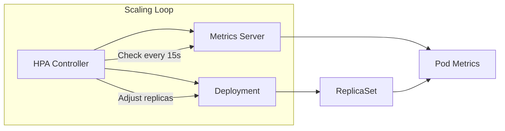

# How to Set Up Horizontal Pod Autoscaling (HPA) in Kubernetes

Author: [nawazdhandala](https://www.github.com/nawazdhandala)

Tags: Kubernetes, HPA, Autoscaling, Performance, Scaling, DevOps

Description: A comprehensive guide to setting up Horizontal Pod Autoscaler (HPA) in Kubernetes, including metrics server setup, custom metrics, scaling behaviors, and production best practices.

---

Manual scaling doesn't work at scale. The Horizontal Pod Autoscaler (HPA) automatically adjusts the number of pod replicas based on observed metrics. Here's how to set it up properly.

## How HPA Works



HPA monitors metrics and calculates desired replicas using:

```
desiredReplicas = ceil[currentReplicas * (currentMetricValue / desiredMetricValue)]
```

## Prerequisites: Metrics Server

HPA needs metrics to scale. Install the metrics server:

The Metrics Server collects resource metrics from kubelets and exposes them via the Kubernetes API. Without it, HPA cannot get CPU and memory utilization data to make scaling decisions.

```bash
# Check if metrics server is already installed
kubectl get deployment metrics-server -n kube-system

# Install if missing - this deploys the metrics server
kubectl apply -f https://github.com/kubernetes-sigs/metrics-server/releases/latest/download/components.yaml

# For local clusters (minikube, kind), kubelet certificates aren't valid
# Add --kubelet-insecure-tls to skip certificate validation
kubectl patch deployment metrics-server -n kube-system --type='json' -p='[
  {"op": "add", "path": "/spec/template/spec/containers/0/args/-", "value": "--kubelet-insecure-tls"}
]'

# Verify metrics are working - should show CPU and memory usage
kubectl top nodes
kubectl top pods -A
```

## Basic HPA Setup

### Step 1: Ensure Resource Requests Are Set

HPA calculates CPU/memory utilization as a percentage of requests. No requests = no scaling.

Resource requests are mandatory for HPA to function. The HPA controller calculates utilization as (current usage / request), so without requests defined, it cannot determine the percentage and will show "unknown" metrics.

```yaml
apiVersion: apps/v1
kind: Deployment
metadata:
  name: web-api
  namespace: production
spec:
  replicas: 2                      # Initial replica count
  selector:
    matchLabels:
      app: web-api
  template:
    metadata:
      labels:
        app: web-api
    spec:
      containers:
        - name: api
          image: myapp/api:v1.0
          resources:
            requests:
              cpu: 100m            # Required for HPA - base CPU allocation
              memory: 128Mi        # Required for memory-based HPA
            limits:
              cpu: 500m            # Maximum CPU the container can use
              memory: 512Mi        # Maximum memory before OOM kill
          ports:
            - containerPort: 8080
```

### Step 2: Create the HPA

This HPA configuration targets 70% CPU utilization. When average CPU across all pods exceeds 70% of their requests, HPA adds replicas. When it drops below, replicas are removed (down to minReplicas).

```yaml
apiVersion: autoscaling/v2         # Use v2 API for full feature set
kind: HorizontalPodAutoscaler
metadata:
  name: web-api
  namespace: production
spec:
  scaleTargetRef:                  # Reference to the resource to scale
    apiVersion: apps/v1
    kind: Deployment
    name: web-api
  minReplicas: 2                   # Never scale below 2 for HA
  maxReplicas: 20                  # Upper limit to control costs
  metrics:
    - type: Resource               # Built-in resource metrics
      resource:
        name: cpu
        target:
          type: Utilization
          averageUtilization: 70   # Target 70% CPU utilization
```

### Step 3: Apply and Verify

After creating the HPA, verify it's working by checking the current metrics and target values. The TARGETS column shows current/target utilization.

```bash
# Apply the HPA configuration
kubectl apply -f hpa.yaml

# Check HPA status - shows current vs target metrics
kubectl get hpa -n production

# Output:
# NAME      REFERENCE            TARGETS   MINPODS   MAXPODS   REPLICAS   AGE
# web-api   Deployment/web-api   25%/70%   2         20        2          1m

# Detailed view with events and conditions
kubectl describe hpa web-api -n production
```

## HPA with Multiple Metrics

Scale based on both CPU and memory:

When scaling on multiple metrics, HPA calculates the desired replica count for each metric independently and uses the maximum. This ensures scaling handles the most constrained resource.

```yaml
apiVersion: autoscaling/v2
kind: HorizontalPodAutoscaler
metadata:
  name: web-api
  namespace: production
spec:
  scaleTargetRef:
    apiVersion: apps/v1
    kind: Deployment
    name: web-api
  minReplicas: 2
  maxReplicas: 20
  metrics:
    # Scale based on CPU utilization
    - type: Resource
      resource:
        name: cpu
        target:
          type: Utilization
          averageUtilization: 70
    # Also consider memory utilization
    - type: Resource
      resource:
        name: memory
        target:
          type: Utilization
          averageUtilization: 80   # Higher threshold for memory
```

When multiple metrics are specified, HPA calculates desired replicas for each and takes the maximum.

## Custom Metrics Scaling

Scale based on application-specific metrics like requests per second or queue depth.

### Install Prometheus Adapter

The Prometheus Adapter exposes Prometheus metrics through the Kubernetes custom metrics API, allowing HPA to scale based on any metric collected by Prometheus.

```bash
# Add Prometheus community Helm repository
helm repo add prometheus-community https://prometheus-community.github.io/helm-charts
# Install adapter pointing to your Prometheus instance
helm install prometheus-adapter prometheus-community/prometheus-adapter \
  --namespace monitoring \
  --set prometheus.url=http://prometheus.monitoring.svc \
  --set prometheus.port=9090
```

### Configure Custom Metrics

This ConfigMap configures the Prometheus Adapter to expose HTTP request rate as a custom metric. The seriesQuery finds metrics, and metricsQuery calculates per-second rates.

```yaml
# prometheus-adapter config
apiVersion: v1
kind: ConfigMap
metadata:
  name: adapter-config
  namespace: monitoring
data:
  config.yaml: |
    rules:
      # Define how to convert Prometheus metrics to Kubernetes metrics
      - seriesQuery: 'http_requests_total{namespace!="",pod!=""}'
        resources:
          overrides:
            namespace: {resource: "namespace"}
            pod: {resource: "pod"}
        name:
          # Transform metric name: http_requests_total -> http_requests_per_second
          matches: "^(.*)_total$"
          as: "${1}_per_second"
        # Calculate rate over 2 minute window
        metricsQuery: 'sum(rate(<<.Series>>{<<.LabelMatchers>>}[2m])) by (<<.GroupBy>>)'
```

### HPA with Custom Metrics

This HPA scales based on requests per second per pod. When each pod handles more than 1000 RPS on average, HPA adds replicas to distribute the load.

```yaml
apiVersion: autoscaling/v2
kind: HorizontalPodAutoscaler
metadata:
  name: web-api
  namespace: production
spec:
  scaleTargetRef:
    apiVersion: apps/v1
    kind: Deployment
    name: web-api
  minReplicas: 2
  maxReplicas: 50                  # Allow more replicas for traffic spikes
  metrics:
    - type: Pods                   # Per-pod custom metric
      pods:
        metric:
          name: http_requests_per_second  # Metric from Prometheus Adapter
        target:
          type: AverageValue
          averageValue: 1000       # Scale when > 1000 RPS per pod
```

## External Metrics Scaling

Scale based on metrics from external systems (SQS queue length, pub/sub backlog):

External metrics come from systems outside Kubernetes like cloud message queues. This enables scaling based on work backlog rather than just current resource usage.

```yaml
apiVersion: autoscaling/v2
kind: HorizontalPodAutoscaler
metadata:
  name: queue-processor
  namespace: production
spec:
  scaleTargetRef:
    apiVersion: apps/v1
    kind: Deployment
    name: queue-processor
  minReplicas: 1                   # Can scale to zero with KEDA
  maxReplicas: 100                 # High max for queue bursts
  metrics:
    - type: External               # Metric from external system
      external:
        metric:
          name: sqs_queue_messages_visible
          selector:
            matchLabels:
              queue: orders        # Identify specific queue
        target:
          type: AverageValue
          averageValue: 30         # Target 30 messages per pod
```

## Scaling Behavior Configuration

Control how fast HPA scales up and down:

Behavior configuration gives fine-grained control over scaling speed. This is crucial for production to prevent thrashing (rapid scale up/down cycles) and ensure stability during traffic fluctuations.

```yaml
apiVersion: autoscaling/v2
kind: HorizontalPodAutoscaler
metadata:
  name: web-api
  namespace: production
spec:
  scaleTargetRef:
    apiVersion: apps/v1
    kind: Deployment
    name: web-api
  minReplicas: 2
  maxReplicas: 20
  metrics:
    - type: Resource
      resource:
        name: cpu
        target:
          type: Utilization
          averageUtilization: 70
  behavior:
    scaleUp:
      stabilizationWindowSeconds: 0    # Scale up immediately on demand
      policies:
        - type: Percent
          value: 100                   # Can double pod count
          periodSeconds: 60
        - type: Pods
          value: 4                     # Or add up to 4 pods
          periodSeconds: 60
      selectPolicy: Max                # Use whichever adds more pods
    scaleDown:
      stabilizationWindowSeconds: 300  # Wait 5 min before scaling down
      policies:
        - type: Percent
          value: 10                    # Remove at most 10% of pods
          periodSeconds: 60
      selectPolicy: Min                # Scale down conservatively
```

### Scale-Up Patterns

**Aggressive (burst traffic):**

Use aggressive scaling when your application experiences sudden traffic spikes and can start handling requests quickly. This configuration doubles capacity every 15 seconds if needed.

```yaml
scaleUp:
  stabilizationWindowSeconds: 0        # No delay
  policies:
    - type: Percent
      value: 200                       # Triple pods if needed
      periodSeconds: 15                # Very fast scaling
```

**Conservative (steady growth):**

Use conservative scaling for applications with gradual traffic changes or slow startup times. This adds at most 2 pods per minute.

```yaml
scaleUp:
  stabilizationWindowSeconds: 60       # Wait 1 min to confirm need
  policies:
    - type: Pods
      value: 2                         # Add at most 2 pods
      periodSeconds: 60                # Per minute
```

### Scale-Down Patterns

**Quick cooldown:**

Use quick cooldown for cost-sensitive workloads where you want to reduce resources soon after load decreases. The stabilization window prevents scaling down during brief dips.

```yaml
scaleDown:
  stabilizationWindowSeconds: 60       # 1 min stabilization
  policies:
    - type: Percent
      value: 50                        # Can halve pod count
      periodSeconds: 60                # Per minute
```

**Slow cooldown (prevent thrashing):**

Use slow cooldown for production web services to prevent capacity issues from premature scale-down. This removes only 1 pod every 2 minutes after 10 minutes of low usage.

```yaml
scaleDown:
  stabilizationWindowSeconds: 600      # 10 min stabilization
  policies:
    - type: Pods
      value: 1                         # Remove only 1 pod at a time
      periodSeconds: 120               # Every 2 minutes
```

## Testing HPA

### Generate Load

To test HPA, generate artificial load against your service. These tools simulate concurrent users to trigger CPU-based scaling.

```bash
# Simple load generator using wget in a loop
kubectl run load-gen --rm -it --image=busybox -- /bin/sh -c \
  "while true; do wget -q -O- http://web-api.production.svc; done"

# Better: use hey or k6 for realistic load testing
# hey generates 100 concurrent requests for 5 minutes
kubectl run hey --rm -it --image=williamyeh/hey -- \
  -z 5m -c 100 http://web-api.production.svc:8080/
```

### Watch Scaling

Monitor HPA behavior in real-time to verify scaling is working correctly. Watch the replica count change as load increases and decreases.

```bash
# Watch HPA status continuously
watch kubectl get hpa -n production

# Watch pods being created/terminated
watch kubectl get pods -n production -l app=web-api

# Watch events for scaling activity
kubectl get events -n production --watch
```

## Production Best Practices

### 1. Set Appropriate Resource Requests

Profile your application under realistic load to determine proper resource requests. Requests that are too low cause aggressive scaling; too high wastes resources.

```yaml
# Profile your application to find right values
resources:
  requests:
    cpu: 200m                      # Based on actual P50 usage
    memory: 256Mi
  limits:
    cpu: 1000m                     # Based on P99 burst usage
    memory: 512Mi
```

### 2. Use PodDisruptionBudget

Prevent HPA from scaling down too aggressively:

PodDisruptionBudgets protect against aggressive scale-down by ensuring a minimum number of pods remain available. This works alongside HPA's minReplicas for additional safety.

```yaml
apiVersion: policy/v1
kind: PodDisruptionBudget
metadata:
  name: web-api
  namespace: production
spec:
  minAvailable: 2                  # Always keep at least 2 pods running
  selector:
    matchLabels:
      app: web-api
```

### 3. Set minReplicas > 1 for Production

For high availability, never allow scaling to a single replica. minReplicas of 2 or more ensures your service survives pod failures during low-traffic periods.

```yaml
spec:
  minReplicas: 2                   # Never go below 2 for HA
  maxReplicas: 20
```

### 4. Monitor HPA Performance

Create alerts when HPA reaches maxReplicas, indicating your application needs more capacity than allowed. This helps prevent performance degradation during traffic spikes.

```yaml
# Alert if at max replicas
apiVersion: monitoring.coreos.com/v1
kind: PrometheusRule
metadata:
  name: hpa-alerts
spec:
  groups:
    - name: hpa
      rules:
        - alert: HPAAtMaxReplicas
          expr: |
            kube_horizontalpodautoscaler_status_current_replicas
            ==
            kube_horizontalpodautoscaler_spec_max_replicas
          for: 15m                 # Alert after 15 min at max
          labels:
            severity: warning
          annotations:
            summary: "HPA {{ $labels.horizontalpodautoscaler }} at max replicas"
```

### 5. Consider Startup Time

If pods take time to start, scale proactively:

Applications with slow startup times (JVM warmup, model loading) need earlier scaling. Lower the target utilization to trigger scaling before performance degrades.

```yaml
metrics:
  - type: Resource
    resource:
      name: cpu
      target:
        type: Utilization
        averageUtilization: 50     # Lower threshold = more headroom
```

## Troubleshooting HPA

### HPA Shows "Unknown" Metrics

When HPA shows "unknown" for metrics, the metrics server or API is not working correctly. These commands help diagnose the issue.

```bash
# Check metrics server is providing data
kubectl top pods -n production

# Check API service registration
kubectl get apiservice v1beta1.metrics.k8s.io

# Check HPA events for error messages
kubectl describe hpa web-api -n production
```

### HPA Not Scaling Up

1. Check resource requests are set
2. Verify current utilization exceeds target
3. Check maxReplicas hasn't been reached
4. Look for deployment issues (ImagePullBackOff, etc.)

These commands help identify why HPA is not adding replicas when expected:

```bash
# Get full HPA configuration and status
kubectl get hpa web-api -n production -o yaml
# Check deployment for issues
kubectl describe deploy web-api -n production
```

### HPA Scaling Too Aggressively

Increase stabilization window:

If HPA is scaling up and down too frequently (thrashing), increase stabilization windows to require sustained metric changes before scaling.

```yaml
behavior:
  scaleUp:
    stabilizationWindowSeconds: 120    # Wait 2 min before scaling up
  scaleDown:
    stabilizationWindowSeconds: 600    # Wait 10 min before scaling down
```

### Metrics Delayed or Missing

When custom metrics are not appearing or are stale, check the Prometheus Adapter logs and verify the metrics API is responding.

```bash
# Check Prometheus Adapter logs for errors
kubectl logs -n monitoring -l app=prometheus-adapter

# Verify custom metrics are available via API
kubectl get --raw /apis/custom.metrics.k8s.io/v1beta1 | jq
```

## HPA + VPA Interaction

Don't use HPA and VPA on the same resource dimension. Common pattern:

- HPA scales replicas based on CPU utilization
- VPA adjusts memory requests (CPU recommendations disabled)

This configuration safely combines HPA and VPA. HPA controls horizontal scaling via CPU, while VPA only adjusts memory to avoid conflicts.

```yaml
# HPA on CPU
apiVersion: autoscaling/v2
kind: HorizontalPodAutoscaler
spec:
  metrics:
    - type: Resource
      resource:
        name: cpu                  # HPA owns CPU-based scaling
---
# VPA on Memory only
apiVersion: autoscaling.k8s.io/v1
kind: VerticalPodAutoscaler
spec:
  resourcePolicy:
    containerPolicies:
      - containerName: '*'
        controlledResources: ["memory"]  # Only adjust memory, CPU controlled by HPA
```

---

HPA is essential for handling variable load without manual intervention. Start with CPU-based scaling, add memory if needed, and graduate to custom metrics when you understand your application's behavior. The key is setting proper resource requests and tuning behavior policies for your traffic patterns.
