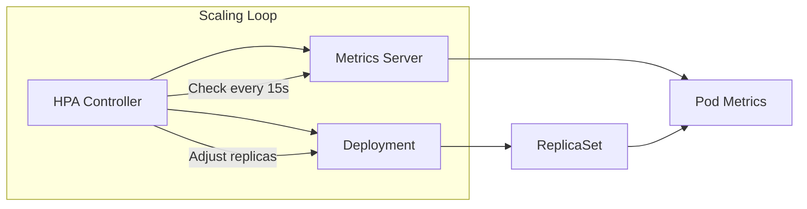

# How to Set Up Horizontal Pod Autoscaling (HPA) in Kubernetes

Author: [nawazdhandala](https://www.github.com/nawazdhandala)

Tags: Kubernetes, HPA, Autoscaling, Performance, Scaling, DevOps

Description: A comprehensive guide to setting up Horizontal Pod Autoscaler (HPA) in Kubernetes, including metrics server setup, custom metrics, scaling behaviors, and production best practices.

---

Manual scaling doesn't work at scale. The Horizontal Pod Autoscaler (HPA) automatically adjusts the number of pod replicas based on observed metrics. Here's how to set it up properly.

## How HPA Works



HPA monitors metrics and calculates desired replicas using:

```
desiredReplicas = ceil[currentReplicas * (currentMetricValue / desiredMetricValue)]
```

## Prerequisites: Metrics Server

HPA needs metrics to scale. Install the metrics server:

```bash
# Check if already installed
kubectl get deployment metrics-server -n kube-system

# Install if missing
kubectl apply -f https://github.com/kubernetes-sigs/metrics-server/releases/latest/download/components.yaml

# For local clusters (minikube, kind), add --kubelet-insecure-tls
kubectl patch deployment metrics-server -n kube-system --type='json' -p='[
  {"op": "add", "path": "/spec/template/spec/containers/0/args/-", "value": "--kubelet-insecure-tls"}
]'

# Verify metrics are working
kubectl top nodes
kubectl top pods -A
```

## Basic HPA Setup

### Step 1: Ensure Resource Requests Are Set

HPA calculates CPU/memory utilization as a percentage of requests. No requests = no scaling.

```yaml
apiVersion: apps/v1
kind: Deployment
metadata:
  name: web-api
  namespace: production
spec:
  replicas: 2
  selector:
    matchLabels:
      app: web-api
  template:
    metadata:
      labels:
        app: web-api
    spec:
      containers:
        - name: api
          image: myapp/api:v1.0
          resources:
            requests:
              cpu: 100m      # Required for HPA
              memory: 128Mi
            limits:
              cpu: 500m
              memory: 512Mi
          ports:
            - containerPort: 8080
```

### Step 2: Create the HPA

```yaml
apiVersion: autoscaling/v2
kind: HorizontalPodAutoscaler
metadata:
  name: web-api
  namespace: production
spec:
  scaleTargetRef:
    apiVersion: apps/v1
    kind: Deployment
    name: web-api
  minReplicas: 2
  maxReplicas: 20
  metrics:
    - type: Resource
      resource:
        name: cpu
        target:
          type: Utilization
          averageUtilization: 70
```

### Step 3: Apply and Verify

```bash
kubectl apply -f hpa.yaml

# Check HPA status
kubectl get hpa -n production

# Output:
# NAME      REFERENCE            TARGETS   MINPODS   MAXPODS   REPLICAS   AGE
# web-api   Deployment/web-api   25%/70%   2         20        2          1m

# Detailed view
kubectl describe hpa web-api -n production
```

## HPA with Multiple Metrics

Scale based on both CPU and memory:

```yaml
apiVersion: autoscaling/v2
kind: HorizontalPodAutoscaler
metadata:
  name: web-api
  namespace: production
spec:
  scaleTargetRef:
    apiVersion: apps/v1
    kind: Deployment
    name: web-api
  minReplicas: 2
  maxReplicas: 20
  metrics:
    - type: Resource
      resource:
        name: cpu
        target:
          type: Utilization
          averageUtilization: 70
    - type: Resource
      resource:
        name: memory
        target:
          type: Utilization
          averageUtilization: 80
```

When multiple metrics are specified, HPA calculates desired replicas for each and takes the maximum.

## Custom Metrics Scaling

Scale based on application-specific metrics like requests per second or queue depth.

### Install Prometheus Adapter

```bash
helm repo add prometheus-community https://prometheus-community.github.io/helm-charts
helm install prometheus-adapter prometheus-community/prometheus-adapter \
  --namespace monitoring \
  --set prometheus.url=http://prometheus.monitoring.svc \
  --set prometheus.port=9090
```

### Configure Custom Metrics

```yaml
# prometheus-adapter config
apiVersion: v1
kind: ConfigMap
metadata:
  name: adapter-config
  namespace: monitoring
data:
  config.yaml: |
    rules:
      - seriesQuery: 'http_requests_total{namespace!="",pod!=""}'
        resources:
          overrides:
            namespace: {resource: "namespace"}
            pod: {resource: "pod"}
        name:
          matches: "^(.*)_total$"
          as: "${1}_per_second"
        metricsQuery: 'sum(rate(<<.Series>>{<<.LabelMatchers>>}[2m])) by (<<.GroupBy>>)'
```

### HPA with Custom Metrics

```yaml
apiVersion: autoscaling/v2
kind: HorizontalPodAutoscaler
metadata:
  name: web-api
  namespace: production
spec:
  scaleTargetRef:
    apiVersion: apps/v1
    kind: Deployment
    name: web-api
  minReplicas: 2
  maxReplicas: 50
  metrics:
    - type: Pods
      pods:
        metric:
          name: http_requests_per_second
        target:
          type: AverageValue
          averageValue: 1000  # Scale when > 1000 RPS per pod
```

## External Metrics Scaling

Scale based on metrics from external systems (SQS queue length, pub/sub backlog):

```yaml
apiVersion: autoscaling/v2
kind: HorizontalPodAutoscaler
metadata:
  name: queue-processor
  namespace: production
spec:
  scaleTargetRef:
    apiVersion: apps/v1
    kind: Deployment
    name: queue-processor
  minReplicas: 1
  maxReplicas: 100
  metrics:
    - type: External
      external:
        metric:
          name: sqs_queue_messages_visible
          selector:
            matchLabels:
              queue: orders
        target:
          type: AverageValue
          averageValue: 30  # 30 messages per pod
```

## Scaling Behavior Configuration

Control how fast HPA scales up and down:

```yaml
apiVersion: autoscaling/v2
kind: HorizontalPodAutoscaler
metadata:
  name: web-api
  namespace: production
spec:
  scaleTargetRef:
    apiVersion: apps/v1
    kind: Deployment
    name: web-api
  minReplicas: 2
  maxReplicas: 20
  metrics:
    - type: Resource
      resource:
        name: cpu
        target:
          type: Utilization
          averageUtilization: 70
  behavior:
    scaleUp:
      stabilizationWindowSeconds: 0   # Scale up immediately
      policies:
        - type: Percent
          value: 100                   # Double pods
          periodSeconds: 60
        - type: Pods
          value: 4                     # Or add 4 pods
          periodSeconds: 60
      selectPolicy: Max                # Use whichever adds more
    scaleDown:
      stabilizationWindowSeconds: 300  # Wait 5 min before scaling down
      policies:
        - type: Percent
          value: 10                    # Remove 10% of pods
          periodSeconds: 60
      selectPolicy: Min                # Scale down conservatively
```

### Scale-Up Patterns

**Aggressive (burst traffic):**
```yaml
scaleUp:
  stabilizationWindowSeconds: 0
  policies:
    - type: Percent
      value: 200
      periodSeconds: 15
```

**Conservative (steady growth):**
```yaml
scaleUp:
  stabilizationWindowSeconds: 60
  policies:
    - type: Pods
      value: 2
      periodSeconds: 60
```

### Scale-Down Patterns

**Quick cooldown:**
```yaml
scaleDown:
  stabilizationWindowSeconds: 60
  policies:
    - type: Percent
      value: 50
      periodSeconds: 60
```

**Slow cooldown (prevent thrashing):**
```yaml
scaleDown:
  stabilizationWindowSeconds: 600
  policies:
    - type: Pods
      value: 1
      periodSeconds: 120
```

## Testing HPA

### Generate Load

```bash
# Simple load generator
kubectl run load-gen --rm -it --image=busybox -- /bin/sh -c \
  "while true; do wget -q -O- http://web-api.production.svc; done"

# Better: use hey or k6
kubectl run hey --rm -it --image=williamyeh/hey -- \
  -z 5m -c 100 http://web-api.production.svc:8080/
```

### Watch Scaling

```bash
# Watch HPA
watch kubectl get hpa -n production

# Watch pods
watch kubectl get pods -n production -l app=web-api

# Watch events
kubectl get events -n production --watch
```

## Production Best Practices

### 1. Set Appropriate Resource Requests

```yaml
# Profile your application to find right values
resources:
  requests:
    cpu: 200m    # Based on actual P50 usage
    memory: 256Mi
  limits:
    cpu: 1000m   # Based on P99 burst
    memory: 512Mi
```

### 2. Use PodDisruptionBudget

Prevent HPA from scaling down too aggressively:

```yaml
apiVersion: policy/v1
kind: PodDisruptionBudget
metadata:
  name: web-api
  namespace: production
spec:
  minAvailable: 2  # Always keep at least 2 pods
  selector:
    matchLabels:
      app: web-api
```

### 3. Set minReplicas > 1 for Production

```yaml
spec:
  minReplicas: 2  # Never go below 2 for HA
  maxReplicas: 20
```

### 4. Monitor HPA Performance

```yaml
# Alert if at max replicas
apiVersion: monitoring.coreos.com/v1
kind: PrometheusRule
metadata:
  name: hpa-alerts
spec:
  groups:
    - name: hpa
      rules:
        - alert: HPAAtMaxReplicas
          expr: |
            kube_horizontalpodautoscaler_status_current_replicas
            ==
            kube_horizontalpodautoscaler_spec_max_replicas
          for: 15m
          labels:
            severity: warning
          annotations:
            summary: "HPA {{ $labels.horizontalpodautoscaler }} at max replicas"
```

### 5. Consider Startup Time

If pods take time to start, scale proactively:

```yaml
metrics:
  - type: Resource
    resource:
      name: cpu
      target:
        type: Utilization
        averageUtilization: 50  # Lower threshold = more headroom
```

## Troubleshooting HPA

### HPA Shows "Unknown" Metrics

```bash
# Check metrics server
kubectl top pods -n production

# Check API service
kubectl get apiservice v1beta1.metrics.k8s.io

# Check HPA events
kubectl describe hpa web-api -n production
```

### HPA Not Scaling Up

1. Check resource requests are set
2. Verify current utilization exceeds target
3. Check maxReplicas hasn't been reached
4. Look for deployment issues (ImagePullBackOff, etc.)

```bash
# Debug command
kubectl get hpa web-api -n production -o yaml
kubectl describe deploy web-api -n production
```

### HPA Scaling Too Aggressively

Increase stabilization window:

```yaml
behavior:
  scaleUp:
    stabilizationWindowSeconds: 120
  scaleDown:
    stabilizationWindowSeconds: 600
```

### Metrics Delayed or Missing

```bash
# Check Prometheus Adapter
kubectl logs -n monitoring -l app=prometheus-adapter

# Verify custom metrics are available
kubectl get --raw /apis/custom.metrics.k8s.io/v1beta1 | jq
```

## HPA + VPA Interaction

Don't use HPA and VPA on the same resource dimension. Common pattern:

- HPA scales replicas based on CPU utilization
- VPA adjusts memory requests (CPU recommendations disabled)

```yaml
# HPA on CPU
apiVersion: autoscaling/v2
kind: HorizontalPodAutoscaler
spec:
  metrics:
    - type: Resource
      resource:
        name: cpu
---
# VPA on Memory only
apiVersion: autoscaling.k8s.io/v1
kind: VerticalPodAutoscaler
spec:
  resourcePolicy:
    containerPolicies:
      - containerName: '*'
        controlledResources: ["memory"]  # CPU controlled by HPA
```

---

HPA is essential for handling variable load without manual intervention. Start with CPU-based scaling, add memory if needed, and graduate to custom metrics when you understand your application's behavior. The key is setting proper resource requests and tuning behavior policies for your traffic patterns.
