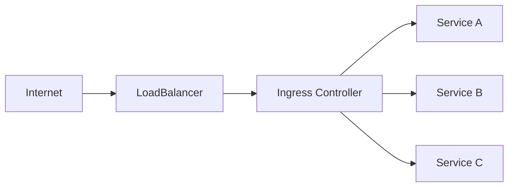

# How to Set Up Ingress Controllers in Kubernetes: NGINX vs Traefik vs HAProxy

Author: [nawazdhandala](https://www.github.com/nawazdhandala)

Tags: Kubernetes, Ingress, Networking, NGINX, Traefik, HAProxy, DevOps

Description: A comprehensive comparison of NGINX, Traefik, and HAProxy Ingress controllers with installation guides, configuration examples, and decision criteria for choosing the right one.

---

Ingress controllers are the gatekeepers of your Kubernetes cluster. They route external HTTP/HTTPS traffic to the right services. Choosing the right one matters for performance, flexibility, and operational sanity.

## What Is an Ingress Controller?

An Ingress resource defines routing rules. An Ingress controller implements them by configuring a reverse proxy (NGINX, Traefik, HAProxy, etc.) based on those rules.



Without an Ingress controller, Ingress resources do nothing.

## Quick Comparison

| Feature | NGINX Ingress | Traefik | HAProxy Ingress |
|---------|--------------|---------|-----------------|
| Configuration | Annotations + ConfigMap | CRDs + Labels | ConfigMap + CRDs |
| Auto TLS (Let's Encrypt) | Requires cert-manager | Built-in | Requires cert-manager |
| Dashboard | No (Prometheus metrics) | Yes (built-in) | Yes (stats page) |
| TCP/UDP Support | Yes | Yes | Yes |
| gRPC | Yes | Yes | Yes |
| WebSocket | Yes | Yes | Yes |
| Learning Curve | Low | Low | Medium |
| Performance | Excellent | Good | Excellent |
| Community | Huge | Large | Medium |

## Option 1: NGINX Ingress Controller

The most battle-tested option. Two flavors exist:
- **kubernetes/ingress-nginx**: Community-maintained (recommended)
- **nginxinc/kubernetes-ingress**: NGINX Inc. commercial offering

### Installation with Helm

This Helm installation deploys the NGINX Ingress Controller with 2 replicas for high availability and exposes it via a cloud load balancer.

```bash
# Add the official ingress-nginx Helm repository
helm repo add ingress-nginx https://kubernetes.github.io/ingress-nginx
helm repo update

# Install with high availability settings
helm install ingress-nginx ingress-nginx/ingress-nginx \
  --namespace ingress-nginx \
  --create-namespace \
  --set controller.replicaCount=2 \         # HA: run 2 replicas
  --set controller.service.type=LoadBalancer # Expose via cloud LB
```

### Verify Installation

After installation, verify the controller pods are running and the LoadBalancer has an external IP assigned. This IP is where you'll point your DNS records.

```bash
# Check controller pods are running
kubectl get pods -n ingress-nginx
# Check service has external IP (may take a few minutes)
kubectl get svc -n ingress-nginx
```

### Basic Ingress Resource

This Ingress resource routes traffic based on paths. Requests to /api go to the API service, while all other requests go to the frontend. TLS is enabled with a pre-created certificate secret.

```yaml
apiVersion: networking.k8s.io/v1
kind: Ingress
metadata:
  name: web-ingress
  namespace: production
  annotations:
    # Rewrite /api/foo to /foo when forwarding to backend
    nginx.ingress.kubernetes.io/rewrite-target: /
    # Redirect HTTP to HTTPS
    nginx.ingress.kubernetes.io/ssl-redirect: "true"
spec:
  ingressClassName: nginx          # Select NGINX ingress controller
  tls:
    - hosts:
        - app.example.com
      secretName: app-tls          # TLS certificate secret
  rules:
    - host: app.example.com
      http:
        paths:
          # Route /api/* to API service
          - path: /api
            pathType: Prefix
            backend:
              service:
                name: api-service
                port:
                  number: 8080
          # Route everything else to frontend
          - path: /
            pathType: Prefix
            backend:
              service:
                name: frontend-service
                port:
                  number: 80
```

### Useful NGINX Annotations

NGINX annotations provide fine-grained control over request handling. These examples show common production configurations for rate limiting, timeouts, CORS, and authentication.

```yaml
annotations:
  # Rate limiting - protect against abuse
  nginx.ingress.kubernetes.io/limit-rps: "100"            # Max 100 requests/second
  nginx.ingress.kubernetes.io/limit-connections: "10"      # Max 10 concurrent connections

  # Timeouts - tune for your application needs
  nginx.ingress.kubernetes.io/proxy-connect-timeout: "30"  # Backend connection timeout
  nginx.ingress.kubernetes.io/proxy-read-timeout: "300"    # Wait up to 5 min for response

  # Body size - increase for file uploads
  nginx.ingress.kubernetes.io/proxy-body-size: "50m"       # Allow 50MB uploads

  # CORS - enable cross-origin requests
  nginx.ingress.kubernetes.io/enable-cors: "true"
  nginx.ingress.kubernetes.io/cors-allow-origin: "https://example.com"

  # Authentication - protect with basic auth
  nginx.ingress.kubernetes.io/auth-type: basic
  nginx.ingress.kubernetes.io/auth-secret: basic-auth      # Secret with htpasswd
  nginx.ingress.kubernetes.io/auth-realm: "Authentication Required"
```

## Option 2: Traefik Ingress Controller

Traefik shines with automatic service discovery, built-in Let's Encrypt, and a beautiful dashboard. It's the default in K3s.

### Installation with Helm

Traefik supports both standard Kubernetes Ingress and its own CRDs (IngressRoute). This installation enables both, plus the built-in dashboard for monitoring and debugging.

```bash
# Add Traefik Helm repository
helm repo add traefik https://traefik.github.io/charts
helm repo update

# Install with dashboard and both providers enabled
helm install traefik traefik/traefik \
  --namespace traefik \
  --create-namespace \
  --set dashboard.enabled=true \                  # Enable web dashboard
  --set dashboard.ingressRoute=true \             # Expose dashboard via IngressRoute
  --set providers.kubernetesIngress.enabled=true \ # Support standard Ingress
  --set providers.kubernetesCRD.enabled=true      # Support Traefik CRDs
```

### Verify Installation

Verify Traefik pods are running and the service is exposed. Traefik creates a LoadBalancer service by default for external access.

```bash
# Check Traefik pods are running
kubectl get pods -n traefik
# Check service for external IP
kubectl get svc -n traefik
```

### Basic IngressRoute (Traefik CRD)

IngressRoute is Traefik's native CRD offering more features than standard Ingress. The match field uses Traefik's powerful expression syntax for routing based on host, path, headers, and more.

```yaml
apiVersion: traefik.io/v1alpha1
kind: IngressRoute
metadata:
  name: web-ingressroute
  namespace: production
spec:
  entryPoints:
    - websecure                    # Use HTTPS entrypoint (port 443)
  routes:
    # Route API requests with rate limiting
    - match: Host(`app.example.com`) && PathPrefix(`/api`)
      kind: Rule
      services:
        - name: api-service
          port: 8080
      middlewares:
        - name: rate-limit         # Apply rate limiting middleware
    # Route all other requests to frontend
    - match: Host(`app.example.com`)
      kind: Rule
      services:
        - name: frontend-service
          port: 80
  tls:
    secretName: app-tls            # TLS certificate secret
```

### Traefik Middleware for Rate Limiting

Traefik Middleware resources define reusable request processing. This rate limiter allows 100 requests/second average with bursts up to 50 additional requests.

```yaml
apiVersion: traefik.io/v1alpha1
kind: Middleware
metadata:
  name: rate-limit
  namespace: production
spec:
  rateLimit:
    average: 100                   # Average requests per second allowed
    burst: 50                      # Allow bursts above average
    period: 1s                     # Time period for rate calculation
```

### Automatic Let's Encrypt with Traefik

Traefik can automatically obtain and renew TLS certificates from Let's Encrypt. This eliminates the need for cert-manager and simplifies TLS management.

```yaml
apiVersion: traefik.io/v1alpha1
kind: IngressRoute
metadata:
  name: secure-route
spec:
  entryPoints:
    - websecure                    # HTTPS entrypoint
  routes:
    - match: Host(`app.example.com`)
      kind: Rule
      services:
        - name: my-service
          port: 80
  tls:
    certResolver: letsencrypt      # Use Let's Encrypt cert resolver
```

Add to Helm values:

These Helm values configure the Let's Encrypt certificate resolver. ACME is the protocol used by Let's Encrypt, and httpChallenge proves domain ownership via HTTP.

```yaml
additionalArguments:
  # Email for Let's Encrypt registration and notifications
  - "--certificatesresolvers.letsencrypt.acme.email=admin@example.com"
  # Storage location for certificates
  - "--certificatesresolvers.letsencrypt.acme.storage=/data/acme.json"
  # Use HTTP challenge on the web entrypoint
  - "--certificatesresolvers.letsencrypt.acme.httpchallenge.entrypoint=web"
```

### Access Traefik Dashboard

The Traefik dashboard shows routes, services, middlewares, and real-time request information. Use port-forward for secure local access.

```bash
# Port-forward to access dashboard locally
kubectl port-forward -n traefik svc/traefik 9000:9000
# Open http://localhost:9000/dashboard/
```

## Option 3: HAProxy Ingress Controller

HAProxy is legendary for raw performance and fine-grained traffic control. Choose it for high-throughput scenarios.

### Installation with Helm

HAProxy Ingress installation with high availability. HAProxy excels at handling millions of concurrent connections with minimal resource overhead.

```bash
# Add HAProxy Ingress Helm repository
helm repo add haproxy-ingress https://haproxy-ingress.github.io/charts
helm repo update

# Install with HA settings
helm install haproxy-ingress haproxy-ingress/haproxy-ingress \
  --namespace haproxy-ingress \
  --create-namespace \
  --set controller.replicaCount=2 \         # HA: run 2 replicas
  --set controller.service.type=LoadBalancer # Expose via cloud LB
```

### Verify Installation

Verify the HAProxy Ingress controller is running. Check both the pods and the LoadBalancer service.

```bash
# Check controller pods are running
kubectl get pods -n haproxy-ingress
# Check service for external IP
kubectl get svc -n haproxy-ingress
```

### Basic Ingress with HAProxy

HAProxy Ingress uses standard Kubernetes Ingress resources with HAProxy-specific annotations for advanced configuration.

```yaml
apiVersion: networking.k8s.io/v1
kind: Ingress
metadata:
  name: web-ingress
  namespace: production
  annotations:
    # Redirect HTTP to HTTPS
    haproxy-ingress.github.io/ssl-redirect: "true"
    # Long timeout for WebSocket or streaming connections
    haproxy-ingress.github.io/timeout-server: "300s"
spec:
  ingressClassName: haproxy        # Select HAProxy ingress controller
  tls:
    - hosts:
        - app.example.com
      secretName: app-tls          # TLS certificate secret
  rules:
    - host: app.example.com
      http:
        paths:
          - path: /
            pathType: Prefix
            backend:
              service:
                name: web-service
                port:
                  number: 80
```

### HAProxy-Specific Annotations

HAProxy annotations provide enterprise-grade features like connection limits, advanced health checking, load balancing algorithms, and WAF integration.

```yaml
annotations:
  # Connection limits - prevent backend overload
  haproxy-ingress.github.io/maxconn-server: "100"           # Max connections per backend

  # Health checks - detect and route around failures
  haproxy-ingress.github.io/health-check-interval: "5s"     # Check every 5 seconds
  haproxy-ingress.github.io/health-check-rise: "2"          # 2 successes to mark healthy
  haproxy-ingress.github.io/health-check-fall: "3"          # 3 failures to mark unhealthy

  # Load balancing algorithm
  haproxy-ingress.github.io/balance-algorithm: "roundrobin" # Or leastconn, source, uri

  # Rate limiting - protect against abuse
  haproxy-ingress.github.io/limit-rps: "100"                # Max 100 requests/second

  # WAF rules - enable ModSecurity for security
  haproxy-ingress.github.io/waf: "modsecurity"
```

## TLS Certificate Management

All three controllers work with cert-manager for automatic certificate provisioning:

Cert-manager automates TLS certificate management for Kubernetes. It handles certificate requests, renewals, and secret creation for all ingress controllers.

```bash
# Add cert-manager Helm repository
helm repo add jetstack https://charts.jetstack.io
helm repo update

# Install cert-manager with CRDs
helm install cert-manager jetstack/cert-manager \
  --namespace cert-manager \
  --create-namespace \
  --set installCRDs=true           # Install Custom Resource Definitions
```

### ClusterIssuer for Let's Encrypt

A ClusterIssuer is a cluster-wide certificate issuer. This configuration uses Let's Encrypt production servers with HTTP-01 challenge for domain validation.

```yaml
apiVersion: cert-manager.io/v1
kind: ClusterIssuer
metadata:
  name: letsencrypt-prod
spec:
  acme:
    # Let's Encrypt production server
    server: https://acme-v02.api.letsencrypt.org/directory
    # Email for certificate expiration notifications
    email: admin@example.com
    privateKeySecretRef:
      name: letsencrypt-prod       # Store account private key here
    solvers:
      # Use HTTP-01 challenge with your ingress controller
      - http01:
          ingress:
            class: nginx           # or traefik, haproxy
```

### Ingress with Automatic TLS

Adding the cluster-issuer annotation tells cert-manager to automatically request and manage a TLS certificate for the specified hosts. The certificate is stored in the specified secret.

```yaml
apiVersion: networking.k8s.io/v1
kind: Ingress
metadata:
  name: web-ingress
  annotations:
    # Tell cert-manager to issue a certificate
    cert-manager.io/cluster-issuer: "letsencrypt-prod"
spec:
  ingressClassName: nginx
  tls:
    - hosts:
        - app.example.com
      secretName: app-tls          # cert-manager creates this secret
  rules:
    - host: app.example.com
      http:
        paths:
          - path: /
            pathType: Prefix
            backend:
              service:
                name: web-service
                port:
                  number: 80
```

## When to Choose What

### Choose NGINX Ingress When:
- You need maximum community support and documentation
- Your team already knows NGINX configuration
- You want extensive annotation-based customization
- You need battle-tested production stability

### Choose Traefik When:
- You want built-in Let's Encrypt without cert-manager
- You need automatic service discovery
- You prefer CRD-based configuration over annotations
- You want a built-in dashboard
- You're using K3s (it's the default)

### Choose HAProxy When:
- You need maximum throughput and lowest latency
- You're handling millions of connections
- You need advanced load balancing algorithms
- You want built-in WAF capabilities
- Your team has HAProxy expertise

## Performance Tuning

### NGINX Tuning

This ConfigMap tunes NGINX for high-throughput scenarios. These settings increase worker connections, enable connection reuse, and optimize timeouts.

```yaml
# ConfigMap for nginx-ingress
apiVersion: v1
kind: ConfigMap
metadata:
  name: ingress-nginx-controller
  namespace: ingress-nginx
data:
  worker-processes: "auto"                   # Match CPU cores
  max-worker-connections: "65535"            # High connection limit
  keep-alive: "75"                           # Keep-alive timeout seconds
  keep-alive-requests: "1000"                # Max requests per keep-alive
  upstream-keepalive-connections: "320"      # Backend connection pool
  upstream-keepalive-timeout: "60"           # Backend keep-alive timeout
  proxy-connect-timeout: "15"                # Fast fail on connection issues
  proxy-read-timeout: "60"                   # Time to wait for response
```

### Traefik Tuning

These Helm values configure Traefik for production workloads with appropriate resource limits and timeout settings.

```yaml
# Helm values
deployment:
  replicas: 3                      # Run 3 replicas for HA

resources:
  requests:
    cpu: "500m"
    memory: "256Mi"
  limits:
    cpu: "2000m"
    memory: "1Gi"

additionalArguments:
  # Graceful shutdown timeout
  - "--entryPoints.web.transport.lifeCycle.graceTimeOut=30s"
  # Read timeout for HTTPS connections
  - "--entryPoints.websecure.transport.respondingTimeouts.readTimeout=60s"
```

## Monitoring and Observability

All three controllers expose Prometheus metrics:

This ServiceMonitor configures Prometheus to scrape NGINX Ingress metrics. Similar configurations work for Traefik and HAProxy.

```yaml
# ServiceMonitor for NGINX
apiVersion: monitoring.coreos.com/v1
kind: ServiceMonitor
metadata:
  name: nginx-ingress
  namespace: monitoring
spec:
  selector:
    matchLabels:
      app.kubernetes.io/name: ingress-nginx  # Match NGINX service labels
  endpoints:
    - port: metrics                # Scrape metrics port
      interval: 30s                # Every 30 seconds
```

Key metrics to watch:
- `nginx_ingress_controller_requests` - Request count by status code
- `nginx_ingress_controller_request_duration_seconds` - Latency histogram
- `nginx_ingress_controller_upstream_latency_seconds` - Backend latency

## Troubleshooting Common Issues

### Ingress Not Working

When Ingress resources are not routing traffic, systematically check the controller, Ingress class, and backend connectivity.

```bash
# Check Ingress controller logs for errors
kubectl logs -n ingress-nginx -l app.kubernetes.io/name=ingress-nginx

# Verify Ingress class exists and is default
kubectl get ingressclass

# Check Ingress events for errors
kubectl describe ingress <name> -n <namespace>

# Test from inside cluster - bypass external networking
kubectl run curl --rm -it --image=curlimages/curl -- \
  curl -H "Host: app.example.com" http://ingress-nginx-controller.ingress-nginx.svc
```

### TLS Certificate Issues

Certificate problems often manifest as browser warnings or connection failures. Check the certificate resource, secret, and cert-manager logs.

```bash
# Check certificate status - look for Ready=True
kubectl describe certificate <name> -n <namespace>

# Verify secret exists and contains certificate data
kubectl get secret <tls-secret> -n <namespace> -o yaml

# Check cert-manager logs for errors
kubectl logs -n cert-manager -l app=cert-manager
```

### 502/504 Gateway Errors

Usually means the backend service is unreachable:

502 Bad Gateway indicates the ingress controller cannot connect to your backend. This is usually a backend pod or service configuration issue, not an ingress problem.

```bash
# Check backend pods are running and ready
kubectl get pods -l app=<backend-app>

# Verify service has endpoints (pods selected)
kubectl get endpoints <service-name>

# Test backend directly - bypass ingress
kubectl port-forward svc/<service-name> 8080:80
curl localhost:8080
```

---

The right Ingress controller depends on your team's experience, performance requirements, and feature needs. NGINX wins on community support, Traefik wins on ease of use, and HAProxy wins on raw performance. Pick one, learn it well, and standardize across your clusters.
