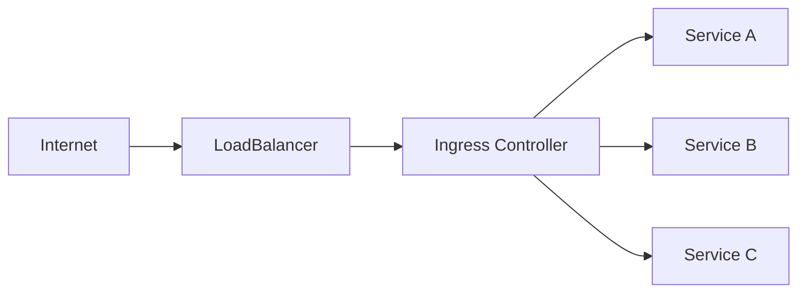

# How to Set Up Ingress Controllers in Kubernetes: NGINX vs Traefik vs HAProxy

Author: [nawazdhandala](https://www.github.com/nawazdhandala)

Tags: Kubernetes, Ingress, Networking, NGINX, Traefik, HAProxy, DevOps

Description: A comprehensive comparison of NGINX, Traefik, and HAProxy Ingress controllers with installation guides, configuration examples, and decision criteria for choosing the right one.

---

Ingress controllers are the gatekeepers of your Kubernetes cluster. They route external HTTP/HTTPS traffic to the right services. Choosing the right one matters for performance, flexibility, and operational sanity.

## What Is an Ingress Controller?

An Ingress resource defines routing rules. An Ingress controller implements them by configuring a reverse proxy (NGINX, Traefik, HAProxy, etc.) based on those rules.



Without an Ingress controller, Ingress resources do nothing.

## Quick Comparison

| Feature | NGINX Ingress | Traefik | HAProxy Ingress |
|---------|--------------|---------|-----------------|
| Configuration | Annotations + ConfigMap | CRDs + Labels | ConfigMap + CRDs |
| Auto TLS (Let's Encrypt) | Requires cert-manager | Built-in | Requires cert-manager |
| Dashboard | No (Prometheus metrics) | Yes (built-in) | Yes (stats page) |
| TCP/UDP Support | Yes | Yes | Yes |
| gRPC | Yes | Yes | Yes |
| WebSocket | Yes | Yes | Yes |
| Learning Curve | Low | Low | Medium |
| Performance | Excellent | Good | Excellent |
| Community | Huge | Large | Medium |

## Option 1: NGINX Ingress Controller

The most battle-tested option. Two flavors exist:
- **kubernetes/ingress-nginx**: Community-maintained (recommended)
- **nginxinc/kubernetes-ingress**: NGINX Inc. commercial offering

### Installation with Helm

```bash
helm repo add ingress-nginx https://kubernetes.github.io/ingress-nginx
helm repo update

helm install ingress-nginx ingress-nginx/ingress-nginx \
  --namespace ingress-nginx \
  --create-namespace \
  --set controller.replicaCount=2 \
  --set controller.service.type=LoadBalancer
```

### Verify Installation

```bash
kubectl get pods -n ingress-nginx
kubectl get svc -n ingress-nginx
```

### Basic Ingress Resource

```yaml
apiVersion: networking.k8s.io/v1
kind: Ingress
metadata:
  name: web-ingress
  namespace: production
  annotations:
    nginx.ingress.kubernetes.io/rewrite-target: /
    nginx.ingress.kubernetes.io/ssl-redirect: "true"
spec:
  ingressClassName: nginx
  tls:
    - hosts:
        - app.example.com
      secretName: app-tls
  rules:
    - host: app.example.com
      http:
        paths:
          - path: /api
            pathType: Prefix
            backend:
              service:
                name: api-service
                port:
                  number: 8080
          - path: /
            pathType: Prefix
            backend:
              service:
                name: frontend-service
                port:
                  number: 80
```

### Useful NGINX Annotations

```yaml
annotations:
  # Rate limiting
  nginx.ingress.kubernetes.io/limit-rps: "100"
  nginx.ingress.kubernetes.io/limit-connections: "10"

  # Timeouts
  nginx.ingress.kubernetes.io/proxy-connect-timeout: "30"
  nginx.ingress.kubernetes.io/proxy-read-timeout: "300"

  # Body size
  nginx.ingress.kubernetes.io/proxy-body-size: "50m"

  # CORS
  nginx.ingress.kubernetes.io/enable-cors: "true"
  nginx.ingress.kubernetes.io/cors-allow-origin: "https://example.com"

  # Authentication
  nginx.ingress.kubernetes.io/auth-type: basic
  nginx.ingress.kubernetes.io/auth-secret: basic-auth
  nginx.ingress.kubernetes.io/auth-realm: "Authentication Required"
```

## Option 2: Traefik Ingress Controller

Traefik shines with automatic service discovery, built-in Let's Encrypt, and a beautiful dashboard. It's the default in K3s.

### Installation with Helm

```bash
helm repo add traefik https://traefik.github.io/charts
helm repo update

helm install traefik traefik/traefik \
  --namespace traefik \
  --create-namespace \
  --set dashboard.enabled=true \
  --set dashboard.ingressRoute=true \
  --set providers.kubernetesIngress.enabled=true \
  --set providers.kubernetesCRD.enabled=true
```

### Verify Installation

```bash
kubectl get pods -n traefik
kubectl get svc -n traefik
```

### Basic IngressRoute (Traefik CRD)

```yaml
apiVersion: traefik.io/v1alpha1
kind: IngressRoute
metadata:
  name: web-ingressroute
  namespace: production
spec:
  entryPoints:
    - websecure
  routes:
    - match: Host(`app.example.com`) && PathPrefix(`/api`)
      kind: Rule
      services:
        - name: api-service
          port: 8080
      middlewares:
        - name: rate-limit
    - match: Host(`app.example.com`)
      kind: Rule
      services:
        - name: frontend-service
          port: 80
  tls:
    secretName: app-tls
```

### Traefik Middleware for Rate Limiting

```yaml
apiVersion: traefik.io/v1alpha1
kind: Middleware
metadata:
  name: rate-limit
  namespace: production
spec:
  rateLimit:
    average: 100
    burst: 50
    period: 1s
```

### Automatic Let's Encrypt with Traefik

```yaml
apiVersion: traefik.io/v1alpha1
kind: IngressRoute
metadata:
  name: secure-route
spec:
  entryPoints:
    - websecure
  routes:
    - match: Host(`app.example.com`)
      kind: Rule
      services:
        - name: my-service
          port: 80
  tls:
    certResolver: letsencrypt
```

Add to Helm values:

```yaml
additionalArguments:
  - "--certificatesresolvers.letsencrypt.acme.email=admin@example.com"
  - "--certificatesresolvers.letsencrypt.acme.storage=/data/acme.json"
  - "--certificatesresolvers.letsencrypt.acme.httpchallenge.entrypoint=web"
```

### Access Traefik Dashboard

```bash
kubectl port-forward -n traefik svc/traefik 9000:9000
# Open http://localhost:9000/dashboard/
```

## Option 3: HAProxy Ingress Controller

HAProxy is legendary for raw performance and fine-grained traffic control. Choose it for high-throughput scenarios.

### Installation with Helm

```bash
helm repo add haproxy-ingress https://haproxy-ingress.github.io/charts
helm repo update

helm install haproxy-ingress haproxy-ingress/haproxy-ingress \
  --namespace haproxy-ingress \
  --create-namespace \
  --set controller.replicaCount=2 \
  --set controller.service.type=LoadBalancer
```

### Verify Installation

```bash
kubectl get pods -n haproxy-ingress
kubectl get svc -n haproxy-ingress
```

### Basic Ingress with HAProxy

```yaml
apiVersion: networking.k8s.io/v1
kind: Ingress
metadata:
  name: web-ingress
  namespace: production
  annotations:
    haproxy-ingress.github.io/ssl-redirect: "true"
    haproxy-ingress.github.io/timeout-server: "300s"
spec:
  ingressClassName: haproxy
  tls:
    - hosts:
        - app.example.com
      secretName: app-tls
  rules:
    - host: app.example.com
      http:
        paths:
          - path: /
            pathType: Prefix
            backend:
              service:
                name: web-service
                port:
                  number: 80
```

### HAProxy-Specific Annotations

```yaml
annotations:
  # Connection limits
  haproxy-ingress.github.io/maxconn-server: "100"

  # Health checks
  haproxy-ingress.github.io/health-check-interval: "5s"
  haproxy-ingress.github.io/health-check-rise: "2"
  haproxy-ingress.github.io/health-check-fall: "3"

  # Load balancing algorithm
  haproxy-ingress.github.io/balance-algorithm: "roundrobin"

  # Rate limiting
  haproxy-ingress.github.io/limit-rps: "100"

  # WAF rules
  haproxy-ingress.github.io/waf: "modsecurity"
```

## TLS Certificate Management

All three controllers work with cert-manager for automatic certificate provisioning:

```bash
helm repo add jetstack https://charts.jetstack.io
helm repo update

helm install cert-manager jetstack/cert-manager \
  --namespace cert-manager \
  --create-namespace \
  --set installCRDs=true
```

### ClusterIssuer for Let's Encrypt

```yaml
apiVersion: cert-manager.io/v1
kind: ClusterIssuer
metadata:
  name: letsencrypt-prod
spec:
  acme:
    server: https://acme-v02.api.letsencrypt.org/directory
    email: admin@example.com
    privateKeySecretRef:
      name: letsencrypt-prod
    solvers:
      - http01:
          ingress:
            class: nginx  # or traefik, haproxy
```

### Ingress with Automatic TLS

```yaml
apiVersion: networking.k8s.io/v1
kind: Ingress
metadata:
  name: web-ingress
  annotations:
    cert-manager.io/cluster-issuer: "letsencrypt-prod"
spec:
  ingressClassName: nginx
  tls:
    - hosts:
        - app.example.com
      secretName: app-tls  # cert-manager creates this
  rules:
    - host: app.example.com
      http:
        paths:
          - path: /
            pathType: Prefix
            backend:
              service:
                name: web-service
                port:
                  number: 80
```

## When to Choose What

### Choose NGINX Ingress When:
- You need maximum community support and documentation
- Your team already knows NGINX configuration
- You want extensive annotation-based customization
- You need battle-tested production stability

### Choose Traefik When:
- You want built-in Let's Encrypt without cert-manager
- You need automatic service discovery
- You prefer CRD-based configuration over annotations
- You want a built-in dashboard
- You're using K3s (it's the default)

### Choose HAProxy When:
- You need maximum throughput and lowest latency
- You're handling millions of connections
- You need advanced load balancing algorithms
- You want built-in WAF capabilities
- Your team has HAProxy expertise

## Performance Tuning

### NGINX Tuning

```yaml
# ConfigMap for nginx-ingress
apiVersion: v1
kind: ConfigMap
metadata:
  name: ingress-nginx-controller
  namespace: ingress-nginx
data:
  worker-processes: "auto"
  max-worker-connections: "65535"
  keep-alive: "75"
  keep-alive-requests: "1000"
  upstream-keepalive-connections: "320"
  upstream-keepalive-timeout: "60"
  proxy-connect-timeout: "15"
  proxy-read-timeout: "60"
```

### Traefik Tuning

```yaml
# Helm values
deployment:
  replicas: 3

resources:
  requests:
    cpu: "500m"
    memory: "256Mi"
  limits:
    cpu: "2000m"
    memory: "1Gi"

additionalArguments:
  - "--entryPoints.web.transport.lifeCycle.graceTimeOut=30s"
  - "--entryPoints.websecure.transport.respondingTimeouts.readTimeout=60s"
```

## Monitoring and Observability

All three controllers expose Prometheus metrics:

```yaml
# ServiceMonitor for NGINX
apiVersion: monitoring.coreos.com/v1
kind: ServiceMonitor
metadata:
  name: nginx-ingress
  namespace: monitoring
spec:
  selector:
    matchLabels:
      app.kubernetes.io/name: ingress-nginx
  endpoints:
    - port: metrics
      interval: 30s
```

Key metrics to watch:
- `nginx_ingress_controller_requests` - Request count by status code
- `nginx_ingress_controller_request_duration_seconds` - Latency histogram
- `nginx_ingress_controller_upstream_latency_seconds` - Backend latency

## Troubleshooting Common Issues

### Ingress Not Working

```bash
# Check Ingress controller logs
kubectl logs -n ingress-nginx -l app.kubernetes.io/name=ingress-nginx

# Verify Ingress class
kubectl get ingressclass

# Check Ingress events
kubectl describe ingress <name> -n <namespace>

# Test from inside cluster
kubectl run curl --rm -it --image=curlimages/curl -- \
  curl -H "Host: app.example.com" http://ingress-nginx-controller.ingress-nginx.svc
```

### TLS Certificate Issues

```bash
# Check certificate status
kubectl describe certificate <name> -n <namespace>

# Verify secret exists
kubectl get secret <tls-secret> -n <namespace> -o yaml

# Check cert-manager logs
kubectl logs -n cert-manager -l app=cert-manager
```

### 502/504 Gateway Errors

Usually means the backend service is unreachable:

```bash
# Check backend pods are running
kubectl get pods -l app=<backend-app>

# Verify service endpoints
kubectl get endpoints <service-name>

# Test backend directly
kubectl port-forward svc/<service-name> 8080:80
curl localhost:8080
```

---

The right Ingress controller depends on your team's experience, performance requirements, and feature needs. NGINX wins on community support, Traefik wins on ease of use, and HAProxy wins on raw performance. Pick one, learn it well, and standardize across your clusters.
