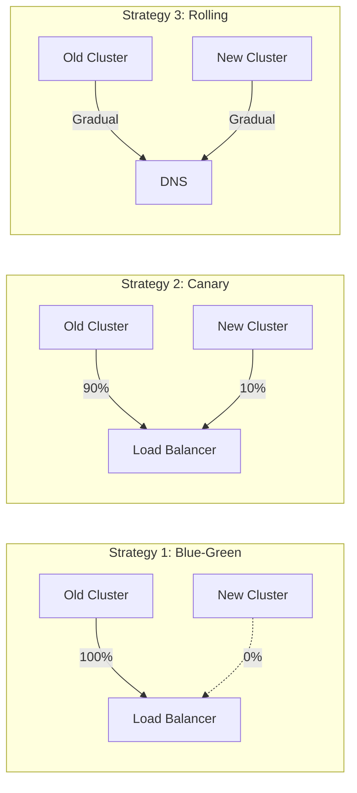
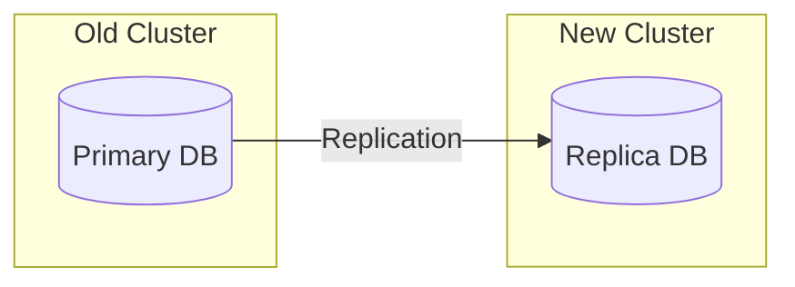

# How to Migrate Workloads Between Kubernetes Clusters with Zero Downtime

Author: [nawazdhandala](https://www.github.com/nawazdhandala)

Tags: Kubernetes, Migration, Zero Downtime, Multi-Cluster, DevOps, Disaster Recovery

Description: A step-by-step guide to migrating workloads between Kubernetes clusters without downtime, including traffic shifting, data migration, and rollback strategies.

---

Migrating between Kubernetes clusters - whether upgrading, changing providers, or consolidating - requires careful planning. Here's how to move workloads without impacting users.

## Migration Strategies



## Pre-Migration Checklist

### 1. Inventory Current Workloads

```bash
# Export all deployments
kubectl get deployments -A -o yaml > deployments.yaml

# Export all services
kubectl get services -A -o yaml > services.yaml

# Export all configmaps and secrets
kubectl get configmaps -A -o yaml > configmaps.yaml
kubectl get secrets -A -o yaml > secrets.yaml

# Export PVCs
kubectl get pvc -A -o yaml > pvcs.yaml

# Export ingresses
kubectl get ingress -A -o yaml > ingresses.yaml

# Export CRDs
kubectl get crds -o yaml > crds.yaml
```

### 2. Identify Dependencies

```bash
# External dependencies
kubectl get services -A -o json | jq '.items[] | select(.spec.type == "LoadBalancer" or .spec.type == "ExternalName")'

# PersistentVolumes
kubectl get pv -o json | jq '.items[] | {name: .metadata.name, claim: .spec.claimRef.name, storage: .spec.capacity.storage}'

# External secrets (Vault, AWS Secrets Manager)
kubectl get externalsecrets -A -o yaml
```

### 3. Document Network Configuration

```bash
# Network policies
kubectl get networkpolicies -A -o yaml > networkpolicies.yaml

# Service mesh configs
kubectl get virtualservices -A -o yaml > virtualservices.yaml
kubectl get destinationrules -A -o yaml > destinationrules.yaml
```

## Setting Up the New Cluster

### 1. Create New Cluster

```bash
# AWS EKS
eksctl create cluster \
  --name new-cluster \
  --version 1.28 \
  --region us-west-2 \
  --nodegroup-name standard-workers \
  --node-type m5.xlarge \
  --nodes 3 \
  --nodes-min 1 \
  --nodes-max 5

# Or GKE
gcloud container clusters create new-cluster \
  --zone us-central1-a \
  --num-nodes 3 \
  --machine-type n1-standard-4
```

### 2. Install Infrastructure Components

```bash
# Install the same versions of infrastructure components
helm install ingress-nginx ingress-nginx/ingress-nginx \
  --namespace ingress-nginx \
  --create-namespace \
  --version 4.8.3

helm install cert-manager jetstack/cert-manager \
  --namespace cert-manager \
  --create-namespace \
  --version v1.13.2 \
  --set installCRDs=true

# Install monitoring
helm install prometheus prometheus-community/kube-prometheus-stack \
  --namespace monitoring \
  --create-namespace
```

### 3. Replicate Secrets

```bash
# Using kubeseal for Sealed Secrets
kubeseal --fetch-cert --controller-namespace kube-system > pub-cert.pem

# Re-encrypt secrets for new cluster
kubeseal --format=yaml --cert=pub-cert.pem < secret.yaml > sealed-secret.yaml
kubectl apply -f sealed-secret.yaml --context=new-cluster
```

Or sync from external secret store:

```yaml
apiVersion: external-secrets.io/v1beta1
kind: ExternalSecret
metadata:
  name: app-secrets
  namespace: production
spec:
  refreshInterval: 1h
  secretStoreRef:
    kind: ClusterSecretStore
    name: aws-secrets-manager
  target:
    name: app-secrets
  data:
    - secretKey: database-password
      remoteRef:
        key: production/database
        property: password
```

## Data Migration

### Database Replication



#### PostgreSQL Replication

```bash
# On old cluster - enable replication
kubectl exec -it postgres-0 -- psql -U postgres -c "
ALTER SYSTEM SET wal_level = replica;
ALTER SYSTEM SET max_wal_senders = 3;
ALTER SYSTEM SET max_replication_slots = 3;
"

# Create replication slot
kubectl exec -it postgres-0 -- psql -U postgres -c "
SELECT pg_create_physical_replication_slot('replica_slot');
"

# On new cluster - set up replica
kubectl exec -it postgres-0 -- bash -c "
pg_basebackup -h <old-primary-endpoint> -D /var/lib/postgresql/data -U replicator -P -R -S replica_slot
"
```

#### Using Velero for Stateful Workloads

```bash
# Install Velero on both clusters
velero install \
  --provider aws \
  --plugins velero/velero-plugin-for-aws:v1.8.0 \
  --bucket velero-backups \
  --backup-location-config region=us-west-2 \
  --snapshot-location-config region=us-west-2 \
  --secret-file ./credentials

# Create backup on old cluster
velero backup create migration-backup \
  --include-namespaces production \
  --include-resources persistentvolumeclaims,persistentvolumes

# Restore on new cluster
velero restore create --from-backup migration-backup
```

### Object Storage Sync

```bash
# Sync S3 buckets
aws s3 sync s3://old-bucket s3://new-bucket --source-region us-east-1 --region us-west-2

# Or use rclone for cross-provider
rclone sync gcs:old-bucket s3:new-bucket
```

## Application Migration

### 1. Deploy to New Cluster

```bash
# Apply manifests to new cluster
kubectl apply -f deployments.yaml --context=new-cluster
kubectl apply -f services.yaml --context=new-cluster
kubectl apply -f configmaps.yaml --context=new-cluster
```

### 2. Verify Deployments

```bash
# Check all deployments are healthy
kubectl get deployments -A --context=new-cluster

# Verify pods are running
kubectl get pods -A --context=new-cluster

# Check service endpoints
kubectl get endpoints -A --context=new-cluster
```

### 3. Run Smoke Tests

```yaml
apiVersion: batch/v1
kind: Job
metadata:
  name: migration-tests
spec:
  template:
    spec:
      containers:
        - name: tests
          image: curlimages/curl
          command:
            - /bin/sh
            - -c
            - |
              # Test API endpoints
              curl -f http://api-service/health || exit 1
              curl -f http://api-service/api/v1/status || exit 1

              # Test database connectivity
              curl -f http://api-service/api/v1/db-check || exit 1

              echo "All tests passed"
      restartPolicy: Never
```

## Traffic Migration

### Option 1: DNS-Based Switching

```bash
# Get new cluster's load balancer IP
NEW_LB_IP=$(kubectl get svc ingress-nginx-controller -n ingress-nginx -o jsonpath='{.status.loadBalancer.ingress[0].ip}' --context=new-cluster)

# Update DNS (low TTL first)
# Set TTL to 60 seconds before migration
# Point to new cluster IP
# After verification, increase TTL back to normal
```

### Option 2: Global Load Balancer

```yaml
# AWS Route 53 weighted routing
{
  "Changes": [
    {
      "Action": "UPSERT",
      "ResourceRecordSet": {
        "Name": "api.example.com",
        "Type": "A",
        "SetIdentifier": "old-cluster",
        "Weight": 90,
        "AliasTarget": {
          "HostedZoneId": "Z35SXDOTRQ7X7K",
          "DNSName": "old-elb.us-west-2.elb.amazonaws.com",
          "EvaluateTargetHealth": true
        }
      }
    },
    {
      "Action": "UPSERT",
      "ResourceRecordSet": {
        "Name": "api.example.com",
        "Type": "A",
        "SetIdentifier": "new-cluster",
        "Weight": 10,
        "AliasTarget": {
          "HostedZoneId": "Z35SXDOTRQ7X7K",
          "DNSName": "new-elb.us-west-2.elb.amazonaws.com",
          "EvaluateTargetHealth": true
        }
      }
    }
  ]
}
```

### Option 3: Service Mesh Traffic Splitting

```yaml
# Istio VirtualService for gradual traffic shift
apiVersion: networking.istio.io/v1alpha3
kind: VirtualService
metadata:
  name: api-service
spec:
  hosts:
    - api.example.com
  http:
    - route:
        - destination:
            host: api-service.old-cluster.svc.cluster.local
          weight: 90
        - destination:
            host: api-service.new-cluster.svc.cluster.local
          weight: 10
```

## Gradual Cutover Process

### Phase 1: Shadow Traffic (0% live)

```yaml
# Mirror traffic to new cluster for testing
apiVersion: networking.istio.io/v1alpha3
kind: VirtualService
metadata:
  name: api-service
spec:
  hosts:
    - api.example.com
  http:
    - route:
        - destination:
            host: api-service-old
          weight: 100
      mirror:
        host: api-service-new
      mirrorPercentage:
        value: 100.0
```

### Phase 2: Canary (10% live)

```bash
# Update weights
# Old cluster: 90%
# New cluster: 10%

# Monitor for errors
kubectl logs -l app=api-service -f --context=new-cluster
```

### Phase 3: Progressive Increase

```bash
#!/bin/bash
# gradual-cutover.sh

WEIGHTS=(10 25 50 75 90 100)
INTERVAL=300  # 5 minutes between increases

for weight in "${WEIGHTS[@]}"; do
    old_weight=$((100 - weight))
    echo "Setting traffic: Old=$old_weight%, New=$weight%"

    # Update Route 53 weights
    aws route53 change-resource-record-sets \
        --hosted-zone-id Z123456 \
        --change-batch "{
            \"Changes\": [{
                \"Action\": \"UPSERT\",
                \"ResourceRecordSet\": {
                    \"Name\": \"api.example.com\",
                    \"Type\": \"A\",
                    \"SetIdentifier\": \"old-cluster\",
                    \"Weight\": $old_weight,
                    \"AliasTarget\": {
                        \"HostedZoneId\": \"Z35SXDOTRQ7X7K\",
                        \"DNSName\": \"old-elb.amazonaws.com\",
                        \"EvaluateTargetHealth\": true
                    }
                }
            }, {
                \"Action\": \"UPSERT\",
                \"ResourceRecordSet\": {
                    \"Name\": \"api.example.com\",
                    \"Type\": \"A\",
                    \"SetIdentifier\": \"new-cluster\",
                    \"Weight\": $weight,
                    \"AliasTarget\": {
                        \"HostedZoneId\": \"Z35SXDOTRQ7X7K\",
                        \"DNSName\": \"new-elb.amazonaws.com\",
                        \"EvaluateTargetHealth\": true
                    }
                }
            }]
        }"

    # Wait and monitor
    echo "Waiting $INTERVAL seconds..."
    sleep $INTERVAL

    # Check error rates
    ERROR_RATE=$(curl -s "http://prometheus:9090/api/v1/query?query=rate(http_requests_total{status=~\"5..\"}[5m])" | jq '.data.result[0].value[1]')

    if (( $(echo "$ERROR_RATE > 0.01" | bc -l) )); then
        echo "Error rate too high ($ERROR_RATE). Rolling back."
        # Rollback logic here
        exit 1
    fi
done

echo "Migration complete!"
```

### Phase 4: Complete Migration

```bash
# Remove old cluster from DNS
aws route53 change-resource-record-sets \
    --hosted-zone-id Z123456 \
    --change-batch '{
        "Changes": [{
            "Action": "DELETE",
            "ResourceRecordSet": {
                "Name": "api.example.com",
                "Type": "A",
                "SetIdentifier": "old-cluster",
                "Weight": 0,
                "AliasTarget": {...}
            }
        }]
    }'
```

## Rollback Plan

### Immediate Rollback

```bash
#!/bin/bash
# rollback.sh

echo "Initiating rollback to old cluster"

# Shift all traffic to old cluster
aws route53 change-resource-record-sets \
    --hosted-zone-id Z123456 \
    --change-batch '{
        "Changes": [{
            "Action": "UPSERT",
            "ResourceRecordSet": {
                "Name": "api.example.com",
                "Type": "A",
                "SetIdentifier": "old-cluster",
                "Weight": 100
            }
        }, {
            "Action": "UPSERT",
            "ResourceRecordSet": {
                "Name": "api.example.com",
                "Type": "A",
                "SetIdentifier": "new-cluster",
                "Weight": 0
            }
        }]
    }'

echo "Rollback complete. Monitoring..."
```

### Database Rollback

```bash
# If using replication, promote old primary
kubectl exec -it postgres-0 --context=old-cluster -- psql -U postgres -c "
SELECT pg_promote();
"

# If using Velero, restore from backup
velero restore create rollback-restore --from-backup pre-migration-backup
```

## Post-Migration Tasks

### 1. Verify Everything

```bash
# Check all services
kubectl get pods -A --context=new-cluster | grep -v Running

# Check persistent volumes
kubectl get pv --context=new-cluster

# Verify external connectivity
curl -I https://api.example.com

# Run full test suite
./run-integration-tests.sh
```

### 2. Update CI/CD Pipelines

```yaml
# Update kubeconfig references
- name: Deploy to Kubernetes
  env:
    KUBECONFIG: ${{ secrets.NEW_CLUSTER_KUBECONFIG }}
  run: |
    kubectl apply -f manifests/
```

### 3. Update Monitoring

```yaml
# Update Prometheus targets
- job_name: 'kubernetes-pods'
  kubernetes_sd_configs:
    - role: pod
      api_server: https://new-cluster.example.com
      tls_config:
        ca_file: /var/run/secrets/kubernetes.io/serviceaccount/ca.crt
      bearer_token_file: /var/run/secrets/kubernetes.io/serviceaccount/token
```

### 4. Decommission Old Cluster

```bash
# Wait 1-2 weeks after complete migration

# Scale down workloads
kubectl scale deployment --all --replicas=0 -A --context=old-cluster

# Delete namespaces
kubectl delete namespace production staging --context=old-cluster

# Delete cluster
eksctl delete cluster --name old-cluster --region us-west-2
```

## Migration Tools

### Velero

```bash
# Backup entire cluster
velero backup create full-backup --include-namespaces '*'

# Restore to new cluster
velero restore create --from-backup full-backup
```

### Submariner (Multi-Cluster Networking)

```bash
# Connect clusters for service discovery during migration
subctl join broker-info.subm --clusterid old-cluster
subctl join broker-info.subm --clusterid new-cluster

# Services can now communicate across clusters
# old-cluster can reach new-cluster.clusterset.local
```

### Liqo (Virtual Kubelet)

```bash
# Enable resource sharing between clusters
liqoctl install
liqoctl peer out-of-band new-cluster --auth-url https://new-cluster.example.com

# Workloads can be scheduled across both clusters
```

## Best Practices

1. **Test in staging first** - Do a complete migration rehearsal
2. **Use low DNS TTLs** - Enable quick rollback
3. **Maintain both clusters** - Keep old cluster running until confident
4. **Monitor closely** - Watch error rates and latencies during transition
5. **Document everything** - Record each step for troubleshooting
6. **Have rollback scripts ready** - Automate the rollback process
7. **Communicate with stakeholders** - Set expectations about potential issues
8. **Choose off-peak hours** - Start migrations during low traffic periods

---

Zero-downtime cluster migration is achievable with careful planning. The key is gradual traffic shifting with constant monitoring. Always have a tested rollback plan, and don't delete the old cluster until you're absolutely certain the migration succeeded.
