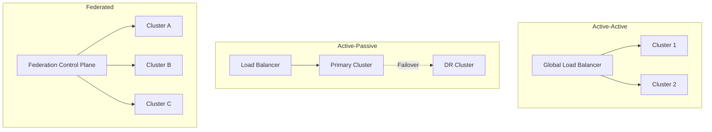

# How to Set Up Multi-Cluster Kubernetes for High Availability

Author: [nawazdhandala](https://www.github.com/nawazdhandala)

Tags: Kubernetes, High Availability, Multi-Cluster, Disaster Recovery, Federation, DevOps

Description: A comprehensive guide to setting up multi-cluster Kubernetes for high availability, including federation patterns, traffic management, and failover strategies.

---

A single Kubernetes cluster is a single point of failure. Multi-cluster setups provide resilience against zone failures, region outages, and even cloud provider incidents.

## Multi-Cluster Architecture Patterns



### Pattern Comparison

| Pattern | RTO | RPO | Cost | Complexity |
|---------|-----|-----|------|------------|
| Active-Active | Minutes | Zero | 2x | High |
| Active-Passive | Minutes-Hours | Minutes | 1.5x | Medium |
| Federated | Depends | Depends | 1.2-2x | Very High |

## Active-Active Setup

### Global Load Balancer with DNS

**Option 1: Cloud Provider Global Load Balancer**

```hcl
# Terraform example for GCP
resource "google_compute_global_address" "default" {
  name = "global-ip"
}

resource "google_compute_backend_service" "default" {
  name        = "multi-cluster-backend"
  port_name   = "http"
  protocol    = "HTTP"
  timeout_sec = 30

  backend {
    group = google_container_node_pool.cluster1.instance_group_urls[0]
  }

  backend {
    group = google_container_node_pool.cluster2.instance_group_urls[0]
  }

  health_checks = [google_compute_health_check.default.id]
}
```

**Option 2: DNS-Based Load Balancing**

```yaml
# ExternalDNS with weighted records
apiVersion: externaldns.k8s.io/v1alpha1
kind: DNSEndpoint
metadata:
  name: myapp-global
spec:
  endpoints:
    - dnsName: myapp.example.com
      recordTTL: 60
      recordType: A
      targets:
        - 1.2.3.4  # Cluster 1 IP
        - 5.6.7.8  # Cluster 2 IP
      setIdentifier: cluster1
      providerSpecific:
        - name: weight
          value: "50"
```

### Service Mesh for Multi-Cluster

**Istio Multi-Cluster Setup**

```bash
# On each cluster, install Istio with multi-cluster config
istioctl install --set values.global.meshID=mesh1 \
  --set values.global.multiCluster.clusterName=cluster1 \
  --set values.global.network=network1

# Create remote secret for cluster discovery
istioctl create-remote-secret --name=cluster2 | \
  kubectl apply -f - --context=cluster1
```

**Cross-Cluster Service Discovery**

```yaml
# ServiceEntry for services in other cluster
apiVersion: networking.istio.io/v1beta1
kind: ServiceEntry
metadata:
  name: remote-service
spec:
  hosts:
    - api.remote.svc.cluster.local
  location: MESH_INTERNAL
  ports:
    - number: 8080
      name: http
      protocol: HTTP
  resolution: DNS
  endpoints:
    - address: api.cluster2.example.com
      ports:
        http: 8080
```

### Submariner for Pod-to-Pod Connectivity

```bash
# Install Submariner broker on hub cluster
subctl deploy-broker --kubeconfig broker-kubeconfig

# Join clusters to the broker
subctl join broker-info.subm --clusterid cluster1 --kubeconfig cluster1-kubeconfig
subctl join broker-info.subm --clusterid cluster2 --kubeconfig cluster2-kubeconfig

# Export services
kubectl annotate service myapp submariner.io/exportTo=ClusterSetIP
```

## Active-Passive Setup

### Velero for DR Backup/Restore

```bash
# Install Velero on both clusters
velero install \
  --provider aws \
  --bucket velero-backups \
  --secret-file ./credentials-velero

# Create scheduled backup on primary
velero schedule create daily-backup \
  --schedule="0 2 * * *" \
  --include-namespaces production \
  --ttl 168h

# Restore on DR cluster during failover
velero restore create --from-backup daily-backup
```

### Database Replication

```yaml
# Primary PostgreSQL
apiVersion: postgresql.cnpg.io/v1
kind: Cluster
metadata:
  name: postgres-primary
spec:
  instances: 3
  primaryUpdateStrategy: unsupervised
  bootstrap:
    initdb:
      database: myapp
  storage:
    size: 100Gi
  replica:
    enabled: true
    source: postgres-dr

# DR PostgreSQL (read replica)
apiVersion: postgresql.cnpg.io/v1
kind: Cluster
metadata:
  name: postgres-dr
spec:
  instances: 2
  replica:
    enabled: true
    source: postgres-primary
  externalClusters:
    - name: postgres-primary
      connectionParameters:
        host: postgres-primary.cluster1.example.com
        user: replication
      password:
        name: replication-secret
        key: password
```

### Failover Automation

```yaml
# Kubernetes Job for failover
apiVersion: batch/v1
kind: Job
metadata:
  name: failover-job
spec:
  template:
    spec:
      containers:
        - name: failover
          image: bitnami/kubectl
          command:
            - /bin/sh
            - -c
            - |
              # Update DNS to point to DR cluster
              curl -X PATCH "https://api.cloudflare.com/client/v4/zones/$ZONE_ID/dns_records/$RECORD_ID" \
                -H "Authorization: Bearer $CF_TOKEN" \
                -H "Content-Type: application/json" \
                --data '{"content":"'$DR_CLUSTER_IP'"}'

              # Scale up DR deployments
              kubectl scale deployment --all --replicas=3

              # Promote database replica
              kubectl annotate cluster postgres-dr cnpg.io/hibernation-
      restartPolicy: OnFailure
```

## GitOps for Multi-Cluster

### ArgoCD ApplicationSet

```yaml
apiVersion: argoproj.io/v1alpha1
kind: ApplicationSet
metadata:
  name: myapp-multicluster
  namespace: argocd
spec:
  generators:
    - clusters:
        selector:
          matchLabels:
            env: production
  template:
    metadata:
      name: 'myapp-{{name}}'
    spec:
      project: default
      source:
        repoURL: https://github.com/myorg/myapp.git
        targetRevision: HEAD
        path: k8s/overlays/{{metadata.labels.region}}
      destination:
        server: '{{server}}'
        namespace: production
      syncPolicy:
        automated:
          prune: true
          selfHeal: true
```

### FluxCD Multi-Cluster

```yaml
# clusters/cluster1/flux-system/kustomization.yaml
apiVersion: kustomize.config.k8s.io/v1beta1
kind: Kustomization
resources:
  - gotk-components.yaml
  - gotk-sync.yaml
  - ../../base/infrastructure
  - ../../base/apps
patches:
  - patch: |
      - op: add
        path: /spec/postBuild/substitute/CLUSTER_NAME
        value: cluster1
    target:
      kind: Kustomization
```

## Health Monitoring and Failover Detection

### External Health Checks

```yaml
# Uptime Robot / Pingdom style checks
apiVersion: batch/v1
kind: CronJob
metadata:
  name: cluster-health-check
spec:
  schedule: "*/1 * * * *"
  jobTemplate:
    spec:
      template:
        spec:
          containers:
            - name: checker
              image: curlimages/curl
              command:
                - /bin/sh
                - -c
                - |
                  for cluster in cluster1 cluster2; do
                    if ! curl -sf "https://$cluster.example.com/healthz" --max-time 10; then
                      # Alert or trigger failover
                      curl -X POST "$ALERTING_WEBHOOK" \
                        -d '{"cluster":"'$cluster'","status":"unhealthy"}'
                    fi
                  done
          restartPolicy: OnFailure
```

### Prometheus Federation

```yaml
# Prometheus config for cross-cluster monitoring
global:
  external_labels:
    cluster: cluster1

scrape_configs:
  - job_name: 'federate-cluster2'
    scrape_interval: 30s
    honor_labels: true
    metrics_path: '/federate'
    params:
      'match[]':
        - '{job=~".+"}'
    static_configs:
      - targets:
          - 'prometheus.cluster2.example.com:9090'
```

## Data Synchronization Strategies

### Stateless Applications

No special handling needed - just deploy to both clusters.

### Databases

**Option 1: Cloud Managed (Recommended)**
- Use cloud provider's multi-region database
- Aurora Global Database, Cloud SQL Cross-Region

**Option 2: Kubernetes Operators**
- CrunchyData Postgres Operator
- Vitess for MySQL
- MongoDB Community Operator

**Option 3: External Replication**
- Logical replication at application level
- Change Data Capture (CDC)

### Object Storage

```yaml
# MinIO bucket replication
apiVersion: minio.min.io/v2
kind: BucketReplication
metadata:
  name: bucket-replication
spec:
  source:
    bucket: my-bucket
    endpoint: minio.cluster1.svc
  destination:
    bucket: my-bucket
    endpoint: minio.cluster2.example.com
  rules:
    - id: replicate-all
      status: Enabled
      priority: 1
```

## Testing Multi-Cluster Setup

### Chaos Engineering

```yaml
# Chaos Mesh - Simulate cluster failure
apiVersion: chaos-mesh.org/v1alpha1
kind: NetworkChaos
metadata:
  name: cluster-partition
spec:
  action: partition
  mode: all
  selector:
    namespaces:
      - production
  direction: both
  duration: "10m"
```

### Failover Drills

```bash
#!/bin/bash
# Monthly DR drill

echo "Starting DR drill..."

# 1. Verify backup freshness
LATEST_BACKUP=$(velero backup get -o json | jq -r '.items[0].metadata.name')
BACKUP_AGE=$(velero backup describe $LATEST_BACKUP | grep "Started:" | awk '{print $2}')

# 2. Simulate primary failure
kubectl --context=cluster1 scale deployment --all --replicas=0 -n production

# 3. Trigger failover
kubectl --context=cluster2 apply -f failover-manifests/

# 4. Verify services
for svc in api web worker; do
  curl -sf "https://$svc.dr.example.com/healthz" || echo "$svc FAILED"
done

# 5. Measure RTO
echo "Failover complete. RTO: $(calculate_rto)"

# 6. Restore primary
kubectl --context=cluster1 scale deployment --all --replicas=3 -n production
```

## Cost Optimization

### Cluster Autoscaler for DR

```yaml
# DR cluster starts minimal, scales up during failover
apiVersion: v1
kind: ConfigMap
metadata:
  name: cluster-autoscaler-priority-expander
data:
  priorities: |-
    10:
      - .*spot.*
    50:
      - .*on-demand.*
```

### Scheduled Scaling

```yaml
# Scale down DR cluster during off-hours
apiVersion: keda.sh/v1alpha1
kind: ScaledObject
metadata:
  name: dr-cluster-scaler
spec:
  scaleTargetRef:
    name: my-deployment
  triggers:
    - type: cron
      metadata:
        timezone: America/New_York
        start: 0 9 * * 1-5  # Scale up weekdays
        end: 0 18 * * 1-5   # Scale down after hours
        desiredReplicas: "3"
```

## Best Practices

1. **Use Infrastructure as Code** - Terraform/Pulumi for consistent clusters
2. **Automate everything** - Failover should be one button
3. **Test regularly** - Monthly DR drills
4. **Monitor cross-cluster** - Unified observability
5. **Document runbooks** - Step-by-step failover procedures
6. **Consider data gravity** - Put compute near data
7. **Plan for split-brain** - Have conflict resolution strategy

---

Multi-cluster Kubernetes adds complexity but provides essential resilience. Start with active-passive if you need DR, graduate to active-active for true high availability. Whatever pattern you choose, test your failover procedures regularly - the worst time to find bugs is during a real outage.
