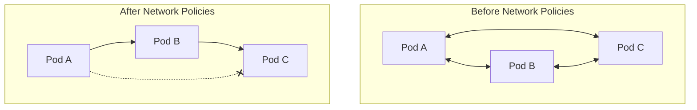

# How to Configure Kubernetes Network Policies for Zero-Trust Security

Author: [nawazdhandala](https://www.github.com/nawazdhandala)

Tags: Kubernetes, Security, Networking, Zero Trust, Network Policies, DevOps

Description: A practical guide to implementing zero-trust networking in Kubernetes using Network Policies, from basic isolation to advanced microsegmentation patterns.

---

By default, Kubernetes allows all pods to communicate with all other pods. That's terrifying from a security perspective. Network Policies let you implement zero-trust networking where pods can only talk to explicitly allowed destinations.

## Understanding Network Policies

Network Policies are firewall rules for pod-to-pod communication. They work at Layer 3/4 (IP and port level).



### Prerequisites

Network Policies require a CNI plugin that supports them:
- **Calico** - Full support
- **Cilium** - Full support with L7 extensions
- **Weave Net** - Full support
- **Flannel** - No support (policies are ignored)

Check your CNI:

```bash
kubectl get pods -n kube-system | grep -E 'calico|cilium|weave'
```

## The Zero-Trust Foundation: Default Deny

Start by denying all traffic, then explicitly allow what's needed.

### Deny All Ingress in a Namespace

```yaml
apiVersion: networking.k8s.io/v1
kind: NetworkPolicy
metadata:
  name: default-deny-ingress
  namespace: production
spec:
  podSelector: {}  # Applies to all pods
  policyTypes:
    - Ingress
```

### Deny All Egress in a Namespace

```yaml
apiVersion: networking.k8s.io/v1
kind: NetworkPolicy
metadata:
  name: default-deny-egress
  namespace: production
spec:
  podSelector: {}
  policyTypes:
    - Egress
```

### Deny All Traffic (Both Directions)

```yaml
apiVersion: networking.k8s.io/v1
kind: NetworkPolicy
metadata:
  name: default-deny-all
  namespace: production
spec:
  podSelector: {}
  policyTypes:
    - Ingress
    - Egress
```

## Allowing Essential Traffic

After default deny, pods can't reach anything - not even DNS. Fix that first.

### Allow DNS Resolution

```yaml
apiVersion: networking.k8s.io/v1
kind: NetworkPolicy
metadata:
  name: allow-dns
  namespace: production
spec:
  podSelector: {}
  policyTypes:
    - Egress
  egress:
    - to:
        - namespaceSelector:
            matchLabels:
              kubernetes.io/metadata.name: kube-system
          podSelector:
            matchLabels:
              k8s-app: kube-dns
      ports:
        - protocol: UDP
          port: 53
        - protocol: TCP
          port: 53
```

### Allow Traffic to Kubernetes API

```yaml
apiVersion: networking.k8s.io/v1
kind: NetworkPolicy
metadata:
  name: allow-kube-api
  namespace: production
spec:
  podSelector: {}
  policyTypes:
    - Egress
  egress:
    - to:
        - ipBlock:
            cidr: 10.96.0.1/32  # Your API server ClusterIP
      ports:
        - protocol: TCP
          port: 443
```

## Real-World Patterns

### Pattern 1: Three-Tier Application

Frontend talks to API, API talks to database. Nothing else.

```yaml
# Allow frontend to receive external traffic
apiVersion: networking.k8s.io/v1
kind: NetworkPolicy
metadata:
  name: frontend-ingress
  namespace: production
spec:
  podSelector:
    matchLabels:
      app: frontend
  policyTypes:
    - Ingress
  ingress:
    - from:
        - namespaceSelector:
            matchLabels:
              kubernetes.io/metadata.name: ingress-nginx
      ports:
        - protocol: TCP
          port: 80
---
# Allow frontend to call API
apiVersion: networking.k8s.io/v1
kind: NetworkPolicy
metadata:
  name: frontend-egress
  namespace: production
spec:
  podSelector:
    matchLabels:
      app: frontend
  policyTypes:
    - Egress
  egress:
    - to:
        - podSelector:
            matchLabels:
              app: api
      ports:
        - protocol: TCP
          port: 8080
---
# Allow API to receive from frontend
apiVersion: networking.k8s.io/v1
kind: NetworkPolicy
metadata:
  name: api-ingress
  namespace: production
spec:
  podSelector:
    matchLabels:
      app: api
  policyTypes:
    - Ingress
  ingress:
    - from:
        - podSelector:
            matchLabels:
              app: frontend
      ports:
        - protocol: TCP
          port: 8080
---
# Allow API to call database
apiVersion: networking.k8s.io/v1
kind: NetworkPolicy
metadata:
  name: api-egress
  namespace: production
spec:
  podSelector:
    matchLabels:
      app: api
  policyTypes:
    - Egress
  egress:
    - to:
        - podSelector:
            matchLabels:
              app: postgres
      ports:
        - protocol: TCP
          port: 5432
---
# Allow database to receive from API only
apiVersion: networking.k8s.io/v1
kind: NetworkPolicy
metadata:
  name: postgres-ingress
  namespace: production
spec:
  podSelector:
    matchLabels:
      app: postgres
  policyTypes:
    - Ingress
  ingress:
    - from:
        - podSelector:
            matchLabels:
              app: api
      ports:
        - protocol: TCP
          port: 5432
```

### Pattern 2: Namespace Isolation

Allow traffic within a namespace but block cross-namespace communication.

```yaml
apiVersion: networking.k8s.io/v1
kind: NetworkPolicy
metadata:
  name: namespace-isolation
  namespace: team-a
spec:
  podSelector: {}
  policyTypes:
    - Ingress
    - Egress
  ingress:
    - from:
        - podSelector: {}  # Same namespace only
  egress:
    - to:
        - podSelector: {}  # Same namespace only
```

### Pattern 3: Allow Specific Cross-Namespace Traffic

Let monitoring namespace scrape metrics from all namespaces.

```yaml
apiVersion: networking.k8s.io/v1
kind: NetworkPolicy
metadata:
  name: allow-prometheus-scrape
  namespace: production
spec:
  podSelector: {}
  policyTypes:
    - Ingress
  ingress:
    - from:
        - namespaceSelector:
            matchLabels:
              kubernetes.io/metadata.name: monitoring
          podSelector:
            matchLabels:
              app: prometheus
      ports:
        - protocol: TCP
          port: 9090
        - protocol: TCP
          port: 8080
```

### Pattern 4: Allow External API Calls

Let pods call specific external services.

```yaml
apiVersion: networking.k8s.io/v1
kind: NetworkPolicy
metadata:
  name: allow-external-apis
  namespace: production
spec:
  podSelector:
    matchLabels:
      app: payment-service
  policyTypes:
    - Egress
  egress:
    # Allow Stripe API
    - to:
        - ipBlock:
            cidr: 0.0.0.0/0
            except:
              - 10.0.0.0/8      # Block internal ranges
              - 172.16.0.0/12
              - 192.168.0.0/16
      ports:
        - protocol: TCP
          port: 443
```

### Pattern 5: Label-Based Microsegmentation

Use labels to create dynamic security groups.

```yaml
apiVersion: networking.k8s.io/v1
kind: NetworkPolicy
metadata:
  name: pci-zone-isolation
  namespace: production
spec:
  podSelector:
    matchLabels:
      security-zone: pci
  policyTypes:
    - Ingress
    - Egress
  ingress:
    - from:
        - podSelector:
            matchLabels:
              security-zone: pci
  egress:
    - to:
        - podSelector:
            matchLabels:
              security-zone: pci
```

## Advanced: Cilium Network Policies

Cilium extends Kubernetes Network Policies with L7 (HTTP) filtering.

### L7 HTTP Policy

```yaml
apiVersion: cilium.io/v2
kind: CiliumNetworkPolicy
metadata:
  name: api-l7-policy
  namespace: production
spec:
  endpointSelector:
    matchLabels:
      app: api
  ingress:
    - fromEndpoints:
        - matchLabels:
            app: frontend
      toPorts:
        - ports:
            - port: "8080"
              protocol: TCP
          rules:
            http:
              - method: GET
                path: "/api/v1/.*"
              - method: POST
                path: "/api/v1/orders"
```

### DNS-Based Egress Policy

```yaml
apiVersion: cilium.io/v2
kind: CiliumNetworkPolicy
metadata:
  name: allow-github-api
  namespace: production
spec:
  endpointSelector:
    matchLabels:
      app: ci-runner
  egress:
    - toFQDNs:
        - matchName: "api.github.com"
        - matchName: "github.com"
      toPorts:
        - ports:
            - port: "443"
              protocol: TCP
```

## Testing Network Policies

### Deploy Test Pods

```bash
# Create test namespace
kubectl create namespace netpol-test

# Deploy test pods
kubectl run client -n netpol-test --image=curlimages/curl --command -- sleep infinity
kubectl run server -n netpol-test --image=nginx --port=80 --expose
```

### Test Connectivity

```bash
# Before policy - should work
kubectl exec -n netpol-test client -- curl -s server

# Apply deny all
kubectl apply -f - <<EOF
apiVersion: networking.k8s.io/v1
kind: NetworkPolicy
metadata:
  name: deny-all
  namespace: netpol-test
spec:
  podSelector: {}
  policyTypes:
    - Ingress
EOF

# After policy - should timeout
kubectl exec -n netpol-test client -- curl -s --max-time 5 server
```

### Use Network Policy Visualization Tools

```bash
# Install Cilium Hubble for traffic visualization
cilium hubble enable

# Watch traffic flows
hubble observe --namespace production

# Or use kubectl network policy viewer
kubectl get netpol -A -o yaml | kubectl neat
```

## Debugging Network Policies

### Check Policy is Applied

```bash
# List policies in namespace
kubectl get networkpolicies -n production

# Describe policy
kubectl describe networkpolicy <name> -n production

# Check pod labels match
kubectl get pods -n production --show-labels
```

### Common Issues

**Issue: Policy not taking effect**
- CNI doesn't support Network Policies (Flannel)
- Pod labels don't match selector
- Namespace labels missing

**Issue: All traffic blocked**
- Missing DNS egress rule
- Default deny without allowances

**Issue: Intermittent connectivity**
- Policy targets wrong port
- Missing protocol specification

### Network Policy Audit Script

```bash
#!/bin/bash
NAMESPACE=$1

echo "=== Network Policies in $NAMESPACE ==="
kubectl get networkpolicies -n $NAMESPACE

echo -e "\n=== Pods and Labels ==="
kubectl get pods -n $NAMESPACE --show-labels

echo -e "\n=== Services ==="
kubectl get svc -n $NAMESPACE

echo -e "\n=== Testing DNS from a pod ==="
POD=$(kubectl get pods -n $NAMESPACE -o jsonpath='{.items[0].metadata.name}')
kubectl exec -n $NAMESPACE $POD -- nslookup kubernetes.default 2>&1 || echo "DNS blocked"

echo -e "\n=== Testing external connectivity ==="
kubectl exec -n $NAMESPACE $POD -- curl -s --max-time 5 https://api.github.com 2>&1 || echo "External blocked"
```

## GitOps Best Practices

### Organize Policies by Purpose

```
policies/
  base/
    default-deny.yaml
    allow-dns.yaml
    allow-monitoring.yaml
  production/
    frontend-policies.yaml
    api-policies.yaml
    database-policies.yaml
  staging/
    kustomization.yaml
```

### Use Kustomize Overlays

```yaml
# base/kustomization.yaml
apiVersion: kustomize.config.k8s.io/v1beta1
kind: Kustomization
resources:
  - default-deny.yaml
  - allow-dns.yaml

# production/kustomization.yaml
apiVersion: kustomize.config.k8s.io/v1beta1
kind: Kustomization
namespace: production
resources:
  - ../base
  - frontend-policies.yaml
  - api-policies.yaml
```

## Security Checklist

- [ ] Default deny all ingress in every namespace
- [ ] Default deny all egress in every namespace
- [ ] Allow DNS egress explicitly
- [ ] Allow only required cross-namespace traffic
- [ ] Use label-based selectors, not IP blocks where possible
- [ ] Document every "allow" policy with comments
- [ ] Test policies in staging before production
- [ ] Monitor for policy violations (Cilium Hubble, Calico Enterprise)
- [ ] Review policies quarterly

---

Network Policies are the foundation of zero-trust in Kubernetes. Start with default deny, add explicit allows, and test everything. Your security team will thank you when the next container escape vulnerability drops.
