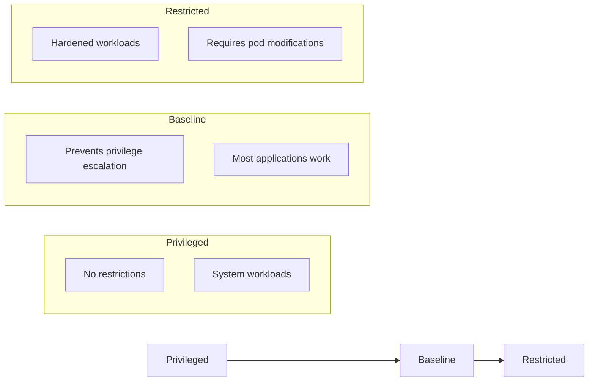

# How to Enable Pod Security Standards in Kubernetes

Author: [nawazdhandala](https://www.github.com/nawazdhandala)

Tags: Kubernetes, Security, Pod Security Standards, PSS, PSA, DevOps

Description: A complete guide to implementing Pod Security Standards (PSS) and Pod Security Admission (PSA) in Kubernetes for workload security.

---

Pod Security Standards (PSS) replaced PodSecurityPolicies (PSP) as the native way to enforce security constraints on pods. If you're still running without pod security controls, any container can run as root, mount host paths, or escape to the node.

## Understanding Pod Security Standards

Three built-in profiles, from most permissive to most restrictive:



| Profile | Description | Use Case |
|---------|-------------|----------|
| **Privileged** | No restrictions | System components, CNI, CSI drivers |
| **Baseline** | Prevents known privilege escalations | Most applications |
| **Restricted** | Heavily restricted, security best practices | Security-critical workloads |

## Enforcement Modes

Pod Security Admission (PSA) can operate in three modes:

- **enforce**: Reject pods that violate the policy
- **audit**: Log violations but allow the pod
- **warn**: Show warnings to users but allow the pod

## Enabling Pod Security at Namespace Level

### Apply Restricted Policy

```yaml
apiVersion: v1
kind: Namespace
metadata:
  name: production
  labels:
    pod-security.kubernetes.io/enforce: restricted
    pod-security.kubernetes.io/enforce-version: latest
    pod-security.kubernetes.io/audit: restricted
    pod-security.kubernetes.io/audit-version: latest
    pod-security.kubernetes.io/warn: restricted
    pod-security.kubernetes.io/warn-version: latest
```

### Apply Baseline Policy

```yaml
apiVersion: v1
kind: Namespace
metadata:
  name: staging
  labels:
    pod-security.kubernetes.io/enforce: baseline
    pod-security.kubernetes.io/enforce-version: latest
    pod-security.kubernetes.io/audit: restricted
    pod-security.kubernetes.io/audit-version: latest
    pod-security.kubernetes.io/warn: restricted
    pod-security.kubernetes.io/warn-version: latest
```

### Gradual Rollout Strategy

Start with audit/warn, then enforce:

```yaml
apiVersion: v1
kind: Namespace
metadata:
  name: migration-target
  labels:
    # Only warn for now
    pod-security.kubernetes.io/warn: restricted
    pod-security.kubernetes.io/audit: restricted
    # Enforce baseline as minimum
    pod-security.kubernetes.io/enforce: baseline
```

## What Each Profile Restricts

### Baseline Profile Restrictions

```yaml
# These are BLOCKED by baseline:
spec:
  hostNetwork: true      # Blocked
  hostPID: true          # Blocked
  hostIPC: true          # Blocked
  containers:
    - name: app
      securityContext:
        privileged: true                    # Blocked
        allowPrivilegeEscalation: true      # Allowed (baseline)
        capabilities:
          add: ["NET_RAW"]                  # Blocked (dangerous caps)
      volumeMounts:
        - mountPath: /host
          name: host-root
  volumes:
    - name: host-root
      hostPath:
        path: /                             # Blocked
```

### Restricted Profile Additional Restrictions

```yaml
# These are BLOCKED by restricted (in addition to baseline):
spec:
  containers:
    - name: app
      securityContext:
        runAsNonRoot: false           # Must be true
        allowPrivilegeEscalation: true  # Must be false
        seccompProfile:
          type: Unconfined           # Must be RuntimeDefault or Localhost
        capabilities:
          drop: []                    # Must drop ALL
      ports:
        - containerPort: 80           # Must be > 1024 (non-privileged)
```

## Writing Compliant Pod Specs

### Restricted-Compliant Pod

```yaml
apiVersion: v1
kind: Pod
metadata:
  name: secure-app
  namespace: production
spec:
  securityContext:
    runAsNonRoot: true
    runAsUser: 1000
    runAsGroup: 1000
    fsGroup: 1000
    seccompProfile:
      type: RuntimeDefault
  containers:
    - name: app
      image: myapp:latest
      securityContext:
        allowPrivilegeEscalation: false
        readOnlyRootFilesystem: true
        capabilities:
          drop:
            - ALL
      ports:
        - containerPort: 8080  # Non-privileged port
      volumeMounts:
        - name: tmp
          mountPath: /tmp
        - name: cache
          mountPath: /var/cache
  volumes:
    - name: tmp
      emptyDir: {}
    - name: cache
      emptyDir: {}
```

### Restricted-Compliant Deployment

```yaml
apiVersion: apps/v1
kind: Deployment
metadata:
  name: secure-web
  namespace: production
spec:
  replicas: 3
  selector:
    matchLabels:
      app: secure-web
  template:
    metadata:
      labels:
        app: secure-web
    spec:
      securityContext:
        runAsNonRoot: true
        runAsUser: 65534  # nobody
        runAsGroup: 65534
        fsGroup: 65534
        seccompProfile:
          type: RuntimeDefault
      containers:
        - name: nginx
          image: nginxinc/nginx-unprivileged:latest  # Non-root nginx
          securityContext:
            allowPrivilegeEscalation: false
            readOnlyRootFilesystem: true
            capabilities:
              drop:
                - ALL
          ports:
            - containerPort: 8080
          volumeMounts:
            - name: tmp
              mountPath: /tmp
            - name: cache
              mountPath: /var/cache/nginx
            - name: run
              mountPath: /var/run
      volumes:
        - name: tmp
          emptyDir: {}
        - name: cache
          emptyDir: {}
        - name: run
          emptyDir: {}
```

## Handling Violations

### Test Before Enforcing

```bash
# Dry-run to see what would be rejected
kubectl label --dry-run=server namespace production \
  pod-security.kubernetes.io/enforce=restricted

# Check existing pods against a policy
kubectl get pods -n production -o json | \
  kubectl neat | \
  kubectl apply --dry-run=server -f -
```

### Common Violation Messages

```
Error: pods "myapp" is forbidden: violates PodSecurity "restricted:latest":
  allowPrivilegeEscalation != false
  unrestricted capabilities
  runAsNonRoot != true
  seccompProfile
```

### Exemptions for System Components

Some namespaces need privileged access:

```yaml
# kube-system namespace - keep privileged
apiVersion: v1
kind: Namespace
metadata:
  name: kube-system
  labels:
    pod-security.kubernetes.io/enforce: privileged
    pod-security.kubernetes.io/audit: privileged
    pod-security.kubernetes.io/warn: privileged
```

## Cluster-Wide Defaults

Configure cluster-wide defaults via AdmissionConfiguration:

```yaml
# /etc/kubernetes/psa-config.yaml
apiVersion: apiserver.config.k8s.io/v1
kind: AdmissionConfiguration
plugins:
  - name: PodSecurity
    configuration:
      apiVersion: pod-security.admission.config.k8s.io/v1
      kind: PodSecurityConfiguration
      defaults:
        enforce: "baseline"
        enforce-version: "latest"
        audit: "restricted"
        audit-version: "latest"
        warn: "restricted"
        warn-version: "latest"
      exemptions:
        usernames: []
        runtimeClasses: []
        namespaces:
          - kube-system
          - kube-public
          - kube-node-lease
          - cert-manager
          - ingress-nginx
```

Add to API server:

```yaml
# /etc/kubernetes/manifests/kube-apiserver.yaml
spec:
  containers:
    - command:
        - kube-apiserver
        - --admission-control-config-file=/etc/kubernetes/psa-config.yaml
      volumeMounts:
        - name: psa-config
          mountPath: /etc/kubernetes/psa-config.yaml
          readOnly: true
  volumes:
    - name: psa-config
      hostPath:
        path: /etc/kubernetes/psa-config.yaml
        type: File
```

## Migration Strategy from PSP

### Step 1: Audit Current State

```bash
# Find pods that would fail restricted
for ns in $(kubectl get ns -o jsonpath='{.items[*].metadata.name}'); do
  echo "=== Namespace: $ns ==="
  kubectl label namespace $ns \
    pod-security.kubernetes.io/warn=restricted \
    pod-security.kubernetes.io/audit=restricted \
    --overwrite
done

# Check audit logs
kubectl logs -n kube-system -l component=kube-apiserver | grep "pod-security.kubernetes.io"
```

### Step 2: Fix Non-Compliant Workloads

```bash
# Find pods running as root
kubectl get pods -A -o json | jq -r '
  .items[] |
  select(.spec.containers[].securityContext.runAsNonRoot != true) |
  "\(.metadata.namespace)/\(.metadata.name)"
'

# Find pods with privileged containers
kubectl get pods -A -o json | jq -r '
  .items[] |
  select(.spec.containers[].securityContext.privileged == true) |
  "\(.metadata.namespace)/\(.metadata.name)"
'
```

### Step 3: Enable Enforcement Gradually

```bash
# Start with one namespace
kubectl label namespace test-ns \
  pod-security.kubernetes.io/enforce=baseline

# Monitor for issues, then expand
kubectl label namespace staging \
  pod-security.kubernetes.io/enforce=baseline

# Finally production
kubectl label namespace production \
  pod-security.kubernetes.io/enforce=restricted
```

## Monitoring PSS Violations

### Prometheus Alerts

```yaml
apiVersion: monitoring.coreos.com/v1
kind: PrometheusRule
metadata:
  name: pod-security-alerts
  namespace: monitoring
spec:
  groups:
    - name: pod-security
      rules:
        - alert: PodSecurityViolation
          expr: |
            increase(apiserver_admission_controller_admission_duration_seconds_count{
              name="PodSecurity",
              rejected="true"
            }[5m]) > 0
          for: 1m
          labels:
            severity: warning
          annotations:
            summary: "Pod security violations detected"
            description: "Pods are being rejected by Pod Security Admission"
```

### Audit Log Analysis

```bash
# Extract PSS violations from audit logs
grep "pod-security.kubernetes.io" /var/log/kubernetes/audit.log | \
  jq 'select(.annotations["pod-security.kubernetes.io/audit-violations"] != null)'
```

## Common Fixes for Restricted Compliance

### Fix: Application Needs Root

Use init containers or build rootless images:

```yaml
spec:
  initContainers:
    - name: fix-permissions
      image: busybox
      command: ["sh", "-c", "chown -R 1000:1000 /data"]
      securityContext:
        runAsUser: 0  # Only init container runs as root
      volumeMounts:
        - name: data
          mountPath: /data
  containers:
    - name: app
      securityContext:
        runAsNonRoot: true
        runAsUser: 1000
```

### Fix: App Needs to Bind Port 80

Use port remapping:

```yaml
spec:
  containers:
    - name: nginx
      image: nginx-unprivileged
      ports:
        - containerPort: 8080  # App listens on 8080
---
apiVersion: v1
kind: Service
metadata:
  name: nginx
spec:
  ports:
    - port: 80           # Service exposes 80
      targetPort: 8080   # Routes to 8080
```

### Fix: App Needs Specific Capabilities

If truly needed, use baseline instead of restricted:

```yaml
metadata:
  namespace: special-apps
  labels:
    pod-security.kubernetes.io/enforce: baseline
```

Or use a RuntimeClass exemption.

## Security Context Cheat Sheet

```yaml
# Copy this template for restricted-compliant pods
spec:
  securityContext:
    runAsNonRoot: true
    runAsUser: 1000
    runAsGroup: 1000
    fsGroup: 1000
    seccompProfile:
      type: RuntimeDefault
  containers:
    - name: app
      securityContext:
        allowPrivilegeEscalation: false
        readOnlyRootFilesystem: true
        capabilities:
          drop:
            - ALL
```

---

Pod Security Standards are now the standard way to secure workloads in Kubernetes. Start with baseline enforcement and audit/warn for restricted. Fix violations systematically, and eventually enforce restricted where possible. Your cluster's security posture depends on it.
