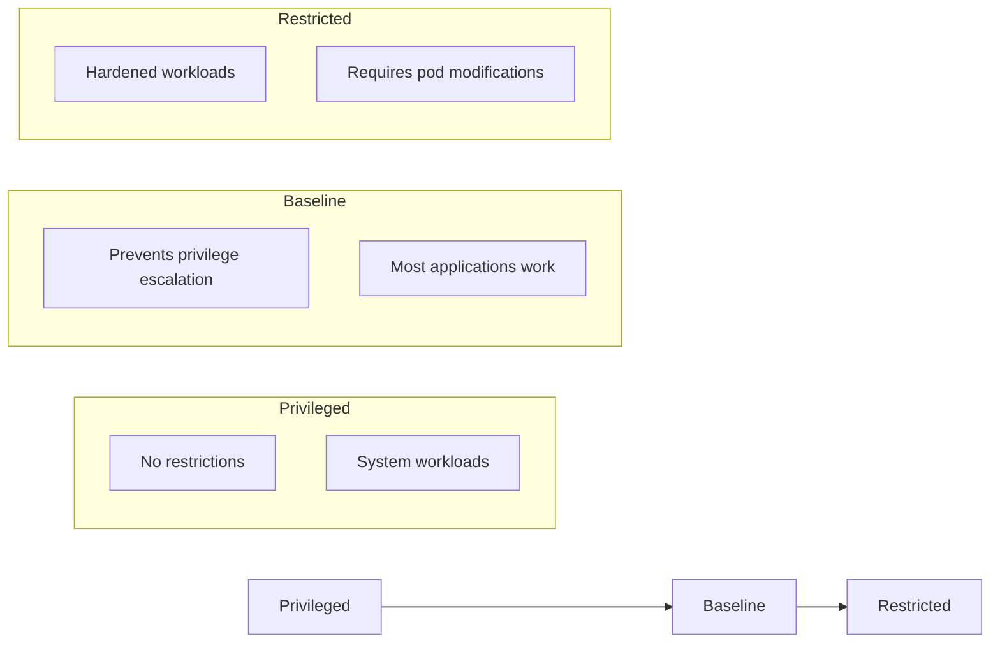

# How to Enable Pod Security Standards in Kubernetes

Author: [nawazdhandala](https://www.github.com/nawazdhandala)

Tags: Kubernetes, Security, Pod Security Standards, PSS, PSA, DevOps

Description: A complete guide to implementing Pod Security Standards (PSS) and Pod Security Admission (PSA) in Kubernetes for workload security.

---

Pod Security Standards (PSS) replaced PodSecurityPolicies (PSP) as the native way to enforce security constraints on pods. If you're still running without pod security controls, any container can run as root, mount host paths, or escape to the node.

## Understanding Pod Security Standards

Three built-in profiles, from most permissive to most restrictive:

The following diagram illustrates the progression of Pod Security Standards from the least restrictive (Privileged) to the most restrictive (Restricted). Understanding this hierarchy helps you choose the appropriate security level for your workloads.



| Profile | Description | Use Case |
|---------|-------------|----------|
| **Privileged** | No restrictions | System components, CNI, CSI drivers |
| **Baseline** | Prevents known privilege escalations | Most applications |
| **Restricted** | Heavily restricted, security best practices | Security-critical workloads |

## Enforcement Modes

Pod Security Admission (PSA) can operate in three modes:

- **enforce**: Reject pods that violate the policy
- **audit**: Log violations but allow the pod
- **warn**: Show warnings to users but allow the pod

## Enabling Pod Security at Namespace Level

### Apply Restricted Policy

This namespace configuration applies the most restrictive security policy. All pods in this namespace must comply with the restricted profile, which enforces security best practices like running as non-root, dropping all capabilities, and using seccomp profiles.

```yaml
# Namespace with restricted Pod Security Standard
apiVersion: v1
kind: Namespace
metadata:
  name: production
  labels:
    # Enforce: Reject pods that violate restricted policy
    pod-security.kubernetes.io/enforce: restricted
    pod-security.kubernetes.io/enforce-version: latest
    # Audit: Log violations for monitoring
    pod-security.kubernetes.io/audit: restricted
    pod-security.kubernetes.io/audit-version: latest
    # Warn: Display warnings to users deploying non-compliant pods
    pod-security.kubernetes.io/warn: restricted
    pod-security.kubernetes.io/warn-version: latest
```

### Apply Baseline Policy

The baseline policy is suitable for staging environments where you want to prevent known privilege escalations while allowing most applications to run without modification. This configuration enforces baseline but audits and warns against restricted violations to help prepare for stricter security.

```yaml
# Namespace with baseline enforcement but restricted audit/warn
apiVersion: v1
kind: Namespace
metadata:
  name: staging
  labels:
    # Enforce baseline to block known privilege escalations
    pod-security.kubernetes.io/enforce: baseline
    pod-security.kubernetes.io/enforce-version: latest
    # Audit and warn for restricted to prepare for tighter security
    pod-security.kubernetes.io/audit: restricted
    pod-security.kubernetes.io/audit-version: latest
    pod-security.kubernetes.io/warn: restricted
    pod-security.kubernetes.io/warn-version: latest
```

### Gradual Rollout Strategy

Start with audit/warn, then enforce:

When migrating to Pod Security Standards, it's best to start gradually. This configuration only warns about restricted violations while enforcing the baseline minimum, allowing you to identify non-compliant workloads without breaking existing deployments.

```yaml
# Gradual migration: warn for restricted, enforce only baseline
apiVersion: v1
kind: Namespace
metadata:
  name: migration-target
  labels:
    # Only warn for now - won't block pods
    pod-security.kubernetes.io/warn: restricted
    # Audit logs restricted violations for review
    pod-security.kubernetes.io/audit: restricted
    # Enforce baseline as minimum security requirement
    pod-security.kubernetes.io/enforce: baseline
```

## What Each Profile Restricts

### Baseline Profile Restrictions

Understanding what the baseline profile blocks is essential for troubleshooting deployment failures. This example shows common security-sensitive configurations that baseline will reject to prevent privilege escalation and host access.

```yaml
# These are BLOCKED by baseline:
spec:
  hostNetwork: true      # Blocked - prevents access to host network
  hostPID: true          # Blocked - prevents access to host process IDs
  hostIPC: true          # Blocked - prevents access to host IPC namespace
  containers:
    - name: app
      securityContext:
        privileged: true                    # Blocked - prevents full host access
        allowPrivilegeEscalation: true      # Allowed (baseline permits this)
        capabilities:
          add: ["NET_RAW"]                  # Blocked - dangerous capabilities
      volumeMounts:
        - mountPath: /host
          name: host-root
  volumes:
    - name: host-root
      hostPath:
        path: /                             # Blocked - prevents host filesystem access
```

### Restricted Profile Additional Restrictions

The restricted profile adds more requirements on top of baseline. These settings are mandatory for restricted-compliant pods and represent security hardening best practices for production workloads.

```yaml
# These are BLOCKED by restricted (in addition to baseline):
spec:
  containers:
    - name: app
      securityContext:
        runAsNonRoot: false           # Must be true - containers must run as non-root
        allowPrivilegeEscalation: true  # Must be false - prevents privilege escalation
        seccompProfile:
          type: Unconfined           # Must be RuntimeDefault or Localhost for syscall filtering
        capabilities:
          drop: []                    # Must drop ALL capabilities
      ports:
        - containerPort: 80           # Must be > 1024 (non-privileged port)
```

## Writing Compliant Pod Specs

### Restricted-Compliant Pod

This pod specification is fully compliant with the restricted profile. It includes all required security settings: non-root user, seccomp profile, dropped capabilities, read-only filesystem, and non-privileged ports. Use this as a template for secure workloads.

```yaml
apiVersion: v1
kind: Pod
metadata:
  name: secure-app
  namespace: production
spec:
  # Pod-level security context applies to all containers
  securityContext:
    runAsNonRoot: true           # Ensure no container runs as root
    runAsUser: 1000              # Run as non-root user ID
    runAsGroup: 1000             # Run with non-root group ID
    fsGroup: 1000                # Set filesystem group for volume mounts
    seccompProfile:
      type: RuntimeDefault       # Use container runtime's default seccomp profile
  containers:
    - name: app
      image: myapp:latest
      securityContext:
        allowPrivilegeEscalation: false  # Block privilege escalation attempts
        readOnlyRootFilesystem: true     # Prevent writes to container filesystem
        capabilities:
          drop:
            - ALL                # Drop all Linux capabilities for minimal privileges
      ports:
        - containerPort: 8080    # Use non-privileged port (> 1024)
      volumeMounts:
        - name: tmp
          mountPath: /tmp        # Writable temp directory via emptyDir
        - name: cache
          mountPath: /var/cache  # Writable cache directory via emptyDir
  volumes:
    - name: tmp
      emptyDir: {}               # Ephemeral storage for temp files
    - name: cache
      emptyDir: {}               # Ephemeral storage for cache files
```

### Restricted-Compliant Deployment

For production deployments, this configuration demonstrates a secure web server setup using the nginx-unprivileged image. It follows all restricted profile requirements while providing the necessary writable directories for nginx operation.

```yaml
apiVersion: apps/v1
kind: Deployment
metadata:
  name: secure-web
  namespace: production
spec:
  replicas: 3
  selector:
    matchLabels:
      app: secure-web
  template:
    metadata:
      labels:
        app: secure-web
    spec:
      # Pod-level security settings
      securityContext:
        runAsNonRoot: true        # Enforce non-root execution
        runAsUser: 65534          # Use 'nobody' user (standard non-root user)
        runAsGroup: 65534         # Use 'nobody' group
        fsGroup: 65534            # Set filesystem group ownership
        seccompProfile:
          type: RuntimeDefault    # Apply default syscall restrictions
      containers:
        - name: nginx
          # Use nginx-unprivileged image that runs on port 8080 by default
          image: nginxinc/nginx-unprivileged:latest
          securityContext:
            allowPrivilegeEscalation: false  # Block privilege escalation
            readOnlyRootFilesystem: true     # Immutable container filesystem
            capabilities:
              drop:
                - ALL            # Remove all Linux capabilities
          ports:
            - containerPort: 8080  # nginx-unprivileged listens on 8080
          volumeMounts:
            - name: tmp
              mountPath: /tmp                # Required for nginx temp files
            - name: cache
              mountPath: /var/cache/nginx    # Required for nginx proxy cache
            - name: run
              mountPath: /var/run            # Required for nginx PID file
      volumes:
        # EmptyDir volumes provide writable storage with read-only root
        - name: tmp
          emptyDir: {}
        - name: cache
          emptyDir: {}
        - name: run
          emptyDir: {}
```

## Handling Violations

### Test Before Enforcing

Before enabling enforcement, use these commands to identify which pods would be rejected. The dry-run option lets you test policy changes without actually applying them, helping you plan your migration.

```bash
# Dry-run to see what would be rejected without applying changes
kubectl label --dry-run=server namespace production \
  pod-security.kubernetes.io/enforce=restricted

# Check existing pods against a policy using dry-run
# kubectl neat removes clutter from kubectl output for cleaner YAML
kubectl get pods -n production -o json | \
  kubectl neat | \
  kubectl apply --dry-run=server -f -
```

### Common Violation Messages

```
Error: pods "myapp" is forbidden: violates PodSecurity "restricted:latest":
  allowPrivilegeEscalation != false
  unrestricted capabilities
  runAsNonRoot != true
  seccompProfile
```

### Exemptions for System Components

Some namespaces need privileged access:

System namespaces like kube-system contain components that require elevated privileges (CNI plugins, CSI drivers, etc.). Apply the privileged policy to these namespaces to allow system components to function properly.

```yaml
# kube-system namespace - keep privileged for system components
apiVersion: v1
kind: Namespace
metadata:
  name: kube-system
  labels:
    # System components need full privileges
    pod-security.kubernetes.io/enforce: privileged
    pod-security.kubernetes.io/audit: privileged
    pod-security.kubernetes.io/warn: privileged
```

## Cluster-Wide Defaults

Configure cluster-wide defaults via AdmissionConfiguration:

This cluster-level configuration sets default Pod Security Standards for all namespaces. It enforces baseline by default, audits and warns for restricted, and exempts system namespaces that require privileged access.

```yaml
# /etc/kubernetes/psa-config.yaml
# Cluster-wide Pod Security Admission configuration
apiVersion: apiserver.config.k8s.io/v1
kind: AdmissionConfiguration
plugins:
  - name: PodSecurity
    configuration:
      apiVersion: pod-security.admission.config.k8s.io/v1
      kind: PodSecurityConfiguration
      # Default policies applied to all namespaces
      defaults:
        enforce: "baseline"           # Enforce baseline minimum
        enforce-version: "latest"     # Use latest policy version
        audit: "restricted"           # Log restricted violations
        audit-version: "latest"
        warn: "restricted"            # Warn on restricted violations
        warn-version: "latest"
      # Namespaces exempted from default policies
      exemptions:
        usernames: []                 # No user exemptions
        runtimeClasses: []            # No runtime class exemptions
        namespaces:
          - kube-system               # Core Kubernetes components
          - kube-public               # Public cluster resources
          - kube-node-lease           # Node heartbeat leases
          - cert-manager              # Certificate management
          - ingress-nginx             # Ingress controller
```

Add to API server:

This API server configuration snippet shows how to mount and reference the Pod Security Admission configuration file. This must be added to the kube-apiserver manifest to enable cluster-wide defaults.

```yaml
# /etc/kubernetes/manifests/kube-apiserver.yaml
spec:
  containers:
    - command:
        - kube-apiserver
        # Reference the PSA configuration file
        - --admission-control-config-file=/etc/kubernetes/psa-config.yaml
      volumeMounts:
        - name: psa-config
          mountPath: /etc/kubernetes/psa-config.yaml
          readOnly: true              # Config should be read-only
  volumes:
    - name: psa-config
      hostPath:
        path: /etc/kubernetes/psa-config.yaml
        type: File                    # Mount as single file, not directory
```

## Migration Strategy from PSP

### Step 1: Audit Current State

This script enables audit and warn modes for all namespaces without enforcing, allowing you to identify non-compliant workloads. Check the API server audit logs afterward to see which pods would fail the restricted policy.

```bash
# Find pods that would fail restricted by enabling warn/audit on all namespaces
for ns in $(kubectl get ns -o jsonpath='{.items[*].metadata.name}'); do
  echo "=== Namespace: $ns ==="
  # Label each namespace with warn and audit for restricted policy
  kubectl label namespace $ns \
    pod-security.kubernetes.io/warn=restricted \
    pod-security.kubernetes.io/audit=restricted \
    --overwrite
done

# Check audit logs for PSS violations in API server logs
kubectl logs -n kube-system -l component=kube-apiserver | grep "pod-security.kubernetes.io"
```

### Step 2: Fix Non-Compliant Workloads

These jq queries help identify pods that need modification before enabling restricted enforcement. Finding pods running as root or with privileged containers is the first step in remediation.

```bash
# Find pods running as root (runAsNonRoot not set to true)
kubectl get pods -A -o json | jq -r '
  .items[] |
  select(.spec.containers[].securityContext.runAsNonRoot != true) |
  "\(.metadata.namespace)/\(.metadata.name)"
'

# Find pods with privileged containers
kubectl get pods -A -o json | jq -r '
  .items[] |
  select(.spec.containers[].securityContext.privileged == true) |
  "\(.metadata.namespace)/\(.metadata.name)"
'
```

### Step 3: Enable Enforcement Gradually

Roll out enforcement incrementally, starting with test namespaces and progressing to production. This approach lets you catch issues early and build confidence before applying stricter policies to critical workloads.

```bash
# Start with one test namespace to validate changes
kubectl label namespace test-ns \
  pod-security.kubernetes.io/enforce=baseline

# Monitor for issues, then expand to staging
kubectl label namespace staging \
  pod-security.kubernetes.io/enforce=baseline

# Finally apply restricted to production after validation
kubectl label namespace production \
  pod-security.kubernetes.io/enforce=restricted
```

## Monitoring PSS Violations

### Prometheus Alerts

This PrometheusRule creates an alert when pods are rejected by Pod Security Admission. Use this to detect when deployments are failing due to security policy violations, which could indicate misconfigurations or attack attempts.

```yaml
apiVersion: monitoring.coreos.com/v1
kind: PrometheusRule
metadata:
  name: pod-security-alerts
  namespace: monitoring
spec:
  groups:
    - name: pod-security
      rules:
        - alert: PodSecurityViolation
          # Alert when pods are rejected by PodSecurity admission
          expr: |
            increase(apiserver_admission_controller_admission_duration_seconds_count{
              name="PodSecurity",
              rejected="true"
            }[5m]) > 0
          for: 1m
          labels:
            severity: warning
          annotations:
            summary: "Pod security violations detected"
            description: "Pods are being rejected by Pod Security Admission"
```

### Audit Log Analysis

This command extracts Pod Security Standard violations from the Kubernetes audit log. Use it to review which pods were flagged and understand the specific violations that occurred.

```bash
# Extract PSS violations from audit logs
# Filter for entries with pod-security annotations indicating violations
grep "pod-security.kubernetes.io" /var/log/kubernetes/audit.log | \
  jq 'select(.annotations["pod-security.kubernetes.io/audit-violations"] != null)'
```

## Common Fixes for Restricted Compliance

### Fix: Application Needs Root

Use init containers or build rootless images:

When an application needs root access for initialization (like setting file permissions), use an init container that runs as root before the main container starts. The main application container can then run as non-root.

```yaml
spec:
  initContainers:
    - name: fix-permissions
      image: busybox
      # Set correct ownership on the data volume
      command: ["sh", "-c", "chown -R 1000:1000 /data"]
      securityContext:
        runAsUser: 0              # Only init container runs as root
      volumeMounts:
        - name: data
          mountPath: /data
  containers:
    - name: app
      securityContext:
        runAsNonRoot: true        # Main container runs as non-root
        runAsUser: 1000           # Matches ownership set by init container
```

### Fix: App Needs to Bind Port 80

Use port remapping:

Instead of running as root to bind to port 80, configure your application to listen on a non-privileged port (like 8080) and use the Kubernetes Service to expose it on port 80. The Service handles the port translation transparently.

```yaml
spec:
  containers:
    - name: nginx
      image: nginx-unprivileged
      ports:
        - containerPort: 8080     # App listens on non-privileged port
---
apiVersion: v1
kind: Service
metadata:
  name: nginx
spec:
  ports:
    - port: 80                    # Service exposes standard port 80
      targetPort: 8080            # Routes to container's 8080 port
```

### Fix: App Needs Specific Capabilities

If truly needed, use baseline instead of restricted:

Some applications genuinely require specific Linux capabilities that restricted doesn't allow. In these cases, apply the baseline policy to that namespace and document why the exception is necessary.

```yaml
# Namespace-level exception for apps requiring specific capabilities
metadata:
  namespace: special-apps
  labels:
    # Use baseline instead of restricted for capability requirements
    pod-security.kubernetes.io/enforce: baseline
```

Or use a RuntimeClass exemption.

## Security Context Cheat Sheet

This template contains all the required security settings for a restricted-compliant pod. Copy and customize this for your workloads to ensure they meet the strictest security requirements.

```yaml
# Copy this template for restricted-compliant pods
spec:
  securityContext:
    runAsNonRoot: true            # Mandatory: no root containers
    runAsUser: 1000               # Specify non-root user ID
    runAsGroup: 1000              # Specify non-root group ID
    fsGroup: 1000                 # Set group ownership for volumes
    seccompProfile:
      type: RuntimeDefault        # Mandatory: apply seccomp filtering
  containers:
    - name: app
      securityContext:
        allowPrivilegeEscalation: false  # Mandatory: block privilege escalation
        readOnlyRootFilesystem: true     # Recommended: immutable container
        capabilities:
          drop:
            - ALL                 # Mandatory: remove all capabilities
```

---

Pod Security Standards are now the standard way to secure workloads in Kubernetes. Start with baseline enforcement and audit/warn for restricted. Fix violations systematically, and eventually enforce restricted where possible. Your cluster's security posture depends on it.
