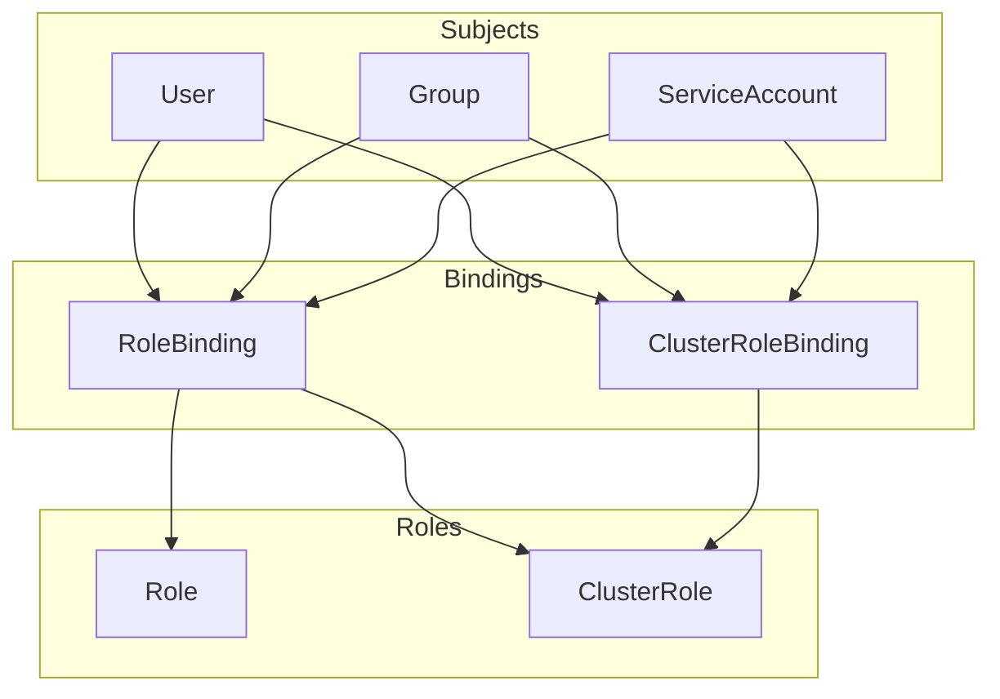

# How to Implement RBAC Best Practices in Kubernetes

Author: [nawazdhandala](https://www.github.com/nawazdhandala)

Tags: Kubernetes, Security, RBAC, Access Control, DevOps

Description: A comprehensive guide to Kubernetes RBAC implementation, from basic concepts to production-ready patterns for multi-tenant clusters.

---

RBAC (Role-Based Access Control) is your first line of defense in Kubernetes. Done wrong, everyone has admin access. Done right, users and services have exactly the permissions they need - nothing more.

## RBAC Building Blocks



- **Role**: Permissions within a namespace
- **ClusterRole**: Permissions cluster-wide or across namespaces
- **RoleBinding**: Grants Role/ClusterRole to subjects in a namespace
- **ClusterRoleBinding**: Grants ClusterRole cluster-wide

## Check Your Current RBAC Configuration

```bash
# Who can do what?
kubectl auth can-i --list

# Can a specific user create pods?
kubectl auth can-i create pods --as=developer@example.com -n production

# Can a service account delete deployments?
kubectl auth can-i delete deployments --as=system:serviceaccount:production:myapp -n production

# List all roles in a namespace
kubectl get roles -n production

# List all cluster roles
kubectl get clusterroles

# List all bindings
kubectl get rolebindings -n production
kubectl get clusterrolebindings
```

## The Principle of Least Privilege

Start with zero permissions and add only what's needed.

### Bad: Overly Permissive

```yaml
# DON'T DO THIS - gives full admin access
apiVersion: rbac.authorization.k8s.io/v1
kind: ClusterRoleBinding
metadata:
  name: developer-admin
subjects:
  - kind: User
    name: developer@example.com
roleRef:
  kind: ClusterRole
  name: cluster-admin
  apiGroup: rbac.authorization.k8s.io
```

### Good: Namespace-Scoped, Limited Permissions

```yaml
apiVersion: rbac.authorization.k8s.io/v1
kind: Role
metadata:
  name: developer
  namespace: development
rules:
  - apiGroups: ["", "apps", "batch"]
    resources: ["pods", "deployments", "services", "configmaps", "jobs"]
    verbs: ["get", "list", "watch", "create", "update", "patch"]
  - apiGroups: [""]
    resources: ["pods/log", "pods/exec"]
    verbs: ["get", "create"]
---
apiVersion: rbac.authorization.k8s.io/v1
kind: RoleBinding
metadata:
  name: developer-binding
  namespace: development
subjects:
  - kind: User
    name: developer@example.com
    apiGroup: rbac.authorization.k8s.io
roleRef:
  kind: Role
  name: developer
  apiGroup: rbac.authorization.k8s.io
```

## Standard Roles for Common Personas

### 1. Developer Role

Can deploy and debug applications but not modify infrastructure.

```yaml
apiVersion: rbac.authorization.k8s.io/v1
kind: Role
metadata:
  name: developer
  namespace: development
rules:
  # Core resources
  - apiGroups: [""]
    resources: ["pods", "services", "configmaps", "secrets", "persistentvolumeclaims"]
    verbs: ["get", "list", "watch", "create", "update", "patch", "delete"]
  # Deployments
  - apiGroups: ["apps"]
    resources: ["deployments", "replicasets", "statefulsets"]
    verbs: ["get", "list", "watch", "create", "update", "patch", "delete"]
  # Debugging
  - apiGroups: [""]
    resources: ["pods/log", "pods/exec", "pods/portforward"]
    verbs: ["get", "create"]
  # Events for troubleshooting
  - apiGroups: [""]
    resources: ["events"]
    verbs: ["get", "list", "watch"]
  # Jobs
  - apiGroups: ["batch"]
    resources: ["jobs", "cronjobs"]
    verbs: ["get", "list", "watch", "create", "update", "patch", "delete"]
```

### 2. Read-Only Role

For monitoring, auditing, or junior team members.

```yaml
apiVersion: rbac.authorization.k8s.io/v1
kind: ClusterRole
metadata:
  name: readonly
rules:
  - apiGroups: ["", "apps", "batch", "networking.k8s.io"]
    resources: ["*"]
    verbs: ["get", "list", "watch"]
  - apiGroups: [""]
    resources: ["pods/log"]
    verbs: ["get"]
  # Explicitly deny sensitive resources
  - apiGroups: [""]
    resources: ["secrets"]
    verbs: []  # No access to secrets
```

### 3. Operator Role

Can manage deployments and HPA but not RBAC or nodes.

```yaml
apiVersion: rbac.authorization.k8s.io/v1
kind: ClusterRole
metadata:
  name: operator
rules:
  # Read everything
  - apiGroups: ["*"]
    resources: ["*"]
    verbs: ["get", "list", "watch"]
  # Manage workloads
  - apiGroups: ["apps"]
    resources: ["deployments", "statefulsets", "daemonsets"]
    verbs: ["create", "update", "patch", "delete"]
  - apiGroups: [""]
    resources: ["pods", "services", "configmaps"]
    verbs: ["create", "update", "patch", "delete"]
  # Manage autoscaling
  - apiGroups: ["autoscaling"]
    resources: ["horizontalpodautoscalers"]
    verbs: ["create", "update", "patch", "delete"]
  # Pod operations
  - apiGroups: [""]
    resources: ["pods/exec", "pods/log", "pods/portforward"]
    verbs: ["create", "get"]
```

### 4. Platform Admin Role

Full access to namespace resources but not cluster-level.

```yaml
apiVersion: rbac.authorization.k8s.io/v1
kind: ClusterRole
metadata:
  name: namespace-admin
rules:
  # Full namespace resource access
  - apiGroups: ["", "apps", "batch", "networking.k8s.io", "autoscaling"]
    resources: ["*"]
    verbs: ["*"]
  # Can manage RBAC within namespaces
  - apiGroups: ["rbac.authorization.k8s.io"]
    resources: ["roles", "rolebindings"]
    verbs: ["*"]
  # Cannot touch cluster-level resources
  # No clusterroles, clusterrolebindings, nodes, persistentvolumes
```

## ServiceAccount Best Practices

### 1. Create Dedicated ServiceAccounts

```yaml
# Don't use default ServiceAccount
apiVersion: v1
kind: ServiceAccount
metadata:
  name: myapp
  namespace: production
---
apiVersion: apps/v1
kind: Deployment
metadata:
  name: myapp
  namespace: production
spec:
  template:
    spec:
      serviceAccountName: myapp  # Explicit ServiceAccount
      automountServiceAccountToken: true
```

### 2. Minimal ServiceAccount Permissions

```yaml
apiVersion: rbac.authorization.k8s.io/v1
kind: Role
metadata:
  name: myapp
  namespace: production
rules:
  # Only what the app actually needs
  - apiGroups: [""]
    resources: ["configmaps"]
    resourceNames: ["myapp-config"]  # Specific resource only
    verbs: ["get", "watch"]
  - apiGroups: [""]
    resources: ["secrets"]
    resourceNames: ["myapp-secrets"]
    verbs: ["get"]
---
apiVersion: rbac.authorization.k8s.io/v1
kind: RoleBinding
metadata:
  name: myapp
  namespace: production
subjects:
  - kind: ServiceAccount
    name: myapp
    namespace: production
roleRef:
  kind: Role
  name: myapp
  apiGroup: rbac.authorization.k8s.io
```

### 3. Disable Token Automount When Not Needed

```yaml
apiVersion: v1
kind: ServiceAccount
metadata:
  name: web-frontend
  namespace: production
automountServiceAccountToken: false  # Frontend doesn't need API access
```

Or at pod level:

```yaml
spec:
  automountServiceAccountToken: false
  containers:
    - name: web
      image: nginx
```

## Aggregated ClusterRoles

Use aggregation to build composite roles.

```yaml
# Base role with label for aggregation
apiVersion: rbac.authorization.k8s.io/v1
kind: ClusterRole
metadata:
  name: monitoring-base
  labels:
    rbac.example.com/aggregate-to-monitoring: "true"
rules:
  - apiGroups: [""]
    resources: ["pods", "services"]
    verbs: ["get", "list", "watch"]
---
# Additional monitoring permissions
apiVersion: rbac.authorization.k8s.io/v1
kind: ClusterRole
metadata:
  name: monitoring-metrics
  labels:
    rbac.example.com/aggregate-to-monitoring: "true"
rules:
  - apiGroups: ["metrics.k8s.io"]
    resources: ["pods", "nodes"]
    verbs: ["get", "list"]
---
# Aggregated role - automatically includes all labeled roles
apiVersion: rbac.authorization.k8s.io/v1
kind: ClusterRole
metadata:
  name: monitoring
aggregationRule:
  clusterRoleSelectors:
    - matchLabels:
        rbac.example.com/aggregate-to-monitoring: "true"
rules: []  # Rules are automatically filled from aggregation
```

## Multi-Tenant RBAC Patterns

### Namespace Isolation

```yaml
# Each team gets their own namespace with full access
apiVersion: rbac.authorization.k8s.io/v1
kind: RoleBinding
metadata:
  name: team-a-admin
  namespace: team-a
subjects:
  - kind: Group
    name: team-a@example.com
    apiGroup: rbac.authorization.k8s.io
roleRef:
  kind: ClusterRole
  name: admin  # Built-in admin role
  apiGroup: rbac.authorization.k8s.io
```

### Cross-Namespace Read Access

```yaml
# Allow monitoring team to read from all namespaces
apiVersion: rbac.authorization.k8s.io/v1
kind: ClusterRoleBinding
metadata:
  name: monitoring-readonly
subjects:
  - kind: Group
    name: monitoring-team@example.com
    apiGroup: rbac.authorization.k8s.io
roleRef:
  kind: ClusterRole
  name: view  # Built-in view role
  apiGroup: rbac.authorization.k8s.io
```

## Audit Your RBAC Configuration

### Find Overly Permissive Bindings

```bash
# Find all cluster-admin bindings
kubectl get clusterrolebindings -o json | jq '.items[] | select(.roleRef.name == "cluster-admin") | .metadata.name'

# Find bindings with wildcard permissions
kubectl get clusterroles -o json | jq '.items[] | select(.rules[]?.resources[]? == "*" and .rules[]?.verbs[]? == "*") | .metadata.name'

# List all subjects with cluster-admin
kubectl get clusterrolebindings -o json | jq '.items[] | select(.roleRef.name == "cluster-admin") | .subjects[]'
```

### Use kubectl-who-can

```bash
# Install
kubectl krew install who-can

# Who can delete pods in production?
kubectl who-can delete pods -n production

# Who can create clusterrolebindings?
kubectl who-can create clusterrolebindings

# Who can exec into pods?
kubectl who-can create pods/exec -n production
```

### Use rakkess for Permission Matrix

```bash
# Install
kubectl krew install access-matrix

# Show what current user can do
kubectl access-matrix

# Show for specific namespace
kubectl access-matrix -n production
```

## RBAC Debugging

### Permission Denied Errors

```bash
# Check what user can do
kubectl auth can-i --list --as=developer@example.com

# Check specific permission
kubectl auth can-i create deployments -n production --as=developer@example.com

# Verbose API call to see RBAC evaluation
kubectl get pods -v=6  # Shows API calls and auth decisions
```

### Trace Permission Source

```bash
# Find which binding grants a permission
kubectl get rolebindings,clusterrolebindings -A -o json | \
  jq '.items[] | select(.subjects[]?.name == "developer@example.com")'
```

## RBAC Security Checklist

- [ ] No users or service accounts have cluster-admin except break-glass accounts
- [ ] Default ServiceAccount has no permissions (or tokens disabled)
- [ ] Each application has dedicated ServiceAccount with minimal permissions
- [ ] Developers cannot access production namespaces directly
- [ ] Secrets access is explicitly granted, not blanket wildcard
- [ ] No ClusterRoleBindings with wildcard verbs and resources
- [ ] RBAC changes require approval (GitOps with PR review)
- [ ] Regular audit of who-can-do-what
- [ ] Pods don't automount tokens unless necessary

## Common Mistakes

### 1. Using Default ServiceAccount

```yaml
# BAD - default SA often has more permissions than needed
spec:
  containers:
    - name: myapp
```

### 2. Wildcard Permissions

```yaml
# BAD - effectively admin access
rules:
  - apiGroups: ["*"]
    resources: ["*"]
    verbs: ["*"]
```

### 3. Cluster-Wide When Namespace Would Suffice

```yaml
# BAD - ClusterRoleBinding when RoleBinding is enough
kind: ClusterRoleBinding
```

### 4. Granting Secrets Access Broadly

```yaml
# BAD - access to all secrets
rules:
  - apiGroups: [""]
    resources: ["secrets"]
    verbs: ["get", "list"]

# GOOD - specific secrets only
rules:
  - apiGroups: [""]
    resources: ["secrets"]
    resourceNames: ["myapp-config"]
    verbs: ["get"]
```

---

RBAC is tedious to set up but critical for security. Start with the built-in roles (view, edit, admin), customize as needed, and audit regularly. Remember: if a breach happens, the blast radius is determined by what permissions the compromised account had.
