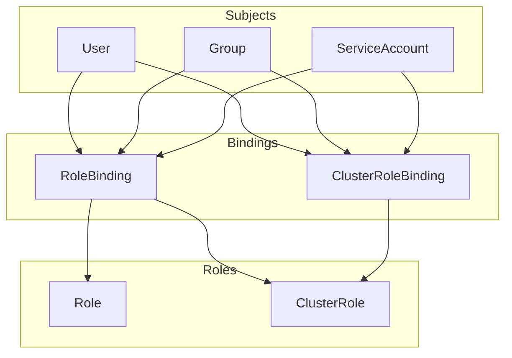

# How to Implement RBAC Best Practices in Kubernetes

Author: [nawazdhandala](https://www.github.com/nawazdhandala)

Tags: Kubernetes, Security, RBAC, Access Control, DevOps

Description: A comprehensive guide to Kubernetes RBAC implementation, from basic concepts to production-ready patterns for multi-tenant clusters.

---

RBAC (Role-Based Access Control) is your first line of defense in Kubernetes. Done wrong, everyone has admin access. Done right, users and services have exactly the permissions they need - nothing more.

## RBAC Building Blocks

The following diagram illustrates how RBAC components connect in Kubernetes. Subjects (users, groups, or service accounts) are bound to roles through bindings, which grant them specific permissions defined in the roles.



- **Role**: Permissions within a namespace
- **ClusterRole**: Permissions cluster-wide or across namespaces
- **RoleBinding**: Grants Role/ClusterRole to subjects in a namespace
- **ClusterRoleBinding**: Grants ClusterRole cluster-wide

## Check Your Current RBAC Configuration

These commands help you audit existing permissions and understand who can do what in your cluster. Use them regularly to verify access controls and troubleshoot permission issues.

```bash
# List all permissions for the current user
kubectl auth can-i --list

# Check if a specific user can create pods in production
kubectl auth can-i create pods --as=developer@example.com -n production

# Check if a service account can delete deployments
kubectl auth can-i delete deployments --as=system:serviceaccount:production:myapp -n production

# List all roles in a namespace
kubectl get roles -n production

# List all cluster roles (cluster-wide permissions)
kubectl get clusterroles

# List all bindings in a namespace
kubectl get rolebindings -n production
# List all cluster-wide bindings
kubectl get clusterrolebindings
```

## The Principle of Least Privilege

Start with zero permissions and add only what's needed.

### Bad: Overly Permissive

This example demonstrates what NOT to do. Granting cluster-admin to developers gives them full control over the entire cluster, including the ability to delete critical system components, access all secrets, and modify RBAC itself.

```yaml
# DON'T DO THIS - gives full admin access to entire cluster
apiVersion: rbac.authorization.k8s.io/v1
kind: ClusterRoleBinding
metadata:
  name: developer-admin
subjects:
  - kind: User
    name: developer@example.com
roleRef:
  kind: ClusterRole
  name: cluster-admin      # DANGEROUS: Full unrestricted cluster access
  apiGroup: rbac.authorization.k8s.io
```

### Good: Namespace-Scoped, Limited Permissions

This configuration demonstrates proper RBAC setup. The Role grants only necessary permissions within a single namespace, and the RoleBinding associates it with a specific user. Developers can work freely within their namespace without affecting others.

```yaml
apiVersion: rbac.authorization.k8s.io/v1
kind: Role
metadata:
  name: developer
  namespace: development         # Permissions only apply to this namespace
rules:
  # Grant access to core workload resources
  - apiGroups: ["", "apps", "batch"]
    resources: ["pods", "deployments", "services", "configmaps", "jobs"]
    verbs: ["get", "list", "watch", "create", "update", "patch"]
  # Allow debugging via logs and exec
  - apiGroups: [""]
    resources: ["pods/log", "pods/exec"]
    verbs: ["get", "create"]
---
apiVersion: rbac.authorization.k8s.io/v1
kind: RoleBinding
metadata:
  name: developer-binding
  namespace: development         # Binding is namespace-scoped
subjects:
  - kind: User
    name: developer@example.com
    apiGroup: rbac.authorization.k8s.io
roleRef:
  kind: Role
  name: developer               # References the Role defined above
  apiGroup: rbac.authorization.k8s.io
```

## Standard Roles for Common Personas

### 1. Developer Role

Can deploy and debug applications but not modify infrastructure.

This role provides developers with everything they need to deploy and troubleshoot applications: access to pods, deployments, services, secrets, and debugging capabilities. It deliberately excludes cluster-level resources and RBAC modifications.

```yaml
apiVersion: rbac.authorization.k8s.io/v1
kind: Role
metadata:
  name: developer
  namespace: development
rules:
  # Core resources - pods, services, configs, secrets, and storage claims
  - apiGroups: [""]
    resources: ["pods", "services", "configmaps", "secrets", "persistentvolumeclaims"]
    verbs: ["get", "list", "watch", "create", "update", "patch", "delete"]
  # Deployments - full management of application deployments
  - apiGroups: ["apps"]
    resources: ["deployments", "replicasets", "statefulsets"]
    verbs: ["get", "list", "watch", "create", "update", "patch", "delete"]
  # Debugging - access to logs, exec into pods, and port-forwarding
  - apiGroups: [""]
    resources: ["pods/log", "pods/exec", "pods/portforward"]
    verbs: ["get", "create"]
  # Events for troubleshooting - read-only access to understand issues
  - apiGroups: [""]
    resources: ["events"]
    verbs: ["get", "list", "watch"]
  # Jobs - ability to run one-time and scheduled tasks
  - apiGroups: ["batch"]
    resources: ["jobs", "cronjobs"]
    verbs: ["get", "list", "watch", "create", "update", "patch", "delete"]
```

### 2. Read-Only Role

For monitoring, auditing, or junior team members.

This ClusterRole provides read-only access across the cluster, useful for monitoring systems or users who need visibility without modification rights. Note that secrets are explicitly excluded to protect sensitive data.

```yaml
apiVersion: rbac.authorization.k8s.io/v1
kind: ClusterRole
metadata:
  name: readonly
rules:
  # Broad read access to common resources across all namespaces
  - apiGroups: ["", "apps", "batch", "networking.k8s.io"]
    resources: ["*"]
    verbs: ["get", "list", "watch"]   # Read-only verbs
  # Allow viewing pod logs for troubleshooting
  - apiGroups: [""]
    resources: ["pods/log"]
    verbs: ["get"]
  # Explicitly deny sensitive resources - empty verbs means no access
  - apiGroups: [""]
    resources: ["secrets"]
    verbs: []                          # No access to secrets
```

### 3. Operator Role

Can manage deployments and HPA but not RBAC or nodes.

This role is designed for operations teams who need to manage running workloads, scale applications, and perform maintenance. It provides broad read access but limits write access to workload-related resources only.

```yaml
apiVersion: rbac.authorization.k8s.io/v1
kind: ClusterRole
metadata:
  name: operator
rules:
  # Read everything for visibility into cluster state
  - apiGroups: ["*"]
    resources: ["*"]
    verbs: ["get", "list", "watch"]
  # Manage workloads - can modify deployments, statefulsets, daemonsets
  - apiGroups: ["apps"]
    resources: ["deployments", "statefulsets", "daemonsets"]
    verbs: ["create", "update", "patch", "delete"]
  # Manage core resources for application operations
  - apiGroups: [""]
    resources: ["pods", "services", "configmaps"]
    verbs: ["create", "update", "patch", "delete"]
  # Manage autoscaling - essential for capacity management
  - apiGroups: ["autoscaling"]
    resources: ["horizontalpodautoscalers"]
    verbs: ["create", "update", "patch", "delete"]
  # Pod operations - exec and logs for debugging, port-forward for access
  - apiGroups: [""]
    resources: ["pods/exec", "pods/log", "pods/portforward"]
    verbs: ["create", "get"]
```

### 4. Platform Admin Role

Full access to namespace resources but not cluster-level.

This role is for platform teams who manage namespaces and their resources. They can create RBAC roles within namespaces but cannot modify cluster-level resources like nodes or ClusterRoles, maintaining separation of concerns.

```yaml
apiVersion: rbac.authorization.k8s.io/v1
kind: ClusterRole
metadata:
  name: namespace-admin
rules:
  # Full namespace resource access - all verbs on workload resources
  - apiGroups: ["", "apps", "batch", "networking.k8s.io", "autoscaling"]
    resources: ["*"]
    verbs: ["*"]
  # Can manage RBAC within namespaces - delegate access to others
  - apiGroups: ["rbac.authorization.k8s.io"]
    resources: ["roles", "rolebindings"]
    verbs: ["*"]
  # Cannot touch cluster-level resources:
  # - No clusterroles, clusterrolebindings (cluster RBAC)
  # - No nodes (infrastructure)
  # - No persistentvolumes (storage infrastructure)
```

## ServiceAccount Best Practices

### 1. Create Dedicated ServiceAccounts

Every application should have its own ServiceAccount rather than using the default. This ensures proper isolation and allows fine-grained permission control per application.

```yaml
# Create a dedicated ServiceAccount for the application
apiVersion: v1
kind: ServiceAccount
metadata:
  name: myapp
  namespace: production
---
apiVersion: apps/v1
kind: Deployment
metadata:
  name: myapp
  namespace: production
spec:
  template:
    spec:
      serviceAccountName: myapp           # Use the dedicated ServiceAccount
      automountServiceAccountToken: true  # Enable API access if needed
```

### 2. Minimal ServiceAccount Permissions

Grant only the exact permissions your application needs. Using resourceNames further restricts access to specific resources rather than all resources of that type, following the principle of least privilege.

```yaml
apiVersion: rbac.authorization.k8s.io/v1
kind: Role
metadata:
  name: myapp
  namespace: production
rules:
  # Only access to specific ConfigMap by name
  - apiGroups: [""]
    resources: ["configmaps"]
    resourceNames: ["myapp-config"]       # Restrict to specific resource
    verbs: ["get", "watch"]
  # Only access to specific Secret by name
  - apiGroups: [""]
    resources: ["secrets"]
    resourceNames: ["myapp-secrets"]      # Restrict to specific resource
    verbs: ["get"]
---
apiVersion: rbac.authorization.k8s.io/v1
kind: RoleBinding
metadata:
  name: myapp
  namespace: production
subjects:
  - kind: ServiceAccount
    name: myapp
    namespace: production                 # ServiceAccount namespace must be specified
roleRef:
  kind: Role
  name: myapp
  apiGroup: rbac.authorization.k8s.io
```

### 3. Disable Token Automount When Not Needed

Most applications don't need Kubernetes API access. Disabling token automount reduces the attack surface if the application is compromised, as attackers won't have API credentials to exploit.

```yaml
# ServiceAccount level - affects all pods using this SA
apiVersion: v1
kind: ServiceAccount
metadata:
  name: web-frontend
  namespace: production
automountServiceAccountToken: false       # Frontend doesn't need API access
```

Or at pod level:

```yaml
# Pod level - overrides ServiceAccount setting
spec:
  automountServiceAccountToken: false     # No API token mounted in pod
  containers:
    - name: web
      image: nginx
```

## Aggregated ClusterRoles

Use aggregation to build composite roles.

Aggregated ClusterRoles automatically combine rules from multiple ClusterRoles based on label selectors. This pattern allows you to extend roles modularly without modifying the base role definition.

```yaml
# Base role with label for aggregation
apiVersion: rbac.authorization.k8s.io/v1
kind: ClusterRole
metadata:
  name: monitoring-base
  labels:
    rbac.example.com/aggregate-to-monitoring: "true"  # Label for aggregation
rules:
  - apiGroups: [""]
    resources: ["pods", "services"]
    verbs: ["get", "list", "watch"]
---
# Additional monitoring permissions - separate role for metrics
apiVersion: rbac.authorization.k8s.io/v1
kind: ClusterRole
metadata:
  name: monitoring-metrics
  labels:
    rbac.example.com/aggregate-to-monitoring: "true"  # Same label for aggregation
rules:
  - apiGroups: ["metrics.k8s.io"]
    resources: ["pods", "nodes"]
    verbs: ["get", "list"]
---
# Aggregated role - automatically includes all labeled roles
apiVersion: rbac.authorization.k8s.io/v1
kind: ClusterRole
metadata:
  name: monitoring
aggregationRule:
  clusterRoleSelectors:
    - matchLabels:
        rbac.example.com/aggregate-to-monitoring: "true"  # Select roles by label
rules: []  # Rules are automatically filled from aggregation - don't set manually
```

## Multi-Tenant RBAC Patterns

### Namespace Isolation

This pattern gives each team complete control over their own namespace using the built-in admin role. Teams can manage all resources within their namespace but cannot affect other namespaces.

```yaml
# Each team gets their own namespace with full access
apiVersion: rbac.authorization.k8s.io/v1
kind: RoleBinding
metadata:
  name: team-a-admin
  namespace: team-a                       # Binding scoped to team's namespace
subjects:
  - kind: Group
    name: team-a@example.com              # Entire team gets access via group
    apiGroup: rbac.authorization.k8s.io
roleRef:
  kind: ClusterRole
  name: admin                             # Built-in admin role - full namespace access
  apiGroup: rbac.authorization.k8s.io
```

### Cross-Namespace Read Access

Some teams like monitoring or security need visibility across all namespaces. ClusterRoleBinding with the built-in view role provides read-only access cluster-wide without modification permissions.

```yaml
# Allow monitoring team to read from all namespaces
apiVersion: rbac.authorization.k8s.io/v1
kind: ClusterRoleBinding
metadata:
  name: monitoring-readonly
subjects:
  - kind: Group
    name: monitoring-team@example.com     # Monitoring team group
    apiGroup: rbac.authorization.k8s.io
roleRef:
  kind: ClusterRole
  name: view                              # Built-in view role - read-only access
  apiGroup: rbac.authorization.k8s.io
```

## Audit Your RBAC Configuration

### Find Overly Permissive Bindings

These commands help identify security risks in your RBAC configuration. Regular audits using these queries can catch overly permissive bindings before they become security incidents.

```bash
# Find all cluster-admin bindings - these grant full cluster access
kubectl get clusterrolebindings -o json | jq '.items[] | select(.roleRef.name == "cluster-admin") | .metadata.name'

# Find bindings with wildcard permissions - effectively admin access
kubectl get clusterroles -o json | jq '.items[] | select(.rules[]?.resources[]? == "*" and .rules[]?.verbs[]? == "*") | .metadata.name'

# List all subjects with cluster-admin - identify who has full access
kubectl get clusterrolebindings -o json | jq '.items[] | select(.roleRef.name == "cluster-admin") | .subjects[]'
```

### Use kubectl-who-can

The who-can plugin provides a quick way to audit permissions by showing all subjects that can perform a specific action. Install it via krew and use it for security reviews and incident investigation.

```bash
# Install the who-can plugin via krew
kubectl krew install who-can

# Who can delete pods in production?
kubectl who-can delete pods -n production

# Who can create clusterrolebindings? (dangerous permission)
kubectl who-can create clusterrolebindings

# Who can exec into pods? (potential security concern)
kubectl who-can create pods/exec -n production
```

### Use rakkess for Permission Matrix

The access-matrix plugin provides a visual overview of permissions, making it easy to spot gaps or excessive permissions in your RBAC configuration.

```bash
# Install the access-matrix plugin via krew
kubectl krew install access-matrix

# Show what current user can do across all resource types
kubectl access-matrix

# Show permissions for specific namespace
kubectl access-matrix -n production
```

## RBAC Debugging

### Permission Denied Errors

When users encounter permission errors, use these commands to diagnose the issue. The verbose mode shows the exact API calls being made and how they're being authorized.

```bash
# Check what a user can do - lists all permissions
kubectl auth can-i --list --as=developer@example.com

# Check specific permission - returns yes/no
kubectl auth can-i create deployments -n production --as=developer@example.com

# Verbose API call to see RBAC evaluation details
kubectl get pods -v=6  # Shows API calls and auth decisions in output
```

### Trace Permission Source

This query finds which bindings grant permissions to a specific user or service account, helping you understand why they have certain access and which bindings to modify.

```bash
# Find which binding grants a permission to a specific user
kubectl get rolebindings,clusterrolebindings -A -o json | \
  jq '.items[] | select(.subjects[]?.name == "developer@example.com")'
```

## RBAC Security Checklist

- [ ] No users or service accounts have cluster-admin except break-glass accounts
- [ ] Default ServiceAccount has no permissions (or tokens disabled)
- [ ] Each application has dedicated ServiceAccount with minimal permissions
- [ ] Developers cannot access production namespaces directly
- [ ] Secrets access is explicitly granted, not blanket wildcard
- [ ] No ClusterRoleBindings with wildcard verbs and resources
- [ ] RBAC changes require approval (GitOps with PR review)
- [ ] Regular audit of who-can-do-what
- [ ] Pods don't automount tokens unless necessary

## Common Mistakes

### 1. Using Default ServiceAccount

When no ServiceAccount is specified, pods use the default ServiceAccount which may have permissions you didn't intend to grant. Always create and specify a dedicated ServiceAccount.

```yaml
# BAD - default SA often has more permissions than needed
spec:
  containers:
    - name: myapp
      # No serviceAccountName specified - uses default
```

### 2. Wildcard Permissions

Wildcard permissions grant access to everything including future resources. This is equivalent to admin access and should almost never be used except for actual cluster administrators.

```yaml
# BAD - effectively admin access
rules:
  - apiGroups: ["*"]      # All API groups
    resources: ["*"]       # All resources
    verbs: ["*"]           # All actions - extremely dangerous
```

### 3. Cluster-Wide When Namespace Would Suffice

ClusterRoleBindings grant permissions across all namespaces. If permissions are only needed in specific namespaces, use RoleBinding instead to limit the scope.

```yaml
# BAD - ClusterRoleBinding when RoleBinding is enough
kind: ClusterRoleBinding    # Use RoleBinding if access to one namespace is sufficient
```

### 4. Granting Secrets Access Broadly

Secrets contain sensitive data like passwords and API keys. Always use resourceNames to restrict access to specific secrets rather than allowing access to all secrets in a namespace.

```yaml
# BAD - access to all secrets in namespace
rules:
  - apiGroups: [""]
    resources: ["secrets"]
    verbs: ["get", "list"]    # Can read ALL secrets

# GOOD - specific secrets only
rules:
  - apiGroups: [""]
    resources: ["secrets"]
    resourceNames: ["myapp-config"]  # Can only read this specific secret
    verbs: ["get"]
```

---

RBAC is tedious to set up but critical for security. Start with the built-in roles (view, edit, admin), customize as needed, and audit regularly. Remember: if a breach happens, the blast radius is determined by what permissions the compromised account had.
