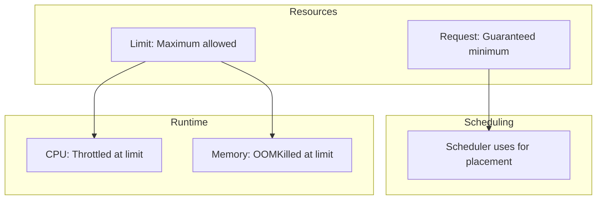

# How to Right-Size Kubernetes Resource Requests and Limits

Author: [nawazdhandala](https://www.github.com/nawazdhandala)

Tags: Kubernetes, Resource Management, Performance, Cost Optimization, DevOps

Description: A practical guide to setting appropriate CPU and memory requests and limits in Kubernetes, including profiling tools, common patterns, and avoiding over/under provisioning.

---

Resource requests and limits are the most impactful settings in Kubernetes that most teams get wrong. Too high wastes money. Too low causes OOM kills and throttling. Here's how to get them right.

## Understanding Requests vs Limits



| Setting | CPU Behavior | Memory Behavior |
|---------|--------------|-----------------|
| **Request** | Reserved for scheduling | Reserved for scheduling |
| **Below Request** | Gets full request | Gets full request |
| **Above Request** | Can burst (if available) | Uses available memory |
| **At Limit** | Throttled | - |
| **Above Limit** | Throttled | OOMKilled |

## The Consequences of Getting It Wrong

### Over-Provisioned Resources

```yaml
# BAD: Wastes cluster capacity
resources:
  requests:
    cpu: 2000m      # App uses 100m average
    memory: 4Gi     # App uses 256Mi average
```

**Problems:**
- Nodes appear full when they're mostly idle
- Cluster autoscaler adds unnecessary nodes
- Cloud bill explodes

### Under-Provisioned Resources

```yaml
# BAD: Causes performance issues
resources:
  requests:
    cpu: 10m        # App needs 500m
    memory: 64Mi    # App needs 512Mi
```

**Problems:**
- Scheduler packs too many pods on nodes
- CPU throttling causes latency spikes
- OOM kills cause restarts and data loss

## Step 1: Profile Your Application

### Use Metrics Server

```bash
# See actual usage
kubectl top pods -n production

# Output:
# NAME                    CPU(cores)   MEMORY(bytes)
# web-api-7b4c9d-k2x9f   45m          187Mi
# web-api-7b4c9d-l8p2n   52m          195Mi
```

### Use Prometheus Queries

```promql
# CPU usage over 24 hours (P95)
quantile_over_time(0.95,
  sum(rate(container_cpu_usage_seconds_total{
    namespace="production",
    pod=~"web-api.*",
    container!=""
  }[5m])) by (pod)
[24h])

# Memory usage over 24 hours (P95)
quantile_over_time(0.95,
  sum(container_memory_working_set_bytes{
    namespace="production",
    pod=~"web-api.*",
    container!=""
  }) by (pod)
[24h])
```

### Use VPA Recommendations (Without Applying)

```yaml
apiVersion: autoscaling.k8s.io/v1
kind: VerticalPodAutoscaler
metadata:
  name: web-api-vpa
  namespace: production
spec:
  targetRef:
    apiVersion: apps/v1
    kind: Deployment
    name: web-api
  updatePolicy:
    updateMode: "Off"  # Just get recommendations
```

Check recommendations:

```bash
kubectl describe vpa web-api-vpa -n production

# Output includes:
# Recommendation:
#   Container Recommendations:
#     Container Name: web-api
#     Lower Bound:
#       Cpu:     25m
#       Memory:  262144k
#     Target:
#       Cpu:     100m
#       Memory:  524288k
#     Upper Bound:
#       Cpu:     200m
#       Memory:  1Gi
```

## Step 2: Establish Baseline Metrics

Profile under different conditions:

```bash
#!/bin/bash
# Collect metrics over time

NAMESPACE="production"
APP="web-api"

echo "timestamp,pod,cpu,memory" > metrics.csv

while true; do
  kubectl top pods -n $NAMESPACE -l app=$APP --no-headers | \
    while read pod cpu mem; do
      echo "$(date +%s),$pod,$cpu,$mem" >> metrics.csv
    done
  sleep 60
done
```

Analyze the data:

```python
import pandas as pd

df = pd.read_csv('metrics.csv')
df['cpu_millicores'] = df['cpu'].str.replace('m', '').astype(int)
df['memory_mib'] = df['memory'].str.replace('Mi', '').astype(int)

print(f"CPU P50: {df['cpu_millicores'].quantile(0.50)}m")
print(f"CPU P95: {df['cpu_millicores'].quantile(0.95)}m")
print(f"CPU P99: {df['cpu_millicores'].quantile(0.99)}m")
print(f"CPU Max: {df['cpu_millicores'].max()}m")

print(f"Memory P50: {df['memory_mib'].quantile(0.50)}Mi")
print(f"Memory P95: {df['memory_mib'].quantile(0.95)}Mi")
print(f"Memory P99: {df['memory_mib'].quantile(0.99)}Mi")
print(f"Memory Max: {df['memory_mib'].max()}Mi")
```

## Step 3: Set Appropriate Values

### The Golden Rules

1. **CPU Request** = P95 of normal usage
2. **CPU Limit** = 2-5x request (or remove for burst)
3. **Memory Request** = P99 of usage + 10-20% buffer
4. **Memory Limit** = Same as request or slightly higher

### Example Configuration

Based on profiling:
- CPU: P50=45m, P95=100m, P99=150m, Max=300m
- Memory: P50=187Mi, P95=220Mi, P99=250Mi, Max=280Mi

```yaml
resources:
  requests:
    cpu: 100m       # P95 of CPU
    memory: 300Mi   # P99 + 20% buffer
  limits:
    cpu: 500m       # Allow bursts, but cap them
    memory: 350Mi   # Slight buffer above request
```

### Different Patterns for Different Workloads

**Web API (latency-sensitive):**
```yaml
resources:
  requests:
    cpu: 200m
    memory: 512Mi
  limits:
    cpu: 1000m      # Allow CPU burst for request handling
    memory: 512Mi   # Memory should be stable
```

**Background Worker (throughput-focused):**
```yaml
resources:
  requests:
    cpu: 500m
    memory: 1Gi
  limits:
    # No CPU limit - let it use available CPU
    memory: 1Gi
```

**Batch Job (predictable):**
```yaml
resources:
  requests:
    cpu: 1000m
    memory: 2Gi
  limits:
    cpu: 1000m      # Predictable, set request = limit
    memory: 2Gi
```

## Step 4: Handle CPU Throttling

### Detect Throttling

```promql
# Throttled CPU seconds
sum(rate(container_cpu_cfs_throttled_seconds_total{
  namespace="production",
  pod=~"web-api.*"
}[5m])) by (pod)

# Throttle ratio
sum(rate(container_cpu_cfs_throttled_periods_total{
  namespace="production",
  pod=~"web-api.*"
}[5m])) by (pod)
/
sum(rate(container_cpu_cfs_periods_total{
  namespace="production",
  pod=~"web-api.*"
}[5m])) by (pod)
```

### Fix Throttling

Option 1: Increase CPU limit
```yaml
limits:
  cpu: 2000m  # Was 500m
```

Option 2: Remove CPU limit entirely
```yaml
resources:
  requests:
    cpu: 200m
  # No CPU limit - pod can burst freely
```

Option 3: Increase replicas and lower per-pod usage
```yaml
# HPA scales horizontally instead of vertically
spec:
  replicas: 4  # Was 2
```

## Step 5: Handle OOM Kills

### Detect OOM Kills

```bash
# Find OOM killed pods
kubectl get events -n production --field-selector reason=OOMKilled

# Check container last state
kubectl get pod <pod-name> -n production -o jsonpath='{.status.containerStatuses[*].lastState}'
```

### Fix OOM Kills

```yaml
resources:
  requests:
    memory: 512Mi   # Increase if consistently OOMing
  limits:
    memory: 768Mi   # Give buffer for spikes
```

Also check for memory leaks in your application.

## Step 6: Quality of Service (QoS) Classes

Kubernetes assigns QoS based on resource settings:

### Guaranteed (Highest Priority)

```yaml
# Request equals limit for all resources
resources:
  requests:
    cpu: 500m
    memory: 512Mi
  limits:
    cpu: 500m
    memory: 512Mi
```

Best for: Production critical workloads

### Burstable (Medium Priority)

```yaml
# Requests set, limits different or missing
resources:
  requests:
    cpu: 100m
    memory: 256Mi
  limits:
    cpu: 500m
    memory: 512Mi
```

Best for: Most applications

### BestEffort (Lowest Priority - First to be killed)

```yaml
# No requests or limits
resources: {}
```

Best for: Non-critical batch jobs only

## Tools for Right-Sizing

### Goldilocks (by Fairwind)

```bash
# Install
helm repo add fairwinds-stable https://charts.fairwinds.com/stable
helm install goldilocks fairwinds-stable/goldilocks --namespace goldilocks --create-namespace

# Enable for namespace
kubectl label namespace production goldilocks.fairwinds.com/enabled=true

# Access dashboard
kubectl port-forward -n goldilocks svc/goldilocks-dashboard 8080:80
```

### Kubecost

```bash
# Install
helm repo add kubecost https://kubecost.github.io/cost-analyzer/
helm install kubecost kubecost/cost-analyzer --namespace kubecost --create-namespace

# Access dashboard
kubectl port-forward -n kubecost svc/kubecost-cost-analyzer 9090:9090
```

### kubectl-resource-recommender Plugin

```bash
kubectl krew install resource-capacity
kubectl resource-capacity -n production
```

## Resource Quota and LimitRange

### Namespace Defaults with LimitRange

```yaml
apiVersion: v1
kind: LimitRange
metadata:
  name: default-limits
  namespace: production
spec:
  limits:
    - default:
        cpu: 500m
        memory: 512Mi
      defaultRequest:
        cpu: 100m
        memory: 256Mi
      type: Container
    - max:
        cpu: 4
        memory: 8Gi
      min:
        cpu: 50m
        memory: 64Mi
      type: Container
```

### Namespace Quota

```yaml
apiVersion: v1
kind: ResourceQuota
metadata:
  name: compute-quota
  namespace: production
spec:
  hard:
    requests.cpu: "20"
    requests.memory: 40Gi
    limits.cpu: "40"
    limits.memory: 80Gi
    pods: "100"
```

## Common Patterns and Anti-Patterns

### Anti-Pattern: Copy-Paste Resources

```yaml
# Everyone copies the same values
resources:
  requests:
    cpu: 500m
    memory: 512Mi
  limits:
    cpu: 1000m
    memory: 1Gi
```

**Fix:** Profile each application individually.

### Anti-Pattern: Limits Way Higher Than Requests

```yaml
resources:
  requests:
    cpu: 100m
    memory: 128Mi
  limits:
    cpu: 4000m      # 40x request!
    memory: 8Gi     # 64x request!
```

**Fix:** Keep limits within 2-5x of requests.

### Anti-Pattern: No Resources Set

```yaml
spec:
  containers:
    - name: app
      image: myapp:latest
      # No resources block
```

**Fix:** Always set at least requests.

## Monitoring and Alerting

```yaml
apiVersion: monitoring.coreos.com/v1
kind: PrometheusRule
metadata:
  name: resource-alerts
spec:
  groups:
    - name: resources
      rules:
        - alert: ContainerMemoryNearLimit
          expr: |
            (container_memory_working_set_bytes / container_spec_memory_limit_bytes) > 0.9
          for: 5m
          labels:
            severity: warning
          annotations:
            summary: "Container {{ $labels.container }} memory near limit"

        - alert: ContainerCPUThrottled
          expr: |
            rate(container_cpu_cfs_throttled_seconds_total[5m]) > 0.1
          for: 10m
          labels:
            severity: warning
          annotations:
            summary: "Container {{ $labels.container }} is being throttled"

        - alert: PodResourceRequestsTooHigh
          expr: |
            sum(kube_pod_container_resource_requests{resource="cpu"}) by (pod, namespace)
            >
            2 * sum(rate(container_cpu_usage_seconds_total[1h])) by (pod, namespace)
          for: 24h
          labels:
            severity: info
          annotations:
            summary: "Pod {{ $labels.pod }} requests 2x more CPU than used"
```

---

Right-sizing resources is an ongoing process, not a one-time task. Profile your applications under realistic load, start with conservative values, and adjust based on metrics. The goal is to find the sweet spot where you're not wasting resources but also not causing performance issues.
