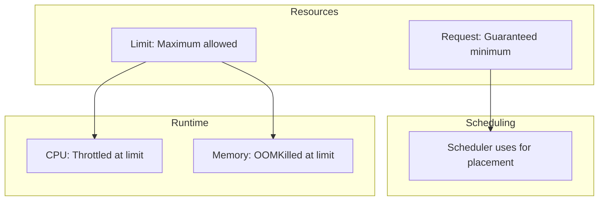

# How to Right-Size Kubernetes Resource Requests and Limits

Author: [nawazdhandala](https://www.github.com/nawazdhandala)

Tags: Kubernetes, Resource Management, Performance, Cost Optimization, DevOps

Description: A practical guide to setting appropriate CPU and memory requests and limits in Kubernetes, including profiling tools, common patterns, and avoiding over/under provisioning.

---

Resource requests and limits are the most impactful settings in Kubernetes that most teams get wrong. Too high wastes money. Too low causes OOM kills and throttling. Here's how to get them right.

## Understanding Requests vs Limits

This diagram illustrates the relationship between requests, limits, and their runtime behaviors. Requests reserve resources for scheduling, while limits cap maximum usage and trigger throttling or termination when exceeded.



| Setting | CPU Behavior | Memory Behavior |
|---------|--------------|-----------------|
| **Request** | Reserved for scheduling | Reserved for scheduling |
| **Below Request** | Gets full request | Gets full request |
| **Above Request** | Can burst (if available) | Uses available memory |
| **At Limit** | Throttled | - |
| **Above Limit** | Throttled | OOMKilled |

## The Consequences of Getting It Wrong

### Over-Provisioned Resources

This example shows a common anti-pattern where pods request far more resources than they actually use. This wastes cluster capacity and increases cloud costs significantly.

```yaml
# BAD: Wastes cluster capacity
resources:
  requests:
    cpu: 2000m      # App uses 100m average - 20x over-provisioned
    memory: 4Gi     # App uses 256Mi average - 16x over-provisioned
```

**Problems:**
- Nodes appear full when they're mostly idle
- Cluster autoscaler adds unnecessary nodes
- Cloud bill explodes

### Under-Provisioned Resources

Conversely, setting resources too low causes performance problems and instability. The scheduler packs too many pods on nodes, leading to resource contention.

```yaml
# BAD: Causes performance issues
resources:
  requests:
    cpu: 10m        # App needs 500m - will be severely throttled
    memory: 64Mi    # App needs 512Mi - will be OOM killed
```

**Problems:**
- Scheduler packs too many pods on nodes
- CPU throttling causes latency spikes
- OOM kills cause restarts and data loss

## Step 1: Profile Your Application

### Use Metrics Server

The metrics server provides real-time resource usage data. Use kubectl top regularly to understand actual resource consumption patterns before setting requests and limits.

```bash
# See actual CPU and memory usage for all pods
kubectl top pods -n production

# Output:
# NAME                    CPU(cores)   MEMORY(bytes)
# web-api-7b4c9d-k2x9f   45m          187Mi
# web-api-7b4c9d-l8p2n   52m          195Mi
```

### Use Prometheus Queries

These PromQL queries provide historical data on resource usage percentiles. Analyzing P95 and P99 values over 24 hours gives you reliable data for setting appropriate resource requests.

```promql
# CPU usage over 24 hours (P95)
# Returns 95th percentile CPU usage - good baseline for requests
quantile_over_time(0.95,
  sum(rate(container_cpu_usage_seconds_total{
    namespace="production",
    pod=~"web-api.*",
    container!=""
  }[5m])) by (pod)
[24h])

# Memory usage over 24 hours (P95)
# Returns 95th percentile memory usage - add buffer for requests
quantile_over_time(0.95,
  sum(container_memory_working_set_bytes{
    namespace="production",
    pod=~"web-api.*",
    container!=""
  }) by (pod)
[24h])
```

### Use VPA Recommendations (Without Applying)

The Vertical Pod Autoscaler can analyze historical usage and provide recommendations without automatically applying them. This is a safe way to get sizing guidance for your workloads.

```yaml
# VPA configured for recommendation-only mode
apiVersion: autoscaling.k8s.io/v1
kind: VerticalPodAutoscaler
metadata:
  name: web-api-vpa
  namespace: production
spec:
  targetRef:
    apiVersion: apps/v1
    kind: Deployment
    name: web-api
  updatePolicy:
    updateMode: "Off"  # Just get recommendations, don't auto-apply changes
```

Check recommendations:

The VPA provides lower bound, target, and upper bound recommendations. The target value is typically the best starting point for your resource requests.

```bash
# View VPA recommendations for sizing guidance
kubectl describe vpa web-api-vpa -n production

# Output includes:
# Recommendation:
#   Container Recommendations:
#     Container Name: web-api
#     Lower Bound:           # Minimum viable resources
#       Cpu:     25m
#       Memory:  262144k
#     Target:                # Recommended resource settings
#       Cpu:     100m
#       Memory:  524288k
#     Upper Bound:           # Maximum likely needed
#       Cpu:     200m
#       Memory:  1Gi
```

## Step 2: Establish Baseline Metrics

Profile under different conditions:

This script collects resource metrics over time, allowing you to analyze usage patterns during peak and off-peak hours. Run it for at least 24-48 hours to capture representative usage.

```bash
#!/bin/bash
# Collect metrics over time for analysis

NAMESPACE="production"
APP="web-api"

# Create CSV with header
echo "timestamp,pod,cpu,memory" > metrics.csv

# Continuously collect metrics every 60 seconds
while true; do
  kubectl top pods -n $NAMESPACE -l app=$APP --no-headers | \
    while read pod cpu mem; do
      # Append timestamp and metrics to CSV
      echo "$(date +%s),$pod,$cpu,$mem" >> metrics.csv
    done
  sleep 60  # Collect every minute
done
```

Analyze the data:

This Python script analyzes collected metrics to calculate percentiles. Use these values to inform your resource request and limit decisions.

```python
import pandas as pd

# Load collected metrics data
df = pd.read_csv('metrics.csv')

# Parse CPU (remove 'm' suffix) and memory (remove 'Mi' suffix)
df['cpu_millicores'] = df['cpu'].str.replace('m', '').astype(int)
df['memory_mib'] = df['memory'].str.replace('Mi', '').astype(int)

# Calculate CPU percentiles - use P95 for requests
print(f"CPU P50: {df['cpu_millicores'].quantile(0.50)}m")  # Median usage
print(f"CPU P95: {df['cpu_millicores'].quantile(0.95)}m")  # Use for requests
print(f"CPU P99: {df['cpu_millicores'].quantile(0.99)}m")  # Near-maximum
print(f"CPU Max: {df['cpu_millicores'].max()}m")           # Absolute peak

# Calculate memory percentiles - use P99 for requests (memory spikes are dangerous)
print(f"Memory P50: {df['memory_mib'].quantile(0.50)}Mi")  # Median usage
print(f"Memory P95: {df['memory_mib'].quantile(0.95)}Mi")  # Typical high usage
print(f"Memory P99: {df['memory_mib'].quantile(0.99)}Mi")  # Use for requests
print(f"Memory Max: {df['memory_mib'].max()}Mi")           # Absolute peak
```

## Step 3: Set Appropriate Values

### The Golden Rules

1. **CPU Request** = P95 of normal usage
2. **CPU Limit** = 2-5x request (or remove for burst)
3. **Memory Request** = P99 of usage + 10-20% buffer
4. **Memory Limit** = Same as request or slightly higher

### Example Configuration

Based on profiling:
- CPU: P50=45m, P95=100m, P99=150m, Max=300m
- Memory: P50=187Mi, P95=220Mi, P99=250Mi, Max=280Mi

This configuration translates profiling data into appropriate resource settings. CPU allows bursting for spikes, while memory has a smaller buffer since exceeding limits causes OOM kills.

```yaml
resources:
  requests:
    cpu: 100m       # P95 of CPU - covers normal usage
    memory: 300Mi   # P99 + 20% buffer - prevents most OOM kills
  limits:
    cpu: 500m       # Allow bursts up to 5x request for traffic spikes
    memory: 350Mi   # Slight buffer above request for safety
```

### Different Patterns for Different Workloads

**Web API (latency-sensitive):**

Web APIs need high CPU limits to handle request bursts without throttling, which would increase latency. Memory should be stable and predictable.

```yaml
resources:
  requests:
    cpu: 200m
    memory: 512Mi
  limits:
    cpu: 1000m      # Allow 5x CPU burst for request handling spikes
    memory: 512Mi   # Memory should be stable for web workloads
```

**Background Worker (throughput-focused):**

Background workers prioritize throughput over latency. Removing CPU limits allows them to use any available CPU, maximizing processing speed.

```yaml
resources:
  requests:
    cpu: 500m
    memory: 1Gi
  limits:
    # No CPU limit - let it use available CPU for maximum throughput
    memory: 1Gi     # Memory limit prevents runaway consumption
```

**Batch Job (predictable):**

Batch jobs have predictable resource needs. Setting request equal to limit ensures guaranteed resources and prevents noisy neighbor issues.

```yaml
resources:
  requests:
    cpu: 1000m
    memory: 2Gi
  limits:
    cpu: 1000m      # Predictable workload - set request = limit
    memory: 2Gi     # Guaranteed QoS class for consistent performance
```

## Step 4: Handle CPU Throttling

### Detect Throttling

These PromQL queries identify pods experiencing CPU throttling. High throttle rates indicate the CPU limit is too low and causing performance degradation.

```promql
# Throttled CPU seconds - total time spent throttled
sum(rate(container_cpu_cfs_throttled_seconds_total{
  namespace="production",
  pod=~"web-api.*"
}[5m])) by (pod)

# Throttle ratio - percentage of periods that were throttled
# Values > 0.1 (10%) indicate significant throttling
sum(rate(container_cpu_cfs_throttled_periods_total{
  namespace="production",
  pod=~"web-api.*"
}[5m])) by (pod)
/
sum(rate(container_cpu_cfs_periods_total{
  namespace="production",
  pod=~"web-api.*"
}[5m])) by (pod)
```

### Fix Throttling

There are multiple approaches to address CPU throttling depending on your workload characteristics and requirements.

Option 1: Increase CPU limit

```yaml
limits:
  cpu: 2000m  # Was 500m - increased 4x to reduce throttling
```

Option 2: Remove CPU limit entirely

```yaml
resources:
  requests:
    cpu: 200m       # Still reserve CPU for scheduling
  # No CPU limit - pod can burst freely using any available CPU
```

Option 3: Increase replicas and lower per-pod usage

```yaml
# HPA scales horizontally instead of vertically
# More pods = less load per pod = less throttling
spec:
  replicas: 4  # Was 2 - double replicas to halve per-pod load
```

## Step 5: Handle OOM Kills

### Detect OOM Kills

OOM (Out of Memory) kills occur when a container exceeds its memory limit. Use these commands to identify affected pods and understand the frequency of OOM events.

```bash
# Find OOM killed pods from cluster events
kubectl get events -n production --field-selector reason=OOMKilled

# Check container last state for OOM information
kubectl get pod <pod-name> -n production -o jsonpath='{.status.containerStatuses[*].lastState}'
```

### Fix OOM Kills

When pods are consistently OOM killed, increase both the request and limit. The request ensures the pod gets scheduled on a node with sufficient memory.

```yaml
resources:
  requests:
    memory: 512Mi   # Increase if consistently OOMing
  limits:
    memory: 768Mi   # Give buffer for memory spikes
```

Also check for memory leaks in your application.

## Step 6: Quality of Service (QoS) Classes

Kubernetes assigns QoS based on resource settings:

### Guaranteed (Highest Priority)

Guaranteed QoS pods are the last to be evicted under memory pressure. Use this for critical production workloads that must maintain availability.

```yaml
# Request equals limit for all resources - Guaranteed QoS
resources:
  requests:
    cpu: 500m
    memory: 512Mi
  limits:
    cpu: 500m       # Same as request
    memory: 512Mi   # Same as request - triggers Guaranteed QoS
```

Best for: Production critical workloads

### Burstable (Medium Priority)

Burstable is the most common QoS class. Pods can burst above their requests if resources are available, but will be evicted before Guaranteed pods under pressure.

```yaml
# Requests set, limits different or missing - Burstable QoS
resources:
  requests:
    cpu: 100m
    memory: 256Mi
  limits:
    cpu: 500m       # Higher than request - allows bursting
    memory: 512Mi   # Higher than request - allows memory spikes
```

Best for: Most applications

### BestEffort (Lowest Priority - First to be killed)

BestEffort pods have no resource guarantees and are first to be evicted. Only use for truly non-critical batch jobs that can be interrupted.

```yaml
# No requests or limits - BestEffort QoS (lowest priority)
resources: {}       # Pod can be evicted anytime under resource pressure
```

Best for: Non-critical batch jobs only

## Tools for Right-Sizing

### Goldilocks (by Fairwind)

Goldilocks automatically creates VPAs for all deployments in labeled namespaces and provides a dashboard showing current settings alongside recommendations.

```bash
# Install Goldilocks via Helm
helm repo add fairwinds-stable https://charts.fairwinds.com/stable
helm install goldilocks fairwinds-stable/goldilocks --namespace goldilocks --create-namespace

# Enable for namespace - Goldilocks will create VPAs automatically
kubectl label namespace production goldilocks.fairwinds.com/enabled=true

# Access dashboard to view recommendations
kubectl port-forward -n goldilocks svc/goldilocks-dashboard 8080:80
```

### Kubecost

Kubecost provides cost visibility and resource efficiency recommendations. It helps identify over-provisioned workloads and calculates potential savings.

```bash
# Install Kubecost via Helm
helm repo add kubecost https://kubecost.github.io/cost-analyzer/
helm install kubecost kubecost/cost-analyzer --namespace kubecost --create-namespace

# Access dashboard for cost and efficiency analysis
kubectl port-forward -n kubecost svc/kubecost-cost-analyzer 9090:9090
```

### kubectl-resource-recommender Plugin

This krew plugin provides a quick command-line view of resource capacity and utilization across your cluster or namespace.

```bash
# Install via krew plugin manager
kubectl krew install resource-capacity

# View resource capacity and usage for a namespace
kubectl resource-capacity -n production
```

## Resource Quota and LimitRange

### Namespace Defaults with LimitRange

LimitRange sets default requests and limits for pods that don't specify them, and enforces minimum/maximum boundaries. This prevents both over and under-provisioning at the namespace level.

```yaml
apiVersion: v1
kind: LimitRange
metadata:
  name: default-limits
  namespace: production
spec:
  limits:
    - default:             # Default limits applied to containers without explicit limits
        cpu: 500m
        memory: 512Mi
      defaultRequest:      # Default requests applied to containers without explicit requests
        cpu: 100m
        memory: 256Mi
      type: Container
    - max:                 # Maximum allowed values - prevents over-provisioning
        cpu: 4
        memory: 8Gi
      min:                 # Minimum allowed values - prevents under-provisioning
        cpu: 50m
        memory: 64Mi
      type: Container
```

### Namespace Quota

ResourceQuota limits total resource consumption for an entire namespace, preventing any single team or application from consuming disproportionate cluster resources.

```yaml
apiVersion: v1
kind: ResourceQuota
metadata:
  name: compute-quota
  namespace: production
spec:
  hard:
    requests.cpu: "20"      # Total CPU requests across all pods
    requests.memory: 40Gi   # Total memory requests across all pods
    limits.cpu: "40"        # Total CPU limits across all pods
    limits.memory: 80Gi     # Total memory limits across all pods
    pods: "100"             # Maximum number of pods in namespace
```

## Common Patterns and Anti-Patterns

### Anti-Pattern: Copy-Paste Resources

When teams copy the same resource values for every application regardless of actual needs, you end up with either over or under-provisioned workloads. Each application should be profiled individually.

```yaml
# Everyone copies the same values - rarely appropriate
resources:
  requests:
    cpu: 500m
    memory: 512Mi
  limits:
    cpu: 1000m
    memory: 1Gi
```

**Fix:** Profile each application individually.

### Anti-Pattern: Limits Way Higher Than Requests

Extremely high limits relative to requests cause scheduling problems. The scheduler places pods based on requests, but pods can burst to limits, causing resource contention.

```yaml
resources:
  requests:
    cpu: 100m
    memory: 128Mi
  limits:
    cpu: 4000m      # 40x request! - causes severe contention when bursting
    memory: 8Gi     # 64x request! - can OOM the node if all pods burst
```

**Fix:** Keep limits within 2-5x of requests.

### Anti-Pattern: No Resources Set

Without resource specifications, pods get BestEffort QoS and can be evicted anytime. The scheduler also cannot make informed placement decisions.

```yaml
spec:
  containers:
    - name: app
      image: myapp:latest
      # No resources block - BestEffort QoS, first to be evicted
```

**Fix:** Always set at least requests.

## Monitoring and Alerting

These PrometheusRules create alerts for common resource issues: containers approaching memory limits, CPU throttling, and over-provisioned resources. Use these to proactively identify and fix resource problems.

```yaml
apiVersion: monitoring.coreos.com/v1
kind: PrometheusRule
metadata:
  name: resource-alerts
spec:
  groups:
    - name: resources
      rules:
        # Alert when container memory usage exceeds 90% of limit
        - alert: ContainerMemoryNearLimit
          expr: |
            (container_memory_working_set_bytes / container_spec_memory_limit_bytes) > 0.9
          for: 5m
          labels:
            severity: warning
          annotations:
            summary: "Container {{ $labels.container }} memory near limit"

        # Alert when container is being CPU throttled
        - alert: ContainerCPUThrottled
          expr: |
            rate(container_cpu_cfs_throttled_seconds_total[5m]) > 0.1
          for: 10m
          labels:
            severity: warning
          annotations:
            summary: "Container {{ $labels.container }} is being throttled"

        # Alert when pod requests are much higher than actual usage
        - alert: PodResourceRequestsTooHigh
          expr: |
            sum(kube_pod_container_resource_requests{resource="cpu"}) by (pod, namespace)
            >
            2 * sum(rate(container_cpu_usage_seconds_total[1h])) by (pod, namespace)
          for: 24h
          labels:
            severity: info
          annotations:
            summary: "Pod {{ $labels.pod }} requests 2x more CPU than used"
```

---

Right-sizing resources is an ongoing process, not a one-time task. Profile your applications under realistic load, start with conservative values, and adjust based on metrics. The goal is to find the sweet spot where you're not wasting resources but also not causing performance issues.
