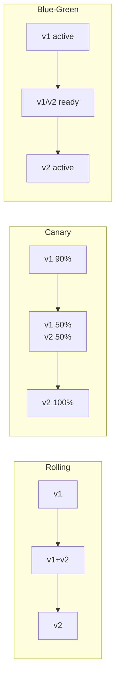

# How to Run Rolling Updates and Canary Deployments in Kubernetes

Author: [nawazdhandala](https://www.github.com/nawazdhandala)

Tags: Kubernetes, Releases, Canary Deployment, Rolling Updates, DevOps, Reliability

Description: A practical guide to implementing safe deployment strategies in Kubernetes, including rolling updates, canary deployments, blue-green deployments, and automated rollbacks.

---

Deploying new versions shouldn't mean crossing your fingers and hoping nothing breaks. Kubernetes provides built-in support for rolling updates, and with some additional tooling, you can implement canary deployments that catch problems before they affect all users.

## Deployment Strategies Overview

This diagram illustrates the three main deployment strategies. Rolling updates gradually replace pods, canary deployments test with a subset of traffic, and blue-green deployments maintain two complete environments for instant switching.



| Strategy | Risk | Rollback Speed | Resource Usage |
|----------|------|----------------|----------------|
| Rolling | Medium | Medium | Normal |
| Canary | Low | Fast | +10-50% |
| Blue-Green | Low | Instant | 2x |

## Rolling Updates (Built-in)

Kubernetes Deployments use rolling updates by default.

### Basic Rolling Update Configuration

This deployment configuration demonstrates a rolling update strategy with readiness and liveness probes. The strategy settings control how many pods can be added or removed during the update process.

```yaml
apiVersion: apps/v1
kind: Deployment
metadata:
  name: web-api
  namespace: production
spec:
  replicas: 10
  strategy:
    type: RollingUpdate
    rollingUpdate:
      maxSurge: 25%        # Max extra pods during update (2 for 10 replicas)
      maxUnavailable: 25%  # Max unavailable pods during update (2 for 10 replicas)
  selector:
    matchLabels:
      app: web-api
  template:
    metadata:
      labels:
        app: web-api
    spec:
      containers:
        - name: api
          image: myapp/api:v1.0.0
          ports:
            - containerPort: 8080
          # Readiness probe - pod receives traffic only when ready
          readinessProbe:
            httpGet:
              path: /ready
              port: 8080
            initialDelaySeconds: 5    # Wait before first probe
            periodSeconds: 5          # Check every 5 seconds
          # Liveness probe - pod restarts if unhealthy
          livenessProbe:
            httpGet:
              path: /healthz
              port: 8080
            initialDelaySeconds: 10   # Wait for app to start
            periodSeconds: 10         # Check every 10 seconds
```

### Rolling Update Parameters

**maxSurge**: Extra pods allowed during update
- `25%` = 2 extra pods (for 10 replicas)
- `1` = exactly 1 extra pod

**maxUnavailable**: Pods that can be unavailable
- `25%` = 2 pods can be down (for 10 replicas)
- `0` = all pods must stay running (requires maxSurge > 0)

### Safe Rolling Update Settings

For zero-downtime deployments, set maxUnavailable to 0. This ensures all existing pods remain running until new pods are ready, guaranteeing continuous availability.

```yaml
# Zero-downtime configuration - never reduce capacity below current
strategy:
  type: RollingUpdate
  rollingUpdate:
    maxSurge: 1          # Add one new pod at a time
    maxUnavailable: 0    # Never remove pods until new ones are ready
```

### Trigger a Rolling Update

These commands demonstrate different ways to trigger a rolling update. All methods cause Kubernetes to gradually replace pods with the new version.

```bash
# Update image directly via command line
kubectl set image deployment/web-api api=myapp/api:v2.0.0 -n production

# Or edit deployment interactively
kubectl edit deployment web-api -n production

# Or apply updated manifest file (recommended for GitOps)
kubectl apply -f deployment.yaml
```

### Watch Rolling Update Progress

Use these commands to monitor the progress of your rolling update and understand the deployment history.

```bash
# Watch rollout status - blocks until complete or failed
kubectl rollout status deployment/web-api -n production

# Watch pods being created and terminated in real-time
kubectl get pods -n production -l app=web-api -w

# Check rollout history - shows previous revisions
kubectl rollout history deployment/web-api -n production
```

### Rollback a Deployment

Rollback commands allow you to quickly revert to a previous version if problems are detected. You can rollback to the immediately previous version or to a specific revision number.

```bash
# Rollback to previous version (most common)
kubectl rollout undo deployment/web-api -n production

# Rollback to specific revision number
kubectl rollout undo deployment/web-api --to-revision=2 -n production

# Pause rollout mid-update - useful for debugging
kubectl rollout pause deployment/web-api -n production

# Resume paused rollout
kubectl rollout resume deployment/web-api -n production
```

## Canary Deployments

### Method 1: Native Kubernetes (Manual)

Create a separate deployment with fewer replicas:

This native Kubernetes approach uses two deployments with a shared Service selector. Traffic is distributed based on the ratio of pod counts between stable and canary deployments (9:1 = 90:10).

```yaml
# Stable deployment (90% traffic - 9 out of 10 pods)
apiVersion: apps/v1
kind: Deployment
metadata:
  name: web-api-stable
spec:
  replicas: 9                    # 9 pods receive 90% of traffic
  selector:
    matchLabels:
      app: web-api
      version: stable
  template:
    metadata:
      labels:
        app: web-api             # Shared label for Service selector
        version: stable          # Version-specific label
    spec:
      containers:
        - name: api
          image: myapp/api:v1.0.0
---
# Canary deployment (10% traffic - 1 out of 10 pods)
apiVersion: apps/v1
kind: Deployment
metadata:
  name: web-api-canary
spec:
  replicas: 1                    # 1 pod receives 10% of traffic
  selector:
    matchLabels:
      app: web-api
      version: canary
  template:
    metadata:
      labels:
        app: web-api             # Same app label - Service routes to both
        version: canary          # Version-specific label
    spec:
      containers:
        - name: api
          image: myapp/api:v2.0.0
---
# Service targets both deployments via shared app label
apiVersion: v1
kind: Service
metadata:
  name: web-api
spec:
  selector:
    app: web-api                 # Matches both stable and canary pods
  ports:
    - port: 80
      targetPort: 8080
```

Traffic split is proportional to pod count (9:1 = 90:10).

### Method 2: Istio Traffic Splitting

Istio provides fine-grained traffic control through VirtualService and DestinationRule resources. This allows percentage-based traffic splitting independent of pod counts, giving you precise control over canary traffic.

```yaml
# VirtualService for traffic splitting
apiVersion: networking.istio.io/v1beta1
kind: VirtualService
metadata:
  name: web-api
spec:
  hosts:
    - web-api
  http:
    - route:
        - destination:
            host: web-api
            subset: stable         # Route 90% to stable subset
          weight: 90
        - destination:
            host: web-api
            subset: canary         # Route 10% to canary subset
          weight: 10
---
# DestinationRule defines subsets based on pod labels
apiVersion: networking.istio.io/v1beta1
kind: DestinationRule
metadata:
  name: web-api
spec:
  host: web-api
  subsets:
    - name: stable
      labels:
        version: stable            # Matches stable deployment pods
    - name: canary
      labels:
        version: canary            # Matches canary deployment pods
```

Gradually increase canary weight:

Use kubectl patch to adjust traffic weights as you gain confidence in the canary version. Increase gradually (10% -> 25% -> 50% -> 100%) while monitoring for errors.

```bash
# Increase canary traffic from 10% to 50%
kubectl patch virtualservice web-api --type=merge -p '
spec:
  http:
  - route:
    - destination:
        host: web-api
        subset: stable
      weight: 50
    - destination:
        host: web-api
        subset: canary
      weight: 50'
```

### Method 3: Argo Rollouts (Recommended)

Install Argo Rollouts:

Argo Rollouts extends Kubernetes with advanced deployment capabilities. It provides a Rollout resource that replaces Deployments and supports canary, blue-green, and analysis-based strategies.

```bash
# Create namespace and install Argo Rollouts controller
kubectl create namespace argo-rollouts
kubectl apply -n argo-rollouts -f https://github.com/argoproj/argo-rollouts/releases/latest/download/install.yaml

# Install kubectl plugin for rollout management
brew install argoproj/tap/kubectl-argo-rollouts
```

Create a Rollout resource:

This Rollout resource defines a multi-step canary strategy that gradually increases traffic to the new version with pauses between steps, allowing time to verify each stage before proceeding.

```yaml
apiVersion: argoproj.io/v1alpha1
kind: Rollout
metadata:
  name: web-api
  namespace: production
spec:
  replicas: 10
  selector:
    matchLabels:
      app: web-api
  template:
    metadata:
      labels:
        app: web-api
    spec:
      containers:
        - name: api
          image: myapp/api:v1.0.0
          ports:
            - containerPort: 8080
  strategy:
    canary:
      steps:
        - setWeight: 10            # Start with 10% traffic to canary
        - pause: {duration: 5m}    # Wait 5 minutes to observe metrics
        - setWeight: 30            # Increase to 30%
        - pause: {duration: 5m}    # Wait 5 minutes
        - setWeight: 50            # Increase to 50%
        - pause: {duration: 5m}    # Wait 5 minutes
        - setWeight: 80            # Increase to 80%
        - pause: {duration: 5m}    # Final verification before 100%
      trafficRouting:
        nginx:
          stableIngress: web-api-ingress  # Ingress for traffic management
```

Monitor rollout:

Argo Rollouts provides both CLI and web dashboard for monitoring rollout progress. Use these tools to watch canary progression and intervene if needed.

```bash
# Watch rollout status in terminal
kubectl argo rollouts get rollout web-api -n production --watch

# Open web dashboard for visual monitoring
kubectl argo rollouts dashboard
# Opens web UI at http://localhost:3100
```

### Canary with Analysis

Automatically rollback if metrics degrade:

Analysis templates define automated health checks during rollouts. If the success rate drops below the threshold, Argo Rollouts automatically aborts the canary and rolls back, preventing bad deployments from reaching all users.

```yaml
apiVersion: argoproj.io/v1alpha1
kind: Rollout
metadata:
  name: web-api
spec:
  strategy:
    canary:
      steps:
        - setWeight: 10
        - pause: {duration: 2m}
        - analysis:                        # Run analysis after initial canary
            templates:
              - templateName: success-rate
        - setWeight: 50
        - pause: {duration: 5m}
        - analysis:                        # Run analysis again before full rollout
            templates:
              - templateName: success-rate
      trafficRouting:
        nginx:
          stableIngress: web-api-ingress
---
# Analysis template that checks HTTP success rate via Prometheus
apiVersion: argoproj.io/v1alpha1
kind: AnalysisTemplate
metadata:
  name: success-rate
spec:
  metrics:
    - name: success-rate
      interval: 1m                         # Check every minute
      successCondition: result[0] >= 0.95  # Success rate must be >= 95%
      failureLimit: 3                      # Abort after 3 failures
      provider:
        prometheus:
          address: http://prometheus.monitoring.svc:9090
          query: |
            sum(rate(http_requests_total{status=~"2.*",app="web-api"}[5m]))
            /
            sum(rate(http_requests_total{app="web-api"}[5m]))
```

## Blue-Green Deployments

### Using Argo Rollouts

Blue-green deployments maintain two complete environments. The previewService allows testing the new version before switching traffic. AutoPromotionEnabled: false requires manual approval before switching.

```yaml
apiVersion: argoproj.io/v1alpha1
kind: Rollout
metadata:
  name: web-api
spec:
  replicas: 10
  selector:
    matchLabels:
      app: web-api
  template:
    metadata:
      labels:
        app: web-api
    spec:
      containers:
        - name: api
          image: myapp/api:v1.0.0
  strategy:
    blueGreen:
      activeService: web-api-active        # Service for production traffic
      previewService: web-api-preview      # Service for testing new version
      autoPromotionEnabled: false          # Require manual promotion
      prePromotionAnalysis:                # Run smoke tests before promoting
        templates:
          - templateName: smoke-tests
---
# Active service - receives production traffic
apiVersion: v1
kind: Service
metadata:
  name: web-api-active
spec:
  selector:
    app: web-api                           # Selector managed by Argo Rollouts
  ports:
    - port: 80
---
# Preview service - allows testing new version before promotion
apiVersion: v1
kind: Service
metadata:
  name: web-api-preview
spec:
  selector:
    app: web-api                           # Selector managed by Argo Rollouts
  ports:
    - port: 80
```

Promote or abort:

After verifying the preview environment, use these commands to promote the new version to production or abort and rollback if issues are found.

```bash
# Promote blue to green - switches production traffic to new version
kubectl argo rollouts promote web-api -n production

# Abort and rollback - reverts to previous version
kubectl argo rollouts abort web-api -n production
```

## Health Checks for Safe Rollouts

### Readiness Probe (Critical for Rolling Updates)

Readiness probes are essential for safe rolling updates. Kubernetes only routes traffic to pods that pass their readiness probe, preventing traffic from reaching pods that aren't ready to serve requests.

```yaml
readinessProbe:
  httpGet:
    path: /ready                   # Endpoint that returns 200 when ready
    port: 8080
  initialDelaySeconds: 5           # Wait 5s before first probe
  periodSeconds: 5                 # Check every 5 seconds
  successThreshold: 1              # One success = ready
  failureThreshold: 3              # Three failures = not ready
```

The pod only receives traffic when readiness probe passes.

### Startup Probe (For Slow-Starting Apps)

Startup probes handle applications with long initialization times. They prevent liveness probes from killing pods that are still starting up, giving applications time to complete initialization.

```yaml
startupProbe:
  httpGet:
    path: /healthz
    port: 8080
  failureThreshold: 30             # Allow 30 failures before giving up
  periodSeconds: 10                # Check every 10 seconds
  # App has 30 * 10 = 300 seconds (5 minutes) to start
```

### Graceful Shutdown

Graceful shutdown ensures in-flight requests complete before pod termination. The preStop hook adds a delay to allow load balancers to drain connections before the container stops.

```yaml
spec:
  terminationGracePeriodSeconds: 60  # Maximum time for graceful shutdown
  containers:
    - name: api
      lifecycle:
        preStop:
          exec:
            # Delay container stop to allow load balancer to drain connections
            command: ["/bin/sh", "-c", "sleep 10"]
```

## Pod Disruption Budgets

Prevent too many pods from being unavailable:

PodDisruptionBudgets protect application availability during voluntary disruptions like node drains, cluster upgrades, or rollouts. They ensure a minimum number of pods remain running.

```yaml
apiVersion: policy/v1
kind: PodDisruptionBudget
metadata:
  name: web-api-pdb
spec:
  minAvailable: 80%                # At least 80% of pods must stay running
  # Alternative: maxUnavailable: 20%  # At most 20% can be unavailable
  selector:
    matchLabels:
      app: web-api                 # Apply to pods with this label
```

## Monitoring Deployments

### Prometheus Alerts

These PrometheusRules alert on deployment issues: replica mismatches indicate stuck rollouts, stalled conditions indicate failures, and high error rates during rollout suggest the new version has bugs.

```yaml
apiVersion: monitoring.coreos.com/v1
kind: PrometheusRule
metadata:
  name: deployment-alerts
spec:
  groups:
    - name: deployments
      rules:
        # Alert when deployment replicas don't match desired
        - alert: DeploymentReplicasMismatch
          expr: |
            kube_deployment_spec_replicas
            !=
            kube_deployment_status_replicas_available
          for: 10m
          labels:
            severity: warning

        # Alert when rollout is stuck and not progressing
        - alert: RolloutStalled
          expr: |
            kube_deployment_status_condition{condition="Progressing",status="false"} == 1
          for: 15m
          labels:
            severity: critical

        # Alert when error rate spikes during deployment
        - alert: HighErrorRateDuringRollout
          expr: |
            sum(rate(http_requests_total{status=~"5.*"}[5m])) by (deployment)
            /
            sum(rate(http_requests_total[5m])) by (deployment)
            > 0.05
          for: 2m
          labels:
            severity: critical
```

### Watch Commands

Use these commands during deployments to monitor progress and catch issues early. Real-time monitoring helps you react quickly to deployment problems.

```bash
# Watch deployment status changes
kubectl get deployment web-api -n production -w

# Watch events for the deployment
kubectl get events -n production --field-selector involvedObject.name=web-api --watch

# Watch rollout status - shows progress and conditions
kubectl rollout status deployment/web-api -n production
```

## Automated Rollback

### Using progressDeadlineSeconds

The progressDeadlineSeconds setting configures how long Kubernetes waits for a deployment to make progress before marking it as failed. This provides automatic failure detection for stuck rollouts.

```yaml
spec:
  progressDeadlineSeconds: 600    # Fail if no progress in 10 minutes
```

If the deployment doesn't progress (pods not becoming ready), Kubernetes marks it as failed.

### With Argo Rollouts Analysis

Argo Rollouts can run continuous analysis during the canary phase. If the error rate exceeds the threshold, the rollout automatically aborts and reverts to the stable version.

```yaml
strategy:
  canary:
    analysis:
      templates:
        - templateName: error-rate
      startingStep: 1              # Start analysis from first canary step
    steps:
      - setWeight: 20
      - pause: {duration: 5m}
---
# Analysis template for continuous error rate monitoring
apiVersion: argoproj.io/v1alpha1
kind: AnalysisTemplate
metadata:
  name: error-rate
spec:
  metrics:
    - name: error-rate
      interval: 1m                 # Check every minute
      failureLimit: 2              # Abort after 2 failures
      successCondition: result[0] < 0.05  # Error rate must be < 5%
      provider:
        prometheus:
          address: http://prometheus:9090
          query: |
            sum(rate(http_requests_total{status=~"5.*",app="{{args.app}}"}[5m]))
            /
            sum(rate(http_requests_total{app="{{args.app}}"}[5m]))
```

## Best Practices Summary

1. **Always use readiness probes** - No traffic until pod is ready
2. **Set progressDeadlineSeconds** - Auto-fail stuck deployments
3. **Use PodDisruptionBudgets** - Protect availability during updates
4. **Start canary at 10% or less** - Limit blast radius
5. **Automate analysis** - Don't rely on humans watching dashboards
6. **Have a rollback plan** - Test rollback procedures
7. **Monitor error rates during rollout** - Alert on degradation

---

Safe deployments are about limiting blast radius and detecting problems early. Start with proper rolling update settings and readiness probes. As you mature, add canary deployments with automated analysis. The goal is to deploy frequently with confidence, not fear.
