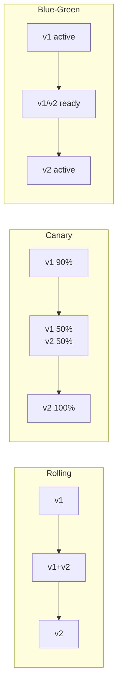

# How to Run Rolling Updates and Canary Deployments in Kubernetes

Author: [nawazdhandala](https://www.github.com/nawazdhandala)

Tags: Kubernetes, Releases, Canary Deployment, Rolling Updates, DevOps, Reliability

Description: A practical guide to implementing safe deployment strategies in Kubernetes, including rolling updates, canary deployments, blue-green deployments, and automated rollbacks.

---

Deploying new versions shouldn't mean crossing your fingers and hoping nothing breaks. Kubernetes provides built-in support for rolling updates, and with some additional tooling, you can implement canary deployments that catch problems before they affect all users.

## Deployment Strategies Overview



| Strategy | Risk | Rollback Speed | Resource Usage |
|----------|------|----------------|----------------|
| Rolling | Medium | Medium | Normal |
| Canary | Low | Fast | +10-50% |
| Blue-Green | Low | Instant | 2x |

## Rolling Updates (Built-in)

Kubernetes Deployments use rolling updates by default.

### Basic Rolling Update Configuration

```yaml
apiVersion: apps/v1
kind: Deployment
metadata:
  name: web-api
  namespace: production
spec:
  replicas: 10
  strategy:
    type: RollingUpdate
    rollingUpdate:
      maxSurge: 25%        # Max extra pods during update
      maxUnavailable: 25%  # Max unavailable pods during update
  selector:
    matchLabels:
      app: web-api
  template:
    metadata:
      labels:
        app: web-api
    spec:
      containers:
        - name: api
          image: myapp/api:v1.0.0
          ports:
            - containerPort: 8080
          readinessProbe:
            httpGet:
              path: /ready
              port: 8080
            initialDelaySeconds: 5
            periodSeconds: 5
          livenessProbe:
            httpGet:
              path: /healthz
              port: 8080
            initialDelaySeconds: 10
            periodSeconds: 10
```

### Rolling Update Parameters

**maxSurge**: Extra pods allowed during update
- `25%` = 2 extra pods (for 10 replicas)
- `1` = exactly 1 extra pod

**maxUnavailable**: Pods that can be unavailable
- `25%` = 2 pods can be down (for 10 replicas)
- `0` = all pods must stay running (requires maxSurge > 0)

### Safe Rolling Update Settings

```yaml
# Zero-downtime configuration
strategy:
  type: RollingUpdate
  rollingUpdate:
    maxSurge: 1
    maxUnavailable: 0
```

### Trigger a Rolling Update

```bash
# Update image
kubectl set image deployment/web-api api=myapp/api:v2.0.0 -n production

# Or edit deployment
kubectl edit deployment web-api -n production

# Or apply updated manifest
kubectl apply -f deployment.yaml
```

### Watch Rolling Update Progress

```bash
# Watch rollout status
kubectl rollout status deployment/web-api -n production

# Watch pods
kubectl get pods -n production -l app=web-api -w

# Check rollout history
kubectl rollout history deployment/web-api -n production
```

### Rollback a Deployment

```bash
# Rollback to previous version
kubectl rollout undo deployment/web-api -n production

# Rollback to specific revision
kubectl rollout undo deployment/web-api --to-revision=2 -n production

# Pause rollout (stop mid-update)
kubectl rollout pause deployment/web-api -n production

# Resume rollout
kubectl rollout resume deployment/web-api -n production
```

## Canary Deployments

### Method 1: Native Kubernetes (Manual)

Create a separate deployment with fewer replicas:

```yaml
# Stable deployment (90% traffic)
apiVersion: apps/v1
kind: Deployment
metadata:
  name: web-api-stable
spec:
  replicas: 9
  selector:
    matchLabels:
      app: web-api
      version: stable
  template:
    metadata:
      labels:
        app: web-api
        version: stable
    spec:
      containers:
        - name: api
          image: myapp/api:v1.0.0
---
# Canary deployment (10% traffic)
apiVersion: apps/v1
kind: Deployment
metadata:
  name: web-api-canary
spec:
  replicas: 1
  selector:
    matchLabels:
      app: web-api
      version: canary
  template:
    metadata:
      labels:
        app: web-api
        version: canary
    spec:
      containers:
        - name: api
          image: myapp/api:v2.0.0
---
# Service targets both
apiVersion: v1
kind: Service
metadata:
  name: web-api
spec:
  selector:
    app: web-api  # Matches both stable and canary
  ports:
    - port: 80
      targetPort: 8080
```

Traffic split is proportional to pod count (9:1 = 90:10).

### Method 2: Istio Traffic Splitting

```yaml
# VirtualService for traffic splitting
apiVersion: networking.istio.io/v1beta1
kind: VirtualService
metadata:
  name: web-api
spec:
  hosts:
    - web-api
  http:
    - route:
        - destination:
            host: web-api
            subset: stable
          weight: 90
        - destination:
            host: web-api
            subset: canary
          weight: 10
---
# DestinationRule defines subsets
apiVersion: networking.istio.io/v1beta1
kind: DestinationRule
metadata:
  name: web-api
spec:
  host: web-api
  subsets:
    - name: stable
      labels:
        version: stable
    - name: canary
      labels:
        version: canary
```

Gradually increase canary weight:

```bash
kubectl patch virtualservice web-api --type=merge -p '
spec:
  http:
  - route:
    - destination:
        host: web-api
        subset: stable
      weight: 50
    - destination:
        host: web-api
        subset: canary
      weight: 50'
```

### Method 3: Argo Rollouts (Recommended)

Install Argo Rollouts:

```bash
kubectl create namespace argo-rollouts
kubectl apply -n argo-rollouts -f https://github.com/argoproj/argo-rollouts/releases/latest/download/install.yaml

# Install kubectl plugin
brew install argoproj/tap/kubectl-argo-rollouts
```

Create a Rollout resource:

```yaml
apiVersion: argoproj.io/v1alpha1
kind: Rollout
metadata:
  name: web-api
  namespace: production
spec:
  replicas: 10
  selector:
    matchLabels:
      app: web-api
  template:
    metadata:
      labels:
        app: web-api
    spec:
      containers:
        - name: api
          image: myapp/api:v1.0.0
          ports:
            - containerPort: 8080
  strategy:
    canary:
      steps:
        - setWeight: 10
        - pause: {duration: 5m}
        - setWeight: 30
        - pause: {duration: 5m}
        - setWeight: 50
        - pause: {duration: 5m}
        - setWeight: 80
        - pause: {duration: 5m}
      trafficRouting:
        nginx:
          stableIngress: web-api-ingress
```

Monitor rollout:

```bash
kubectl argo rollouts get rollout web-api -n production --watch

kubectl argo rollouts dashboard
# Opens web UI
```

### Canary with Analysis

Automatically rollback if metrics degrade:

```yaml
apiVersion: argoproj.io/v1alpha1
kind: Rollout
metadata:
  name: web-api
spec:
  strategy:
    canary:
      steps:
        - setWeight: 10
        - pause: {duration: 2m}
        - analysis:
            templates:
              - templateName: success-rate
        - setWeight: 50
        - pause: {duration: 5m}
        - analysis:
            templates:
              - templateName: success-rate
      trafficRouting:
        nginx:
          stableIngress: web-api-ingress
---
apiVersion: argoproj.io/v1alpha1
kind: AnalysisTemplate
metadata:
  name: success-rate
spec:
  metrics:
    - name: success-rate
      interval: 1m
      successCondition: result[0] >= 0.95
      failureLimit: 3
      provider:
        prometheus:
          address: http://prometheus.monitoring.svc:9090
          query: |
            sum(rate(http_requests_total{status=~"2.*",app="web-api"}[5m]))
            /
            sum(rate(http_requests_total{app="web-api"}[5m]))
```

## Blue-Green Deployments

### Using Argo Rollouts

```yaml
apiVersion: argoproj.io/v1alpha1
kind: Rollout
metadata:
  name: web-api
spec:
  replicas: 10
  selector:
    matchLabels:
      app: web-api
  template:
    metadata:
      labels:
        app: web-api
    spec:
      containers:
        - name: api
          image: myapp/api:v1.0.0
  strategy:
    blueGreen:
      activeService: web-api-active
      previewService: web-api-preview
      autoPromotionEnabled: false
      prePromotionAnalysis:
        templates:
          - templateName: smoke-tests
---
apiVersion: v1
kind: Service
metadata:
  name: web-api-active
spec:
  selector:
    app: web-api
  ports:
    - port: 80
---
apiVersion: v1
kind: Service
metadata:
  name: web-api-preview
spec:
  selector:
    app: web-api
  ports:
    - port: 80
```

Promote or abort:

```bash
# Promote blue to green
kubectl argo rollouts promote web-api -n production

# Abort and rollback
kubectl argo rollouts abort web-api -n production
```

## Health Checks for Safe Rollouts

### Readiness Probe (Critical for Rolling Updates)

```yaml
readinessProbe:
  httpGet:
    path: /ready
    port: 8080
  initialDelaySeconds: 5
  periodSeconds: 5
  successThreshold: 1
  failureThreshold: 3
```

The pod only receives traffic when readiness probe passes.

### Startup Probe (For Slow-Starting Apps)

```yaml
startupProbe:
  httpGet:
    path: /healthz
    port: 8080
  failureThreshold: 30
  periodSeconds: 10
  # App has 5 minutes to start
```

### Graceful Shutdown

```yaml
spec:
  terminationGracePeriodSeconds: 60
  containers:
    - name: api
      lifecycle:
        preStop:
          exec:
            command: ["/bin/sh", "-c", "sleep 10"]
```

## Pod Disruption Budgets

Prevent too many pods from being unavailable:

```yaml
apiVersion: policy/v1
kind: PodDisruptionBudget
metadata:
  name: web-api-pdb
spec:
  minAvailable: 80%  # Or maxUnavailable: 20%
  selector:
    matchLabels:
      app: web-api
```

## Monitoring Deployments

### Prometheus Alerts

```yaml
apiVersion: monitoring.coreos.com/v1
kind: PrometheusRule
metadata:
  name: deployment-alerts
spec:
  groups:
    - name: deployments
      rules:
        - alert: DeploymentReplicasMismatch
          expr: |
            kube_deployment_spec_replicas
            !=
            kube_deployment_status_replicas_available
          for: 10m
          labels:
            severity: warning

        - alert: RolloutStalled
          expr: |
            kube_deployment_status_condition{condition="Progressing",status="false"} == 1
          for: 15m
          labels:
            severity: critical

        - alert: HighErrorRateDuringRollout
          expr: |
            sum(rate(http_requests_total{status=~"5.*"}[5m])) by (deployment)
            /
            sum(rate(http_requests_total[5m])) by (deployment)
            > 0.05
          for: 2m
          labels:
            severity: critical
```

### Watch Commands

```bash
# Deployment status
kubectl get deployment web-api -n production -w

# Pod events
kubectl get events -n production --field-selector involvedObject.name=web-api --watch

# Rollout metrics
kubectl rollout status deployment/web-api -n production
```

## Automated Rollback

### Using progressDeadlineSeconds

```yaml
spec:
  progressDeadlineSeconds: 600  # Fail if no progress in 10 minutes
```

If the deployment doesn't progress (pods not becoming ready), Kubernetes marks it as failed.

### With Argo Rollouts Analysis

```yaml
strategy:
  canary:
    analysis:
      templates:
        - templateName: error-rate
      startingStep: 1
    steps:
      - setWeight: 20
      - pause: {duration: 5m}
---
apiVersion: argoproj.io/v1alpha1
kind: AnalysisTemplate
metadata:
  name: error-rate
spec:
  metrics:
    - name: error-rate
      interval: 1m
      failureLimit: 2
      successCondition: result[0] < 0.05
      provider:
        prometheus:
          address: http://prometheus:9090
          query: |
            sum(rate(http_requests_total{status=~"5.*",app="{{args.app}}"}[5m]))
            /
            sum(rate(http_requests_total{app="{{args.app}}"}[5m]))
```

## Best Practices Summary

1. **Always use readiness probes** - No traffic until pod is ready
2. **Set progressDeadlineSeconds** - Auto-fail stuck deployments
3. **Use PodDisruptionBudgets** - Protect availability during updates
4. **Start canary at 10% or less** - Limit blast radius
5. **Automate analysis** - Don't rely on humans watching dashboards
6. **Have a rollback plan** - Test rollback procedures
7. **Monitor error rates during rollout** - Alert on degradation

---

Safe deployments are about limiting blast radius and detecting problems early. Start with proper rolling update settings and readiness probes. As you mature, add canary deployments with automated analysis. The goal is to deploy frequently with confidence, not fear.
