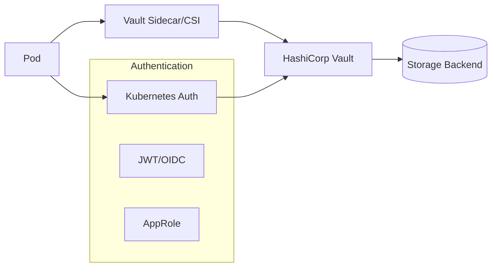

# How to Secure Kubernetes Secrets with HashiCorp Vault or Sealed Secrets

Author: [nawazdhandala](https://www.github.com/nawazdhandala)

Tags: Kubernetes, Security, Secrets Management, HashiCorp Vault, Sealed Secrets, DevOps

Description: A practical guide to securing Kubernetes secrets using HashiCorp Vault and Bitnami Sealed Secrets, with installation, configuration, and GitOps integration patterns.

---

Kubernetes Secrets are base64-encoded, not encrypted. Anyone with cluster access can decode them. This guide shows you how to properly secure secrets using HashiCorp Vault and Sealed Secrets.

## The Problem with Native Kubernetes Secrets

The following example demonstrates how easily Kubernetes secrets can be decoded by anyone with cluster access. This is a critical security concern because base64 encoding provides no actual protection.

```bash
# Create a secret containing a database password
kubectl create secret generic db-creds --from-literal=password=supersecret

# Anyone with kubectl access can decode the secret - base64 is NOT encryption!
# This retrieves the secret, extracts the password field, and decodes it
kubectl get secret db-creds -o jsonpath='{.data.password}' | base64 -d
# Output: supersecret
```

Even worse, secrets in Git repos are visible to anyone with repo access. You need encryption at rest and in transit.

## Option 1: Sealed Secrets

Sealed Secrets lets you encrypt secrets that can only be decrypted by the controller running in your cluster. Safe to commit to Git.


### Install Sealed Secrets Controller

This installs the Sealed Secrets controller in your cluster using Helm. The controller holds the private key that can decrypt sealed secrets, making it the only component capable of revealing the actual secret values.

```bash
# Add the official Bitnami Helm repository for Sealed Secrets
helm repo add sealed-secrets https://bitnami-labs.github.io/sealed-secrets
# Refresh the repo cache to get the latest chart versions
helm repo update

# Install the controller in kube-system namespace for cluster-wide access
# The fullnameOverride ensures consistent naming for the controller
helm install sealed-secrets sealed-secrets/sealed-secrets \
  --namespace kube-system \
  --set fullnameOverride=sealed-secrets-controller
```

### Install kubeseal CLI

The kubeseal CLI is the client-side tool that encrypts secrets using the cluster's public key. You need this installed on your local machine to create sealed secrets before committing them to Git.

```bash
# macOS - use Homebrew for simple installation
brew install kubeseal

# Linux - download the latest release binary from GitHub
# First, fetch the latest version tag from the GitHub API
KUBESEAL_VERSION=$(curl -s https://api.github.com/repos/bitnami-labs/sealed-secrets/releases/latest | jq -r .tag_name)
# Download the tarball for Linux amd64 architecture
curl -OL "https://github.com/bitnami-labs/sealed-secrets/releases/download/${KUBESEAL_VERSION}/kubeseal-${KUBESEAL_VERSION#v}-linux-amd64.tar.gz"
# Extract the binary from the archive
tar -xzf kubeseal-*.tar.gz
# Move to system path for global access
sudo mv kubeseal /usr/local/bin/
```

### Create a Sealed Secret

This workflow shows how to create an encrypted sealed secret from a regular Kubernetes secret. The secret is encrypted client-side and can be safely stored in Git.

```bash
# Create a regular secret YAML (don't apply it!) using --dry-run
# This generates the secret manifest without sending it to the cluster
kubectl create secret generic db-creds \
  --from-literal=username=admin \
  --from-literal=password=supersecret123 \
  --dry-run=client -o yaml > secret.yaml

# Seal the secret using the cluster's public key
# kubeseal fetches the public key from the controller automatically
kubeseal --format yaml < secret.yaml > sealed-secret.yaml

# View the sealed secret - the data is now encrypted
cat sealed-secret.yaml
```

Output:

The resulting SealedSecret resource contains encrypted data that can only be decrypted by the cluster's Sealed Secrets controller. Notice how the original values are replaced with encrypted strings.

```yaml
# SealedSecret CRD - safe to commit to Git
apiVersion: bitnami.com/v1alpha1
kind: SealedSecret
metadata:
  name: db-creds
  namespace: default
spec:
  # encryptedData contains the encrypted key-value pairs
  # Only the cluster controller can decrypt these values
  encryptedData:
    password: AgBy3i4OJSWK+PiTySYZZA9rO43cGDEq...
    username: AgBy3i4OJSWK+PiTySYZZA9rO43cGDEq...
  template:
    metadata:
      name: db-creds
      namespace: default
    # Opaque is the standard type for arbitrary key-value secrets
    type: Opaque
```

### Apply Sealed Secret

Once you have a sealed secret, you can safely commit it to Git and apply it to your cluster. The controller automatically decrypts it and creates the actual Kubernetes Secret.

```bash
# Safe to commit to Git! The encrypted data cannot be decrypted without the controller's private key
git add sealed-secret.yaml
git commit -m "Add encrypted db credentials"

# Apply to cluster - the controller detects the SealedSecret and decrypts it
# This creates a regular Kubernetes Secret automatically
kubectl apply -f sealed-secret.yaml

# Verify the secret was created by the controller
kubectl get secret db-creds
```

### Scope Options

Sealed Secrets supports different scope levels that control where the secret can be used. Choose the appropriate scope based on your security requirements.

```bash
# Strict (default) - secret is bound to both name AND namespace
# Cannot be renamed or moved to another namespace
kubeseal --scope strict

# Namespace-wide - secret can be renamed within the same namespace
# Useful when secret names might change but namespace stays the same
kubeseal --scope namespace-wide

# Cluster-wide - secret can be used anywhere in the cluster
# Use sparingly as it reduces security isolation
kubeseal --scope cluster-wide
```

### Rotate Encryption Keys

Key rotation is an important security practice. The Sealed Secrets controller generates new keys periodically, and you should re-encrypt your secrets to use the latest key.

```bash
# Fetch the current public key and save it for offline sealing
kubeseal --fetch-cert > sealed-secrets-cert.pem

# Re-encrypt existing sealed secrets with the new key (after controller key rotation)
# This updates the encryption without changing the secret values
kubeseal --re-encrypt < sealed-secret.yaml > sealed-secret-new.yaml
```

### Backup Sealed Secrets Keys

Critical: Back up the master encryption key to prevent data loss. If you lose the key and reinstall the controller, all existing sealed secrets become undecryptable.

```bash
# Backup the master key (store this securely - treat it like a root password!)
# This retrieves all sealing keys used by the controller
kubectl get secret -n kube-system \
  -l sealedsecrets.bitnami.com/sealed-secrets-key \
  -o yaml > sealed-secrets-master.key

# Restore on a new cluster before deploying sealed secrets
# This allows the new controller to decrypt existing sealed secrets
kubectl apply -f sealed-secrets-master.key
```

## Option 2: HashiCorp Vault

Vault is an enterprise-grade secrets manager with dynamic secrets, encryption as a service, and audit logging.



### Install Vault with Helm

This section shows two installation methods: dev mode for testing and HA mode for production. Never use dev mode in production as it stores data in memory and auto-unseals with a known key.

```bash
# Add the official HashiCorp Helm repository
helm repo add hashicorp https://helm.releases.hashicorp.com
helm repo update

# Install Vault in dev mode (NOT for production - data is in-memory only!)
# Dev mode auto-unseals and uses a root token, making it easy to test
helm install vault hashicorp/vault \
  --namespace vault \
  --create-namespace \
  --set server.dev.enabled=true

# For production, use HA mode with multiple replicas for fault tolerance
# This requires manual unsealing or auto-unseal configuration
helm install vault hashicorp/vault \
  --namespace vault \
  --create-namespace \
  --set server.ha.enabled=true \
  --set server.ha.replicas=3
```

### Initialize and Unseal Vault (Production)

Vault starts sealed and requires initialization and unsealing before use. The init process generates unseal keys and a root token that must be stored securely.

```bash
# Initialize Vault - this generates 5 unseal keys and a root token
# This command should only be run once per Vault cluster
kubectl exec -it vault-0 -n vault -- vault operator init

# CRITICAL: Save the unseal keys and root token securely!
# You need 3 of 5 keys (default threshold) to unseal Vault
# Unseal with key 1
kubectl exec -it vault-0 -n vault -- vault operator unseal <key1>
# Unseal with key 2
kubectl exec -it vault-0 -n vault -- vault operator unseal <key2>
# Unseal with key 3 - Vault becomes operational after this
kubectl exec -it vault-0 -n vault -- vault operator unseal <key3>
```

### Configure Kubernetes Authentication

Kubernetes authentication allows pods to authenticate with Vault using their service account tokens. This eliminates the need for hardcoded credentials in applications.

```bash
# Exec into Vault pod to configure authentication
kubectl exec -it vault-0 -n vault -- /bin/sh

# Enable the Kubernetes authentication method
vault auth enable kubernetes

# Configure Vault to communicate with the Kubernetes API
# This uses the pod's service account to verify token validity
vault write auth/kubernetes/config \
  kubernetes_host="https://$KUBERNETES_PORT_443_TCP_ADDR:443" \
  token_reviewer_jwt="$(cat /var/run/secrets/kubernetes.io/serviceaccount/token)" \
  kubernetes_ca_cert=@/var/run/secrets/kubernetes.io/serviceaccount/ca.crt \
  issuer="https://kubernetes.default.svc.cluster.local"
```

### Create Secrets and Policies

Vault policies define what secrets an authenticated entity can access. This least-privilege approach ensures applications only have access to their own secrets.

```bash
# Enable the KV (Key-Value) secrets engine version 2
# KV-v2 provides versioning and soft-delete capabilities
vault secrets enable -path=secret kv-v2

# Create a secret for the application
vault kv put secret/myapp/config \
  username="admin" \
  password="supersecret123"

# Create a policy that grants read-only access to myapp secrets
# The path uses 'data' prefix because KV-v2 stores data at secret/data/*
vault policy write myapp - <<EOF
path "secret/data/myapp/*" {
  capabilities = ["read"]
}
EOF

# Create a Kubernetes role that links service accounts to the policy
# Only pods with the 'myapp' service account in 'production' namespace can authenticate
vault write auth/kubernetes/role/myapp \
  bound_service_account_names=myapp \
  bound_service_account_namespaces=production \
  policies=myapp \
  ttl=1h
```

### Method 1: Vault Agent Sidecar Injector

The Vault Agent Injector automatically injects a sidecar container that handles secret retrieval and renewal. This is the most common method for integrating Vault with Kubernetes applications.

Install the injector:

```bash
# Enable the injector component in the Vault Helm release
helm upgrade vault hashicorp/vault \
  --namespace vault \
  --set injector.enabled=true
```

Annotate your deployment:

The following deployment shows how to use annotations to inject secrets into your pod. The Vault Agent sidecar handles authentication and writes secrets to a shared volume.

```yaml
apiVersion: apps/v1
kind: Deployment
metadata:
  name: myapp
  namespace: production
spec:
  template:
    metadata:
      annotations:
        # Enable Vault agent injection for this pod
        vault.hashicorp.com/agent-inject: "true"
        # Specify the Vault role for authentication
        vault.hashicorp.com/role: "myapp"
        # Define which secret to inject and the file path
        vault.hashicorp.com/agent-inject-secret-config.txt: "secret/data/myapp/config"
        # Template to format the secret as environment variables
        vault.hashicorp.com/agent-inject-template-config.txt: |
          {{- with secret "secret/data/myapp/config" -}}
          export DB_USERNAME="{{ .Data.data.username }}"
          export DB_PASSWORD="{{ .Data.data.password }}"
          {{- end -}}
    spec:
      # ServiceAccount must match the bound_service_account_names in Vault role
      serviceAccountName: myapp
      containers:
        - name: myapp
          image: myapp:latest
          command: ["/bin/sh", "-c"]
          # Source the secrets file before starting the application
          args:
            - source /vault/secrets/config.txt && exec /app/myapp
```

### Method 2: Vault CSI Provider

The CSI (Container Storage Interface) provider mounts secrets as files in your pod and can optionally sync them to Kubernetes Secrets. This method is useful when you need secrets as both files and environment variables.

Install Vault CSI provider:

```bash
# Enable the CSI provider in the Vault Helm release
helm install vault hashicorp/vault \
  --namespace vault \
  --set csi.enabled=true
```

Create SecretProviderClass:

The SecretProviderClass defines how to fetch secrets from Vault and optionally sync them to Kubernetes Secrets for use as environment variables.

```yaml
apiVersion: secrets-store.csi.x-k8s.io/v1
kind: SecretProviderClass
metadata:
  name: vault-myapp
  namespace: production
spec:
  # Use the Vault provider for the Secrets Store CSI driver
  provider: vault
  parameters:
    # Vault role for Kubernetes authentication
    roleName: "myapp"
    # Vault server address (internal cluster DNS)
    vaultAddress: "http://vault.vault.svc:8200"
    # Define the secrets to retrieve from Vault
    objects: |
      - objectName: "db-username"
        secretPath: "secret/data/myapp/config"
        secretKey: "username"
      - objectName: "db-password"
        secretPath: "secret/data/myapp/config"
        secretKey: "password"
  # Optionally sync to a Kubernetes Secret for use with envFrom
  secretObjects:
    - secretName: myapp-secrets
      type: Opaque
      data:
        - objectName: db-username
          key: username
        - objectName: db-password
          key: password
```

Use in deployment:

This deployment shows how to consume secrets from the CSI provider both as mounted files and as environment variables via the synced Kubernetes Secret.

```yaml
apiVersion: apps/v1
kind: Deployment
metadata:
  name: myapp
  namespace: production
spec:
  template:
    spec:
      serviceAccountName: myapp
      containers:
        - name: myapp
          image: myapp:latest
          env:
            # Reference secrets from the synced Kubernetes Secret
            - name: DB_USERNAME
              valueFrom:
                secretKeyRef:
                  name: myapp-secrets
                  key: username
            - name: DB_PASSWORD
              valueFrom:
                secretKeyRef:
                  name: myapp-secrets
                  key: password
          volumeMounts:
            # Mount secrets as files at /mnt/secrets
            - name: secrets
              mountPath: "/mnt/secrets"
              readOnly: true
      volumes:
        - name: secrets
          csi:
            # Use the Secrets Store CSI driver
            driver: secrets-store.csi.k8s.io
            readOnly: true
            volumeAttributes:
              # Reference the SecretProviderClass we created
              secretProviderClass: vault-myapp
```

### Method 3: External Secrets Operator

External Secrets Operator syncs secrets from Vault to Kubernetes Secrets.

This is an alternative approach that runs as a separate operator and periodically syncs secrets from Vault to native Kubernetes Secrets. It's useful when you want to minimize changes to existing deployments.

```bash
# Add the External Secrets Helm repository
helm repo add external-secrets https://charts.external-secrets.io
# Install the operator in its own namespace
helm install external-secrets external-secrets/external-secrets \
  --namespace external-secrets \
  --create-namespace
```

Create ClusterSecretStore:

The ClusterSecretStore defines the connection to Vault at the cluster level, allowing multiple ExternalSecrets across namespaces to use the same backend.

```yaml
apiVersion: external-secrets.io/v1beta1
kind: ClusterSecretStore
metadata:
  name: vault-backend
spec:
  provider:
    vault:
      # Vault server address
      server: "http://vault.vault.svc:8200"
      # Path to the secrets engine
      path: "secret"
      # KV version (v2 for versioned secrets)
      version: "v2"
      auth:
        kubernetes:
          # Path where Kubernetes auth is mounted in Vault
          mountPath: "kubernetes"
          # Vault role for the External Secrets service account
          role: "external-secrets"
          serviceAccountRef:
            name: external-secrets
            namespace: external-secrets
```

Create ExternalSecret:

The ExternalSecret defines which secrets to sync from Vault and how to map them to a Kubernetes Secret. The operator handles automatic refresh based on the interval.

```yaml
apiVersion: external-secrets.io/v1beta1
kind: ExternalSecret
metadata:
  name: myapp-secrets
  namespace: production
spec:
  # How often to sync secrets from Vault
  refreshInterval: "1h"
  # Reference to the ClusterSecretStore
  secretStoreRef:
    name: vault-backend
    kind: ClusterSecretStore
  # The Kubernetes Secret to create/update
  target:
    name: myapp-secrets
  # Map Vault secret keys to Kubernetes Secret keys
  data:
    - secretKey: username
      remoteRef:
        key: myapp/config
        property: username
    - secretKey: password
      remoteRef:
        key: myapp/config
        property: password
```

## Comparison: When to Use What

| Feature | Sealed Secrets | Vault |
|---------|---------------|-------|
| Complexity | Low | High |
| Dynamic secrets | No | Yes |
| Secret rotation | Manual | Automatic |
| Audit logging | No | Yes |
| Multi-cluster | Per-cluster keys | Centralized |
| GitOps friendly | Excellent | Good |
| Cost | Free | Free/Enterprise |

### Choose Sealed Secrets When:
- You want simple GitOps workflow
- Static secrets are sufficient
- Single cluster deployment
- Small team, simple requirements

### Choose Vault When:
- You need dynamic secrets (database credentials)
- Compliance requires audit logging
- Multi-cluster secret management
- You need encryption as a service
- Enterprise security requirements

## GitOps Integration

### Sealed Secrets + ArgoCD

Sealed Secrets integrates seamlessly with ArgoCD because encrypted secrets can be safely stored in Git. ArgoCD applies the SealedSecret, and the controller decrypts it in-cluster.

```yaml
# Works out of the box - commit SealedSecrets to Git and ArgoCD syncs them
apiVersion: argoproj.io/v1alpha1
kind: Application
metadata:
  name: myapp
spec:
  source:
    # Git repository containing application manifests and SealedSecrets
    repoURL: https://github.com/org/myapp
    path: k8s/overlays/production
  destination:
    server: https://kubernetes.default.svc
    namespace: production
```

### Vault + ArgoCD

When using Vault with ArgoCD, the ExternalSecrets in your Git repository define what secrets to sync, while the actual secret values remain in Vault.

```yaml
# ExternalSecrets in the Git repo define what to sync from Vault
apiVersion: argoproj.io/v1alpha1
kind: Application
metadata:
  name: myapp
spec:
  source:
    repoURL: https://github.com/org/myapp
    path: k8s/overlays/production
  # ExternalSecrets in the path will sync from Vault automatically
  # The secret values never appear in Git
```

## Security Best Practices

1. **Never commit plain secrets to Git**
2. **Rotate secrets regularly** - Vault does this automatically
3. **Use least-privilege policies** - Only grant access to needed secrets
4. **Enable audit logging** - Vault provides comprehensive audit logs
5. **Backup encryption keys** - Sealed Secrets master key, Vault unseal keys
6. **Use namespaced secrets** - Don't use cluster-wide scope unless necessary
7. **Monitor secret access** - Alert on unusual access patterns

---

Sealed Secrets is perfect for teams starting their GitOps journey. Vault is the enterprise solution when you need dynamic secrets, audit trails, and centralized management. Pick based on your compliance requirements and operational capacity.
