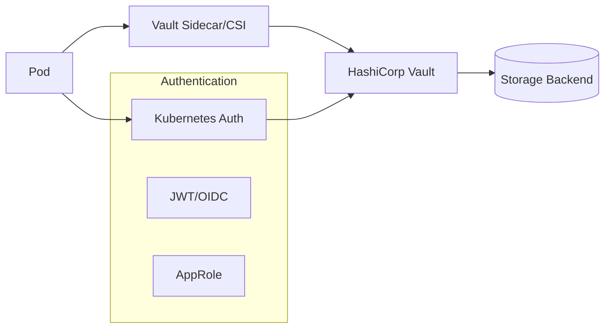

# How to Secure Kubernetes Secrets with HashiCorp Vault or Sealed Secrets

Author: [nawazdhandala](https://www.github.com/nawazdhandala)

Tags: Kubernetes, Security, Secrets Management, HashiCorp Vault, Sealed Secrets, DevOps

Description: A practical guide to securing Kubernetes secrets using HashiCorp Vault and Bitnami Sealed Secrets, with installation, configuration, and GitOps integration patterns.

---

Kubernetes Secrets are base64-encoded, not encrypted. Anyone with cluster access can decode them. This guide shows you how to properly secure secrets using HashiCorp Vault and Sealed Secrets.

## The Problem with Native Kubernetes Secrets

```bash
# Create a secret
kubectl create secret generic db-creds --from-literal=password=supersecret

# Anyone with access can decode it
kubectl get secret db-creds -o jsonpath='{.data.password}' | base64 -d
# Output: supersecret
```

Even worse, secrets in Git repos are visible to anyone with repo access. You need encryption at rest and in transit.

## Option 1: Sealed Secrets

Sealed Secrets lets you encrypt secrets that can only be decrypted by the controller running in your cluster. Safe to commit to Git.


### Install Sealed Secrets Controller

```bash
# Add Bitnami Helm repo
helm repo add sealed-secrets https://bitnami-labs.github.io/sealed-secrets
helm repo update

# Install controller
helm install sealed-secrets sealed-secrets/sealed-secrets \
  --namespace kube-system \
  --set fullnameOverride=sealed-secrets-controller
```

### Install kubeseal CLI

```bash
# macOS
brew install kubeseal

# Linux
KUBESEAL_VERSION=$(curl -s https://api.github.com/repos/bitnami-labs/sealed-secrets/releases/latest | jq -r .tag_name)
curl -OL "https://github.com/bitnami-labs/sealed-secrets/releases/download/${KUBESEAL_VERSION}/kubeseal-${KUBESEAL_VERSION#v}-linux-amd64.tar.gz"
tar -xzf kubeseal-*.tar.gz
sudo mv kubeseal /usr/local/bin/
```

### Create a Sealed Secret

```bash
# Create a regular secret YAML (don't apply it!)
kubectl create secret generic db-creds \
  --from-literal=username=admin \
  --from-literal=password=supersecret123 \
  --dry-run=client -o yaml > secret.yaml

# Seal it
kubeseal --format yaml < secret.yaml > sealed-secret.yaml

# View the sealed secret
cat sealed-secret.yaml
```

Output:
```yaml
apiVersion: bitnami.com/v1alpha1
kind: SealedSecret
metadata:
  name: db-creds
  namespace: default
spec:
  encryptedData:
    password: AgBy3i4OJSWK+PiTySYZZA9rO43cGDEq...
    username: AgBy3i4OJSWK+PiTySYZZA9rO43cGDEq...
  template:
    metadata:
      name: db-creds
      namespace: default
    type: Opaque
```

### Apply Sealed Secret

```bash
# Safe to commit to Git!
git add sealed-secret.yaml
git commit -m "Add encrypted db credentials"

# Apply to cluster - controller decrypts automatically
kubectl apply -f sealed-secret.yaml

# Verify the secret was created
kubectl get secret db-creds
```

### Scope Options

```bash
# Strict (default) - bound to name and namespace
kubeseal --scope strict

# Namespace-wide - can change name within namespace
kubeseal --scope namespace-wide

# Cluster-wide - can be used anywhere
kubeseal --scope cluster-wide
```

### Rotate Encryption Keys

```bash
# Fetch current public key
kubeseal --fetch-cert > sealed-secrets-cert.pem

# Re-encrypt all secrets with new key (after key rotation)
kubeseal --re-encrypt < sealed-secret.yaml > sealed-secret-new.yaml
```

### Backup Sealed Secrets Keys

```bash
# Backup the master key (store securely!)
kubectl get secret -n kube-system \
  -l sealedsecrets.bitnami.com/sealed-secrets-key \
  -o yaml > sealed-secrets-master.key

# Restore on new cluster
kubectl apply -f sealed-secrets-master.key
```

## Option 2: HashiCorp Vault

Vault is an enterprise-grade secrets manager with dynamic secrets, encryption as a service, and audit logging.



### Install Vault with Helm

```bash
# Add HashiCorp Helm repo
helm repo add hashicorp https://helm.releases.hashicorp.com
helm repo update

# Install Vault in dev mode (NOT for production)
helm install vault hashicorp/vault \
  --namespace vault \
  --create-namespace \
  --set server.dev.enabled=true

# For production, use HA mode with auto-unseal
helm install vault hashicorp/vault \
  --namespace vault \
  --create-namespace \
  --set server.ha.enabled=true \
  --set server.ha.replicas=3
```

### Initialize and Unseal Vault (Production)

```bash
# Initialize Vault
kubectl exec -it vault-0 -n vault -- vault operator init

# Save the unseal keys and root token securely!
# Unseal with 3 of 5 keys
kubectl exec -it vault-0 -n vault -- vault operator unseal <key1>
kubectl exec -it vault-0 -n vault -- vault operator unseal <key2>
kubectl exec -it vault-0 -n vault -- vault operator unseal <key3>
```

### Configure Kubernetes Authentication

```bash
# Exec into Vault pod
kubectl exec -it vault-0 -n vault -- /bin/sh

# Enable Kubernetes auth method
vault auth enable kubernetes

# Configure Kubernetes auth
vault write auth/kubernetes/config \
  kubernetes_host="https://$KUBERNETES_PORT_443_TCP_ADDR:443" \
  token_reviewer_jwt="$(cat /var/run/secrets/kubernetes.io/serviceaccount/token)" \
  kubernetes_ca_cert=@/var/run/secrets/kubernetes.io/serviceaccount/ca.crt \
  issuer="https://kubernetes.default.svc.cluster.local"
```

### Create Secrets and Policies

```bash
# Enable KV secrets engine
vault secrets enable -path=secret kv-v2

# Create a secret
vault kv put secret/myapp/config \
  username="admin" \
  password="supersecret123"

# Create policy
vault policy write myapp - <<EOF
path "secret/data/myapp/*" {
  capabilities = ["read"]
}
EOF

# Create Kubernetes role
vault write auth/kubernetes/role/myapp \
  bound_service_account_names=myapp \
  bound_service_account_namespaces=production \
  policies=myapp \
  ttl=1h
```

### Method 1: Vault Agent Sidecar Injector

Install the injector:

```bash
helm upgrade vault hashicorp/vault \
  --namespace vault \
  --set injector.enabled=true
```

Annotate your deployment:

```yaml
apiVersion: apps/v1
kind: Deployment
metadata:
  name: myapp
  namespace: production
spec:
  template:
    metadata:
      annotations:
        vault.hashicorp.com/agent-inject: "true"
        vault.hashicorp.com/role: "myapp"
        vault.hashicorp.com/agent-inject-secret-config.txt: "secret/data/myapp/config"
        vault.hashicorp.com/agent-inject-template-config.txt: |
          {{- with secret "secret/data/myapp/config" -}}
          export DB_USERNAME="{{ .Data.data.username }}"
          export DB_PASSWORD="{{ .Data.data.password }}"
          {{- end -}}
    spec:
      serviceAccountName: myapp
      containers:
        - name: myapp
          image: myapp:latest
          command: ["/bin/sh", "-c"]
          args:
            - source /vault/secrets/config.txt && exec /app/myapp
```

### Method 2: Vault CSI Provider

Install Vault CSI provider:

```bash
helm install vault hashicorp/vault \
  --namespace vault \
  --set csi.enabled=true
```

Create SecretProviderClass:

```yaml
apiVersion: secrets-store.csi.x-k8s.io/v1
kind: SecretProviderClass
metadata:
  name: vault-myapp
  namespace: production
spec:
  provider: vault
  parameters:
    roleName: "myapp"
    vaultAddress: "http://vault.vault.svc:8200"
    objects: |
      - objectName: "db-username"
        secretPath: "secret/data/myapp/config"
        secretKey: "username"
      - objectName: "db-password"
        secretPath: "secret/data/myapp/config"
        secretKey: "password"
  secretObjects:
    - secretName: myapp-secrets
      type: Opaque
      data:
        - objectName: db-username
          key: username
        - objectName: db-password
          key: password
```

Use in deployment:

```yaml
apiVersion: apps/v1
kind: Deployment
metadata:
  name: myapp
  namespace: production
spec:
  template:
    spec:
      serviceAccountName: myapp
      containers:
        - name: myapp
          image: myapp:latest
          env:
            - name: DB_USERNAME
              valueFrom:
                secretKeyRef:
                  name: myapp-secrets
                  key: username
            - name: DB_PASSWORD
              valueFrom:
                secretKeyRef:
                  name: myapp-secrets
                  key: password
          volumeMounts:
            - name: secrets
              mountPath: "/mnt/secrets"
              readOnly: true
      volumes:
        - name: secrets
          csi:
            driver: secrets-store.csi.k8s.io
            readOnly: true
            volumeAttributes:
              secretProviderClass: vault-myapp
```

### Method 3: External Secrets Operator

External Secrets Operator syncs secrets from Vault to Kubernetes Secrets.

```bash
helm repo add external-secrets https://charts.external-secrets.io
helm install external-secrets external-secrets/external-secrets \
  --namespace external-secrets \
  --create-namespace
```

Create ClusterSecretStore:

```yaml
apiVersion: external-secrets.io/v1beta1
kind: ClusterSecretStore
metadata:
  name: vault-backend
spec:
  provider:
    vault:
      server: "http://vault.vault.svc:8200"
      path: "secret"
      version: "v2"
      auth:
        kubernetes:
          mountPath: "kubernetes"
          role: "external-secrets"
          serviceAccountRef:
            name: external-secrets
            namespace: external-secrets
```

Create ExternalSecret:

```yaml
apiVersion: external-secrets.io/v1beta1
kind: ExternalSecret
metadata:
  name: myapp-secrets
  namespace: production
spec:
  refreshInterval: "1h"
  secretStoreRef:
    name: vault-backend
    kind: ClusterSecretStore
  target:
    name: myapp-secrets
  data:
    - secretKey: username
      remoteRef:
        key: myapp/config
        property: username
    - secretKey: password
      remoteRef:
        key: myapp/config
        property: password
```

## Comparison: When to Use What

| Feature | Sealed Secrets | Vault |
|---------|---------------|-------|
| Complexity | Low | High |
| Dynamic secrets | No | Yes |
| Secret rotation | Manual | Automatic |
| Audit logging | No | Yes |
| Multi-cluster | Per-cluster keys | Centralized |
| GitOps friendly | Excellent | Good |
| Cost | Free | Free/Enterprise |

### Choose Sealed Secrets When:
- You want simple GitOps workflow
- Static secrets are sufficient
- Single cluster deployment
- Small team, simple requirements

### Choose Vault When:
- You need dynamic secrets (database credentials)
- Compliance requires audit logging
- Multi-cluster secret management
- You need encryption as a service
- Enterprise security requirements

## GitOps Integration

### Sealed Secrets + ArgoCD

```yaml
# Works out of the box - commit SealedSecrets to Git
apiVersion: argoproj.io/v1alpha1
kind: Application
metadata:
  name: myapp
spec:
  source:
    repoURL: https://github.com/org/myapp
    path: k8s/overlays/production
  destination:
    server: https://kubernetes.default.svc
    namespace: production
```

### Vault + ArgoCD

```yaml
# Use External Secrets Operator
apiVersion: argoproj.io/v1alpha1
kind: Application
metadata:
  name: myapp
spec:
  source:
    repoURL: https://github.com/org/myapp
    path: k8s/overlays/production
  # ExternalSecrets in the path will sync from Vault
```

## Security Best Practices

1. **Never commit plain secrets to Git**
2. **Rotate secrets regularly** - Vault does this automatically
3. **Use least-privilege policies** - Only grant access to needed secrets
4. **Enable audit logging** - Vault provides comprehensive audit logs
5. **Backup encryption keys** - Sealed Secrets master key, Vault unseal keys
6. **Use namespaced secrets** - Don't use cluster-wide scope unless necessary
7. **Monitor secret access** - Alert on unusual access patterns

---

Sealed Secrets is perfect for teams starting their GitOps journey. Vault is the enterprise solution when you need dynamic secrets, audit trails, and centralized management. Pick based on your compliance requirements and operational capacity.
