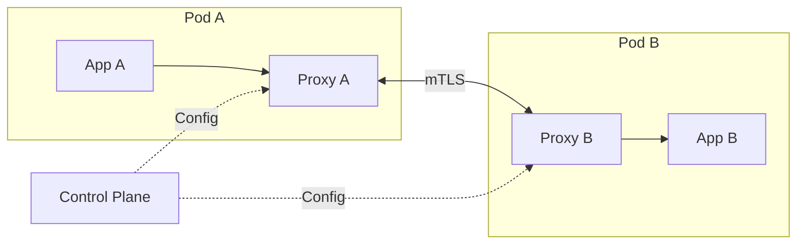

# How to Set Up Service Mesh with Istio/Linkerd in Kubernetes

Author: [nawazdhandala](https://www.github.com/nawazdhandala)

Tags: Kubernetes, Service Mesh, Istio, Linkerd, Networking, Security, Observability, DevOps

Description: A practical guide to implementing service mesh in Kubernetes with both Istio and Linkerd, covering installation, traffic management, security, and observability.

---

Service meshes handle the network complexity of microservices - encryption, load balancing, retries, observability - without changing application code. Istio and Linkerd are the two leading options, each with different philosophies.

## What Is a Service Mesh?

A service mesh injects sidecar proxies alongside your application containers. These proxies intercept all network traffic and apply policies consistently.



### When You Need a Service Mesh

- **Mutual TLS everywhere** without application changes
- **Traffic splitting** for canary deployments
- **Automatic retries and circuit breakers**
- **Distributed tracing** across services
- **Fine-grained traffic policies**

### When You Don't

- Simple applications with few services
- Teams not ready for operational complexity
- Tight resource constraints (sidecars add overhead)

## Istio vs Linkerd Comparison

| Feature | Istio | Linkerd |
|---------|-------|---------|
| Resource footprint | ~100MB per sidecar | ~20MB per sidecar |
| Complexity | Higher | Lower |
| Features | Everything | Essential features |
| Learning curve | Steep | Gentle |
| mTLS | Yes | Yes |
| Traffic management | Advanced | Basic |
| Multi-cluster | Yes | Yes |
| CNCF status | Not CNCF | Graduated |

## Option 1: Linkerd Setup

Linkerd is simpler, lighter, and easier to operate. Start here if you're new to service meshes.

### Install Linkerd CLI

```bash
# macOS
brew install linkerd

# Linux
curl --proto '=https' --tlsv1.2 -sSfL https://run.linkerd.io/install | sh
export PATH=$HOME/.linkerd2/bin:$PATH

# Verify
linkerd version
```

### Pre-Installation Check

```bash
linkerd check --pre
```

### Install Linkerd Control Plane

```bash
# Install CRDs first
linkerd install --crds | kubectl apply -f -

# Install control plane
linkerd install | kubectl apply -f -

# Verify installation
linkerd check
```

### Install Viz Extension (Observability)

```bash
linkerd viz install | kubectl apply -f -
linkerd viz check

# Access dashboard
linkerd viz dashboard &
```

### Inject Sidecars into Your Application

```bash
# Inject into existing deployment
kubectl get deploy -n production -o yaml | linkerd inject - | kubectl apply -f -

# Or add annotation to namespace for automatic injection
kubectl annotate namespace production linkerd.io/inject=enabled
```

### Verify Mesh Traffic

```bash
# Check meshed pods
linkerd viz stat deploy -n production

# Watch live traffic
linkerd viz top deploy/api -n production

# View traffic routes
linkerd viz routes deploy/api -n production
```

### Linkerd Traffic Split (Canary)

```yaml
apiVersion: split.smi-spec.io/v1alpha1
kind: TrafficSplit
metadata:
  name: api-canary
  namespace: production
spec:
  service: api
  backends:
    - service: api-stable
      weight: 900m  # 90%
    - service: api-canary
      weight: 100m  # 10%
```

### Linkerd Service Profiles (Retries & Timeouts)

```yaml
apiVersion: linkerd.io/v1alpha2
kind: ServiceProfile
metadata:
  name: api.production.svc.cluster.local
  namespace: production
spec:
  routes:
    - name: GET /api/v1/users
      condition:
        method: GET
        pathRegex: /api/v1/users
      responseClasses:
        - condition:
            status:
              min: 500
              max: 599
          isFailure: true
      timeout: 30s
      retries:
        isRetryable: true
        maxRetries: 3
```

## Option 2: Istio Setup

Istio offers more features but requires more operational investment.

### Install istioctl

```bash
# macOS
brew install istioctl

# Linux
curl -L https://istio.io/downloadIstio | sh -
cd istio-*
export PATH=$PWD/bin:$PATH

# Verify
istioctl version
```

### Pre-Installation Check

```bash
istioctl x precheck
```

### Install Istio

```bash
# Install with demo profile (includes observability)
istioctl install --set profile=demo -y

# Or minimal production profile
istioctl install --set profile=minimal -y

# Verify
istioctl verify-install
kubectl get pods -n istio-system
```

### Enable Sidecar Injection

```bash
# Label namespace for automatic injection
kubectl label namespace production istio-injection=enabled

# Restart existing pods to inject sidecars
kubectl rollout restart deployment -n production
```

### Install Observability Add-ons

```bash
# Apply Kiali, Prometheus, Grafana, Jaeger
kubectl apply -f https://raw.githubusercontent.com/istio/istio/release-1.20/samples/addons/prometheus.yaml
kubectl apply -f https://raw.githubusercontent.com/istio/istio/release-1.20/samples/addons/grafana.yaml
kubectl apply -f https://raw.githubusercontent.com/istio/istio/release-1.20/samples/addons/jaeger.yaml
kubectl apply -f https://raw.githubusercontent.com/istio/istio/release-1.20/samples/addons/kiali.yaml

# Access Kiali dashboard
istioctl dashboard kiali
```

### Istio Virtual Service (Traffic Routing)

```yaml
apiVersion: networking.istio.io/v1beta1
kind: VirtualService
metadata:
  name: api-routing
  namespace: production
spec:
  hosts:
    - api
  http:
    - match:
        - headers:
            x-canary:
              exact: "true"
      route:
        - destination:
            host: api
            subset: canary
    - route:
        - destination:
            host: api
            subset: stable
          weight: 90
        - destination:
            host: api
            subset: canary
          weight: 10
```

### Istio Destination Rule (Load Balancing & Subsets)

```yaml
apiVersion: networking.istio.io/v1beta1
kind: DestinationRule
metadata:
  name: api-destination
  namespace: production
spec:
  host: api
  trafficPolicy:
    connectionPool:
      tcp:
        maxConnections: 100
      http:
        h2UpgradePolicy: UPGRADE
        http1MaxPendingRequests: 100
        http2MaxRequests: 1000
    loadBalancer:
      simple: LEAST_REQUEST
    outlierDetection:
      consecutive5xxErrors: 5
      interval: 30s
      baseEjectionTime: 30s
  subsets:
    - name: stable
      labels:
        version: stable
    - name: canary
      labels:
        version: canary
```

### Istio Circuit Breaker

```yaml
apiVersion: networking.istio.io/v1beta1
kind: DestinationRule
metadata:
  name: api-circuit-breaker
  namespace: production
spec:
  host: api
  trafficPolicy:
    outlierDetection:
      consecutive5xxErrors: 3
      interval: 10s
      baseEjectionTime: 30s
      maxEjectionPercent: 50
      minHealthPercent: 30
```

### Istio Retry Policy

```yaml
apiVersion: networking.istio.io/v1beta1
kind: VirtualService
metadata:
  name: api-retries
  namespace: production
spec:
  hosts:
    - api
  http:
    - route:
        - destination:
            host: api
      retries:
        attempts: 3
        perTryTimeout: 10s
        retryOn: 5xx,reset,connect-failure,retriable-4xx
```

### Istio Timeout Policy

```yaml
apiVersion: networking.istio.io/v1beta1
kind: VirtualService
metadata:
  name: api-timeout
  namespace: production
spec:
  hosts:
    - api
  http:
    - route:
        - destination:
            host: api
      timeout: 30s
```

## Mutual TLS (mTLS) Configuration

### Linkerd mTLS

Linkerd enables mTLS automatically for all meshed traffic. No configuration needed.

```bash
# Verify mTLS is active
linkerd viz edges deployment -n production
```

### Istio mTLS

```yaml
# Strict mTLS for namespace
apiVersion: security.istio.io/v1beta1
kind: PeerAuthentication
metadata:
  name: default
  namespace: production
spec:
  mtls:
    mode: STRICT
---
# Or cluster-wide
apiVersion: security.istio.io/v1beta1
kind: PeerAuthentication
metadata:
  name: default
  namespace: istio-system
spec:
  mtls:
    mode: STRICT
```

### Istio Authorization Policy

```yaml
apiVersion: security.istio.io/v1beta1
kind: AuthorizationPolicy
metadata:
  name: api-authz
  namespace: production
spec:
  selector:
    matchLabels:
      app: api
  action: ALLOW
  rules:
    - from:
        - source:
            principals:
              - cluster.local/ns/production/sa/frontend
      to:
        - operation:
            methods: ["GET", "POST"]
            paths: ["/api/v1/*"]
```

## Observability

### Distributed Tracing

Both meshes automatically propagate trace headers (B3, W3C Trace Context).

**Linkerd with Jaeger:**
```bash
linkerd jaeger install | kubectl apply -f -
linkerd jaeger dashboard
```

**Istio with Jaeger:**
```bash
istioctl dashboard jaeger
```

### Metrics

**Linkerd Prometheus metrics:**
```bash
# All meshed traffic metrics available at
# linkerd-proxy:4191/metrics
```

**Istio Prometheus metrics:**
```bash
# Available at envoy sidecar
# istio-proxy:15090/stats/prometheus
```

Key metrics to monitor:
- Request rate
- Error rate
- Latency (P50, P95, P99)
- Connection pool utilization

## Resource Overhead Comparison

### Linkerd (Minimal)

```yaml
# Typical sidecar resources
resources:
  requests:
    cpu: 10m
    memory: 20Mi
  limits:
    cpu: 100m
    memory: 50Mi
```

### Istio (Default)

```yaml
# Typical sidecar resources
resources:
  requests:
    cpu: 100m
    memory: 128Mi
  limits:
    cpu: 2000m
    memory: 1Gi
```

Tune Istio sidecar resources:

```yaml
# Annotation on pod
annotations:
  sidecar.istio.io/proxyCPU: "50m"
  sidecar.istio.io/proxyMemory: "64Mi"
```

## Troubleshooting

### Linkerd Troubleshooting

```bash
# Check mesh status
linkerd check

# Debug specific deployment
linkerd viz stat deploy/api -n production

# View proxy logs
kubectl logs deploy/api -n production -c linkerd-proxy

# Check tap traffic
linkerd viz tap deploy/api -n production
```

### Istio Troubleshooting

```bash
# Analyze configuration issues
istioctl analyze -n production

# Check proxy status
istioctl proxy-status

# View proxy config
istioctl proxy-config all deploy/api -n production

# Debug sidecar logs
kubectl logs deploy/api -n production -c istio-proxy

# Check if mTLS is working
istioctl authn tls-check api.production.svc.cluster.local
```

## Migration Strategy

### Starting with Linkerd

1. Install Linkerd control plane
2. Enable injection on non-critical namespace first
3. Monitor for issues
4. Gradually roll out to production namespaces
5. Add service profiles for critical paths

### Starting with Istio

1. Install Istio with minimal profile
2. Enable injection on one namespace
3. Configure strict mTLS gradually
4. Add virtual services for traffic management
5. Implement authorization policies

## Which One Should You Choose?

**Choose Linkerd if:**
- You want simplicity and quick setup
- Resource efficiency matters
- You need core features (mTLS, observability, retries)
- Your team is small

**Choose Istio if:**
- You need advanced traffic management
- You want fine-grained authorization policies
- Multi-cluster federation is required
- You have dedicated platform teams

---

Start with Linkerd if you're new to service meshes. Graduate to Istio when you outgrow Linkerd's capabilities. Both provide the fundamental benefits of mTLS, observability, and traffic management - the difference is in operational complexity and feature breadth.
